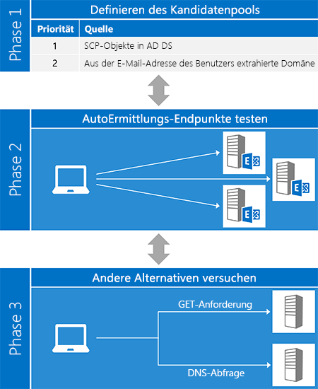
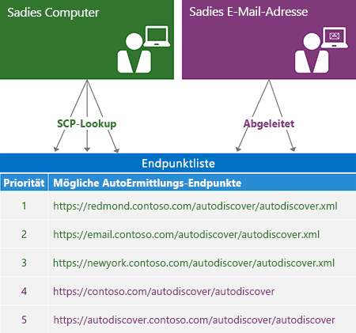
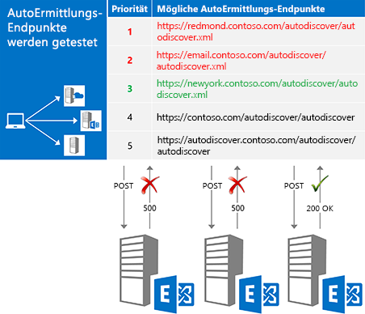
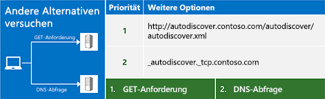

# AutoErmittlung für ExchangeAutodiscover for Exchange

Erfahren Sie mehr über den AutoErmittlungsdienst in Exchange.Learn about the Autodiscover service in Exchange.
  
Der Exchange-AutoErmittlungsdienst bietet eine einfache Möglichkeit zur selbstständigen Konfiguration Ihrer Clientanwendung mit minimaler Benutzerinteraktion. Die meisten Benutzer kennen ihre E-Mail-Adresse und ihr Kennwort und diese beiden Angaben reichen aus, um alle anderen erforderlichen Informationen für den Einstieg abzurufen. Bei EWS-Clients (Exchange-Webdienste) wird AutoErmittlung normalerweise zum Suchen der EWS-Endpunkt-URL verwendet. Die AutoErmittlung kann ebenfalls Informationen zum Konfigurieren von Clients bereitstellen, die andere Protokolle verwenden. AutoErmittlung funktioniert für Clientanwendungen innerhalb und außerhalb von Firewalls sowie bei Topologien mit einer einzelnen oder mehreren Gesamtstrukturen.The Exchange Autodiscover service provides an easy way for your client application to configure itself with minimal user input. Most users know their email address and password, and with those two pieces of information, you can retrieve all the other details you need to get up and running. For Exchange Web Services (EWS) clients, Autodiscover is typically used to find the EWS endpoint URL, but Autodiscover can also provide information to configure clients that use other protocols. Autodiscover works for client applications that are inside or outside firewalls and will work in resource forest and multiple forest scenarios.
  
## Übersicht über den Prozess der AutoErmittlungOverview of the Autodiscover process

Der Prozess der AutoErmittlung besteht prinzipiell aus drei Phasen. In der ersten Phase generieren Sie eine Liste möglicher AutoErmittlungs-Server. In der zweiten Phase probieren Sie jeden Server auf der Liste aus und erhalten (hoffentlich) eine erfolgreiche Antwort. Sollte keiner der möglichen Server zum Erfolg führen, wird Phase drei initiiert. Dabei handelt es sich um das letzte Mittel zur Ermittlung eines AutoErmittlungs-Endpunkts.The Autodiscover process essentially has three phases. In phase one, you generate a list of potential Autodiscover servers, and in phase two, you try each server in your list until you (hopefully) get a successful response. If none of your candidates worked out, you move on to phase three, which represents a "last ditch" attempt to find an Autodiscover endpoint.
  
Die [ExchangeService.AutodiscoverUrl](http://msdn.microsoft.com/de-de/library/microsoft.exchange.webservices.data.exchangeservice.autodiscoverurl%28v=exchg.80%29.aspx)-Methode der EWS Managed API implementiert alle drei Phasen dieses Prozesses für Sie. Sollten Sie also die EWS Managed API verwenden, müssen Sie sich nicht selbst um die Implementierung der AutoErmittlung kümmern. Die folgende Abbildung zeigt die drei Phasen des Prozesses der AutoErmittlung.The [ExchangeService.AutodiscoverUrl](http://msdn.microsoft.com/de-de/library/microsoft.exchange.webservices.data.exchangeservice.autodiscoverurl%28v=exchg.80%29.aspx) method in the EWS Managed API implements all three phases of this process for you, so if you are using the EWS Managed API, you don't need to worry about implementing Autodiscover yourself. The following figure shows the three phases of the Autodiscover process. 
  
**Abbildung 1. Die drei Phasen des Prozesses der AutoErmittlung****Figure 1. Three phases of the Autodiscover process**

  
### Phase 1: Festlegen der möglichen KandidatenPhase 1: Defining the candidate pool

Bevor Sie die AutoErmittlung verwenden können, müssen Sie den richtigen Server für die AutoErmittlung für Ihren Benutzer suchen. Glücklicherweise definiert die AutoErmittlung eine Auswahl an Stellen für Sie, an denen Sie suchen können. Falls mehrere Kandidaten gefunden werden, kann die Liste auch [nach Priorität sortiert werden](how-to-generate-a-list-of-autodiscover-endpoints.md).Before you can use Autodiscover, you have to locate the right Autodiscover server for your user. Luckily, Autodiscover defines a limited number of places for you to look. In the case where multiple candidates are found, Autodiscover also defines [a way to generate and prioritize the list](how-to-generate-a-list-of-autodiscover-endpoints.md).
  
**Table 1: Quellen für die AutoErmittlung möglicher Endpunkte****Table 1: Autodiscover endpoint candidate sources**

|**Informationsquelle****Place to look**|**Was Sie dort finden****What you'll find**|
|:-----|:-----|
|Active Directory-Domänendienste (AD DS)Active Directory Domain Services (AD DS)    |Bei mit der Domäne verbundenen Clients sollten Sie zuerst hier suchen. Exchange veröffentlicht Objekte für Dienstverbindungspunkte (SCP) in AD DS, weshalb Anfragen der AutoErmittlung anhand von Active Directory-Standorten auf Server weitergeleitet werden können. Die Ergebnisse einer [SCP-Suche](how-to-find-autodiscover-endpoints-by-using-scp-lookup-in-exchange.md) sollte am Anfang Ihrer Kandidatenliste stehen.  For domain-joined clients, this is the first place to look. Exchange publishes service connection point (SCP) objects in AD DS, which allows Autodiscover requests to be routed to servers based on Active Directory sites. The results of an [SCP lookup](how-to-find-autodiscover-endpoints-by-using-scp-lookup-in-exchange.md) should be at the top of your candidate list.    **Hinweis**: SCP-Suche nicht für Clients, die kein Mitglied einer Domäne oder, die keinen Zugriff auf Active Directory-Server, zur Verfügung.**NOTE**: SCP lookup isn't available for clients that are not joined to a domain or that do not have access to Active Directory servers. In diesem Fall sollten Sie die SCP-Suche überspringen.In this case, you should skip SCP lookup.  |
|Die Domäne der E-Mail-Adresse des BenutzersThe user's email address domain    | AutoErmittlung definiert zwei Standard-Endpunkt-URL-Formate, die aus dem Domänenteil der E-Mail-Adresse des Benutzers abgeleitet werden:Autodiscover defines two standard endpoint URL forms that are derived from the domain portion of the user's email address:   `"https://" + domain + "/autodiscover/autodiscover" +  *fileExtension*`   `"https://autodiscover." + domain + "/autodiscover/autodiscover" +  *fileExtension*`    Der Wert für  *Dateierweiterung*  hängt von der Zugriffsemthode Sie für die AutoErmittlung verwenden: [SOAP](http://msdn.microsoft.com/library/61c21ea9-7fea-4f56-8ada-bf80e1e6b074%28Office.15%29.aspx) oder [POX](http://msdn.microsoft.com/library/877152f0-f4b1-4f63-b2ce-924f4bdf2d20%28Office.15%29.aspx). Der SOAP-Dienst verwendet die Dateierweiterung ".svc", POX ".xml".  The value of  *fileExtension*  depends on which Autodiscover access method you are using, [SOAP](http://msdn.microsoft.com/library/61c21ea9-7fea-4f56-8ada-bf80e1e6b074%28Office.15%29.aspx) or [POX](http://msdn.microsoft.com/library/877152f0-f4b1-4f63-b2ce-924f4bdf2d20%28Office.15%29.aspx). The SOAP service uses a ".svc" file extension; POX uses ".xml".    |
   
Die folgende Abbildung zeigt, wie eine Liste der Endpunkte für die AutoErmittlung generiert wird.The following figure shows how to generate an Autodiscover endpoint list.
  
**Abbildung 2. Prozess zum Generieren einer Liste der Endpunkte für die AutoErmittlung****Figure 2. Process for generating an Autodiscover endpoint list**

  
### Phase 2: Alle Kandidaten ausprobierenPhase 2: Trying each candidate

Nachdem Sie eine sortierte Liste der potenziellen Kandidaten generiert haben, wird im nächsten Schritt jeder Eintrag aus der Liste durch [Senden einer Anforderung an die URL](how-to-get-user-settings-from-exchange-by-using-autodiscover.md) ausprobiert. Anschließend werden die Ergebnisse wie in Abbildung 3 dargestellt überprüft. Wenn Sie eine erfolgreiche Antwort erhalten, sind Sie fertig!After you generate an ordered list of potential candidates, the next step is try each one in the list by [sending a request to the URL](how-to-get-user-settings-from-exchange-by-using-autodiscover.md) and validating the results, as shown in Figure 3. When you get a successful response, you're done! 
  
**Abbildung 3. Ausprobieren der möglichen Endpunkte nacheinander****Figure 3. Trying each endpoint candidate in order**

  
Bevor Sie eine Anforderung an einen Kandidaten senden, sollten Sie sicherstellen, dass er vertrauenswürdig ist. Denken Sie daran, dass Sie bei diesem Vorgang die Anmeldeinformationen des Benutzers übermitteln. Daher ist es wichtig, diese Daten nur mit vertrauenswürdigen Servern zu teilen. Sie sollten mindestens die folgenden Punkte überprüfen:Before you send a request to a candidate, make sure it is trustworthy. Remember that you're sending the user's credentials, so it's important to make sure that you're only sharing them with a server you can trust. At a minimum, you should verify:
  
- Dass es sich bei dem Endpunkt um einen HTTPS-Endpunkt handelt. Clientanwendungen sollten sich nicht bei Endpunkten ohne SSL anmelden oder dorthin Daten übermitteln.That the endpoint is an HTTPS endpoint. Client applications should not authenticate or send data to a non-SSL endpoint.
    
- Dass das SSL-Zertifikat gültig ist und aus einer vertrauenswürdigen Quelle stammt.That the SSL certificate presented by the server is valid and from a trusted authority.
    
> [!NOTE]
> Hierbei handelt es sich nur um Vorschläge zur grundlegenden Sicherheit. Wenn Sie mit Authentifizierung arbeiten, stellen Sie sicher, dass Ihr Code die Sicherheitsanforderungen Ihrer Organisation erfüllt.These are just basic security suggestions. Whenever you are working with authentication, make sure that your code meets the security requirements of your organization. 
  
DIe Art der Anforderung, die Sie senden, hängt davon ab, wie Sie auf den AutoErmittlungsdienst zugreifen.The type of request you send depends on how you are accessing the Autodiscover service.
  
**Tabelle 2. Arten von Anfragen der AutoErmittlung****Table 2. Types of Autodiscover requests**

|**Bei Verwendung von...****If you are using…**|**Senden Sie eine Anforderung mit...****Send a request by using…**|
|:-----|:-----|
|EWS Managed APIThe EWS Managed API    |der [GetUserSettings](http://msdn.microsoft.com/de-de/library/microsoft.exchange.webservices.autodiscover.autodiscoverservice.getusersettings%28v=exchg.80%29.aspx)-Methode.The [GetUserSettings](http://msdn.microsoft.com/de-de/library/microsoft.exchange.webservices.autodiscover.autodiscoverservice.getusersettings%28v=exchg.80%29.aspx) method.    |
|SOAP-AutoErmittlungsdienstThe SOAP Autodiscover service    |dem [GetUserSettings](http://msdn.microsoft.com/library/758d965c-ef63-4de4-9120-e293abf14ff8%28Office.15%29.aspx)-Vorgang.The [GetUserSettings](http://msdn.microsoft.com/library/758d965c-ef63-4de4-9120-e293abf14ff8%28Office.15%29.aspx) operation.    |
|POX-AutoErmittlungsdienstThe POX Autodiscover service    |HTTP POST mit einem [AutoErmittlung-Anforderungstext](http://msdn.microsoft.com/library/75671b1d-f35b-497b-8d8c-706f3f2535fd%28Office.15%29.aspx).An HTTP POST with an [Autodiscover request body](http://msdn.microsoft.com/library/75671b1d-f35b-497b-8d8c-706f3f2535fd%28Office.15%29.aspx).    |
   
### Phase 3: Ausprobieren anderer AlternativenPhase 3: Trying other alternatives

In einigen Fällen kann es vorkommen, dass Sie alle Endpunkte ausprobieren, ohne einen passenden zu finden. Bevor Sie aufgeben, können Sie andere Alternativen ausprobieren: Sie können eine nicht authentifizierte GET-Anforderung senden oder einen SRV-Eintrag vom DNS abfragen. Sollten diese Versuche auch ergebnislos sein, können Sie den AutoErmittlungsdienst nicht kontaktieren.In some cases you might try all the endpoints in your list, only to find that all of them return an error. Before throwing in the towel, you can try a couple more things: you can send an unauthenticated GET request, or query DNS for an SRV record. If these attempts also don't yield results, you cannot contact the Autodiscover service.
  
**Abbildung 4. Ausprobieren anderer Alternativen****Figure 4. Trying other alternatives**

  
#### Senden einer nicht authentifizierten GET-AnforderungSending an unauthenticated GET request

Zunächst sollten Sie versuchen, eine nicht authentifizierte GET-Anforderung an einen Endpunkt zu senden, der aus der E-Mail-Adresse des Benutzers abgeleitet wird. Das Format dieses Endpunkts ist "http://autodiscover." + Domäne + "/autodiscover/autodiscover.xml". Beachten Sie, dass es sich dabei nicht um einen SSL-Endpunkt handelt. Wenn der Server eine 302-Weiterleitung als Antwort zurückgibt, können Sie das [Erneute Senden der Anforderung des AutoErmittlungsdiensts](handling-autodiscover-error-messages.md#bk_ResendRequest) an die Endpunkt-URL im Location-Header der Antwort probieren.The first thing to try is to send an unauthenticated GET request to an endpoint derived from the user's email address. The format of that endpoint is "http://autodiscover." + domain + "/autodiscover/autodiscover.xml". Note that this is NOT an SSL endpoint. If the server returns a 302 redirect response, you can then attempt to [resend the Autodiscover request](handling-autodiscover-error-messages.md#bk_ResendRequest) to the endpoint URL in the Location header of the response. 
  
#### Abfragen eines SRV-Eintrags beim DNSQuerying DNS for an SRV record

Sollte die nicht authentifizierte GET-Anforderung keine Ergebnisse hervorbringen, ist die letzte Möglichkeit eine DNS-Abfrage von SRV-Einträgen für den AutoErmittlungsdienst. Ein solcher Eintrag hat die Form "_autodiscover._tcp." + Domäne. Bei einer solchen Abfrage werden möglicherweise mehrere Einträge zurückgegeben, Sie sollten allerdings nur Einträge verwenden, die auf einen SSL-Endpunkt zeigen und die höchste Priorität und Gewichtung haben.If the unauthenticated GET request doesn't work out, the last thing to try is a DNS query for SRV records for the Autodiscover service. The record will take the form "_autodiscover._tcp." + domain. This query might return multiple records, but you should only use records that point to an SSL endpoint and that have the highest priority and weight.
  
## Optionen für die Verwendung von AutoErmittlungOptions for using Autodiscover

Sie können entweder mithilfe des SOAP- oder des POX-Webdiensts auf die AutoErmittlung zugreifen. Die Methode, die Sie verwenden, hängt von Ihren Anforderungen und der Umgebung ab. Wir empfehlen jedoch den SOAP-Webdienst, falls möglich. Die EWS Managed API ist auch eine Option. Die API implementiert den Clientbereich für die AutoErmittlungsdienste über POX und SOAP implementiert.You can access Autodiscover either by using the SOAP or the POX web service. The method you use depends on your requirements and environment; however, we recommend using the SOAP web service, if possible. The EWS Managed API is also an option. It implements the client portion of both the SOAP and POX Autodiscover services.
  
**Tabelle 3: Optionen für den Zugriff auf die AutoErmittlung****Table 3: Options for accessing Autodiscover**

|**Option****Option**|**Vorteile****Pros**|**Nachteile****Cons**|
|:-----|:-----|:-----|
|[EWS Managed APIEWS Managed API](get-started-with-ews-managed-api-client-applications.md)   | Implementiert die AutoErmittlung für Sie.Implements the Autodiscover process for you.  Verwendet die AutoErmittlungsdienste über POX und SOAP.Uses both the SOAP and POX Autodiscover services.  Funktioniert mit Exchange Online, Exchange Online in Office 365 oder einer anderen Version von Exchange ab Exchange 2007 SP1.Works with Exchange Online, Exchange Online as part of Office 365, or a version of Exchange starting with Exchange 2007 SP1.  Einfach zu verwenden.Easy to use.    | Beschränkt auf die verfügbaren Benutzereinstellungen in der [Microsoft.Exchange.WebServices.Autodiscover.UserSettingName](http://msdn.microsoft.com/de-de/library/microsoft.exchange.webservices.autodiscover.usersettingname%28v=EXCHG.80%29.aspx)-Enumeration.Limited to the user settings that are available in the [Microsoft.Exchange.WebServices.Autodiscover.UserSettingName](http://msdn.microsoft.com/de-de/library/microsoft.exchange.webservices.autodiscover.usersettingname%28v=EXCHG.80%29.aspx) enumeration.  Nur für .NET Framework-Anwendungen verfügbar.Only available for .NET Framework applications.    |
|[SOAP-AutoErmittlungSOAP Autodiscover](http://msdn.microsoft.com/library/61c21ea9-7fea-4f56-8ada-bf80e1e6b074%28Office.15%29.aspx)   | Plattformunabhängig.Platform independent.  Ermöglicht Ihnen, nur die Einstellungen anzufordern, die Sie benötigen.Allows you to request just the settings you are interested in.    | Nicht in Exchange 2007 verfügbar.Not available in Exchange 2007.    |
|[POX-AutoErmittlungPOX Autodiscover](http://msdn.microsoft.com/library/877152f0-f4b1-4f63-b2ce-924f4bdf2d20%28Office.15%29.aspx)   | Plattformunabhängig.Platform independent.  Wird in Exchange Online und allen Versionen von Exchange ab Exchange 2007 SP1 unterstützt.Supported in Exchange Online and all versions of Exchange starting with Exchange 2007 SP1.    | Bestimmte Einstellungen können nicht angefordert werden.Does not allow you to request specific settings.    |
   
## Inhalt dieses AbschnittsIn this section

- [Suchen Sie nach AutoErmittlung-Endpunkten mithilfe von SCP-Suche in ExchangeFind Autodiscover endpoints by using SCP lookup in Exchange](how-to-find-autodiscover-endpoints-by-using-scp-lookup-in-exchange.md)
    
- [Generieren Sie eine Liste von Endpunkten für die AutoErmittlungGenerate a list of Autodiscover endpoints](how-to-generate-a-list-of-autodiscover-endpoints.md)
    
- [Mithilfe von AutoErmittlung Verbindungspunkte suchenUse Autodiscover to find connection points](how-to-use-autodiscover-to-find-connection-points.md)
    
- [Abrufen von benutzereinstellungen aus Exchange mithilfe der AutoErmittlungGet user settings from Exchange by using Autodiscover](how-to-get-user-settings-from-exchange-by-using-autodiscover.md)
    
- [Abrufen von domäneneinstellungen aus einem Exchange-serverGet domain settings from an Exchange server](how-to-get-domain-settings-from-an-exchange-server.md)
    
- [Aktualisieren von Konfigurationsinformationen mithilfe der AutoErmittlungRefresh configuration information by using Autodiscover](how-to-refresh-configuration-information-by-using-autodiscover.md)
    
- [Behandeln von AutoErmittlungs-FehlermeldungenHandling Autodiscover error messages](handling-autodiscover-error-messages.md)
    
- [Verbessern der Leistung bei Verwendung der AutoErmittlung für ExchangeImproving performance when using Autodiscover for Exchange](improving-performance-when-using-autodiscover-for-exchange.md)
    
## Siehe auchSee also

- [Erste Schritte mit Webdiensten in ExchangeStart using web services in Exchange](start-using-web-services-in-exchange.md)    
- [Exchange 2013: Abrufen von Benutzereinstellungen mit der AutoErmittlungExchange 2013: Get user settings with Autodiscover](http://code.msdn.microsoft.com/Exchange-2013-Get-user-7e22c86e)
- [Beispiel für die AutoErmittlung-PrüfungAutodiscover Checker sample](http://code.msdn.microsoft.com/exchange/Autodiscover-Checker-e1ebca42)  
- [Entwickeln von Webdienstclients für ExchangeDevelop web service clients for Exchange](develop-web-service-clients-for-exchange.md)
    

