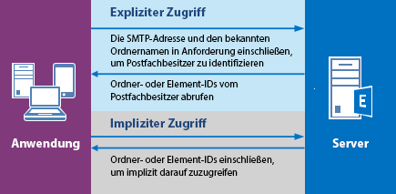

# <a name="delegate-access-and-ews-in-exchange"></a>Stellvertretungszugriff und EWS in Exchange

Erfahren Sie, wie sie die verwaltete EWS-API und EWS in Exchange verwenden können, um einen Stellvertretungszugriff für die Postfächer der Benutzer bereitzustellen.
  
Sie können Benutzern anhand der folgenden drei Möglichkeiten ermöglichen, auf die Postfächer anderer Benutzer zuzugreifen: 
  
- Durch das Hinzufügen von Stellvertretungen und dem Angeben von Berechtigungen für die einzelnen Stellvertreter
    
- Durch direktes Ändern der Ordnerberechtigungen
    
- Durch Verwenden eines Identitätswechsels
    
Am besten funktionieren die Stellvertretung und Ordnerberechtigungen, wenn Sie nur wenigen Benutzern den Zugriff gewähren müssen, da Sie Berechtigungen einzeln für jedes Postfach hinzufügen müssen. Der Identitätswechsel ist am besten für viele Postfächer geeignet, da Sie einfach ein Dienstkonto aktivieren können, um auf jedes Postfach in einer Datenbank zuzugreifen. Abbildung 1 veranschaulicht einige der Unterschiede zwischen den einzelnen Zugriffstypen.
  
**Abbildung 1. Möglichkeiten für den Zugriff auf Postfächer anderer Benutzer**


  
Wenn es darum geht, Nachrichten zu senden oder Besprechungen zu planen, können Stellvertretern „Senden im Auftrag von"-Berechtigungen erteilt werden, sodass dem Empfänger einer E-Mail oder Besprechungsanfrage, die von einem Stellvertreter gesendet wurde, „ *vertreten*  im Auftrag von  *Postfachbesitzer*  " angezeigt wird, wenn er die E-Mail oder Besprechungsanfrage in Outlook empfängt. Das Einbeziehen des „Senden im Auftrag von"-Texts ist ein Client-Implementierungsdetail - und kann erstellt werden, indem die Werte „von" und „Absender" verwendet werden. Der „von"-Wert gibt den Postfachbesitzer an und der „Absender"-Wert gibt den Stellvertreter an, der die Nachricht gesendet hat. Wenn ein Dienstkonto, das die Identität eines Benutzers darstellt, eine E-Mail sendet oder eine Besprechung für den Postfachbesitzer plant, wird die Nachricht als der Nachrichtenbesitzer gesendet. Es gibt keine Möglichkeit für den Empfänger, herauszufinden, ob die Nachricht vom Dienstkonto gesendet wurde. Benutzer, denen Ordnerberechtigungen und kein Stellvertretungszugriff gewährt wurden, können „Senden als" oder „Senden im Auftrag von" eines Postfachbenutzers nicht nutzen. Sie haben Zugriff auf die Postfachordner und können möglicherweise Elemente in den Ordnern erstellen, die Elemente jedoch nicht senden. 
  
Wann die Ordnerberechtigungen am besten direkt geändert werden sollten? In der Regel wenn Sie einem Benutzer Zugriff auf einen Ordner gewähren, ihm jedoch keine „Senden im Auftrag von"-Berechtigungen gewähren möchten, Ihre Berechtigungsanforderungen nicht den verwalteten [DelegateFolderPermissionLevel](http://msdn.microsoft.com/en-us/library/microsoft.exchange.webservices.data.delegatefolderpermissionlevel%28v=exchg.80%29.aspx)-EWS-API-Enumerationswerten oder [PermissionLevel](http://msdn.microsoft.com/library/87978600-3523-451e-a725-ef092c543e2a%28Office.15%29.aspx)-EWS-Elementwerten zugeordnet sind oder wenn Sie einen Benutzerzugriff auf einen einzelnen benutzerdefinierten Ordner bereitstellen möchten. 
  
Wenn Sie nur zum Ändern von Berechtigungen für Ordner dieses Ziel zu erreichen müssen und müssen nicht Stellvertreter hinzufügen (d. h., nicht benötigten Berechtigungen "Senden im Auftrag von"), finden Sie unter [Festlegen von Berechtigungen für einen anderen Benutzer mithilfe der EWS in Exchange](how-to-set-folder-permissions-for-another-user-by-using-ews-in-exchange.md). 
  
Beachten Sie, dass Sie auch [Outlook](http://office.microsoft.com/en-us/outlook-help/allow-someone-else-to-manage-your-mail-and-calendar-HA102749417.aspx) oder die [Exchange Server-PowerShell (Exchange-Verwaltungsshell)](https://docs.microsoft.com/en-us/powershell/exchange/exchange-server/exchange-management-shell?view=exchange-ps) verwenden können, um Delegieren des Zugriffs einzurichten. 
  
## <a name="how-does-delegate-access-work"></a>Wie funktioniert der Stellvertretungszugriff?

Mit dem Stellvertretungszugriff können Benutzer auf einige oder alle Ordner des Postfachbesitzers zugreifen und im Auftrag des Postfachbesitzers agieren. Der Postfachbesitzer kann ein Benutzer oder eine Ressource, wie z. B. ein Konferenzraum sein. Einem Empfangsmitarbeiter können Stellvertreterberechtigungen auf den Kalenderordner eines Konferenzraums gewährt werden, damit er Buchungsanfragen bearbeiten kann. Sie können die verwaltete EWS-API oder EWS verwenden, um dem Postfachbesitzer oder einem Administrator zu ermöglichen, einen Stellvertreter hinzuzufügen, anzugeben, auf welche Ordner der Stellvertreter zugreifen kann, und anschließend die Berechtigungen für diesen Ordner angeben. Stellvertretern kann der Zugriff auf folgende Ordner gewährt werden: 
  
- Kalender
    
- Aufgaben
    
- Posteingang
    
- Kontakte
    
- Anmerkungen
    
- Journal
    
Wenn ein Benutzer Stellvertreterzugriff auf einen oder mehrere dieser Ordner hat, kann er Elemente in diesem Ordner erstellen, abrufen, aktualisieren, löschen, kopieren und suchen, je nachdem, welche [Berechtigungen](#bk_delegateperms) für den Ordner festgelegt sind. Wie die Anwendung diese Aktionen durchführt, hängt davon ab, ob ein [expliziter](#bk_explicit) oder [impliziter](#bk_implicit) Zugriff erforderlich ist. 
  
## <a name="delegate-permissions"></a>Stellvertretungsberechtigungen
<a name="bk_delegateperms"> </a>

Wenn ein Administrator oder Postfachbesitzer einem Postfach einen Stellvertreter hinzufügt, er außerdem die Berechtigungsstufe für einen oder mehrere Ordner festlegen. Wenn eine Berechtigungsstufe für einen Ordner nicht festgelegt ist, lautet der Berechtigungswert standardmäßig Keine. Mehrere Benutzer können die gleichen Berechtigungsstufen für einen Ordner besitzen, und Benutzer können unterschiedliche Berechtigungsstufen für verschiedene Ordner haben. Wenn Sie die verwaltete EWS-API verwenden, verwenden Sie die [DelegateUser.Permissions](http://msdn.microsoft.com/en-us/library/microsoft.exchange.webservices.data.delegateuser.permissions%28v=exchg.80%29.aspx)-Eigenschaft, die für jeden Ordner einen der [DelegateFolderPermissionLevel](http://msdn.microsoft.com/en-us/library/microsoft.exchange.webservices.data.delegatefolderpermissionlevel%28v=exchg.80%29.aspx)-Enumerationswerte enthält, um Vertretungsberechtigungen für Ordner einzurichten. Wenn Sie EWS verwenden, verwenden Sie das [DelegatePermissions](http://msdn.microsoft.com/library/292badc7-bab3-4368-9d7c-9a8b7edb279b%28Office.15%29.aspx)-Element zum Festlegen von Vertretungsberechtigungen, und das [PermissionLevel](http://msdn.microsoft.com/library/87978600-3523-451e-a725-ef092c543e2a%28Office.15%29.aspx)-Element zum Definieren der Berechtigungsstufe. 
  
**Tabelle 2. Stellvertreter-Berechtigungsstufen**

|**Berechtigungsstufe**|**Beschreibung**|
|:-----|:-----|
|Keine  <br/> |Dies ist der Standardwert für alle Ordner.  <br/> |
|Autor  <br/> |Ein Stellvertreter kann Elemente lesen und erstellen sowie erstellte Elemente ändern und löschen. Beispielsweise kann ein Vertreter Aufgabenanfragen und Besprechungsanfragen direkt im Aufgaben- oder Kalenderordner des Postfachbesitzers erstellen, und dann eines der Elemente im Auftrag des Postfachbesitzers versenden.  <br/> |
|Herausgeber  <br/> |Ein Stellvertreter kann alles tun, was ein Autor kann und außerdem die Elemente ändern und löschen, die der Postfachbesitzer erstellt hat.  <br/> |
|Prüfer  <br/> |Ein Stellvertreter kann Elemente lesen; ein Stellvertreter mit Prüferberechtigungen kann beispielsweise Nachrichten im Posteingang einer anderen Person lesen.  <br/> |
|Benutzerdefiniert  <br/> |Der Postfachbesitzer hat dem Stellvertreter einen benutzerdefinierten Satz von Berechtigungen gewährt.  <br/> |
   
Die verwaltete [DelgateUser.ViewPrivateItems](http://msdn.microsoft.com/en-us/library/microsoft.exchange.webservices.data.delegateuser.viewprivateitems%28v=exchg.80%29.aspx) EWS-API-Eigenschaft und das [ViewPrivateItems](http://msdn.microsoft.com/library/80b949ac-440c-4a01-b428-ebafb5b1b802%28Office.15%29.aspx)-EWS-Element ist eine globale Einstellung, die Auswirkungen auf alle Ordner des Postfachbesitzers hat, einschließlich aller Nachrichten-, Kontakte-, Kalender-, Aufgaben-, Anmerkungen- und Journal-Ordner. Sie können keinen Zugriff auf private Elemente in nur einem Ordner zulassen. 
  
## <a name="explicit-access"></a>Expliziter Zugriff
<a name="bk_explicit"> </a>

Einfach gesagt, der explizite Zugriff ist der Zugangsweg für Vertreter, um Aktionen zu den Ordnern oder Elementen des Postfachbesitzers auszuführen. Der explizite Zugriff wird einem Vertreter gewährt, wenn er den bekannten Ordnernamen des Ordners des Postfachbesitzers zusammen mit der SMTP-Adresse des Postfachbesitzers in einer Anfrage an den Server einschließt. Der Zugriff ist explizit, da die Anfrage des Vertreters explizit angibt, dass der Kontext für die Methode oder Operation das Postfach des Postfachbesitzers ist, und nicht die des Postfachs des Vertreters.
  
Der explizite Zugriff definiert den Kontext für alle Methoden oder Operationen, die ab jetzt bei den Ordnern oder Elementen ausgeführt werden. Alle beim eindeutigen Festlegen des expliziten Zugriffs zurückgegebenen Element- und Ordner-IDs identifizieren sich selbst als zum Postfachbesitzer gehörig (jedoch nicht in einem vom Menschen lesbaren Format). So muss die Anwendung die SMTP-Adresse des Postfachbesitzers nicht immer wieder angeben; der Kontext ist in den Bezeichnern verborgen. Nachdem ein Element oder Ordner identifiziert wurde, verwendet ein Stellvertreter den [impliziten Zugriff](#bk_implicit), um das Element zu ändern. In der folgenden Abbildung wird der Prozess zum Abrufen des expliziten und impliziten Zugriffs veranschaulicht. 
  
**Abbildung 2. Anfordern des expliziten oder impliziten Zugriffs auf ein Element oder einen Ordner**


  
Sie können den expliziten Zugriff in vielen verschiedenen Szenarien festlegen. Im Prinzip können Sie den expliziten Zugriff jederzeit beim Senden einer Ordner-ID in einer Methode oder Operation festlegen. Dabei kann es sich um die Suche nach Ordnern, Terminen, Unterhaltungen, das Abrufen von Elementen usw. handeln.
  
### <a name="explicit-access-and-the-ews-managed-api"></a>Expliziter Zugriff und die verwaltete EWS-API
<a name="bk_explicitewsma"> </a>

Sie können den expliziten Stellvertretungszugriff mithilfe einer der folgenden überladenen Methoden initiieren, die einen [FolderId](http://msdn.microsoft.com/en-us/library/microsoft.exchange.webservices.data.folderid%28v=exchg.80%29.aspx)-Eingabeparameter zum Identifizieren des Zielordners nutzen: 
  
- [Folder.Bind](http://msdn.microsoft.com/en-us/library/microsoft.exchange.webservices.data.folder.bind%28v=exchg.80%29.aspx)
    
- [ExchangeService.FindItems](http://msdn.microsoft.com/en-us/library/microsoft.exchange.webservices.data.exchangeservice.finditems%28v=exchg.80%29.aspx)
    
- [ExchangeService.FindAppointments](http://msdn.microsoft.com/en-us/library/microsoft.exchange.webservices.data.exchangeservice.findappointments%28v=exchg.80%29.aspx)
    
- [ExchangeService.FindFolders](http://msdn.microsoft.com/en-us/library/microsoft.exchange.webservices.data.exchangeservice.findfolders%28v=exchg.80%29.aspx)
    
- Und vieles mehr!
    
Sie können den **FolderId** -Parameter in jeder dieser Methoden folgendermaßen verwenden, um den Zielordner des Postfachbesitzers zu identifizieren. 
  
```cs
new FolderId(WellKnownFolderName.Calendar, "primary@contoso.com");
```

Um beispielweise eine Bindung an den Kalenderordner zu erstellen, gibt die **FolderId** in dieser **Bind** -Methode den bekannten Ordnernamen und die SMTP-Adresse des Postfachbesitzers an. 
  
```cs
CalendarFolder calendar = CalendarFolder.Bind(service, new FolderId(WellKnownFolderName.Calendar, "primary@contoso.com"), new PropertySet());
```

Durch das Angeben des bekannten Ordnernamens und der SMPT-Adresse kann der Stellvertreter eine Bindung an den Kalenderordner des Postfachbesitzers erstellen - dadurch erhält er expliziten Zugriff auf den Ordner. Alle darauffolgenden Anfragen für den [impliziten Zugriff](#bk_implicit) auf Elemente in dem Ordner hängen dann vom zurückgegebenen Kontext in den Element-IDs und Ordner-IDs ab. Prinzipiell enthalten die Bezeichner den Kontext für die impliziten Vertretungszugriffsaufrufe. Oder verwenden Sie zum Abrufen der Element-ID eines Elements, das bestimmte Kriterien erfüllt folgende Vorgehensweise. 
  
```cs
FindItemsResults<Item> results = service.FindItems(new FolderId(WellKnownFolderName.Calendar, "primary@contoso.com"), filter, view);
```

In diesem Fall wird die Element-ID zurückgegeben, und anschließend kann der Vertreter den impliziten Zugriff verwenden, um mithilfe der Element-ID Änderungen am Element vorzunehmen.
  
Sie müssen den expliziten Zugriff nicht erneut initiieren, bis Sie eine Element-ID oder eine Ordner-ID benötigen, auf die Sie nicht über den vorhandenen expliziten Zugriff zugegriffen haben. 
  
### <a name="explicit-access-and-ews"></a>Expliziter Zugriff und EWS
<a name="bk_explicitewsma"> </a>

Sie können den expliziten Zugriff initiieren, indem Sie die [GetFolder](http://msdn.microsoft.com/library/355bcf93-dc71-4493-b177-622afac5fdb9%28Office.15%29.aspx)-, [FindItem](http://msdn.microsoft.com/library/ebad6aae-16e7-44de-ae63-a95b24539729%28Office.15%29.aspx)- oder [FindFolder](http://msdn.microsoft.com/library/7a9855aa-06cc-45ba-ad2a-645c15b7d031%28Office.15%29.aspx)-Operationen verwenden. Diese Operationen bieten die Option zum Verwenden des [DistinguishedFolderId](http://msdn.microsoft.com/library/50018162-2941-4227-8a5b-d6b4686bb32f%28Office.15%29.aspx)-Elements, um den Zielordner zu identifizieren. Das **DistinguishedFolderId**-Element weist ein einzelnes optionales untergeordnetes Element auf, das [Postfach](http://msdn.microsoft.com/library/befc70fd-51cb-4258-884c-80c9050f0e82%28Office.15%29.aspx)-Element. Das **Mailbox**-Element gibt bei Verwendung als untergeordnetes Element des **DistinguishedFolderId**-Elements das Postfach für den Vertreter an, auf das zugegriffen werden soll. Wenn der aufrufende Benutzer über eine Berechtigung für den Zugriff auf den Ordner des Postfachbesitzers verfügt, enthält die Antwort eine Bezeichnersammlung für Elemente oder Ordner in dem Postfach. Die Element- und der Ordnerbezeichner, die in der Antwort zurückgegeben werden, können für den impliziten Stellvertretungszugriff verwendet werden. 
  
## <a name="implicit-access"></a>Impliziter Zugriff
<a name="bk_implicit"> </a>

Der implizite Zugriff wird verwendet, nachdem ein Stellvertreter die ID für ein Element oder einen Ordner im Postfach des Postfachbesitzers abgerufen hat und der Stellvertreter das Element aktualisieren, löschen oder kopieren möchte. Wenn der Stellvertreter die Element- oder Ordner-ID in einer Anfrage verwendet, werden die Änderungen am Element im Postfach des Postfachbesitzers vorgenommen. Der Stellvertreter muss die SMTP-Adresse des Postfachbesitzers nicht einbeziehen. 
  
Wenn ein Stellvertreter beispielsweise die ID eines Ordners des Postfachbesitzers hat, kann der Stellvertreter mithilfe der Ordner-ID eine **FindItem**-Operation zu dem Ordner ausführen, ohne explizit das Postfach des Postfachbesitzers anzugeben. Zu diesem Zeitpunkt kann der Stellvertreter mit den in den Antworten zurückgegebenen IDs Aktionen für den Ordner des Postfachbesitzers ausführen. 
  
### <a name="implicit-access-and-the-ews-managed-api"></a>Impliziter Zugriff und die verwaltete EWS-API

Wenn eine Element-ID von der [FindItems](http://msdn.microsoft.com/en-us/library/microsoft.exchange.webservices.data.exchangeservice.finditems%28v=exchg.80%29.aspx)-Methode abgerufen wurde, kann die Element-ID in einem nachfolgenden [Item.Bind](http://msdn.microsoft.com/en-us/library/microsoft.exchange.webservices.data.item.bind%28v=exchg.80%29.aspx)-Methodenaufruf verwendet werden, um eine Bindung an das Element zu erstellen. Anschließend können Sie die [Item.Update](http://msdn.microsoft.com/en-us/library/office/microsoft.exchange.webservices.data.item.update%28v=exchg.80%29.aspx)-, [Item.Delete](http://msdn.microsoft.com/en-us/library/office/microsoft.exchange.webservices.data.item.delete%28v=exchg.80%29.aspx)- oder [Item.Copy](http://msdn.microsoft.com/en-us/library/office/microsoft.exchange.webservices.data.item.copy%28v=exchg.80%29.aspx)-Methode aufrufen - oder einen beliebigen Methodenaufruf verwenden, für den ggf. eine Element-ID erforderlich ist, damit die Aufgabe abgeschlossen werden kann. Solange der Stellvertreter über die entsprechenden Berechtigungen für den Ordner verfügt, der das Element enthält (und, falls zutreffend, den Ordner, in den das Element verschoben wird), kann der Stellvertreter entsprechend seiner Berechtigungsstufen Änderungen daran vornehmen. 
  
### <a name="implicit-access-and-ews"></a>Impliziter Zugriff und EWS

Wenn eine Element-ID von der [FindItem](http://msdn.microsoft.com/library/ebad6aae-16e7-44de-ae63-a95b24539729%28Office.15%29.aspx)-Operation abgerufen wurde, kann die Element-ID in nachfolgenden [GetItem](http://msdn.microsoft.com/library/e3590b8b-c2a7-4dad-a014-6360197b68e4%28Office.15%29.aspx)-Operationen verwendet werden, um eine Bindung zum Element zu erstellen. Anschließend können Sie die [UpdateItem](http://msdn.microsoft.com/library/5d027523-e0bc-4da2-b60b-0cb9fc1fdfe4%28Office.15%29.aspx)-, [DeleteItem](http://msdn.microsoft.com/library/3e26c416-fa12-476e-bfd2-5c1f4bb7b348%28Office.15%29.aspx)- oder [CopyItem](http://msdn.microsoft.com/library/bcc68f9e-d511-4c29-bba6-ed535524624a%28Office.15%29.aspx)-Operation - oder eine beliebige Operation aufrufen, für die ggf. eine Element-ID erforderlich ist, damit die Aufgabe abgeschlossen werden kann. Solange der Stellvertreter über die entsprechenden Berechtigungen für den Ordner verfügt, der das Element enthält (und, falls zutreffend, den Ordner, in den das Element verschoben wird), kann der Stellvertreter entsprechend seiner Berechtigungsstufen Änderungen daran vornehmen. 
  
## <a name="in-this-section"></a>Inhalt dieses Abschnitts
<a name="bk_implicit"> </a>

- [Hinzufügen und Entfernen von Stellvertretungen mithilfe von EWS in Exchange](how-to-add-and-remove-delegates-by-using-ews-in-exchange.md)
    
- [Zugriff auf einen Kalender als Stellvertretung mithilfe der EWS in Exchange](how-to-access-a-calendar-as-a-delegate-by-using-ews-in-exchange.md)
    
- [Access-Kontakte als Stellvertretung mithilfe der EWS in Exchange](how-to-access-contacts-as-a-delegate-by-using-ews-in-exchange.md)
    
- [Access-e-Mail eine Stellvertretung mithilfe der EWS in Exchange](how-to-access-email-as-a-delegate-by-using-ews-in-exchange.md)
    
- [Legen Sie Berechtigungen für einen anderen Benutzer mithilfe der EWS in Exchange](how-to-set-folder-permissions-for-another-user-by-using-ews-in-exchange.md)
    
- [Fehlerbehandlung Delegierung-bezogene in EWS in Exchange](handling-delegation-related-errors-in-ews-in-exchange.md)
    
## <a name="see-also"></a>Siehe auch


- [Entwickeln von Webdienstclients für Exchange](develop-web-service-clients-for-exchange.md)
    
- [Einen Stellvertreter die Verwaltung der E-Mails und des Kalenders vornehmen lassen](http://office.microsoft.com/en-us/outlook-help/allow-someone-else-to-manage-your-mail-and-calendar-HA102749417.aspx)
    
- [Add- MailboxPermission](http://technet.microsoft.com/en-us/library/bb124097%28v=exchg.150%29.aspx)
    

