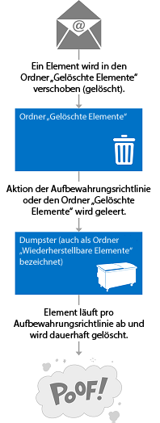
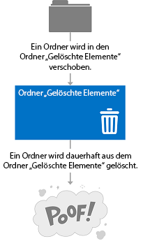
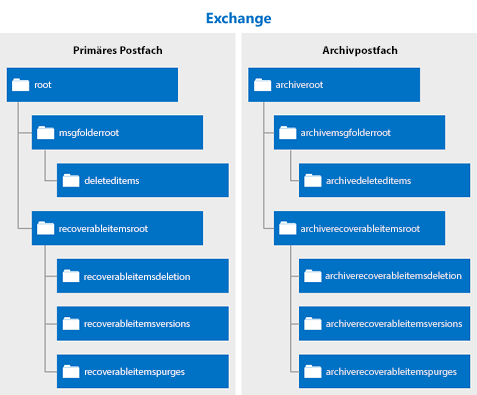

# Löschen von Elementen mithilfe von EWS in ExchangeDeleting items by using EWS in Exchange

Erfahren Sie, wie Sie die EWS Managed API verwenden können oder EWS in Exchange zu löschenden Elemente entweder durch Verschieben in den Ordner Gelöschte Elemente oder zu dem Dumpster.Find out how you can use the EWS Managed API or EWS in Exchange to delete items either by moving them to the Deleted Items folder or to the dumpster.
  
Haben Sie schon einmal gebeten, sich selbst Was ist der Unterschied zwischen dem Verschieben von Elementen in den Ordner Gelöschte Objekte, und verschieben sie die Dumpster?Have you ever asked yourself what the difference is between moving items to the Deleted Items folder, and moving them to the dumpster? Möglicherweise wissen möchten, die verschiedenen Optionen für die Behandlung gelöschter Elemente und wie diese Optionen in Ihrer Anwendung implementiert werden.You might be curious about the different options for handling deleted items and how to implement those options in your application. Exchange-Webdienste (EWS) umfasst drei Optionen für die Behandlung gelöschte Elemente.Exchange Web Services (EWS) includes three options for handling deleted items. In diesem Artikel wird hoffentlich von Verwechslungen deaktivieren möchten, zu den Unterschieden zwischen diesen.This article will hopefully clear up any confusion you might have about the differences between them.
  
## Löschen von Elementen - was eigene Optionen sind?Deleting items - what are my options?

Bevor Sie die gesamte Umgebung zum Löschen von Objekten verstehen können, ist es wichtig, den Unterschied zwischen den folgenden erkannt:Before you can understand the overall landscape for deleting items, it's important to recognize the difference between the following:
  
- Der Ordner Gelöschte Objekte - Wenn Sie Elemente in einem Postfach löschen, wo sie dies ist.The Deleted Items folder - When you delete items in a mailbox, this is where they go.
    
- Die Dumpster (auch bekannt als des Ordners wiederherstellbare Elemente) - beim Entfernen von Elementen aus einem Postfach, wo sie dies ist.The dumpster (aka the Recoverable Items folder) - When you remove items from a mailbox, this is where they go.
    
Abbildung 1 und 2 zeigen, wie der Löschvorgang für Elemente und Ordner in einem Postfach aussieht.Figures 1 and 2 show what the deletion process looks like for items and folders in a mailbox. 

**Abbildung 1. Prozess zum Löschen von Elementen aus einem Postfach****Figure 1. Process for deleting items from a mailbox**

 

**Abbildung 2. Prozess zum Löschen von Ordnern aus einem Postfach****Figure 2. Process for deleting folders from a mailbox**

   
Sie können Elemente und Ordner drei verschiedene Arten löschen, je nachdem, wie "permanent" möchten Sie den Löschvorgang zu.You can delete items and folders three different ways, depending on how "permanent" you would like the deletion to be.
  
**Tabelle 1: Optionen für das Löschen von Elementen mithilfe der Exchange-Webdienste****Table 1: Options for deleting items by using EWS**

|**Option****Option**|**Was ist los****What happens**|
|:-----|:-----|
|Verschieben Sie in den Ordner Gelöschte ElementeMove to the Deleted Items folder    |Dies ist die geringsten Permanent Möglichkeit, Elemente zu löschen.This is the least permanent way to delete items.  Dies entspricht dem setzen ein Blatt Papier im Papierkorb nach Ihren Schreibtisch.This is like putting a piece of paper in the recycle bin by your desk. Sie können auf einfache Weise Code, wenn Sie wieder benötigen.You can easily grab it if you need it again.  Sie können jede [Löschvorgang](deleting-items-by-using-ews-in-exchange.md#bk_howdoIdeleteitems) verwenden, die die Verschiebung der gelöschte Ordner Option zum Ausführen dieser Aktion implementiert.You can use any [deletion operation](deleting-items-by-using-ews-in-exchange.md#bk_howdoIdeleteitems) that implements the move to the Deleted Items folder option to perform this action.  [MoveItem-Vorgang](http://msdn.microsoft.com/library/dcf40fa7-7796-4a5c-bf5b-7a509a18d208%28Office.15%29.aspx) ( [Item.Move()](http://msdn.microsoft.com/de-de/library/microsoft.exchange.webservices.data.item.move%28v=exchg.80%29.aspx)) oder der [MoveFolder-Vorgang](http://msdn.microsoft.com/library/c7233966-6c87-4a14-8156-b1610760176d%28Office.15%29.aspx) ( [Folder.Move()](http://msdn.microsoft.com/de-de/library/microsoft.exchange.webservices.data.folder.move%28v=exchg.80%29.aspx)) können auch um eines Elements oder Ordners in den Ordner Gelöschte Elemente zu verschieben.You can also use the [MoveItem operation](http://msdn.microsoft.com/library/dcf40fa7-7796-4a5c-bf5b-7a509a18d208%28Office.15%29.aspx) ( [Item.Move()](http://msdn.microsoft.com/de-de/library/microsoft.exchange.webservices.data.item.move%28v=exchg.80%29.aspx)) or the [MoveFolder operation](http://msdn.microsoft.com/library/c7233966-6c87-4a14-8156-b1610760176d%28Office.15%29.aspx) ( [Folder.Move()](http://msdn.microsoft.com/de-de/library/microsoft.exchange.webservices.data.folder.move%28v=exchg.80%29.aspx)) to move an item or folder to the Deleted Items folder.    |
|Vorläufiges löschenSoft delete    |Das Element wird in den Ordner Löschvorgänge verschoben die Dumpster.The item is moved to the Deletions folder in the dumpster.  Dies ist wie in den Curbside Container für den Papierkorb leeren.This is like emptying your recycle bin into your curbside container. Sie können weiterhin das Element zugreifen, falls erforderlich, sondern nur etwas komplizierter.You can still access the item if you need to, it's just a little harder.    Weitere Informationen zu den Dumpster (auch als "wiederherstellbare Elemente" bezeichnet) und Szenarien wie eDiscovery oder Rechtsstreitigkeiten Haltestatus finden Sie unter [Recoverable Items Folder](http://technet.microsoft.com/de-de/library/ee364755%28v=exchg.150%29.aspx) auf TechNet.For more about the dumpster (also called the Recoverable Items folder) and scenarios such as eDiscovery or litigation holds, see [Recoverable Items Folder](http://technet.microsoft.com/de-de/library/ee364755%28v=exchg.150%29.aspx) on TechNet.  Weiche Löschvorgänge werden nicht für Applikationen, abzielen Exchange 2007 empfohlen.Soft deletions aren't recommended for applications that target Exchange 2007. In Exchange 2007 gekennzeichnete soft Löschvorgänge durch Einstellung etwas auf das Element, um anzugeben, dass es in verschoben werden sollen die Dumpster einiger Zeit.In Exchange 2007, soft deletions are handled by setting a bit on the item to indicate that it will be moved to the dumpster at an unspecified time.  Durchläufe vorläufiges löschen oder die Suche nach Elementen, die einen weichen über die [FindItem Vorgang](http://msdn.microsoft.com/library/ebad6aae-16e7-44de-ae63-a95b24539729%28Office.15%29.aspx)gelöscht wurden werden in Exchange Online, Exchange Online als Teil von Office 365 und Exchange beginnend mit Exchange 2010-Versionen nicht unterstützt.Soft delete traversals, or searches of items that have been soft deleted via the [FindItem operation](http://msdn.microsoft.com/library/ebad6aae-16e7-44de-ae63-a95b24539729%28Office.15%29.aspx), are not supported in Exchange Online, Exchange Online as part of Office 365, and versions of Exchange starting with Exchange 2010.    **Hinweis**: Ordner nicht weiche gelöscht werden.**NOTE**:  Folders cannot be soft deleted.           |
|Schwerer löschenHard delete    |Des Elements oder Ordners wird dauerhaft gelöscht.The item or folder is permanently deleted.  Festplatte gelöschte Objekte befinden sich im Ordner bereinigt die Dumpster.Hard-deleted items are placed in the Purges folder of the dumpster. Dies ist wie bei der recycling LKW Curbside Recycle Containers leert.This is like when the recycling truck empties your curbside recycle container. Die Elemente können nicht zugegriffen werden, von einem e-Mail-Client wie Outlook oder Outlook Web App und, es sei denn, legen Sie für das Postfach gesperrt ist, die Elemente werden dauerhaft gelöscht nach einem bestimmten Zeitraum.The items cannot be accessed from an email client like Outlook or Outlook Web App, and, unless there is a hold set on the mailbox, the items will be permanently deleted after a set period of time.  Weitere zur Aufbewahrung von Elementen im Artikel [wiederherstellbare Elemente Kontingente und Aufbewahrung von gelöschten Elementen konfigurieren](http://technet.microsoft.com/de-de/library/ee364752%28v=exchg.150%29.aspx).You can read more about item retention in the article [Configure Deleted Item Retention and Recoverable Items Quotas](http://technet.microsoft.com/de-de/library/ee364752%28v=exchg.150%29.aspx).  **Hinweis**: Ordner sind nicht in den Ordner Benutzerkontenverwaltung platziert, wenn sie hart gelöscht werden.**NOTE**:  Folders are not placed in the Purges folder when they are hard deleted. Festplatte gelöschte Ordner werden aus dem Postfach entfernt.Hard-deleted folders are removed from the mailbox.  |
   
Die Verschiebung für den Ordner Gelöschte Objekte und die harte Löschoptionen sind transaktional, d. h., zu dem Zeitpunkt der Webdienstaufruf beendet wurde, das Element in den Ordner Gelöschte Objekte verschoben wurde oder die Dumpster.The move to the Deleted Items folder and the hard delete options are transactional, which means that by the time the web service call finishes, the item has been moved to the Deleted Items folder or the dumpster.
  
Die folgende Abbildung zeigt, mit denen Sie die im Ordner-Ökosystem besser zu verstehen, die zum Speichern von gelöschter Elementen verwendet werden, dass die Hierarchie von Ordnern, die enthalten können Elemente gelöscht.To help you better understand the ecosystem of folders that are used to store deleted items, the following figure shows the hierarchy of folders that can contain deleted items. Die Namen der Ordner sind in den Typ **DistinguishedFolderIdNameType** Schema oder der **WellKnownFolderName** -Aufzählung in die EWS Managed API angezeigt werden.The folder names are as they appear in the **DistinguishedFolderIdNameType** schema type, or the **WellKnownFolderName** enumeration in the EWS Managed API. 
  
**Abbildung 3. Hierarchie von Ordnern, die gelöschten Elemente enthalten****Figure 3. Hierarchy of folders that contain deleted items**

  
**Tabelle 2: Ordner, die gelöschte Elemente enthalten****Table 2: Folders that contain deleted items**

|**Ordnername****Folder name**|**Eingeführt in****Introduced in**|**Beschreibung****Description**|
|:-----|:-----|:-----|
|deleteditemsdeleteditems    |Exchange 2007Exchange 2007    |Ordner Gelöschte Elemente "Standard".The default Deleted Items folder. Elemente bleiben in diesem Ordner, bis sie vorläufig oder Festplatten-gelöschte sind oder ein Aufbewahrungszeitraum überschritten wurde.Items remain in this folder until they are soft- or hard-deleted or until a retention period has been exceeded. Und klicken Sie dann in einen Ordner in dem sie verschoben werden die Dumpster.Then they are moved to a folder in the dumpster. Gelöschte Ordner befinden sich im Ordner "Gelöschte Elemente", und wenn diese vorläufig - oder Festplatten-gelöscht, werden sie dauerhaft aus dem Postfach entfernt und können nicht wiederhergestellt werden.Deleted folders are placed in the Deleted Items folder, and when they are soft- or hard-deleted, they are permanently removed from the mailbox and are not recoverable.    |
|recoverableitemsrootrecoverableitemsroot    |Exchange 2010Exchange 2010    |Der Stamm des dem Dumpster, oder "wiederherstellbare Elemente".The root of the dumpster, or the Recoverable Items folder. Dumpster Access wurde in EWS in Exchange 2010 implementiert.Dumpster access was implemented in EWS in Exchange 2010. "Wiederherstellbare Elemente" ist der Anzeigename für diesen Ordner.The display name for this folder is "Recoverable Items".    |
|recoverableitemsdeletionsrecoverableitemsdeletions    |Exchange 2010Exchange 2010    |Die Hauptseite Dumpster Ordner für ein Postfach.The main dumpster folder for a mailbox. Vorläufig gelöschten Elemente und Elemente, die durch eine Aufbewahrungsrichtlinie aus dem Ordner Gelöschte Elemente verschoben werden in diesem Ordner platziert.Soft-deleted items and items moved from the Deleted Items folder by a retention policy are placed in this folder. "Löschen" ist der Anzeigename für diesen Ordner.The display name for this folder is "Deletions".    |
|recoverableitemsversionsrecoverableitemsversions    |Exchange 2010Exchange 2010    |Ältere Versionen eines Elements in dem gespeichert werden.Where older versions of an item are stored. Ältere Versionen eines Elements werden erstellt, wenn ein Element aktualisiert wird.Old versions of an item are created when an item is updated. Entwurf Elementversionen werden nicht in diesem Ordner gespeichert.Draft item versions are not saved to this folder. Der Anzeigename dieses Ordners ist "Versionen".The display name of this folder is "Versions".    |
|recoverableitemspurgesrecoverableitemspurges    |Exchange 2010Exchange 2010    |Wo werden die Elemente, die aus dem Ordner Löschvorgänge entfernt werden gespeichert.Where items that are removed from the Deletions folder are stored. Alle Speichern von Festplatten gelöschten Elemente werden in diesem Ordner verschoben.All store hard-deleted items are moved to this folder. Der Anzeigename für diesen Ordner lautet "Bereinigt".The display name for this folder is "Purges".    |
|archiveddeletedtitemsarchiveddeletedtitems    |Exchange 2010Exchange 2010    |Den standardmäßigen Ordner für gelöschte Objekte für ein Archivpostfach.The default Deleted Items folder for an archive mailbox.    |
|archiverecoverablesitemsrootarchiverecoverablesitemsroot    |Exchange 2010Exchange 2010    |Das Stammverzeichnis Dumpster Ordner für ein Archivpostfach.The root dumpster folder for an archive mailbox. Archivierte Elemente, die sind vorläufig gelöschten werden in einem Unterordner in diesen Ordner verschoben.Archived items that are soft-deleted are moved to a subfolder in this folder.    |
|archiverecoverableitemsdeletionsarchiverecoverableitemsdeletions    |Exchange 2010Exchange 2010    |Die Hauptseite Dumpster Ordner für ein Archivpostfach.The main dumpster folder for an archive mailbox. Archivierte Elemente verschoben und die Dumpster hier platziert werden.Archived items moved to the dumpster are placed here.    |
|archiverecoverableitemsversionsarchiverecoverableitemsversions    |Exchange 2010Exchange 2010    |In dem ältere Versionen von archivierten Elemente gespeichert werden.Where older versions of archived items are stored.    |
|archiverecoverableitemspurgesarchiverecoverableitemspurges    |Exchange 2010Exchange 2010    |In dem Elemente werden aus dem Archiv Löschvorgänge Festplatte gelöscht Ordner in dem Dumpster gespeichert werden.Where items that are hard-deleted from the archive Deletions folder in the dumpster are stored. Alle Store Festplatte gelöscht archiviert Elemente sind in diesen Ordner verschoben.All store hard-deleted archived items are moved to this folder.    |
   
## Wie lösche ich Elemente?How do I delete items?

Verwenden Sie eine der folgenden Optionen, um anzugeben, ob ein Element in den Ordner Gelöschte Objekte verschoben oder führen Sie eine vorläufig oder einer harte löschen:Use one of the following to indicate whether to move an item to the Deleted Items folder or perform a soft delete or a hard delete:
  
- Den einfachen **DisposalType** -Typ, wenn Sie Exchange Zugriff auf EWS verwenden.The **DisposalType** simple type, if you use EWS to access Exchange. 
    
- Die [DeleteMode-Enumeration](http://msdn.microsoft.com/de-de/library/exchange/microsoft.exchange.webservices.data.deletemode%28v=exchg.80%29.aspx), wenn Sie die EWS Managed API verwenden.The [DeleteMode enumeration](http://msdn.microsoft.com/de-de/library/exchange/microsoft.exchange.webservices.data.deletemode%28v=exchg.80%29.aspx), if you use the EWS Managed API.
    
Eine Anzahl von unterschiedlichen EWS-Vorgänge oder EWS Managed API-Methoden können Sie Elemente und Ordner von einem Postfach löschen.You can use a number of different EWS operations or EWS Managed API methods to delete items and folders from a mailbox.
  
**Tabelle 3: EWS-Vorgänge und EWS Managed API-Methoden zum Löschen von Elementen****Table 3: EWS operations and EWS Managed API methods for deleting items**

|**EWS-Vorgang****EWS operation**|**EWS Managed API-Methode****EWS Managed API method**|**Eingeführt in****Introduced in**|**Funktionsweise****What it does**|
|:-----|:-----|:-----|:-----|
|[DeleteFolder-VorgangDeleteFolder operation](http://msdn.microsoft.com/library/b0f92682-4895-4bcf-a4a1-e4c2e8403979%28Office.15%29.aspx)   |[Folder.Delete-MethodeFolder.Delete method](http://msdn.microsoft.com/de-de/library/exchange/microsoft.exchange.webservices.data.folder.delete%28v=exchg.80%29.aspx)   |Exchange 2007Exchange 2007    |Ordner aus einem Postfach gelöscht.Deletes folders from a mailbox. Mit Exchange-Webdienste können Sie batch-Ordner löschen.With EWS, you can batch delete folders. Mit der EWS Managed API können Sie nur einen einzelnen Ordner pro Aufruf löschen.With the EWS Managed API, you can only delete a single folder per call.    |
|[DeleteItem-OperationDeleteItem operation](http://msdn.microsoft.com/library/3e26c416-fa12-476e-bfd2-5c1f4bb7b348%28Office.15%29.aspx)   |[Item.Delete-MethodeItem.Delete method](http://msdn.microsoft.com/de-de/library/exchange/microsoft.exchange.webservices.data.item.delete%28v=exchg.80%29.aspx)  [ExchangeService.DeleteItems-MethodeExchangeService.DeleteItems method](http://msdn.microsoft.com/de-de/library/exchange/microsoft.exchange.webservices.data.exchangeservice.deleteitems%28v=exchg.80%29.aspx)   |Exchange 2007Exchange 2007    |Löscht Elemente aus einem Postfach.Deletes items from a mailbox.    |
|[EmptyFolder-VorgangEmptyFolder operation](http://msdn.microsoft.com/library/98161486-e2f2-480f-8d5d-708ba81b208a%28Office.15%29.aspx)   |[Folder.Empty-MethodeFolder.Empty method](http://msdn.microsoft.com/de-de/library/exchange/microsoft.exchange.webservices.data.folder.empty%28v=exchg.80%29.aspx)   |Exchange 2010Exchange 2010    |Löscht alle Elemente in einem Ordner, und löscht optional alle Unterordner in einem Ordner.Deletes all the items in a folder, and, optionally, deletes all subfolders in a folder.    |
|[ApplyConversationAction-VorgangApplyConversationAction operation](http://msdn.microsoft.com/library/73d7943d-d361-4f8b-9948-d85f886efa1a%28Office.15%29.aspx)   |[Conversation.EnableAlwaysDeleteItems-MethodeConversation.EnableAlwaysDeleteItems method](http://msdn.microsoft.com/de-de/library/exchange/microsoft.exchange.webservices.data.conversation.enablealwaysdeleteitems%28v=exchg.80%29.aspx)  [Conversation.DeleteItems-MethodeConversation.DeleteItems method](http://msdn.microsoft.com/de-de/library/exchange/microsoft.exchange.webservices.data.conversation.deleteitems%28v=exchg.80%29.aspx)   |Exchange 2010Exchange 2010    |Legt eine Delete processing-Aktion für e-Mail-Nachrichten in einer Unterhaltung, damit sie gelöscht werden.Sets a delete processing action on email messages in a conversation so that they are deleted.    |
|[DeleteUserConfiguration-VorgangDeleteUserConfiguration operation](http://msdn.microsoft.com/library/93e44690-be2d-4fdb-96a8-4ded3c193aed%28Office.15%29.aspx)   |[UserConfiguration.Delete-MethodeUserConfiguration.Delete method](http://msdn.microsoft.com/de-de/library/exchange/microsoft.exchange.webservices.data.userconfiguration.delete%28v=exchg.80%29.aspx)   |Exchange 2010Exchange 2010    |Löscht einen Ordner, Element verknüpft ist und verschiebt es um die Dumpster.Deletes a folder associated item and moves it to the dumpster.    |
|[CreateItem OperationCreateItem operation](http://msdn.microsoft.com/library/78a52120-f1d0-4ed7-8748-436e554f75b6%28Office.15%29.aspx)   |[Appointment.Accept-MethodeAppointment.Accept method](http://msdn.microsoft.com/de-de/library/microsoft.exchange.webservices.data.appointment.accept%28v=exchg.80%29.aspx)   [Appointment.AcceptTentatively-MethodeAppointment.AcceptTentatively method](http://msdn.microsoft.com/de-de/library/microsoft.exchange.webservices.data.appointment.accepttentatively%28v=exchg.80%29.aspx)  [Appointment.CancelMeeting-MethodeAppointment.CancelMeeting method](http://msdn.microsoft.com/de-de/library/microsoft.exchange.webservices.data.appointment.cancelmeeting%28v=exchg.80%29.aspx)  [Appointment.DeclineAppointment.Decline](http://msdn.microsoft.com/de-de/library/microsoft.exchange.webservices.data.appointment.decline%28v=exchg.80%29.aspx)  [MeetingRequest.Accept-MethodeMeetingRequest.Accept method](http://msdn.microsoft.com/de-de/library/microsoft.exchange.webservices.data.meetingrequest.accept%28v=exchg.80%29.aspx)  [MeetingRequest.AcceptTentatively-MethodeMeetingRequest.AcceptTentatively method](http://msdn.microsoft.com/de-de/library/microsoft.exchange.webservices.data.meetingrequest.accepttentatively%28v=exchg.80%29.aspx)  [MeetingRequest.Decline-MethodeMeetingRequest.Decline method](http://msdn.microsoft.com/de-de/library/microsoft.exchange.webservices.data.meetingrequest.decline%28v=exchg.80%29.aspx)   |Exchange 2007Exchange 2007    |Indirekt verschiebt ein Element in den Ordner Gelöschte Objekte, wenn eine Antwort auf eine Besprechungsanfrage gesendet wird oder die Antwort für den Termin festgelegt ist.Indirectly moves an item to the Deleted Items folder whenever a response to a meeting request is sent or the response is set on the appointment.  Der Typ der Löschvorgang ist nicht für diesen Vorgang festgelegt.The deletion type is not set on this operation. Die Besprechungsnachrichten werden in den Ordner Gelöschte Objekte verschoben, wenn ein Antwortobjekt vom Dienst erfolgreich verarbeitet wird.The meeting messages are moved to the Deleted Items folder when a response object is successfully processed by the service.    |
   
Sie können auch Elemente in den Ordner Gelöschte Objekte mithilfe von Regeln für den Posteingang verschieben.You can also move items to the Deleted Items folder by using Inbox rules. Beispielsweise können Sie [Regeln erstellen](inbox-management-and-ews-in-exchange.md) , die eine Delete-Aktion.For example, you can [create rules](inbox-management-and-ews-in-exchange.md) that have a delete action. 
  
Einige Punkte, über das Löschen von Elementen zu beachten:Some points to note about deleting items:
  
- Löschen einer Vorkommen eines sich wiederholenden Elements eine Verschiebung in den Ordner Gelöschte Objekte nicht ausgelöst oder die Dumpster.Deleting an occurrence of a recurring item does not trigger a move to the Deleted Items folder or the dumpster. Dies führt eine Aktualisierung auf das Master-Shape wiederkehrenden Element von sich wiederholenden Reihe.This results in an update to the recurring master item of the recurring series.
    
- Standardordner kann nicht aus dem Postfach gelöscht werden.You cannot delete default folders from the mailbox.
    
- Löschen von Besprechungen oder Besprechungsnachrichten wie Besprechungsanfragen und oder meeting Updates zu vermeiden.Avoid deleting meetings or meeting messages, such as meeting requests and or meeting updates. Stattdessen diese Elemente mithilfe von Antwortobjekte beantworten.Instead, respond to these items by using response objects. Auf diese Weise werden die zugehörigen Kalenderelemente der des Responders oder des Organisators Aktionen entsprechend aktualisiert.This way, the associated calendar items are updated to reflect the responder's or organizer's actions.
    
- Key für ein Element ändern, werden nicht aktualisiert, wenn das Element in den Ordner Gelöschte Objekte oder Löschvorgänge verschoben wird.An item's change key is not updated when the item is moved to the Deleted Items or Deletions folder.
    
- Wenn Sie Ausführen einer harte für ein Element löschen, und rufen Sie dann eine [SyncFolderHierarchy Vorgang](http://msdn.microsoft.com/library/b31916b1-bc6c-4451-a475-b7c5417f752d%28Office.15%29.aspx) oder [SyncFolderHierarchy](http://msdn.microsoft.com/de-de/library/microsoft.exchange.webservices.data.exchangeservice.syncfolderhierarchy%28v=exchg.80%29.aspx) EWS Managed API-Methode oder eine [SyncFolderItems Vorgang](http://msdn.microsoft.com/library/7f0de089-8876-47ec-a871-df118ceae75d%28Office.15%29.aspx) oder [SyncFolderItems](http://msdn.microsoft.com/de-de/library/microsoft.exchange.webservices.data.exchangeservice.syncfolderitems%28v=exchg.80%29.aspx) -Methode, eine Änderung **Löschen** Eintrag wird zurückgegeben.If you perform a hard delete on an item and then call a [SyncFolderHierarchy operation](http://msdn.microsoft.com/library/b31916b1-bc6c-4451-a475-b7c5417f752d%28Office.15%29.aspx) or [SyncFolderHierarchy](http://msdn.microsoft.com/de-de/library/microsoft.exchange.webservices.data.exchangeservice.syncfolderhierarchy%28v=exchg.80%29.aspx) EWS Managed API method, or a [SyncFolderItems operation](http://msdn.microsoft.com/library/7f0de089-8876-47ec-a871-df118ceae75d%28Office.15%29.aspx) or [SyncFolderItems](http://msdn.microsoft.com/de-de/library/microsoft.exchange.webservices.data.exchangeservice.syncfolderitems%28v=exchg.80%29.aspx) method, a **Delete** change entry will be returned. Wenn Sie ein Element in den Ordner Gelöschte Objekte verschieben, wird ein **Update** ändern Eintrag zurückgegeben.If you move an item to the Deleted Items folder, an **Update** change entry is returned. Dies ist, da des Elements oder Ordners einen neuen Eigenschaftswert [ParentFolderId](http://msdn.microsoft.com/library/258f4b1f-367e-4c7d-9c29-eb775a2398c7%28Office.15%29.aspx) verfügen.This is because the item or folder will have a new [ParentFolderId](http://msdn.microsoft.com/library/258f4b1f-367e-4c7d-9c29-eb775a2398c7%28Office.15%29.aspx) property value. [Mehr über die Synchronisierung](mailbox-synchronization-and-ews-in-exchange.md) synchronisieren Elemente gelöscht ist Teil des Szenarios.[Read more about synchronization](mailbox-synchronization-and-ews-in-exchange.md) if synchronizing deleted items is part of your scenario. 
    
## Hier erfahren Sie mehr über das Löschen von ElementenFind out more about deleting items

- [Ziehen Sie Benachrichtigungen für EWS Postfach löschen-bezogenen Ereignisse in ExchangePull notifications for EWS deletion-related mailbox events in Exchange](pull-notifications-for-ews-deletion-related-mailbox-events-in-exchange.md)
    
- [Fehlerbehandlung Löschung-bezogene in EWS in ExchangeHandling deletion-related errors in EWS in Exchange](handling-deletion-related-errors-in-ews-in-exchange.md)
    
## Siehe auchSee also

- [Ordner und Elemente in EWS in ExchangeFolders and items in EWS in Exchange](folders-and-items-in-ews-in-exchange.md)    
- [Entwickeln von Webdienstclients für ExchangeDevelop web service clients for Exchange](develop-web-service-clients-for-exchange.md)    
- [Ordner "wiederherstellbare Elemente"Recoverable Items Folder](http://technet.microsoft.com/de-de/library/ee364755.aspx)    
- [Wiederherstellung einzelner Elemente in Exchange Server 2010Single Item Recovery in Exchange Server 2010](http://blogs.technet.com/b/exchange/archive/2009/09/25/3408389.aspx#_Single_Item_Recovery)    
- [Exchange 2013: Löschen einer Terminserie programmgesteuert von Exchange-ServernExchange 2013: Delete a recurring series programmatically from Exchange servers](http://code.msdn.microsoft.com/exchange/Exchange-2013-Delete-a-e1c7b89d)    
- [Exchange 2013: Löschen von Aufgaben in einem Konto auf Exchange-Servern programmgesteuertExchange 2013: Delete tasks from an account on Exchange servers programmatically](http://code.msdn.microsoft.com/exchange/Exchange-2013-Delete-tasks-13824637)    
- [Exchange 2013: Leeren Sie programmgesteuert Ordner auf Exchange-ServernExchange 2013: Empty folders on Exchange servers programmatically](http://code.msdn.microsoft.com/exchange/Exchange-2013-Empty-6487df37)    
- [Exchange 2013: Löschen Sie programmgesteuert Ordner von Exchange-ServernExchange 2013: Delete folders programmatically from Exchange servers](http://code.msdn.microsoft.com/exchange/Exchange-2013-Delete-aa1a5823)    
- [Exchange 2013: Löschen von vielen Elementen programmgesteuert von Exchange-ServernExchange 2013: Delete many items programmatically from Exchange servers](http://code.msdn.microsoft.com/exchange/Exchange-2013-Delete-many-064f8760)    
- [Exchange 2013: Löschen von Kontakten programmgesteuert aus Exchange-ServernExchange 2013: Delete contacts programmatically from Exchange servers](http://code.msdn.microsoft.com/exchange/Exchange-2013-Delete-3b8b0640)    
- [Löschen von Terminen und Abbrechen an Besprechungen mithilfe von EWS in ExchangeDelete appointments and cancel meetings by using EWS in Exchange](how-to-delete-appointments-and-cancel-meetings-by-using-ews-in-exchange.md)    
- [Verwalten der permanenten Anwendungseinstellungen mithilfe von EWS in ExchangeManage persistent application settings by using EWS in Exchange](how-to-manage-persistent-application-settings-by-using-ews-in-exchange.md)
    

