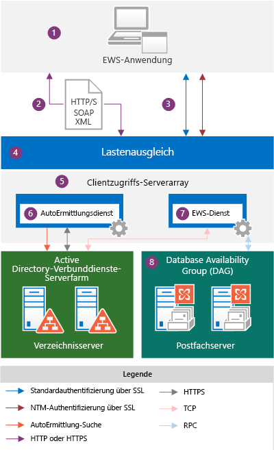
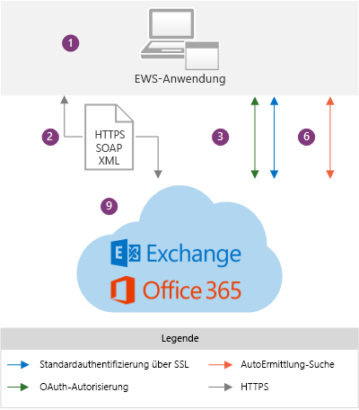

# EWS-Anwendungen und die Exchange-ArchitekturEWS applications and the Exchange architecture

Erfahren Sie mehr über die Funktionsweise von EWS innerhalb der Exchange-Architektur und finden Sie heraus, welche Protokolle EWS verwendet.Learn about how EWS works within the Exchange architecture, and find out which protocols EWS relies on.
  
Exchange-Webdienste (EWS) ist eine plattformübergreifende API, die Anwendungen den Zugriff auf Postfachelemente, z. B. E-Mail-Nachrichten, Termine und Kontakte, von Exchange Online, Exchange Online als Teil von Office 365 oder von lokalen Exchange-Versionen beginnend mit Exchange Server 2007 aus ermöglicht.Exchange Web Services (EWS) is a cross-platform API that enables applications to access mailbox items such as email messages, meetings, and contacts from Exchange Online, Exchange Online as part of Office 365, or on-premises versions of Exchange starting with Exchange Server 2007. EWS applications can access mailbox items locally or remotely by sending a request in a SOAP-based XML message. The SOAP message is embedded in an HTTP message when sent between the application and the server, which means that as long as your application can post XML through HTTP, it can use EWS to access Exchange. [EWS-Anwendungen](ews-application-types.md) können lokal oder remote durch Senden einer Anfrage in einer SOAP-basierten XML-Nachricht auf Postfachelemente zugreifen.[EWS applications](ews-application-types.md) can access mailbox items locally or remotely by sending a request in a SOAP-based XML message. Die SOAP-Nachricht ist in einer HTTP-Nachricht eingebettet, wenn sie zwischen der Anwendung und dem Server gesendet wird, was bedeutet, dass, sofern die Anwendung XML über HTTP veröffentlichen kann, sie EWS für den Zugriff auf Exchange verwenden kann.The SOAP message is embedded in an HTTP message when sent between the application and the server, which means that as long as your application can post XML through HTTP, it can use EWS to access Exchange. 
  
## Übersicht über die Exchange-ArchitekturExchange architecture overview

Das folgende Diagramm zeigt die Authentifizierungsmethoden und Kommunikationspfade von EWS-Anwendungen bei der Kommunikation mit Exchange 2013 und Exchange Online. Aus Sicht der EWS-Anwendung sind die Kommunikationspfade identisch, und die Authentifizierungsmethoden variieren nur geringfügig. Der Hauptunterschied besteht aus der Transparenz in das Exchange-Back-End.The following diagrams show the authentication methods and communication paths used by EWS applications when communicating with Exchange 2013 and Exchange Online. From the EWS application perspective, the communication paths are identical and the authentication methods only vary slightly; the main difference is the visibility you have into the Exchange backend.
  
**Abbildung 1. EWS-Anwendung und die lokale Exchange-Architektur****Figure 1.  EWS application and the Exchange on-premises architecture**

  
Abbildung 2 zeigt die gleichen Kommunikationspfade wie in Abbildung 1, die von EWS-Anwendungen bei der Kommunikation mit Exchange Online verwendet werden.Figure 2 shows the same communication paths shown in Figure 1, as used by EWS applications when communicating with Exchange Online.
  
**Abbildung 2. EWS-Anwendung und die Exchange Online-Architektur****Figure 2.  EWS application and the Exchange Online architecture**

  
Folgende Komponenten werden in den Diagrammen gezeigt:The following are the components that are shown in the diagrams:
  
1. EWS-Anwendung – kann ein [Client, Portal oder eine Dienstanwendung](ews-application-types.md) sein und kann auf einem Client oder auf einem lokalen Exchange-Clientzugriffsserver installiert sein.EWS application — This can be a [client, portal, or service application](ews-application-types.md) and it can be installed on a client or on an Exchange on-premises Client Access server. If you use the EWS Managed API to develop the EWS application, the EWS Managed API assemblies have to be installed on the client and redistributed by your application. Wenn Sie die verwaltete EWS-API verwenden, um die EWS-Anwendung zu entwickeln, müssen die verwalteten EWS-Assemblys auf dem Client installiert sein und [von der Anwendung verteilt werden](redistribution-requirements-for-the-ews-managed-api.md).EWS application — This can be a client, portal, or service application and it can be installed on a client or on an Exchange on-premises Client Access server. If you use the EWS Managed API to develop the EWS application, the EWS Managed API assemblies have to be installed on the client and [redistributed by your application](redistribution-requirements-for-the-ews-managed-api.md).
    
2. Die SOAP-XML-Nachricht – eine XML-Nachricht in einem SOAP-Umschlag, eingebettet in einer HTTP/S-Nachricht, die der „Datei Services.wsdl“ auf dem Clientzugriffsserver entspricht. HTTPS empfiehlt sich für Exchange lokal und ist für Exchange Online erforderlich. The SOAP XML message — An XML message, in a SOAP envelope, embedded in an HTTP/S message that conforms to the Services.wsdl file on the Client Access server. HTTPS is recommended for Exchange on-premises and is required for Exchange Online. 
    
3. Authentifizierungsmethoden – EWS-Nachrichten umfassen grundlegende, NTLM- (integrierte Windows-Authentifizierung) oder OAuth-Authentifizierungsinformationen als Teil des HTTP-Datenverkehrs.Authentication methods — EWS messages include basic, NTLM (Windows Integrated authentication), or OAuth authentication information as part of the HTTP payload. 
    
4. Lastenausgleich – Lastenausgleich verteilt die Nachricht an einen Clientzugriffsserver im Clientzugriffsserver-Array. Diese Komponente wird nur in der lokalen Exchange-Architektur angezeigt.Load balancer — The load balancer distributes the message to a Client Access server in the Client Access server array. This component is only visible in the Exchange on-premises architecture.
    
5. Clientzugriffsserver-Array – Clientzugriffsserver sind in einer Gruppe mit Lastenausgleich organisiert, die als Clientzugriffsserver-Array bezeichnet wird.Client Access server array — Client Access servers are organized into a load-balanced group called a Client Access server array. Einzelne Clientzugriffsserver bieten eine Authentifizierung, begrenzte Umleitung und Proxydienste.Individual Client Access servers provide authentication, limited redirection, and proxy services. Die Clientzugriffsserver rendern selbst keine Daten, und keine Daten werden auf einem Clientzugriffsserver in eine Warteschlange eingereiht oder gespeichert – er ist „thin“ und statusfrei. Er authentifiziert einfach die Anforderung, führt eine AutoErmittlungssuche durch und leitet die Anfrage an den Postfachserver weiter.The Client Access servers themselves don't do any data rendering, and no data is queued or stored on a Client Access server - it is thin and stateless; it simply authenticates the request, performs an Autodiscover lookup, and then proxies the request to the Mailbox server. Der Clientzugriffsserver unterhält eine 1:1-Beziehung mit dem Postfachserver, der die Daten des Benutzers hostet.The Client Access server does maintain a 1:1 relationship with the Mailbox server that hosts the user's data. Das HTTP-Protokoll (gesichert über SSL mithilfe eines selbstsignierten Zertifikats) wird zwischen Clientzugriffs- und Postfachserver verwendet.The HTTP protocol (secured via SSL using a self-signed certificate) is used between the Client Access server and Mailbox server. Diese Komponente wird nur in der lokalen Exchange-Architektur angezeigt.This component is only visible in the Exchange on-premises architecture.
    
6. AutoErmittlungsdienst – der AutoErmittlungsdienst führt eine Diensterkennung mithilfe des Zugriffs auf Active Directory Domain Services (AD DS) durch, um die Postfachversion und den Speicherort des Postfachservers abzurufen, der die aktive Kopie der Daten des Benutzers hostet.Autodiscover service — The Autodiscover service performs a service discovery by accessing Active Directory Domain Services (AD DS) to retrieve the mailbox version and the location of the Mailbox server that is hosting the active copy of the user’s data.
    
7. EWS-Dienst – der EWS-Dienst wird von drei Dateien beschrieben: „Services.WSDL“, „Messages.xsd“, „Types.xsd“ sowie die verwalteten EWS-API-Assemblys. „Services.WSDL“ beschreibt den Vertrag zwischen Client und Server, „Messages.xsd“ definiert die Anforderungs- und Antwort-SOAP-Nachrichten, und „Types.xsd“ definiert die Elemente, die in den SOAP-Nachrichten verwendet werden. „Messages.xsd“ und „Types.xsd“ enthalten immer die neuesten Versionen des Schemas, obwohl frühere Versionen des Schemas vorhanden sind. Beachten Sie, dass „Services.wsdl“, „Messages.xsd“ und „Types.xsd“ auf dem Clientzugriffsserver zur Verfügung gestellt werden, aber eigentlich nicht für die Schemavalidierung verwendet werden – sie werden nur zu Informationszwecken bereitgestellt. Die verwalteten EWS-API-Assemblys werden für serverseitige EWS-Clientanwendungen bereitgestellt und werden auf allen Exchange Server-Rollen bereitgestellt, nicht nur auf den Clientzugriffsservern. Diese Komponente wird nur in der lokalen Exchange-Architektur angezeigt.EWS service —The EWS service is described by three files: Services.wsdl, Messages.xsd, and Types.xsd, as well as the EWS Managed API assemblies. Services.wsdl describes the contract between the client and server, Messages.xsd defines the request and response SOAP messages, and Types.xsd defines the elements used in the SOAP messages. Messages.xsd and Types.xsd always contain the latest versions of the schema, although earlier versions of the schema exist. Note that Services.wsdl, Messages.xsd, and Types.xsd are made available on the Client Access server, but are not actually used for schema validation — they are provided for reference only. The EWS Managed API assemblies are provided for server-side EWS client applications and are deployed on all Exchange Server roles, not just the Client Access servers. This component is only visible in the Exchange on-premises architecture.
    
    Verfügbarkeit von Features basiert auf der EWS-Schemaversion, die die Anwendung verwendet.Feature availability is based on the EWS schema version that your application targets. Da EWS-Schemas vorwärts- und rückwärtskompatibel sind, funktioniert Ihre Anwendung auch mit einer neueren Schemaversion, z. B. mit dem Exchange 2010 SP2-Dienst sowie Exchange Online, wenn Sie eine Anwendung erstellen, die eine frühere Schemaversion wie etwa Exchange 2007 SP1 verwendet.Regardless of the development option that you choose, you should consider how EWS features are implemented in your client. Feature availability is based on the EWS schema version that your application targets. Because EWS schemas are backward- and forward-compatible, if you create an application that targets an earlier schema version, such as Exchange Server 2007 SP1, your application will also work against a later schema version, such as the Exchange Server 2013 SP1 service, as well as Exchange Online. Da die Features und Featureupdates vom Schema gesteuert werden, empfehlen wir, dass Sie die früheste gemeinsame Codebasis verwenden, die die EWS-Features nutzt, die Sie in der Clientanwendung implementieren möchten.Because features and feature updates are driven by the schema, we recommend that you use the earliest common code base that targets the EWS features that you want to implement in your client application. Viele Clientanwendungen können die Exchange2007_SP1-Version nutzen, da das Exchange 2007 SP1-Schema fast alle zentralen Exchange-Funktionen für die Arbeit mit Elementen und Ordnern im Exchange-Informationsspeicher enthält.Many applications can target the Exchange2007_SP1 version, because the Exchange 2007 SP1 schema contains almost all the core Exchange functionality for working with items and folders in the Exchange store. Weitere Informationen finden Sie in den [EWS-Clientfeatures](ews-client-design-overview-for-exchange.md#EWSFeatures).For more information, see [EWS client features](ews-client-design-overview-for-exchange.md#EWSFeatures).
    
8. Database Availability Group (DAG) – Postfachserver sind in einer hochgradig verfügbaren DAG organisiert, die in einem oder mehrerem Rechenzentren bereitgestellt werden können. Der Postfachserver enthält die Postfachdatenbank und verarbeitet alle Vorgänge für die aktiven Postfächer auf diesem Server. Alle Komponenten, die Daten verarbeiten, rendern und speichern, befinden sich auf dem Postfachserver. Clients stellen keine direkte Verbindung mit dem Postfachserver her. Alle Verbindungen werden vom Clientzugriffsserver verarbeitet. Diese Komponente wird nur in der lokalen Exchange-Architektur angezeigt.Database Availability Group (DAG) — Mailbox servers are organized into a highly available DAG, which can be deployed in one or more datacenters. The Mailbox server contains the mailbox database and handles all activity for the active mailboxes on that server. All components that process, render, and store data are on the Mailbox server. Clients do not connect directly to the Mailbox server; all connections are handled by the Client Access server. This component is only visible in the Exchange on-premises architecture.
    
9. Exchange Online und Exchange Online als Teil von Office 365 – die gehostete Messaging-Lösung, die Exchange-Features wie z. B. einen cloudbasierten Dienst bereitstellt.Exchange Online and Exchange Online as part of Office 365 — The hosted messaging solution that delivers Exchange features as a cloud-based service.
    
Wenn eine EWS-Anwendung Informationen aus dem Exchange-Speicher anfordert, wird eine XML-Anforderungsnachricht erstellt, die dem SOAP-Standard entspricht, und an den Exchange-Server gesendet. Wenn der Exchange-Server die Anforderung empfängt, überprüft er die Anmeldeinformationen, die vom Client bereitgestellt werden, und analysiert automatisch die XML-Daten für die angeforderten Daten. Der Server erstellt dann eine SOAP-Antwort, die XML-Daten enthält, die die angeforderten starken Objekttypen und deren Eigenschaften darstellt. Die XML-Daten werden in einer HTTP-Antwort zurück an die Anwendung gesendet. Die Anwendung deserialisiert dann die XML-Elemente und verwendet die Daten, um die starken Objekttypen neu zu erstellen.When an EWS application requests information from the Exchange store, an XML request message that complies with the SOAP standard is created and sent to the Exchange server. When the Exchange server receives the request, it verifies the credentials that are provided by the client and automatically parses the XML for the requested data. The server then builds a SOAP response that contains XML data that represents the requested strongly typed objects and their properties. The XML data is sent back to the application in an HTTP response. The application then deserializes the XML and uses the data to reform the strongly typed objects.
  
## Protokolle und Standards, die EWS-Anwendungen unterstützen müssenProtocols and standards that EWS applications must support

Für die Kommunikation mit einem Exchange-Server müssen EWS-Anwendungen die folgenden Protokolle und Standards unterstützen.To communicate with an Exchange server, EWS applications must support the following protocols and standards.
  
**Tabelle 1. Protokolle****Table 1.  Protocols**

|**Protocol****Protocol**|**Verwendung****How it’s used**|
|:-----|:-----|
|HTTP/SHTTP/S    |Ermöglicht EWS-Anwendungen den Zugriff auf Exchange-Datenbankdaten über das Netzwerk, unabhängig davon, ob sich der Client im Internet oder Intranet befindet.Enables EWS applications to access Exchange database data over the network, regardless of whether the client is on the Internet or intranet.    |
|SOAP 1.0SOAP 1.0    |Bildet einen Umschlag um die Messaging-Nutzdaten. EWS implementiert das SOAP-Protokoll mit verschiedenen Teilen des SOAP-Umschlags, um andere Funktionen zu aktivieren. Der SOAP-Header wird für den Identitätswechsel und zum Bereitstellen von Versionsverwaltungsdaten verwendet. Der SOAP-Text enthält Informationen zum auszuführenden Vorgang und zu den Daten, die an den Vorgang gesendet werden. SOAP basiert auf WSDL, um die aufzurufenden Vorgänge zu beschreiben.Forms an envelope around the messaging payload. EWS implements the SOAP protocol by using different parts of the SOAP envelope to enable different functionality. The SOAP header is used for impersonation and to provide versioning data. The SOAP body provides information about the operation to run and the data that is submitted to the operation. SOAP relies on WSDL to describe the operations to call.    |
|WSDL 1.0WSDL 1.0    |Beschreibt die Bindungen, die Vorgänge und die Eigenschaften, die verwendet werden, um EWS-Vorgänge in der Datei „Services.wsdl“ aufzurufen. Diese Datei bildet zusammen mit den referenzierten Schemadateien den Vertrag zwischen einer EWS-Anwendung und dem Exchange-Server und wird häufig zusammen mit anbieterspezifischen Tools verwendet, um plattformspezifische Anwendungen zu erstellen. Die WSDL-Datei befindet sich im virtuellen EWS-Verzeichnis, das sich im Stammverzeichnis der Website befindet.Describes the bindings, the operations, and the properties that are used to call EWS operations, in the Services.wsdl file. This file, along with the referenced schema files, comprises the contract between an EWS application and the Exchange server, and is often used along with vendor-specific tools to create platform-specific applications. The WSDL file is located in the EWS virtual directory, which is at the root of the website.    |
|Transport Layer Security (TLS)/SSLTransport Layer Security (TLS)/SSL    |Stellt sichere Webkommunikation im Internet oder Intranet bereit. TLS ermöglicht Anwendungen das Authentifizieren von Servern oder (optional) Servern das Authentifizieren von EWS-Anwendungen. Es stellt ferner durch Verschlüsseln der Kommunikation einen Sicherheitskanal bereit. TLS ist die aktuelle Version des SSL-Protokolls (Secure Sockets Layer).Provides secure web communications on the Internet or on intranet. TLS enables applications to authenticate servers or, optionally, servers to authenticate EWS applications. It also provides a security channel by encrypting communications. TLS is the latest version of the Secure Sockets Layer (SSL) protocol.    |
|XML/XSDXML/XSD    |Stellt ein universelles Nachrichtenformat für den Austausch von Informationen zwischen dem Exchange-Server und dem Client bereit. XML stellt komplexe Exchange-Datenbankdaten für Clientanwendungen in einer definierten Struktur bereit. Der Vorteil von XML besteht darin, dass es den Austausch von Daten auch dann ermöglicht, wenn eine EWS-Anwendung und ein Server keine gemeinsame Plattform nutzen.Provides a universal message format for the exchange of information between the Exchange server and the client. XML provides complex Exchange database data to client applications, but in a defined structure. The beauty of XML is that it allows for the exchange of data even when an EWS application and server do not share a common platform.    |
   
Darüber hinaus müssen EWS-Anwendungen folgende Authentifizierungsstandards unterstützen:In addition, EWS applications must support the following authentication standards:
  
- Standardauthentifizierung über SSL für Anwendungen, die Exchange Online oder lokales Exchange nutzen.Basic authentication over SSL, for applications that target Exchange Online or Exchange on-premises.
    
- NTLM-Authentifizierung über SSL für Anwendungen, die lokales Exchange unterstützen.NTLM authentication over SSL, for applications that support Exchange on-premises.
    
- OAuth 2.0-Tokenauthentifizierung für vertrauenswürdige Partneranwendungen und Interoperabilität mit Lync Server 2013 und SharePoint Server 2013.OAuth 2.0 token authentication, for trusted partner applications and interoperability with Lync Server 2013 and SharePoint Server 2013.
    
## Siehe auchSee also

- [Verwenden von Webdiensten in ExchangeStart using web services in Exchange](start-using-web-services-in-exchange.md)
    
- [EWS-AnwendungstypenEWS application types](ews-application-types.md)
    
- [Übersicht über den EWS-Cliententwurf für ExchangeEWS client design overview for Exchange](ews-client-design-overview-for-exchange.md)
    

