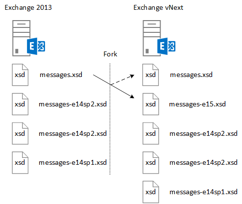

# <a name="ews-schema-versions-in-exchange"></a>EWS-Schemaversionen in Exchange

In diesem Artikel erfahren Sie mehr über das EWS-Schema und wie Sie Ihre Anwendung so entwerfen, dass Sie damit arbeiten, sowie die Features, die in jeder Schemaversion zur Verfügung stehen und wie sich das Schema auf die Exchange-Dienstversion bezieht.
  
Das EWS-Schema definiert die Datenstrukturen, die an Exchange gesendet und von dieser zurückgegeben werden können. Jede neue Version von Exchange, die eine wesentliche Änderung der EWS-Funktionalität enthält, wird ein neues Schema enthalten. EWS und das EWS-Schema sind sowohl rückwärts als auch in einigen Fällen Forward-kompatible-Anwendungen, die für frühere Versionen von EWS entwickelt wurden, funktionieren in den meisten Fällen mit höheren Versionen von EWS, und Anwendungen, die auf spätere Versionen von EWS abzielen, funktionieren, wenn die gleiche Funktionalität in einer früheren Version enthalten war. In diesem Artikel erfahren Sie, wie Sie die Rolle des EWS-Schemas, die Funktionsweise der Schema Versionsverwaltung, die Beziehung zwischen der Schemaversion und der Dienstversion verstehen und wie Sie Ihre Anwendung für die Verwendung des EWS-Schemas entwickeln können. 
  
## <a name="role-of-the-ews-schema"></a>Rolle des EWS-Schemas

Das EWS-Schema führt folgende Schritte aus:
  
- Definiert die Funktionsgruppe, die für einen Client verfügbar ist. Ein Client kann die Liste der unterstützten Schemaversionen mithilfe des SOAP- [AutoErmittlungsdiensts](autodiscover-for-exchange.md)abrufen. Der Client kann dann bestimmen, auf welche Features er zugreifen kann, da jede Schemaversion eine [EWS-Funktionsgruppe](ews-schema-versions-in-exchange.md#bk_features)darstellt. Jedes für EWS freigegebene neue Schema enthält die Schema Entitäten aus der vorherigen Version sowie die Schemadefinitionen für neue Funktionen. Auf diese Weise unterstützt EWS Anwendungen, die auf eine frühere Version von EWS abzielen.
    
- Enthält eine allgemeine Beschreibung des API-Vertrags. Sie können diesen Vertrag verwenden, um die Datenstrukturen zu bestimmen, die an Exchange gesendet und von dieser empfangen werden können.
    
- Stellt einen Mechanismus für die Versionsverwaltung zum Senden von Anforderungen bereit. Der Exchange-Server enthält alle unterstützten EWS-Schemaversionen in seinem virtuellen Verzeichnis. 
    
## <a name="designing-your-application-with-schema-version-in-mind"></a>Entwerfen Ihrer Anwendung mit Schemaversion im Hinterkopf

Beachten Sie beim Entwerfen Ihrer Anwendung für die Verwendung verschiedener Versionen des EWS-Schemas die folgenden Punkte:
  
- Aktivieren/Deaktivieren der Funktion basierend auf der Schemaversion. Sie sollten die Clientfunktionalität der Schemaversion und in einigen Fällen der Version des Diensts zuordnen. Im folgenden Beispiel wird ein [PropertySet](https://msdn.microsoft.com/library/office/microsoft.exchange.webservices.data.propertyset%28v=exchg.80%29.aspx) basierend auf der Version des Schemas und Diensts zurückgegeben. 
    
  ```cs
  private static PropertySet InitPropertySetByVersion(ExchangeService service)
  {
      PropertySet props;
      // The schema version to target to access the NormalizedBody property 
      // is Exchange2013 or later. The server version to target to access the 
      // NormalizedBody property on an email is 15 or later, which 
      // equates to Exchange 2013.
      if (service.RequestedServerVersion >= ExchangeVersion.Exchange2013 &amp;&amp;
          service.ServerInfo.MajorVersion >= 15)
      {
          props = new PropertySet(EmailMessageSchema.NormalizedBody);
      }
      else
      {
          props = new PropertySet(EmailMessageSchema.Body);
      }
      return props;
  }
  ```

- Version Ihrer Anforderungen mit der frühesten Version des EWS-Schemas, die die zu verwendende Funktionalität unterstützt. Dadurch wird Ihr Client auf eine größere Anzahl von potenziellen Exchange-Servern angewendet. Dies ist nicht so wichtig, wenn Sie eine Branchenanwendung entwickeln, die nur auf die Server Ihrer Organisation abzielt, aber sehr wichtig ist, wenn Sie eine Anwendung für eine breitere Exchange-Zielgruppe erstellen.
    
## <a name="features-by-schema-version"></a>Features nach Schemaversion
<a name="bk_features"> </a>

Die für einen Client verfügbaren Schemaversionen werden im einfachen Typ **einfachen exchangeversiontype** im Typen. XSD-Schema identifiziert. Die **einfachen exchangeversiontype** wird durch das [RequestServerVersion](https://msdn.microsoft.com/library/af4032d5-42b3-463e-9d0a-8236d78e5b75%28Office.15%29.aspx) -Element implementiert. Das **RequestServerVersion** -Element wird in allen EWS-Anforderungen gesendet, um dem Server mitzuteilen, welche Version des Schemas der Client abzielt. Dies wiederum identifiziert die Funktionsgruppe, die dem Client zur Verfügung steht. 
  
**Tabelle 1: EWS-Features nach Produkt-und Schemaversion**

|**Produktversion**|**Zugeordnete Schemaversion**|**Features**|
|:-----|:-----|:-----|
|Exchange Online  |Die neueste Schemaversion.  |Enthält alle Features in der aktuellen Version von Exchange sowie alle neuen Features, die für Online Clients hinzugefügt werden. |
|Exchange 2013 SP1 |Exchange2013_SP1 | Enthält alle Features in Exchange 2013.<br/><br/>Die folgenden Features wurden in Exchange 2013 SP1 eingeführt: <ul><li>[Aufbewahrungsrichtlinie für Postfächer](https://msdn.microsoft.com/library/office/microsoft.exchange.webservices.data.exchangeservice.setholdonmailboxes%28v=exchg.80%29.aspx) </li><li> [Vorschlagen einer neuen Zeit](how-to-propose-a-new-meeting-time-by-using-ews-in-exchange.md) </li><li>  Lesen von Bestätigungs Updates zum [Aktualisieren](https://msdn.microsoft.com/library/office/dn600559%28v=exchg.80%29.aspx) und [Löschen](https://msdn.microsoft.com/library/office/dn600557%28v=exchg.80%29.aspx) von Elementen  </li><li> [IRM-Informations](https://msdn.microsoft.com/library/office/microsoft.exchange.webservices.data.conversation.hasirm%28v=exchg.80%29.aspx) Update für Unterhaltungen  </li></ul> |
|Exchange 2013   |Exchange2013   | Umfasst alle Features, die in Exchange 2007 und Exchange 2010 eingeführt wurden. <br/><br/>Die folgenden Features wurden in Exchange 2013 eingeführt:<ul><li>Archivierung  </li><li>  eDiscovery  </li><li>  Personas  </li><li>  Aufbewahrungsrichtlinien  </li><li>  Einheitlicher Kontaktspeicher  </li><li>  Benutzerfotos  </li></ul> |
|Exchange 2010 SP2   |Exchange2010_SP2 | Enthält alle Features, die in Exchange 2010 SP1 eingeführt wurden. <br/><br/>Die folgenden Features wurden in Exchange 2010 SP2 eingeführt:<ul><li>Abrufen des Kennwortablaufs  </li><li>  DateTime-Genauigkeit  </li><li>  Aktualisierte Eigenschaftenbezeichner für Kontakte  </li><li>  Neue Szenarien für Identitätswechsel  </li></ul> |
|Exchange 2010 SP1  |Exchange2010_SP1   | Enthält alle Features, die in Exchange 2010 eingeführt wurden. <br/><br/>Die folgenden Features wurden in Exchange 2010 SP1 eingeführt:<ul><li>Erstellen, abrufen und Ändern von Posteingangsregeln  </li><li>  Programmgesteuerten Zugriff auf Archivpostfach  </li><li>  Konversations Aktionen  </li><li>  Firewall durchlaufen von Benachrichtigungen  </li><li>  Verbesserte Verwaltungsfunktionen  </li><li>  Verbesserte Unterstützung für gemischte Versionen  </li><li>  Unterstützung des Einschränkungs Schutzes  </li><li>  Steuerung des Anwendungszugriffs auf EWS  </li><li>  Unterstützung der Client Zertifikatauthentifizierung  </li></ul> |
|Exchange 2010  |Exchange2010   | Enthält alle Features, die in Exchange 2007 SP1 eingeführt wurden. <br/><br/>Die folgenden Features wurden in der ersten Version von Exchange 2010 eingeführt:<ul><li>Vollständige private Verteilerliste  </li><li>  Benutzer Konfigurationsobjekte  </li><li>  Ordner zugeordnete Elemente  </li><li>  Nachrichtenverfolgung  </li><li>  Unified Messaging  </li><li>  SOAP-AutoErmittlung  </li><li>  Erweiterte Zeitzonenunterstützung  </li><li>  Informationen zur Raum Ressourcenverfügbarkeit  </li><li>  Indizierte Suche  </li><li>  Zugriff auf den Papierkorb  </li><li>  E-Mail-Infos  </li></ul> |
|Exchange 2007 SP1   |Exchange2007_SP1  | Enthält alle Features, die in Exchange 2007 eingeführt wurden. <br/><br/>Die folgenden Features wurden in Exchange 2007 SP1 eingeführt:<ul><li>Delegieren der Verwaltung  </li><li>  Ordnerberechtigungen  </li><li>  Öffentliche Ordner  </li><li>  Bereitstellungselemente  </li><li>  ID-Konvertierung  </li></ul>|
|Exchange 2007  |Exchange2007 | Die folgenden Features wurden in der ersten Version von Exchange 2007 eingeführt:<ul><li>Vollzugriff auf Elemente, Ordner und Anlagen (erstellen, abrufen, aktualisieren, löschen)  </li><li>  Verfügbarkeit  </li><li>  Abwesenheitseinstellungen  </li><li>  Benachrichtigungen  </li><li>  Synchronisierung  </li><li>  Namensauflösung  </li><li>  Verteilerliste (DL)-Erweiterung  </li><li>  Suchen  </li></ul> |
   
## <a name="relationship-between-the-ews-schema-and-the-service-version"></a>Beziehung zwischen dem EWS-Schema und der Dienstversion
<a name="bk_features"> </a>

Die EWS-Schemaversion bezieht sich auf die Version des EWS-Diensts, den der Server ausführt. Das Benennungsmuster für das EWS-Schema bezieht sich auf die lokalen Versionen von Exchange. Die erste Version von Exchange 2013 enthält beispielsweise eine Dienstversion von 15.00.0516.032 und den Schemanamen **Exchange2013**. Da das Schema für Exchange 2013 aktualisiert wurde, haben sowohl Exchange 2013 als auch Exchange Online mit einer Dienstversion von 15.00.0516.032 und später denselben Versionsnamen für das neueste Schema. In früheren Versionen von Exchange wurde das EWS-Schema nicht mit kumulierten Updates (früher als Rollups bezeichnet) aktualisiert. Da Exchange jedoch häufiger zur Unterstützung von Exchange Online aktualisiert wird, enthalten kumulative Updates nun Schema Updates für EWS. Die Namen der Schemadatei und der zugehörige Schema Versionsname werden nur mit Service Packs oder Hauptversionen von Exchange lokal aktualisiert.
  
Während das EWS-Schema den Vertrag definiert, ist in einigen Szenarien die Dienstversion die einzige Möglichkeit für einen Client, um zu bestimmen, wie er mit dem Dienst interagieren soll. Änderungen am Dienstverhalten, die nicht im Schema reflektiert werden, können nur durch die in allen EWS-Antworten zurückgegebene Dienstversion bestimmt werden. Wenn beispielsweise [Öffentliche Ordner](public-folder-access-with-ews-in-exchange.md) in Exchange 2013 neu entworfen wurden, werden die Vorgänge zum Ändern und kopieren öffentlicher Ordner verwendet. Wenn Sie einen Client zum Kopieren öffentlicher Ordner in Exchange 2010 entworfen haben, müssen Sie ihn aktualisieren, um unterschiedliche Vorgänge zu verwenden, um dasselbe Ergebnis in Exchange 2013 zu erhalten. 
  
## <a name="how-the-ews-schema-is-updated"></a>Aktualisieren des EWS-Schemas
<a name="bk_features"> </a>

Exchange-Server, auf denen Exchange-Versionen mit Exchange 2007 beginnen, enthalten das EWS-Schema in das virtuelle Verzeichnis, in dem der EWS-Dienst gehostet wird. Die aktuelle Schemaversion wird immer durch die Typen. xsd-und Messages. XSD-Dateien dargestellt. Abbildung 1 zeigt, wie das Schema "Messages. xsd" verzweigt wird, wenn eine neue Version des Schemas entwickelt wird. Bevor neue Funktionen hinzugefügt werden, wird eine Kopie des ursprünglichen Schemas "Messages. xsd" eingefügt und umbenannt, um die vorherige Version des Schemas darzustellen. Die Datei Messages. xsd wird dann mit der Dienstbeschreibung für die neue Version aktualisiert.
  
**Abbildung 1. Aktualisieren des EWS-Schemas**


  
Bevor das EWS-Schema für eine neue Version aktualisiert wird, wird die aktuelle Version des Schemas mit der folgenden Konvention verzweigt und umbenannt:
  
`<schemaname>-<majorserverversion><servicepack>.xsd`
  
Der Name der ursprünglichen Datei stellt dann das neueste Schema dar. Alle neuen Features werden dem neuesten Schema hinzugefügt, mit Ausnahme von Updates und Fixes für die früheren Versionen des Schemas. 
  
## <a name="see-also"></a>Siehe auch

- [EWS-Schemaversionen in Exchange](ews-schema-versions-in-exchange.md) 
- [AutoErmittlung für Exchange](autodiscover-for-exchange.md) 
- [Entwickeln von Webdienstclients für Exchange](develop-web-service-clients-for-exchange.md)
    

