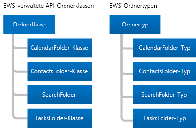

# Ordner und Elemente in EWS in Exchange

Erfahren Sie mehr über Ordner und Postfachelemente und deren Darstellung durch die verwaltet EWS-API oder den EWS-Client.
  
Ordner sind das Organisationselement eines Exchange-Postfachs. Ordner enthalten Postfachelemente, wie z. B. E-Mail-Nachrichten, Kontakte, Termine, Besprechungen und Aufgaben, und sie können auch andere Ordner beinhalten. Exchange beinhaltet verschiedene Arten von Ordnern, wobei sich die Ordnertypen jedoch ähneln. Der Hauptunterschied zwischen ihnen besteht darin, welche Art von Element sie enthalten.
  
Die Elemente weisen jedoch eindeutige Typen auf. Jeder Typ hat einen anderen Satz von Eigenschaften oder ein Schema, das ihn definiert. In diesem Artikel werden die Typen von Ordnern und Elementen erläutert, die zur Verfügung stehen, und wie sie sich unterscheiden.

## Ordner

Ordner werden von der gleichen Basisklasse oder dem gleichen Basistyp abgeleitet: der [Folder](http://msdn.microsoft.com/en-us/library/microsoft.exchange.webservices.data.folder%28v=EXCHG.80%29.aspx)-Klasse in der verwalteten EWS-API oder dem [Ordner](http://msdn.microsoft.com/library/812948d8-c7db-45ce-bb3a-77233a53a974%28Office.15%29.aspx)-Typ in EWS. In der folgenden Abbildung sind die verwalteten EWS-API-Klassen und die EWS-Typen dargestellt. 
  
**Abbildung 1. Verwaltete EWS-API-Ordnerklassen und EWS-Ordnertypen**

  
Der Hauptunterschied zwischen den Ordnerklassen und Ordnertypen besteht darin, dass Sie nur einen bestimmten Elementtyp in den einzelnen Ordnertypen erstellen können. Ein weitere Unterschied liegt darin, wie der Client die Informationen in einem Ordner anzeigt. So können Sie in Exchange zum Beispiel Termine im Kalenderordner erstellen. Sie können andere Elementtypen in den Kalenderordner verschieben, nachdem Sie sie erstellt haben, sie werden in Outlook jedoch nicht angezeigt. Outlook zeigt im Kalenderordner nur Kalenderelemente wie Termine oder Besprechungen an, [auch wenn andere Elementtypen im Ordner vorhanden sind](folders-and-items-in-ews-in-exchange.md#bk_item). 
  
**Tabelle 1. Verwaltete EWS-API-Ordnerklassen und EWS-Ordnertypen**

|**Verwaltete EWS-API-Klasse**|**EWS-Typ**|**FolderClass-Wert**|**Enthält**|**Anmerkungen**|
|:-----|:-----|:-----|:-----|:-----|
|[Folder](http://msdn.microsoft.com/en-us/library/microsoft.exchange.webservices.data.folder%28v=exchg.80%29.aspx)   |[Ordner](http://msdn.microsoft.com/library/812948d8-c7db-45ce-bb3a-77233a53a974%28Office.15%29.aspx)   |IPF. Hinweis    |E-Mail-Nachrichten oder -Ordner    | Dies ist die allgemeine Ordnerklasse oder der allgemeine Typ für die folgenden [WellKnownFolderName](http://msdn.microsoft.com/en-us/library/microsoft.exchange.webservices.data.wellknownfoldername%28v=exchg.80%29.aspx)-Ordner der verwalteten EWS-API und der [DistinguishedFolderId](http://msdn.microsoft.com/library/50018162-2941-4227-8a5b-d6b4686bb32f%28Office.15%29.aspx)-Ordner von EWS: <ul><li>  Stamm (IPM-Unterstruktur)</li><li>NonIpmSubtree</li><li>Posteingang</li><li>Gelöschte Elemente</li><li>Entwürfe</li><li>Journal</li><li>Anmerkungen  </li><li>Postausgang</li><li>Gesendete Elemente</li><li>Nachrichtenordner</li><li>Junk-E-Mail</li><li>Voicemail</li></ul> |
|[CalendarFolder](http://msdn.microsoft.com/en-us/library/microsoft.exchange.webservices.data.calendarfolder%28v=exchg.80%29.aspx)   |[CalendarFolder](http://msdn.microsoft.com/library/48687a78-e757-4c04-9641-bf4302c6b565%28Office.15%29.aspx)   |IPF. Termin    |Termine und Besprechungen    |Wenn ein Benutzer auf eine Besprechungsanfrage antwortet, wird der Termin nur dem [WellKnownFolderName.Calendar](http://msdn.microsoft.com/en-us/library/microsoft.exchange.webservices.data.wellknownfoldername%28v=exchg.80%29.aspx) der verwalteten EWS-API oder dem [DistinguishedFolderId.CalendarFolder](http://msdn.microsoft.com/library/50018162-2941-4227-8a5b-d6b4686bb32f%28Office.15%29.aspx) von EWS hinzugefügt. Diese sind die einzigen Ordner, die die automatische Interaktion mit Besprechungsanfragen und -antworten unterstützen.    Diese Ordnerklasse oder dieser Ordnertyp unterstützt die Verwendung von Kalenderansichten, um Termine und Besprechungen basierend auf einem Start- und Enddatum zurückzugeben. Hierzu werden die [Folder.FindItem](http://msdn.microsoft.com/en-us/library/microsoft.exchange.webservices.data.folder.finditems%28v=EXCHG.80%29.aspx)-Methode und die [CalendarView](http://msdn.microsoft.com/EN-US/library/microsoft.exchange.webservices.data.calendarview%28v=exchg.80%29.aspx)-Klasse der verwalteten EWS-API oder der [FindItem](http://msdn.microsoft.com/library/ebad6aae-16e7-44de-ae63-a95b24539729%28Office.15%29.aspx)-Vorgang und das [CalendarView](http://msdn.microsoft.com/library/a4a953b8-0710-416c-95ef-59e51eba9982%28Office.15%29.aspx)-Element von EWS verwendet.      |
|[ContactsFolder](http://msdn.microsoft.com/en-us/library/microsoft.exchange.webservices.data.contactsfolder%28v=exchg.80%29.aspx)   |[ContactsFolder](http://msdn.microsoft.com/library/6c299de8-2087-4aeb-8e66-2bc7586509a6%28Office.15%29.aspx)   |IPF. Kontakt    |Kontakte und Verteilerlisten    |Keine    |
|["SearchFolder"](http://msdn.microsoft.com/en-us/library/microsoft.exchange.webservices.data.searchfolder%28v=exchg.80%29.aspx)   |["SearchFolder"](http://msdn.microsoft.com/library/1a7d408b-2e98-4391-8834-085ed6d5757c%28Office.15%29.aspx)   |IPF. Hinweis    |Inhalte werden durch eine Einschränkung oder einen Filter bestimmt. Suchordner enthalten keine Unterordner.    |Die Elemente, die den Suchkriterien entsprechen, sind nicht tatsächlich im Suchordner enthalten. Sie befinden sich stattdessen an anderer Stelle im Posteingang.    Um sicherzustellen, dass Suchordner in Outlook verfügbar sind, erstellen Sie sie im Ordner „Finder".    |
|[TasksFolder](http://msdn.microsoft.com/en-us/library/microsoft.exchange.webservices.data.tasksfolder%28v=exchg.80%29.aspx)   |[TasksFolder](http://msdn.microsoft.com/library/5a9a4612-8064-4986-b467-c44f268c64df%28Office.15%29.aspx)   |IPF. Aufgabe    |Enthält zu erledigende Arbeitselemente.    |Keine    |
   
### Ordnerstruktur

Ordner bieten eine Postfachstruktur. Dazu gehören die IPM-Unterstruktur, die in EWS als oberste Ebene des Informationsspeichers bezeichnet wird, wo die meisten Benutzer mit ihrem Postfach interagieren, und Systemordner, die den meisten Benutzern nie angezeigt werden und die sich in EWS in der Nicht-IPM-Unterstruktur oder Stamm befinden. Die folgende Abbildung zeigt die Ordnerstruktur für einen Benutzer und gibt an, welche Ordner Elemente des Benutzers enthalten und welche Systemordner sind.
  
**Abbildung 2. Element- und Systemordner in einem Postfach**

  
### Bekannte Ordner

Einige der Ordner im Postfach sind spezielle Ordner. Diese entsprechen bekannten Ordnern in der verwalteten EWS-API oder definierten Ordnern in EWS. Für einige dieser Ordner gelten Einschränkungen hinsichtlich der Ordnernamen, wo sie sich in der Ordnerstruktur befinden, und ob sie gelöscht werden können. Andere allgemeine (nicht spezielle) Ordner haben nicht die gleichen Einschränkungen. Es ist wichtig, dass Sie die folgenden bekannten oder definierten Ordner kennen, da es sich hierbei um die Stammsystem-, Benutzer- und Suchordner handelt, die für die meisten Implementierungen gelten. 
  
**Tabelle 2. Primäre bekannte und definierte Ordner**

|**Anzeigename**|**EWS Managed API **WellKnownFolderName** Werte**|**EWS **DistinguishedFolderId** Werte**|**Beschreibung**|
|:-----|:-----|:-----|:-----|
|Stamm (Nicht-IPM-Unterstruktur)    |WellKnownFolderName.Root    |DistinguishedFolderId.root    |Enthält den Stammordner eines Postfachs, der auch als „Nicht-IPM-Unterstruktur" bezeichnet wird. Dieser Ordner hat kein übergeordnetes Element, und Sie können ihn nicht verschieben, kopieren, umbenennen oder löschen. Jeder Nachrichtenspeicher enthält nur einen Stammordner.    |
|Oberste Ebene des Informationsspeichers (IPM-Unterstruktur)    |WellKnownFolderName.MsgFolderRoot    |DistinguishedFolderId.msgfolderroot    |Enthält den Posteingang und andere Benutzerordner.    |
|Finder (Suchordner)    |WellKnownFolderName.SearchFolders    |DistinguishedFolderId.searchfolders.    |Enthält die in Outlook sichtbaren Suchordner.    |
   
Eine vollständige Liste der [WellKnownFolderName](http://msdn.microsoft.com/en-us/library/microsoft.exchange.webservices.data.folder.wellknownfoldername%28v=exchg.80%29.aspx)-Eigenschaftenwerte der verwalteten EWS-API finden Sie in der [WellKnownFolderName](http://msdn.microsoft.com/en-us/library/microsoft.exchange.webservices.data.wellknownfoldername%28v=EXCHG.80%29.aspx)-Enumeration. Eine vollständige Liste der **DistinguishedFolderId**-Werte in EWS finden Sie unter [DistinguishedFolderId](http://msdn.microsoft.com/library/50018162-2941-4227-8a5b-d6b4686bb32f%28Office.15%29.aspx).
  
### Ordnereigenschaften

In der verwalteten EWS-API werden alle [Ordnereigenschaften](http://msdn.microsoft.com/en-us/library/microsoft.exchange.webservices.data.folder_properties%28v=exchg.80%29.aspx) von der [Folder](http://msdn.microsoft.com/en-us/library/microsoft.exchange.webservices.data.folder%28v=EXCHG.80%29.aspx)-Basisklasse abgeleitet. And in EWS, all folders use the folder elements that are available on the [Ordner](http://msdn.microsoft.com/library/812948d8-c7db-45ce-bb3a-77233a53a974%28Office.15%29.aspx) type. Most of the folder-related properties and elements are straightforward (parent folder ID, display name, and so on), but a few require a little more explanation. 
  
Die folgenden Bedingungen gelten für die [Folder.FolderClass](http://msdn.microsoft.com/en-us/library/microsoft.exchange.webservices.data.folder.folderclass%28v=EXCHG.80%29.aspx)-Eigenschaft der verwalteten EWS-API oder das [FolderClass](http://msdn.microsoft.com/library/0041d135-2869-4612-89a5-d1aa86aa1093%28Office.15%29.aspx)-Element in EWS: 
  
- Wenn festgelegt, muss der Wert der Eigenschaft oder des Elements mit der abgeleiteten Klassen oder dem Typ des Ordners übereinstimmen. So kann die **FolderClass** -Eigenschaft oder das Element nicht angeben, dass es sich bei dem Ordner um einen Kontaktordner handelt, während die Klasse oder der Typ des Ordners angibt, dass es sich um einen Kalenderordner handelt. 
    
- Sie können entweder [Ordner erstellen](how-to-work-with-folders-by-using-ews-in-exchange.md#bk_createfolderewsma), die einen bestimmten Typ haben, ohne die **FolderClass** -Eigenschaft oder das Element festzulegen, oder Sie können einen allgemeinen Ordnertyp erstellen und die **FolderClass** -Eigenschaft oder das Element festlegen. Mit beiden Optionen erzielen Sie das gleiche Ergebnis. 
    
- Nachdem Sie den **FolderClass** -Wert festgelegt haben, indem Sie einen bestimmten Ordnertyp erstellt oder die **FolderClass** -Eigenschaft bzw. das Element selbst festgelegt haben, können Sie ihn nicht mehr ändern. Sie können z. B. einen IPF.Note-Ordner nicht in einen IPF.Contact-Ordner ändern. Sie können ihn jedoch in einen IPF.Note.Contoso-Ordner ändern. 
    
- Jeder **FolderClass** -Wert, der nicht eines der vordefinierten Präfixe verwendet, wird als ein IPF.Note-Ordner behandelt. So wird ein **FolderClass** -Wert der IAmAFolderClass als ein IPF.Note-Ordner behandelt. 
    
Der Ordnerklassenwert ist erweiterbar. Dies bedeutet, dass die in Tabelle 1 aufgeführten **FolderClass** -Standardwerte als Präfixe behandelt werden und Sie benutzerdefinierte Werte hinzufügen können. Sie können beispielsweise einen Ordner mit dem **FolderClass** -Wert IPF.Contact.Contoso erstellen, und dieser wird dann als Kontaktordner behandelt. 
  
Sie können festlegen, welche Berechtigungen der Client für die Ordner hat, zum Beispiel Löschen, Lesen und Ändern, indem Sie die [Folder.EffectiveRights](http://msdn.microsoft.com/en-us/library/microsoft.exchange.webservices.data.folder.effectiverights%28v=EXCHG.80%29.aspx)-Eigenschaft der verwalteten EWS-API oder das [EffectiveRights](http://msdn.microsoft.com/library/bf5278eb-3a1a-4d27-9d16-b8be043bb023%28Office.15%29.aspx)-Element in EWS verwenden. 
  
### Öffentliche Ordner

Öffentliche Ordner sind für den gemeinsamen Zugriff vorgesehen und bieten eine einfache und effiziente Möglichkeit zum Sammeln, Organisieren und Teilen von Informationen mit anderen Personen in Ihrer Arbeitsgruppe oder Organisation. Sie können öffentliche Ordner auch zum Archivieren von Verteilergruppeninhalt verwenden. Ausführliche Informationen über öffentliche Ordner finden Sie unter [Zugriff auf Öffentliche Ordner mit EWS in Exchange](public-folder-access-with-ews-in-exchange.md).

### Ausgeblendete Ordner

Alle Ordner, die im Stammverzeichnis des Postfachs Exchange erstellt werden ausgeblendet, und Sie können die EWS Managed API oder EWS verwenden, um zusätzliche Ordner unter dem oben Informationsspeicher auszublenden. Weitere Informationen zu ausgeblendeten Ordnern finden Sie unter [Arbeiten mit ausgeblendeten Ordnern in Exchange mithilfe der Exchange-Webdienste](how-to-work-with-hidden-folders-by-using-ews-in-exchange.md). 

### Suchordner

Suchordner unterscheiden sich nur dadurch von normalen Ordner, dass sie über eine Eigenschaft oder ein Element verfügen, die bzw. das den Suchfilter definiert. Sie können in jedem Ordner in einem Exchange-Postfach Suchordner erstellen. Suchordner werden auf die gleiche Weise erstellt wie andere Ordner. Damit ein Suchordner jedoch in Outlook, Outlook Web App oder Outlook Live angezeigt wird, müssen sich [SearchFolder](http://msdn.microsoft.com/en-us/library/microsoft.exchange.webservices.data.searchfolder%28v=exchg.80%29.aspx)-Objekte, die Sie mit der verwalteten EWS-API erstellt haben, im [WellKnownFolderName.SearchFolders](http://msdn.microsoft.com/en-us/library/microsoft.exchange.webservices.data.wellknownfoldername%28v=exchg.80%29.aspx)-Ordner befinden. Mit EWS erstellte [SearchFolder](http://msdn.microsoft.com/library/1a7d408b-2e98-4391-8834-085ed6d5757c%28Office.15%29.aspx)-Typen müssen sich im [DistinguishedFolderId.SearchFolders](http://msdn.microsoft.com/library/50018162-2941-4227-8a5b-d6b4686bb32f%28Office.15%29.aspx)-Ordner befinden. Wenn der Suchordner an einem anderen Ort erstellt wird, steht er trotzdem zur Verfügung, und Sie können ihn in benutzerdefinierten Clientanwendungen anzeigen. 

## Items

EWS in Exchange verwendet **Items**, die E-Mail-Nachrichten, Termine, Besprechungen, Kontakte, Verteilerlisten, Aufgaben, Posts und andere Elemente in einer Mailbox darstellen. Items haben entweder eine starke Typisierung, was bedeutet, dass ihnen eine spezifische Klasse oder ein Schema zugewiesen ist, oder eine nicht starke Typisierung, wobei sie dann als generische Items bezeichnet werden. Generische Items sind [Item](http://msdn.microsoft.com/en-us/library/microsoft.exchange.webservices.data.item%28v=exchg.80%29.aspx)-Objekte in der verwalteten EWS-API und [Item](http://msdn.microsoft.com/library/4dfe8f48-e7b4-444d-bdf9-a34e180f598b%28Office.15%29.aspx)-Typen in EWS. Häufige Items wie E-Mail-Nachrichten, Kontakte, Verteilerlisten, Posts und Aufgaben haben eine starke Typisierung, und Sie können bestimmte Schemaeigenschaften oder -elemente dafür festlegen. 
  
**Tabelle 3. Stark typisierten Elemente**

|**Verwalteter EWS-API-Elementtyp**|**EWS-Item-Element**|
|:-----|:-----|
|[Appointment](http://msdn.microsoft.com/en-us/library/microsoft.exchange.webservices.data.appointment%28v=exchg.80%29.aspx)   |[CalendarItem](http://msdn.microsoft.com/library/b0c1fd27-b6da-46e5-88b8-88f00c71ba80%28Office.15%29.aspx)   |
|[Contact](http://msdn.microsoft.com/en-us/library/microsoft.exchange.webservices.data.contact%28v=exchg.80%29.aspx)   |[Contact](http://msdn.microsoft.com/library/66bfff50-7a91-4d81-b6a0-610b9962f677%28Office.15%29.aspx)   |
|[ContactGroup](http://msdn.microsoft.com/en-us/library/microsoft.exchange.webservices.data.contactgroup%28v=exchg.80%29.aspx)   |[DistributionList](http://msdn.microsoft.com/library/f65aea01-e870-44a2-8571-fa6c001341cc%28Office.15%29.aspx)   |
|["EmailMessage"](http://msdn.microsoft.com/en-us/library/microsoft.exchange.webservices.data.emailmessage%28v=exchg.80%29.aspx)   |[Message](http://msdn.microsoft.com/library/2400b33c-43b2-4fc2-b6fb-275a99e0e810%28Office.15%29.aspx)   |
|[PostItem-Objekt](http://msdn.microsoft.com/en-us/library/microsoft.exchange.webservices.data.postitem%28v=exchg.80%29.aspx)   |[PostItem-Objekt](http://msdn.microsoft.com/library/7727ed84-9591-4a1c-bb04-12129926499b%28Office.15%29.aspx)   |
|[Task](http://msdn.microsoft.com/en-us/library/microsoft.exchange.webservices.data.task%28v=exchg.80%29.aspx)   |[Task](http://msdn.microsoft.com/library/7c84927e-db28-4c5d-b0b5-cbcc2b88d869%28Office.15%29.aspx)   |
   
Stark typisierte Items der verwalteten EWS-API werden von der [Item](http://msdn.microsoft.com/en-us/library/microsoft.exchange.webservices.data.item%28v=EXCHG.80%29.aspx)-Basisklasse abgeleitet. Sie arbeiten jedoch im Allgemeinen mit einem der in Tabelle 3 aufgeführten abgeleiteten Typen, und nicht mit der **Item** -Klasse direkt. Wenn Sie die [ItemCollection](http://msdn.microsoft.com/en-us/library/dd634001%28v=EXCHG.80%29.aspx)-Klasse verwenden, arbeiten Sie jedoch möglicherweise direkt mit Instanzen der **Item** -Klasse. In diesem Fall sollten Sie Logik implementieren, die den Typ des Elements im Store festlegt, den die Instanz in der **Item** -Klasse darstellt. Um mit diesem Item arbeiten zu können, müssen Sie eine Bindung zu dem Item herstellen, indem Sie eine Instanz der Klasse verwenden, die das Item darstellt. 
  
### Items in Ordnern

Bei einigen Ordnern gelten Einschränkungen für die Typen von Items, die sie beinhalten können. Hierbei handelt es sich Einschränkungen, die die Exchange-Postfachdatenbank auf Ordner anwendet, nicht um Einschränkungen der Clientansicht. 
  
**Tabelle 4. Item-Einschränkungen für Ordner**

|**Verwaltete EWS-API-Ordnerklasse**|**EWS-Ordnertyp**|**Einschränkung**|
|:-----|:-----|:-----|
|[Base Folder-Klasse](http://msdn.microsoft.com/en-us/library/microsoft.exchange.webservices.data.folder%28v=exchg.80%29.aspx)   |[Ordner](http://msdn.microsoft.com/library/812948d8-c7db-45ce-bb3a-77233a53a974%28Office.15%29.aspx)   |Sie können neue [EmailMessage](http://msdn.microsoft.com/en-us/library/microsoft.exchange.webservices.data.emailmessage%28v=exchg.80%29.aspx)-Objekte und [PostItem](http://msdn.microsoft.com/en-us/library/microsoft.exchange.webservices.data.postitem%28v=exchg.80%29.aspx)-Objekte der verwalteten EWS-API oder [Message](http://msdn.microsoft.com/library/2400b33c-43b2-4fc2-b6fb-275a99e0e810%28Office.15%29.aspx)-Typen bzw. **PostItem** -Typen in EWS nur in den generischen Ordnern erstellen. Sie können andere Item-Typen in generische Ordner verschieben, wobei der Client diese möglicherweise jedoch nicht anzeigen kann.    |
|[CalendarFolder](http://msdn.microsoft.com/en-us/library/microsoft.exchange.webservices.data.calendarfolder%28v=exchg.80%29.aspx)   |[CalendarFolder](http://msdn.microsoft.com/library/48687a78-e757-4c04-9641-bf4302c6b565%28Office.15%29.aspx)   |Sie können nur neue [Appointment](http://msdn.microsoft.com/en-us/library/microsoft.exchange.webservices.data.appointment%28v=exchg.80%29.aspx)-Objekte der verwalteten EWS-API und [CalendarItem](http://msdn.microsoft.com/library/b0c1fd27-b6da-46e5-88b8-88f00c71ba80%28Office.15%29.aspx)-Typen in EWS im Kalenderordner erstellen. Sie können andere Item-Typen in den Kalenderordner verschieben, wobei der Client diese möglicherweise jedoch nicht anzeigen kann.    |
|[ContactsFolder](http://msdn.microsoft.com/en-us/library/microsoft.exchange.webservices.data.contactsfolder%28v=exchg.80%29.aspx)   |[ContactsFolder](http://msdn.microsoft.com/library/6c299de8-2087-4aeb-8e66-2bc7586509a6%28Office.15%29.aspx)   |Sie können nur neue [Contact](http://msdn.microsoft.com/en-us/library/microsoft.exchange.webservices.data.contact%28v=exchg.80%29.aspx)-Objekte und [ContactGroup](http://msdn.microsoft.com/en-us/library/microsoft.exchange.webservices.data.contactgroup%28v=exchg.80%29.aspx)Objekte der verwalteten EWS-API oder [Contact](http://msdn.microsoft.com/library/66bfff50-7a91-4d81-b6a0-610b9962f677%28Office.15%29.aspx)-Typen oder [DistributionList](http://msdn.microsoft.com/library/f65aea01-e870-44a2-8571-fa6c001341cc%28Office.15%29.aspx)-Typen in EWS im Kontaktordner erstellen. Sie können andere Item-Typen in den Kontaktordner verschieben, wobei der Client diese möglicherweise jedoch nicht anzeigen kann.    |
|["SearchFolder"](http://msdn.microsoft.com/en-us/library/microsoft.exchange.webservices.data.searchfolder%28v=exchg.80%29.aspx)   |["SearchFolder"](http://msdn.microsoft.com/library/1a7d408b-2e98-4391-8834-085ed6d5757c%28Office.15%29.aspx)   |Keine Einschränkungen. Elemente befinden sich nicht tatsächlich im Suchordner. Sie befinden sich an anderer Stelle im Postfach.    |
|[TasksFolder](http://msdn.microsoft.com/en-us/library/microsoft.exchange.webservices.data.tasksfolder%28v=exchg.80%29.aspx)   |[TasksFolder](http://msdn.microsoft.com/library/5a9a4612-8064-4986-b467-c44f268c64df%28Office.15%29.aspx)   |Sie können nur neue [Task](http://msdn.microsoft.com/en-us/library/microsoft.exchange.webservices.data.task%28v=exchg.80%29.aspx)-Objekte der verwalteten EWS-API oder [Task](http://msdn.microsoft.com/library/7c84927e-db28-4c5d-b0b5-cbcc2b88d869%28Office.15%29.aspx)-Typen in EWS im Aufgabenordner erstellen. Sie können andere Item-Typen in den Aufgabenordner verschieben, wobei der Client diese möglicherweise jedoch nicht anzeigen kann.    |

## Upgrade von früheren Produktversionen

Ordner haben sich in früheren und in den aktuellen Produktversionen kaum geändert. Beachten Sie jedoch, dass frühere Versionen von Exchange verwaltete Ordner verwenden, um die Messaging-Datensatzverwaltung (MRM) durchzuführen. Exchange Online, Exchange Online als Teil von Office 365 und Exchange-Versionen ab Exchange 2013 verwenden Aufbewahrungsrichtlinien für MRM. Sie können [verwaltete Ordner für die Verwendung von Aufbewahrungsrichtlinien aktualisieren](http://technet.microsoft.com/en-us/library/dd298032%28v=exchg.150%29.aspx). 
  
Items wurden in früheren und aktuellen Produktversionen nicht geändert.

## Inhalt dieses Abschnitts

- [Arbeiten Sie mit Ordnern in Exchange mithilfe der Exchange-Webdienste](how-to-work-with-folders-by-using-ews-in-exchange.md)
    
- [Arbeiten Sie mit verborgene Ordner im Exchange mithilfe der Exchange-Webdienste](how-to-work-with-hidden-folders-by-using-ews-in-exchange.md)
    
- [Arbeiten Sie mit Exchange-Postfach-Elementen mithilfe von EWS in Exchange](how-to-work-with-exchange-mailbox-items-by-using-ews-in-exchange.md)
    
- [Löschen von Elementen mithilfe von EWS in Exchange](deleting-items-by-using-ews-in-exchange.md)
    
- [Exportieren und Importieren von Elementen mithilfe von EWS in Exchange](exporting-and-importing-items-by-using-ews-in-exchange.md)
    
## Siehe auch

- [Entwickeln von Webdienstclients für Exchange](develop-web-service-clients-for-exchange.md)   
- [Erste Schritte mit Webdiensten in Exchange](start-using-web-services-in-exchange.md)   
- [Übersicht über den EWS-Cliententwurf für Exchange](ews-client-design-overview-for-exchange.md)
    

