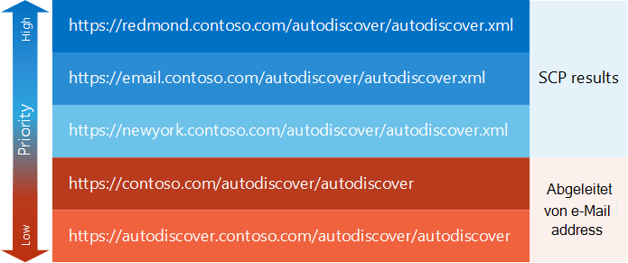

# Generieren einer Liste mit AutoErmittlungs-Endpunkten

Erfahren Sie, wie Sie eine priorisierte Liste mit Auto Ermittlungs Endpunkten generieren.
  
Die erste Aufgabe im [Auto Ermittlungsprozess](autodiscover-for-exchange.md) besteht darin, eine Liste der Auto Ermittlungs Endpunkte zu generieren, die von der Anwendung ausprobiert werden sollen. Diese Auto Ermittlungs Endpunkte können aus einer [SCP-Suche](how-to-find-autodiscover-endpoints-by-using-scp-lookup-in-exchange.md) stammen oder können von der e-Mail-Adresse des Benutzers abgeleitet werden. Am Ende können Sie mit einer großen Anzahl von Endpunkten enden. Werfen wir einen Blick darauf, wie Sie diese nach Priorität organisieren können. 
  
## Beginnen mit SCP-Suche

Auto Ermittlungs Endpunkte, die aus einer [SCP-Suche](how-to-find-autodiscover-endpoints-by-using-scp-lookup-in-exchange.md) stammen, sollten in Ihrer Liste oberste Priorität haben. Administratoren können SCP-Objekte so konfigurieren, dass Sie Ihren Client an den nächstgelegenen oder effizientesten Auto ermittlungsendpunkt weiterleiten, daher empfiehlt es sich, mit diesen Endpunkten zu beginnen. Da der SCP-Nachschlage Prozess über ein eigenes Priorisierung-Schema verfügt, werden die Ergebnisse einer SCP-Suche wie folgt bereits priorisiert: 
  
1. Auto Ermittlungs Endpunkte aus SCP-Objekten, die sich auf den Active Directory-Standort, zu dem der Clientcomputer gehört.
    
2. Auto Ermittlungs Endpunkte aus SCP-Objekten, die nicht auf einen Active Directory Standort beschränkt sind.
    
3. Auto Ermittlungs Endpunkte von SCP-Objekten, die auf einen anderen Active Directory-Standort als den Standort beschränkt sind, zu dem der Clientcomputer gehört.
    
Nachdem Sie über die Ergebnisse des SCP-Suchprozesses verfügen, können Sie Endpunkte hinzufügen, die von der e-Mail-Adresse des Benutzers abgeleitet werden. Diese können als Standard-Endpunkt und als Fallback für den Fall dienen, dass keine SCP-Ergebnisse vorliegen oder die von der SCP-Suche zurückgegebenen Endpunkte nicht ausreichen.
  
## Hinzufügen von von der e-Mail-Adresse des Benutzers abgeleiteten Endpunkten

Wenn die SCP-Suche nicht funktioniert oder die von der SCP-Suche zurückgegebenen Endpunkte keine erfolgreiche Antwort zurückgeben, können Sie eine Reihe von Standard-Auto Ermittlungs Endpunkten von der e-Mail-Adresse des Benutzers ableiten. Diese Endpunkte sollten eine niedrigere Priorität haben als alle aus einer SCP-Suche stammenden, aber Sie benötigen Sie möglicherweise, wenn die SCP-Suche nicht erfolgreich war.
  
### So leiten Sie Auto Ermittlungs Endpunkte ab

1. Extrahieren Sie den Domänennamen aus der e-Mail-Adresse des Benutzers. Wenn die e-Mail-Adresse des Benutzers beispielsweise Sadie.Daniels@contoso.com lautet, lautet der Domänenname contoso.com.
    
2. Erstellen von Endpunkt-URLs ohne Dateierweiterungen in den folgenden Formaten:
    
  - "https://" + Domäne + "/autodiscover/autodiscover"
    
  - "https://autodiscover." + Domäne + "/autodiscover/autodiscover"
    
Nachdem Sie die Liste der Endpunkt-URLs kompiliert haben, die sowohl aus dem SCP-Lookup als auch aus der e-Mail-Adresse des Benutzers stammen, müssen Sie möglicherweise Dateinamenerweiterungen in diesen URLs überarbeiten, je nachdem, ob Sie den [SOAP autodiscover-Webdienst](https://msdn.microsoft.com/library/61c21ea9-7fea-4f56-8ada-bf80e1e6b074%28Office.15%29.aspx) oder den [POX-Auto Ermittlungs Webdienst](https://msdn.microsoft.com/library/877152f0-f4b1-4f63-b2ce-924f4bdf2d20%28Office.15%29.aspx)verwenden.
  
## Hinzufügen oder Ersetzen von Dateinamenerweiterungen in Endpunkt-URLs

Sie können auf den AutoErmittlungsdienst mithilfe des SOAP autodiscover-Webdiensts oder des POX-Auto Ermittlungs-Webdiensts zugreifen. Jeder Dienst verwendet ähnliche Endpunkt-URLs, wobei der einzige Unterschied die Dateinamenerweiterung ist. Der SOAP-AutoErmittlungsdienst verwendet die Dateinamenerweiterung ". svc", und der POX-Auto Ermittlungs Webdienst verwendet die Dateinamenerweiterung ". xml".
  
Standardmäßig sind die von einer SCP-Suche zurückgegebenen Auto Ermittlungs-Endpunkt-URLs POX-URLs. Wenn Sie jedoch die SOAP-AutoErmittlung verwenden, können Sie einfach die Dateinamenerweiterung von ". xml" in ". svc" ändern und eine SOAP-Anforderung ausprobieren.
  
Für die abgeleiteten Auto Ermittlungs-Endpunkt-URLs wird die Dateierweiterung ausgelassen. Fügen Sie die entsprechende Dateierweiterung für den Auto Ermittlungs-Webdienst hinzu, den Sie vor dem Versuch der URL verwenden.
  
## Beispiel: Generieren einer Liste mit Auto Ermittlungs Endpunkten

Werfen wir einen Blick auf ein Beispiel. Sadie Daniels (Sadie.Daniels@contoso.com) verwendet zum ersten Mal eine Exchange-Webdienste Anwendung. Die Anwendung verwendet die AutoErmittlung, um sich selbst zu konfigurieren. Sadies Computer wird der contoso.com-Domäne hinzugefügt und befindet sich im Active Directory Standort von Redmond. Die Anwendung generiert die Liste der in Abbildung 1 gezeigten Auto Ermittlungs Endpunkte.
  
**Abbildung 1: Beispielliste der Auto Ermittlungs Endpunkte**

  
Die EWS-Anwendung in diesem Beispiel bevorzugt den SOAP AutoErmittlungs-Webdienst, sodass die Dateinamenerweiterung für die SCP-Ergebnisse in ". svc" geändert wird, bevor SOAP-Anforderungen an Sie gesendet werden.
  
## Nächste Schritte

Nachdem Sie eine Liste mit Auto Ermittlungs Endpunkten generiert haben, versuchen Sie, diese durch [Senden von Anforderungen an diese Endpunkte zu](how-to-get-user-settings-from-exchange-by-using-autodiscover.md)testen.
  
## Siehe auch

- [AutoErmittlung für Exchange](autodiscover-for-exchange.md)
    
- [Suchen nach AutoErmittlungs-Endpunkten mit der SCP-Suche in Exchange](how-to-find-autodiscover-endpoints-by-using-scp-lookup-in-exchange.md)
    
- [Behandeln von AutoErmittlungs-Fehlermeldungen](handling-autodiscover-error-messages.md)
    

