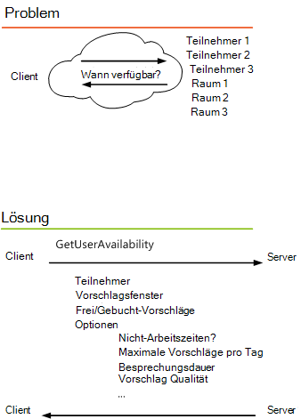

# <a name="get-freebusy-information-by-using-ews-in-exchange"></a><span data-ttu-id="4c29d-103">Abrufen von Frei/Gebucht-Informationen mithilfe von EWS in Exchange</span><span class="sxs-lookup"><span data-stu-id="4c29d-103">Get free/busy information by using EWS in Exchange</span></span>

<span data-ttu-id="4c29d-104">Erfahren Sie, wie Sie Frei/Gebucht-Informationen und vorgeschlagene Besprechungszeiten mithilfe der verwaltete EWS-API oder EWS in Exchange abrufen.</span><span class="sxs-lookup"><span data-stu-id="4c29d-104">Learn how to get free/busy information and suggested meeting times by using the EWS Managed API or EWS in Exchange.</span></span>
  
<span data-ttu-id="4c29d-105">Das Verwenden der verwaltete EWS-API oder EWS zum programmgesteuerten [Erstellen einer Besprechung](how-to-create-appointments-and-meetings-by-using-ews-in-exchange-2013.md) und Senden von Besprechungsanfragen ist groß, aber die Suche nach einer Zeit, die für alle Teilnehmer funktioniert, stellt häufig eine Herausforderung dar.</span><span class="sxs-lookup"><span data-stu-id="4c29d-105">Using the EWS Managed API or EWS to programmatically [create a meeting](how-to-create-appointments-and-meetings-by-using-ews-in-exchange-2013.md) and send out meeting requests is great, but finding a time that works for all your attendees is often a challenge.</span></span> <span data-ttu-id="4c29d-106">Wenn Sie manuell überprüfen müssen, ob jeder verfügbar ist, wird der Zweck der Automatisierung des Vorgangs nicht abgeschlagen.</span><span class="sxs-lookup"><span data-stu-id="4c29d-106">If you have to manually check to see when everyone is available, it defeats the purpose of automating the task.</span></span> <span data-ttu-id="4c29d-107">Glücklicherweise sind die verwaltete EWS-API-Methode [Datei "ExchangeService. GetUserAvailability](https://msdn.microsoft.com/library/microsoft.exchange.webservices.data.exchangeservice.getuseravailability%28v=exchg.80%29.aspx) und der [GetUserAvailability](https://msdn.microsoft.com/library/7906711b-80a1-42ae-8b33-26eeac036a5a%28Office.15%29.aspx) -EWS-Vorgang zu ihrer Rettung gekommen.</span><span class="sxs-lookup"><span data-stu-id="4c29d-107">Fortunately, the [ExchangeService.GetUserAvailability](https://msdn.microsoft.com/library/microsoft.exchange.webservices.data.exchangeservice.getuseravailability%28v=exchg.80%29.aspx) EWS Managed API method and the [GetUserAvailability](https://msdn.microsoft.com/library/7906711b-80a1-42ae-8b33-26eeac036a5a%28Office.15%29.aspx) EWS operation come to your rescue.</span></span> <span data-ttu-id="4c29d-108">Sie können diese Methode oder diesen Vorgang verwenden, um einen Exchange-Server abzufragen, um die beste Zeit zum Planen einer Besprechung zu finden oder einfach nur Frei/Gebucht-Informationen für Teilnehmer abzurufen.</span><span class="sxs-lookup"><span data-stu-id="4c29d-108">You can use this method or operation to query an Exchange server to find the best time to schedule a meeting or just get free/busy information for attendees.</span></span> <span data-ttu-id="4c29d-109">Sie können die Frei/Gebucht-Informationen für eine Liste der Teilnehmer abrufen, oder Ihr Exchange-Server kann eine Besprechungszeit für Sie oder beides finden.</span><span class="sxs-lookup"><span data-stu-id="4c29d-109">You can get the free/busy information for a list of attendees, or have your Exchange server find a meeting time for you, or both</span></span> 
  
<span data-ttu-id="4c29d-110">In Abbildung 1 wird das Problem und die Lösung veranschaulicht.</span><span class="sxs-lookup"><span data-stu-id="4c29d-110">Figure 1 illustrates the problem and the solution.</span></span>
  
<span data-ttu-id="4c29d-111">**Abbildung 1. Anfordern von Verfügbarkeitsinformationen von einem Exchange-Server**</span><span class="sxs-lookup"><span data-stu-id="4c29d-111">**Figure 1. Requesting availability information from an Exchange server**</span></span>


  
## <a name="get-suggested-meeting-times-and-freebusy-information-by-using-the-ews-managed-api"></a><span data-ttu-id="4c29d-113">Abrufen vorgeschlagener Besprechungszeiten und Frei/Gebucht-Informationen mithilfe der verwaltete EWS-API</span><span class="sxs-lookup"><span data-stu-id="4c29d-113">Get suggested meeting times and free/busy information by using the EWS Managed API</span></span>
<span data-ttu-id="4c29d-114"><a name="bk_getavailewsma"> </a></span><span class="sxs-lookup"><span data-stu-id="4c29d-114"><a name="bk_getavailewsma"> </a></span></span>

<span data-ttu-id="4c29d-115">Sie können sowohl eine Liste der vorgeschlagenen Besprechungszeiten als auch alle geplanten Ereigniszeiten für Ihre Teilnehmer abrufen, wenn Sie den [AvailabilityData](https://msdn.microsoft.com/library/office/microsoft.exchange.webservices.data.availabilitydata%28v=exchg.80%29.aspx) -Enumerationswert **FreeBusyAndSuggestions** im Aufruf der [Datei "ExchangeService. GetUserAvailability](https://msdn.microsoft.com/library/microsoft.exchange.webservices.data.exchangeservice.getuseravailability%28v=exchg.80%29.aspx) -Methode verwenden, wie im folgenden Beispiel gezeigt.</span><span class="sxs-lookup"><span data-stu-id="4c29d-115">You can get both a list of suggested meeting times and all the scheduled event times for your attendees when you use an [AvailabilityData](https://msdn.microsoft.com/library/office/microsoft.exchange.webservices.data.availabilitydata%28v=exchg.80%29.aspx) enumeration value of **FreeBusyAndSuggestions** in your [ExchangeService.GetUserAvailability](https://msdn.microsoft.com/library/microsoft.exchange.webservices.data.exchangeservice.getuseravailability%28v=exchg.80%29.aspx) method call, as shown in the following example.</span></span> 
  
<span data-ttu-id="4c29d-116">In diesem Beispiel wird davon ausgegangen, das Sie sich an einem Exchange-Server angemeldet haben und das [ExchangeService](https://msdn.microsoft.com/library/microsoft.exchange.webservices.data.exchangeservice%28v=exchg.80%29.aspx)-Objekt **service** erhalten haben.</span><span class="sxs-lookup"><span data-stu-id="4c29d-116">This example assumes that you have authenticated to an Exchange server and have acquired an [ExchangeService](https://msdn.microsoft.com/library/microsoft.exchange.webservices.data.exchangeservice%28v=exchg.80%29.aspx) object named **service**.</span></span> 
  
```cs
private static void GetSuggestedMeetingTimesAndFreeBusyInfo(ExchangeService service)
{
    // Create a collection of attendees. 
    List<AttendeeInfo> attendees = new List<AttendeeInfo>(); 
 
    attendees.Add(new AttendeeInfo() 
    { 
        SmtpAddress = "mack@contoso.com", 
        AttendeeType = MeetingAttendeeType.Organizer 
    }); 
 
    attendees.Add(new AttendeeInfo() 
    { 
        SmtpAddress = "sadie@contoso.com", 
        AttendeeType = MeetingAttendeeType.Required 
    }); 
 
    // Specify options to request free/busy information and suggested meeting times.
    AvailabilityOptions availabilityOptions = new AvailabilityOptions(); 
    availabilityOptions.GoodSuggestionThreshold = 49; 
    availabilityOptions.MaximumNonWorkHoursSuggestionsPerDay = 0;
    availabilityOptions.MaximumSuggestionsPerDay = 2;
    // Note that 60 minutes is the default value for MeetingDuration, but setting it explicitly for demonstration purposes.
    availabilityOptions.MeetingDuration = 60; 
    availabilityOptions.MinimumSuggestionQuality = SuggestionQuality.Good; 
    availabilityOptions.DetailedSuggestionsWindow = new TimeWindow(DateTime.Now.AddDays(1), DateTime.Now.AddDays(2));
    availabilityOptions.RequestedFreeBusyView = FreeBusyViewType.FreeBusy;
 
    // Return free/busy information and a set of suggested meeting times. 
    // This method results in a GetUserAvailabilityRequest call to EWS.
    GetUserAvailabilityResults results = service.GetUserAvailability(attendees, 
                                                                     availabilityOptions.DetailedSuggestionsWindow, 
                                                                     AvailabilityData.FreeBusyAndSuggestions, 
                                                                     availabilityOptions); 
    // Display suggested meeting times. 
    Console.WriteLine("Availability for {0} and {1}", attendees[0].SmtpAddress, attendees[1].SmtpAddress); 
    Console.WriteLine(); 
 
    foreach (Suggestion suggestion in results.Suggestions) 
    { 
        Console.WriteLine("Suggested date: {0}\n", suggestion.Date.ToShortDateString()); 
        Console.WriteLine("Suggested meeting times:\n");
        foreach (TimeSuggestion timeSuggestion in suggestion.TimeSuggestions) 
        { 
                    Console.WriteLine("\t{0} - {1}\n", 
                                      timeSuggestion.MeetingTime.ToShortTimeString(), 
                                      timeSuggestion.MeetingTime.Add(TimeSpan.FromMinutes(availabilityOptions.MeetingDuration)).ToShortTimeString()); 
        } 
    }
            
    int i = 0;
    // Display free/busy times.
    foreach (AttendeeAvailability availability in results.AttendeesAvailability)
    {
        Console.WriteLine("Availability information for {0}:\n", attendees[i].SmtpAddress);
        foreach (CalendarEvent calEvent in availability.CalendarEvents)
        {
            Console.WriteLine("\tBusy from {0} to {1} \n", calEvent.StartTime.ToString(), calEvent.EndTime.ToString());
        }
        i++;
    }
}

```

## <a name="get-suggested-meeting-times-and-freebusy-information-by-using-ews"></a><span data-ttu-id="4c29d-117">Abrufen vorgeschlagener Besprechungszeiten und Frei/Gebucht-Informationen mithilfe von EWS</span><span class="sxs-lookup"><span data-stu-id="4c29d-117">Get suggested meeting times and free/busy information by using EWS</span></span>
<span data-ttu-id="4c29d-118"><a name="bk_getavailews"> </a></span><span class="sxs-lookup"><span data-stu-id="4c29d-118"><a name="bk_getavailews"> </a></span></span>

<span data-ttu-id="4c29d-119">Sie können sowohl eine Liste der vorgeschlagenen Besprechungszeiten als auch alle geplanten Ereigniszeiten für Ihre Teilnehmer abrufen, indem Sie den [GetUserAvailability](https://msdn.microsoft.com/library/7906711b-80a1-42ae-8b33-26eeac036a5a%28Office.15%29.aspx) -Vorgang verwenden, wie im folgenden Beispiel dargestellt.</span><span class="sxs-lookup"><span data-stu-id="4c29d-119">You can get both a list of suggested meeting times and all the scheduled event times for your attendees by using the [GetUserAvailability](https://msdn.microsoft.com/library/7906711b-80a1-42ae-8b33-26eeac036a5a%28Office.15%29.aspx) operation, as shown in the following example.</span></span> <span data-ttu-id="4c29d-120">Dies ist auch die XML-Anforderung, die von der verwaltete EWS-API gesendet wird, wenn Sie die verwaltete EWS-API verwenden, um [vorgeschlagene Besprechungszeiten zu erhalten](#bk_getavailewsma).</span><span class="sxs-lookup"><span data-stu-id="4c29d-120">This is also the XML request that the EWS Managed API sends when you use the EWS Managed API to [get suggested meeting times](#bk_getavailewsma).</span></span>
  
```XML
<?xml version="1.0" encoding="utf-8"?>
<soap:Envelope xmlns:xsi="http://www.w3.org/2001/XMLSchema-instance"
               xmlns:m="https://schemas.microsoft.com/exchange/services/2006/messages" 
               xmlns:t="https://schemas.microsoft.com/exchange/services/2006/types"
               xmlns:soap="https://schemas.xmlsoap.org/soap/envelope/">
  <soap:Header>
    <t:RequestServerVersion Version="Exchange2010" />
    <t:TimeZoneContext>
      <t:TimeZoneDefinition Name="(UTC-08:00) Pacific Time (US &amp;amp; Canada)" Id="Pacific Standard Time">
        <t:Periods>
          <t:Period Bias="P0DT8H0M0.0S" Name="Standard" Id="Std" />
          <t:Period Bias="P0DT7H0M0.0S" Name="Daylight" Id="Dlt/1" />
          <t:Period Bias="P0DT7H0M0.0S" Name="Daylight" Id="Dlt/2007" />
        </t:Periods>
        <t:TransitionsGroups>
          <t:TransitionsGroup Id="0">
            <t:RecurringDayTransition>
              <t:To Kind="Period">Dlt/1</t:To>
              <t:TimeOffset>P0DT2H0M0.0S</t:TimeOffset>
              <t:Month>4</t:Month>
              <t:DayOfWeek>Sunday</t:DayOfWeek>
              <t:Occurrence>1</t:Occurrence>
            </t:RecurringDayTransition>
            <t:RecurringDayTransition>
              <t:To Kind="Period">Std</t:To>
              <t:TimeOffset>P0DT2H0M0.0S</t:TimeOffset>
              <t:Month>10</t:Month>
              <t:DayOfWeek>Sunday</t:DayOfWeek>
              <t:Occurrence>-1</t:Occurrence>
            </t:RecurringDayTransition>
          </t:TransitionsGroup>
          <t:TransitionsGroup Id="1">
            <t:RecurringDayTransition>
              <t:To Kind="Period">Dlt/2007</t:To>
              <t:TimeOffset>P0DT2H0M0.0S</t:TimeOffset>
              <t:Month>3</t:Month>
              <t:DayOfWeek>Sunday</t:DayOfWeek>
              <t:Occurrence>2</t:Occurrence>
            </t:RecurringDayTransition>
            <t:RecurringDayTransition>
              <t:To Kind="Period">Std</t:To>
              <t:TimeOffset>P0DT2H0M0.0S</t:TimeOffset>
              <t:Month>11</t:Month>
              <t:DayOfWeek>Sunday</t:DayOfWeek>
              <t:Occurrence>1</t:Occurrence>
            </t:RecurringDayTransition>
          </t:TransitionsGroup>
        </t:TransitionsGroups>
        <t:Transitions>
          <t:Transition>
            <t:To Kind="Group">0</t:To>
          </t:Transition>
          <t:AbsoluteDateTransition>
            <t:To Kind="Group">1</t:To>
            <t:DateTime>2007-01-01T08:00:00.000Z</t:DateTime>
          </t:AbsoluteDateTransition>
        </t:Transitions>
      </t:TimeZoneDefinition>
    </t:TimeZoneContext>
  </soap:Header>
  <soap:Body>
    <m:GetUserAvailabilityRequest>
      <m:MailboxDataArray>
        <t:MailboxData>
          <t:Email>
            <t:Address>mack@contoso.com</t:Address>
          </t:Email>
          <t:AttendeeType>Organizer</t:AttendeeType>
          <t:ExcludeConflicts>false</t:ExcludeConflicts>
        </t:MailboxData>
        <t:MailboxData>
          <t:Email>
            <t:Address>sadie@contoso.com</t:Address>
          </t:Email>
          <t:AttendeeType>Required</t:AttendeeType>
          <t:ExcludeConflicts>false</t:ExcludeConflicts>
        </t:MailboxData>
      </m:MailboxDataArray>
      <t:FreeBusyViewOptions>
        <t:TimeWindow>
          <t:StartTime>2014-02-13T00:00:00</t:StartTime>
          <t:EndTime>2014-02-14T00:00:00</t:EndTime>
        </t:TimeWindow>
        <t:MergedFreeBusyIntervalInMinutes>30</t:MergedFreeBusyIntervalInMinutes>
        <t:RequestedView>FreeBusy</t:RequestedView>
      </t:FreeBusyViewOptions>
      <t:SuggestionsViewOptions>
        <t:GoodThreshold>49</t:GoodThreshold>
        <t:MaximumResultsByDay>2</t:MaximumResultsByDay>
        <t:MaximumNonWorkHourResultsByDay>0</t:MaximumNonWorkHourResultsByDay>
        <t:MeetingDurationInMinutes>60</t:MeetingDurationInMinutes>
        <t:MinimumSuggestionQuality>Good</t:MinimumSuggestionQuality>
        <t:DetailedSuggestionsWindow>
          <t:StartTime>2014-02-13T00:00:00</t:StartTime>
          <t:EndTime>2014-02-14T00:00:00</t:EndTime>
        </t:DetailedSuggestionsWindow>
      </t:SuggestionsViewOptions>
    </m:GetUserAvailabilityRequest>
  </soap:Body>
</soap:Envelope>

```

<span data-ttu-id="4c29d-121">Der Server antwortet auf die [GetUserAvailability-Anforderung](https://msdn.microsoft.com/library/7906711b-80a1-42ae-8b33-26eeac036a5a%28Office.15%29.aspx) mit einer [GetUserAvailability-Antwort](https://msdn.microsoft.com/library/6999510a-d60e-43da-8964-57b5fb3e9d11%28Office.15%29.aspx) Nachricht, wie im folgenden Beispiel dargestellt.</span><span class="sxs-lookup"><span data-stu-id="4c29d-121">The server responds to the [GetUserAvailability request](https://msdn.microsoft.com/library/7906711b-80a1-42ae-8b33-26eeac036a5a%28Office.15%29.aspx) with a [GetUserAvailability response](https://msdn.microsoft.com/library/6999510a-d60e-43da-8964-57b5fb3e9d11%28Office.15%29.aspx) message, as shown in the following example.</span></span> 
  
```XML
<?xml version="1.0" encoding="utf-8"?>
<s:Envelope xmlns:s="https://schemas.xmlsoap.org/soap/envelope/">
  <s:Header>
    <h:ServerVersionInfo MajorVersion="15" MinorVersion="0" MajorBuildNumber="873" MinorBuildNumber="9" Version="V2_9" 
                         xmlns:h="https://schemas.microsoft.com/exchange/services/2006/types" 
                         xmlns="https://schemas.microsoft.com/exchange/services/2006/types" 
                         xmlns:xsd="http://www.w3.org/2001/XMLSchema" 
                         xmlns:xsi="http://www.w3.org/2001/XMLSchema-instance" />
  </s:Header>
  <s:Body xmlns:xsi="http://www.w3.org/2001/XMLSchema-instance" xmlns:xsd="http://www.w3.org/2001/XMLSchema">
    <GetUserAvailabilityResponse xmlns="https://schemas.microsoft.com/exchange/services/2006/messages">
      <FreeBusyResponseArray>
        <FreeBusyResponse>
          <ResponseMessage ResponseClass="Success">
            <ResponseCode>NoError</ResponseCode>
          </ResponseMessage>
          <FreeBusyView>
            <FreeBusyViewType xmlns="https://schemas.microsoft.com/exchange/services/2006/types">FreeBusy</FreeBusyViewType>
            <CalendarEventArray xmlns="https://schemas.microsoft.com/exchange/services/2006/types">
              <CalendarEvent>
                <StartTime>2014-02-13T08:00:00</StartTime>
                <EndTime>2014-02-13T10:00:00</EndTime>
                <BusyType>Free</BusyType>
              </CalendarEvent>
              <CalendarEvent>
                <StartTime>2014-02-13T11:00:00</StartTime>
                <EndTime>2014-02-13T12:00:00</EndTime>
                <BusyType>Busy</BusyType>
              </CalendarEvent>
            </CalendarEventArray>
            <WorkingHours xmlns="https://schemas.microsoft.com/exchange/services/2006/types">
              <TimeZone>
                <Bias>480</Bias>
                <StandardTime>
                  <Bias>0</Bias>
                  <Time>02:00:00</Time>
                  <DayOrder>1</DayOrder>
                  <Month>11</Month>
                  <DayOfWeek>Sunday</DayOfWeek>
                </StandardTime>
                <DaylightTime>
                  <Bias>-60</Bias>
                  <Time>02:00:00</Time>
                  <DayOrder>2</DayOrder>
                  <Month>3</Month>
                  <DayOfWeek>Sunday</DayOfWeek>
                </DaylightTime>
              </TimeZone>
              <WorkingPeriodArray>
                <WorkingPeriod>
                  <DayOfWeek>Monday Tuesday Wednesday Thursday Friday</DayOfWeek>
                  <StartTimeInMinutes>480</StartTimeInMinutes>
                  <EndTimeInMinutes>1020</EndTimeInMinutes>
                </WorkingPeriod>
              </WorkingPeriodArray>
            </WorkingHours>
          </FreeBusyView>
        </FreeBusyResponse>
        <FreeBusyResponse>
          <ResponseMessage ResponseClass="Success">
            <ResponseCode>NoError</ResponseCode>
          </ResponseMessage>
          <FreeBusyView>
            <FreeBusyViewType xmlns="https://schemas.microsoft.com/exchange/services/2006/types">FreeBusy</FreeBusyViewType>
            <CalendarEventArray xmlns="https://schemas.microsoft.com/exchange/services/2006/types">
              <CalendarEvent>
                <StartTime>2014-02-12T00:00:00</StartTime>
                <EndTime>2014-02-13T00:00:00</EndTime>
                <BusyType>Free</BusyType>
              </CalendarEvent>
              <CalendarEvent>
                <StartTime>2014-02-13T08:00:00</StartTime>
                <EndTime>2014-02-13T10:00:00</EndTime>
                <BusyType>Free</BusyType>
              </CalendarEvent>
              <CalendarEvent>
                <StartTime>2014-02-13T11:00:00</StartTime>
                <EndTime>2014-02-13T12:00:00</EndTime>
                <BusyType>Busy</BusyType>
              </CalendarEvent>
              <CalendarEvent>
                <StartTime>2014-02-13T15:00:00</StartTime>
                <EndTime>2014-02-13T16:00:00</EndTime>
                <BusyType>Tentative</BusyType>
              </CalendarEvent>
            </CalendarEventArray>
            <WorkingHours xmlns="https://schemas.microsoft.com/exchange/services/2006/types">
              <TimeZone>
                <Bias>480</Bias>
                <StandardTime>
                  <Bias>0</Bias>
                  <Time>02:00:00</Time>
                  <DayOrder>1</DayOrder>
                  <Month>11</Month>
                  <DayOfWeek>Sunday</DayOfWeek>
                </StandardTime>
                <DaylightTime>
                  <Bias>-60</Bias>
                  <Time>02:00:00</Time>
                  <DayOrder>2</DayOrder>
                  <Month>3</Month>
                  <DayOfWeek>Sunday</DayOfWeek>
                </DaylightTime>
              </TimeZone>
              <WorkingPeriodArray>
                <WorkingPeriod>
                  <DayOfWeek>Monday Tuesday Wednesday Thursday Friday</DayOfWeek>
                  <StartTimeInMinutes>540</StartTimeInMinutes>
                  <EndTimeInMinutes>1020</EndTimeInMinutes>
                </WorkingPeriod>
              </WorkingPeriodArray>
            </WorkingHours>
          </FreeBusyView>
        </FreeBusyResponse>
      </FreeBusyResponseArray>
      <SuggestionsResponse>
        <ResponseMessage ResponseClass="Success">
          <ResponseCode>NoError</ResponseCode>
        </ResponseMessage>
        <SuggestionDayResultArray>
          <SuggestionDayResult xmlns="https://schemas.microsoft.com/exchange/services/2006/types">
            <Date>2014-02-13T00:00:00</Date>
            <DayQuality>Excellent</DayQuality>
            <SuggestionArray>
              <Suggestion>
                <MeetingTime>2014-02-13T09:00:00</MeetingTime>
                <IsWorkTime>true</IsWorkTime>
                <SuggestionQuality>Excellent</SuggestionQuality>
                <AttendeeConflictDataArray>
                  <IndividualAttendeeConflictData>
                    <BusyType>Free</BusyType>
                  </IndividualAttendeeConflictData>
                  <IndividualAttendeeConflictData>
                    <BusyType>Free</BusyType>
                  </IndividualAttendeeConflictData>
                </AttendeeConflictDataArray>
              </Suggestion>
              <Suggestion>
                <MeetingTime>2014-02-13T09:30:00</MeetingTime>
                <IsWorkTime>true</IsWorkTime>
                <SuggestionQuality>Excellent</SuggestionQuality>
                <AttendeeConflictDataArray>
                  <IndividualAttendeeConflictData>
                    <BusyType>Free</BusyType>
                  </IndividualAttendeeConflictData>
                  <IndividualAttendeeConflictData>
                    <BusyType>Free</BusyType>
                  </IndividualAttendeeConflictData>
                </AttendeeConflictDataArray>
              </Suggestion>
            </SuggestionArray>
          </SuggestionDayResult>
        </SuggestionDayResultArray>
      </SuggestionsResponse>
    </GetUserAvailabilityResponse>
  </s:Body>
</s:Envelope>

```

## <a name="see-also"></a><span data-ttu-id="4c29d-122">Siehe auch</span><span class="sxs-lookup"><span data-stu-id="4c29d-122">See also</span></span>


- [<span data-ttu-id="4c29d-123">Kalender und EWS in Exchange</span><span class="sxs-lookup"><span data-stu-id="4c29d-123">Calendars and EWS in Exchange</span></span>](calendars-and-ews-in-exchange.md)
    
- [<span data-ttu-id="4c29d-124">Erstellen von Terminen und Besprechungen mithilfe von EWS in Exchange 2013</span><span class="sxs-lookup"><span data-stu-id="4c29d-124">Create appointments and meetings by using EWS in Exchange 2013</span></span>](how-to-create-appointments-and-meetings-by-using-ews-in-exchange-2013.md)
    
- [<span data-ttu-id="4c29d-125">Aktualisieren von Terminen und Besprechungen mithilfe von EWS in Exchange</span><span class="sxs-lookup"><span data-stu-id="4c29d-125">Update appointments and meetings by using EWS in Exchange</span></span>](how-to-update-appointments-and-meetings-by-using-ews-in-exchange.md)
    

