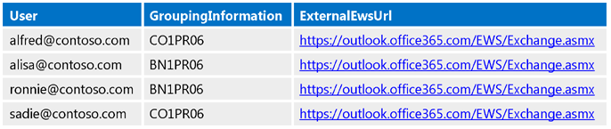
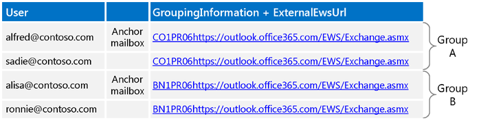
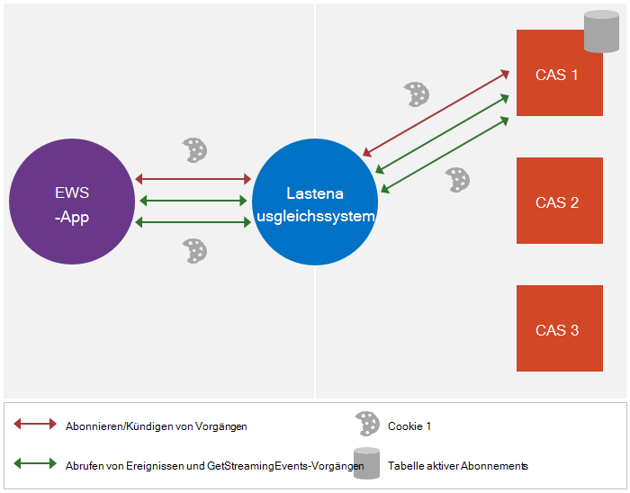
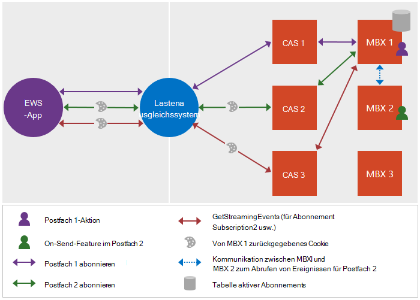

# <a name="maintain-affinity-between-a-group-of-subscriptions-and-the-mailbox-server-in-exchange"></a>Verwalten von Affinität zwischen einer Gruppe von Abonnements und dem Postfachserver in Exchange

Lernen Sie die Affinität zwischen einer Gruppe von Abonnements und dem Postfachserver verwalten.
  
Affinität ist die Zuordnung einer Sequenz von Anforderung und Antwort-Nachrichten mit einem bestimmten Postfachserver. Die meisten Funktionen in Exchange wird vom Server Affinität behandelt. Benachrichtigungen, sind jedoch eine Ausnahme aus. Der Client ist verantwortlich für die Verwaltung von der Affinität für Benachrichtigungsabonnements mit dem Postfachserver. Diese Affinität ermöglicht das System zum Lastenausgleich und Clientzugriffs-Servern zwischen dem Client und dem Server Route Benachrichtigung Abonnements und verwandte Anforderungen an den Postfachserver, der das Abonnement verwaltet. Ohne Affinität kann die Anforderung an einem anderen Postfachserver geleitet erhalten möchten, die nicht der Client-Abonnements, die was dazu einen [ErrorSubscriptionNotFound](http://msdn.microsoft.com/library/4b84d670-74c9-4d6d-84e7-f0a9f76f0d93%28Office.15%29.aspx) Fehler zurückgegeben werden soll. 
  
## <a name="how-is-affinity-maintained"></a>Wie wird die Affinität verwaltet?
<a name="bk_howmaintained"> </a>

Affinität in Exchange ist Cookie-basierte. Der Client löst die Erstellung des Cookies durch das Einbeziehen von bestimmter Kopfzeilen in der Anforderung Abonnement, und klicken Sie dann die Abonnement-Antwort enthält das Cookie. Der Client sendet anschließend das Cookie in nachfolgenden Anforderungen, um sicherzustellen, dass die Anforderung an den richtigen Postfachserver geleitet wird.
  
Genauer gesagt ist Affinität in Exchange durch Folgendes behandelt: 
  
- X-AnchorMailbox – Ein HTTP-Header, die in der anfänglichen Abonnement Anforderung enthalten ist. Das erste Postfach in einer Gruppe von Postfächern, die mit dem gleichen Postfachserver Affinität freigeben identifiziert.
    
- X-PreferServerAffinity – Ein HTTP-Header, die in der anfänglichen Abonnement-Anforderung mit dem X-AnchorMailbox-Header enthalten ist, und festgelegt ist auf "true", um anzugeben, dass der Client anfordert, dass mit dem Postfachserver Affinität verwaltet werden.
    
- X-BackEndOverrideCookie – Ein Cookie, das in der anfänglichen Abonnement Antwort enthalten ist, und enthält eine Cookie, die das System zum Lastenausgleich und Clientzugriffsserver verwenden, um nachfolgende Anforderungen an den gleichen Postfachserver weitergeleitet.
    
## <a name="how-do-i-maintain-affinity-by-using-the-ews-managed-api-or-ews"></a>Wie behalten ich Affinität mithilfe des EWS Managed API oder EWS?
<a name="bk_howdoimaintain"> </a>

Sie können die gleichen Schritte zum Aufrechterhalten der Affinität für mehrere Postfach-Abonnements und ihren Postfachservern, unabhängig davon, ob Sie streaming, Pull oder Push-Benachrichtigungen, verwenden und unabhängig davon, ob Sie vorgesehenen eine lokale Exchange-Server oder Exchange Online.
  
1. Für jedes Postfach, [für die AutoErmittlung aufrufen](how-to-get-user-settings-from-exchange-by-using-autodiscover.md) und die Werten "groupinginformation" und "externalewsurl" benutzereinstellungen zu erhalten. Für die SOAP-AutoErmittlung Sie verwenden im [Setting](http://msdn.microsoft.com/library/43db26e1-f7be-49fd-b26b-fc1b10bd3458%28Office.15%29.aspx) -Element, und für die AutoErmittlung POX, verwenden Sie das [Werten "groupinginformation"](http://msdn.microsoft.com/library/2d8a007f-d79c-43c8-90e3-2c6d883f3a7c%28Office.15%29.aspx) -Element. 
    
2. Mit den Werten "groupinginformation" und "externalewsurl" Einstellungen der AutoErmittlung-Antworten Place Postfächer mit der gleichen Werten "groupinginformation" und "externalewsurl" verkettet Wert in der gleichen Gruppe. Wenn alle Gruppen mehr als 200 Postfächer verfügen, zerlegen Sie die Gruppen weitere, sodass jede Gruppe nicht mehr als 200 Postfächer verfügt.
    
3. Erstellen und Verwenden von einem [ExchangeService](http://msdn.microsoft.com/en-us/library/microsoft.exchange.webservices.data.exchangeservice%28v=EXCHG.80%29.aspx) -Objekt für den Rest der Prozedur. Sie verwenden, werden automatisch die gleichen **ExchangeService** -Objekt, Cookies und Header (klicken Sie nach festlegen) verwaltet. Beachten Sie, dass wenn Sie die Gruppe streaming-Abonnements in eine einzelne Verbindung nicht möchten, erstellen Sie ein anderes **ExchangeService** -Objekt für jeden angenommener Benutzer frei. 
    
4. [Senden Sie ein Abonnement](notification-subscriptions-mailbox-events-and-ews-in-exchange.md) -Anforderung für den Benutzer, dessen Benutzername wird zuerst angezeigt, wenn alle Benutzer in der Gruppe alphabetisch sortiert sind (werden zusammenfassend an diesen Benutzer als den Anker Postfachbenutzer). Die folgenden Schritte aus: 
    
  - Fügen Sie den X-AnchorMailbox-Header mit einem Wert, der an die SMTP-Adresse des Postfachbenutzers Anker festgelegt.
    
  - Fügen Sie den X-PreferServerAffinity-Header mit einem Wert auf True festgelegt.
    
  - Verwenden Sie die Rolle ["ApplicationImpersonation](http://technet.microsoft.com/en-us/library/dd776119%28v=exchg.150%29.aspx) " (der Typ ["ExchangeImpersonation"](http://msdn.microsoft.com/library/d8cbac49-47d0-4745-a2a7-545d33f8da93%28Office.15%29.aspx) ). 
    
5. Rufen Sie in der Antwort Abonnement des X-BackEndOverrideCookie-Werts. Dieser Wert wird in jede nachfolgende Abonnement Anforderung für Benutzer in dieser Gruppe einschließen.
    
6. Senden Sie für jeden zusätzlichen Benutzer in der Gruppe eine Anforderung Abonnement und die folgenden Schritte aus:
    
  - Fügen Sie den X-AnchorMailbox-Header mit einem Wert, der an die SMTP-Adresse des Postfachbenutzers Anker für die Gruppe festgelegt.
    
  - Fügen Sie den X-PreferServerAffinity-Header mit einem Wert auf True festgelegt.
    
  - Enthalten Sie die X-BackEndOverrideCookie, die in den Anker Postfachbenutzer Abonnement Antwort zurückgegeben wurde.
    
  - Verwenden Sie die Rolle ["ApplicationImpersonation](http://technet.microsoft.com/en-us/library/dd776119%28v=exchg.150%29.aspx) " (der Typ ["ExchangeImpersonation"](http://msdn.microsoft.com/library/d8cbac49-47d0-4745-a2a7-545d33f8da93%28Office.15%29.aspx) ). 
    
    Beachten Sie, dass der Server die Werte X PreferServerAffinity und X BackendOverrideCookie zusammen verwendet, um das routing an den Postfachserver ausführen. Die X-AnchorMailbox Kopfzeile ist auch erforderlich, aber wird vom Server ignoriert, wenn die anderen beiden Werte gültig sind. Wenn X AnchorMailbox und X-PreferServerAffinity befinden sich in einer Anforderung und X BackendOverrideCookie ist nicht mit inbegriffen, wird der Wert X AnchorMailbox verwendet, um die Anforderungen weiterzuleiten.
    
    Da die X-PreferServerAffinity und X BackendOverrideCookie Werte führen Sie das routing, wenn das Postfach Anker jemals zu einer anderen Gruppe oder Server verschoben wird, ändert die Logik nicht, da die X-BackendOverrideCookie die Anforderung an den richtigen Server weitergeleitet wird für die Gruppe.
    
7. Senden Sie eine einzelne [GetStreamingEvents](http://msdn.microsoft.com/library/dbe83857-c4f8-4d98-813f-e03c289697a1%28Office.15%29.aspx) oder [GetEvents](http://msdn.microsoft.com/library/22d4da6b-d8a8-484f-82c4-3e4b8f5431cd%28Office.15%29.aspx) Anforderungen für die Gruppe, und gehen Sie folgendermaßen vor: 
    
  - Enthalten Sie in jeder der einzelnen Abonnement Antworten für Postfächer in der Gruppe zurückgegebenen Werte sind [SubscriptionId](http://msdn.microsoft.com/library/3f86c178-2311-4844-82db-c2a0e469d116%28Office.15%29.aspx) . 
    
  - Wenn mehr als 200 Abonnements für die Gruppe vorhanden ist, erstellen Sie mehrere Anforderungen. Die maximale Anzahl von [SubscriptionId](http://msdn.microsoft.com/library/3f86c178-2311-4844-82db-c2a0e469d116%28Office.15%29.aspx) Werte, die in einer Anforderung ist 200. 
    
  - Wenn Sie weitere Verbindungen als der Zielpostfach verfügbar sind, verwenden Sie das Dienstkonto zum Identitätswechsel für das Anker-Postfach für die Gruppe; andernfalls Identitätswechsel nicht verwendet. Idealerweise sollten Sie ein eindeutiges Postfach pro Anforderung [GetStreamingEvents](http://msdn.microsoft.com/library/dbe83857-c4f8-4d98-813f-e03c289697a1%28Office.15%29.aspx) oder [GetEvents](http://msdn.microsoft.com/library/22d4da6b-d8a8-484f-82c4-3e4b8f5431cd%28Office.15%29.aspx) anzunehmen, so dass nie Drosselung Grenzwerte auftreten. 
    
  - Verwenden Sie ApplicationImpersonation, wenn Sie [Weitere Verbindungen als der Zielpostfach verfügbar sind benötigen](how-to-maintain-affinity-between-group-of-subscriptions-and-mailbox-server.md#bk_throttling). andernfalls ApplicationImpersonation nicht verwendet.
    
  - Fügen Sie den X-PreferServerAffinity-Header, und legen Sie es auf "true". Dieser Wert wird automatisch enthalten, wenn Sie das **ExchangeService** -Objekt verwenden, das Sie in Schritt 2 erstellt haben. 
    
  - Enthalten Sie die X-BackEndOverrideCookie für die Gruppe (die X-BackEndOverrideCookie, die in den Anker Postfachbenutzer Abonnement Antwort zurückgegeben wurden). Dieser Wert wird automatisch enthalten, wenn Sie das **ExchangeService** -Objekt verwenden, das Sie in Schritt 2 erstellt haben. 
    
8. Übergeben Sie die zurückgegebenen Ereignisse auf einem getrennten Thread für die Verarbeitung.
    
## <a name="what-throttling-values-do-i-need-to-take-into-consideration"></a>Welche Drosselung Werte muss ich berücksichtigen?
<a name="bk_throttling"> </a>

Wenn Sie Ihre Benachrichtigung Implementierung planen, möchten Sie zwei Werte berücksichtigt werden: die Anzahl der Verbindungen und die Anzahl der Abonnements. Die folgende Tabelle enthält die Standardwerte für jede Einstellung [Drosselung](ews-throttling-in-exchange.md) und wie die Einstellungen verwendet werden. Das Budget ist für jeden Wert der Zielpostfach zugewiesen. Aus diesem Grund ist Verwenden des Identitätswechsels, um zusätzliche Verbindungen zu erhalten ein erforderlicher Schritt in vielen Szenarien aus. 
  
**In Tabelle 1. Drosselung Standardwerte**

|**Bereich von Belang**|**Drosselung Einstellung**|**Standardwert**|**Beschreibung**|
|:-----|:-----|:-----|:-----|
|Streaming Verbindungen  <br/> |Hängenden Verbindungslimit Standard  <br/> |10 für Exchange Online  <br/> 3 für Exchange 2013  <br/> |Die maximale Anzahl von gleichzeitigen streaming Verbindungen, die über ein Konto verfügen, kann gleichzeitig auf dem Server geöffnet. Arbeiten innerhalb dieser Grenzwert, verwenden Sie ein Dienstkonto mit der Rolle "ApplicationImpersonation" für die Ziel-Postfächer zugewiesen und Identitätswechsel für den ersten Benutzer in den einzelnen Gruppen der Abonnement-ID, wenn Ereignisse gestreamt abrufen.  <br/> |
|Pull oder Push-Verbindungen  <br/> |EWSMaxConcurrency  <br/> |27  <br/> |Die maximale Anzahl von gleichzeitigen Pull oder Push-Verbindungen (Anforderungen, die geliefert, aber noch nicht beantwortet wurden), dass ein Konto öffnen auf dem Server gleichzeitig durchführen kann.  <br/> |
|Abonnements  <br/> |EWSMaxSubscriptions  <br/> |20 für Exchange Online  <br/> 5000 für Exchange 2013  <br/> |Die maximale Anzahl von nonexpired Abonnements, die ein Konto gleichzeitig durchführen kann. Dieser Wert wird verringert, wenn das Abonnement auf dem Server erstellt wird.  <br/> |
   
Das folgende Beispiel zeigt, wie Budgets behandelt werden zwischen alle Zielpostfach und das Dienstkonto, das der Rolle ["ApplicationImpersonation](http://technet.microsoft.com/en-us/library/dd776119%28v=exchg.150%29.aspx) " für die Ziel-Postfächer zugewiesen wurde. 
  
- ServiceAccount1 (sa1) Identität viele Benutzer (m1, m2, m3 usw.) und Abonnements für jedes Postfach erstellt. Beachten Sie, dass bei der Erstellung von Abonnements von Ihrem Besitzer sa1, damit beim Öffnen sa1 einer Verbindungs mit der Abonnements, EWS erzwingt, dass die Abonnements sa1 gehören.
    
- Sa1 können die Verbindung wie folgt öffnen:
    
1. Ohne Identitätswechsel sodass die Verbindung gegen sa1 aufgeladen wird.
    
2. Durch Benutzer annehmen der Identität – beispielsweise m1 –, damit die Verbindung mit einer Kopie der m1 Budget berechnet wird. (M1 selbst kann öffnen zehn Verbindungen mit Exchange Online und alle Dienstkonten Identitätswechsel bei m1 können zehn Verbindungen mithilfe des kopierten Budgets.)
    
- Wenn das Verbindungslimit erreicht ist, stehen die folgenden problemumgehungen:
    
  - Wenn die Option 1 verwendet wird, kann der Administrator mehrere Dienstkonten zum Identitätswechsel für weitere Benutzer erstellen.
    
  - Wenn die Option 2 verwendet wird, kann der Code eines anderen Benutzers imitieren – beispielsweise m2.
    
## <a name="example-maintaining-affinity-between-a-group-of-subscriptions-and-the-mailbox-server"></a>Beispiel: Verwalten von Affinität zwischen einer Gruppe von Abonnements und dem Postfachserver
<a name="bk_ce"> </a>

Okay, in der Praxis sehen. Das folgende Codebeispiel zeigt, wie Benutzer gruppieren und verwenden Sie die X-AnchorMailbox und X PreferServerAffinity Header und das Cookie X BackendOverrideCookie zum Aufrechterhalten der Affinität mit dem Postfachserver. Da die Kopf- und das Cookie von großer Wichtigkeit im Textabschnitt Affinität sind, konzentriert sich auf die EWS XML-Anforderungen und Antworten in diesem Beispiel wird. Um die EWS Managed API verwenden, um den Hauptteil der Abonnement-Anforderungen und-Antworten erstellen, finden Sie unter [Stream-Benachrichtigungen bezüglich Postfach Ereignisse im Exchange mithilfe der Exchange-Webdienste](how-to-stream-notifications-about-mailbox-events-by-using-ews-in-exchange.md) , und [ziehen Sie Benachrichtigungen über Postfach Ereignisse mithilfe von EWS in Exchange](how-to-pull-notifications-about-mailbox-events-by-using-ews-in-exchange.md). Dieser Abschnitt enthält zusätzliche Schritte spezielle zur Wartung Affinität und die Kopfzeilen auf Ihre Anfragen hinzufügen.
  
Dieses Beispiel besteht aus vier Benutzer: alfred@contoso.com, alisa@contoso.com, ronnie@contoso.com und sadie@contoso.com. Die folgende Abbildung zeigt den Werten "groupinginformation" und "externalewsurl" [für die AutoErmittlung](how-to-get-user-settings-from-exchange-by-using-autodiscover.md) für die Benutzer. 
  
**Abbildung 1. Für die AutoErmittlung verwendet, um die Gruppenpostfächer**


  
Verwenden die Einstellungen der AutoErmittlung-Antworten, werden die Postfächer nach den verketteten Wert von den Werten "groupinginformation" und "externalewsurl" Einstellungen gruppiert. In diesem Beispiel Alfred und Sadie die gleichen Werte aufweisen, damit sie in einer Gruppe sind, und Alisa und Ronnie dieselben Werte wie, freigeben, damit sie in einer anderen Gruppe sind.
  
**Abbildung 2. Erstellen von postfachgruppen**


  
In diesem Beispiel wird konzentrieren wir uns auf Gruppe a Wir würden verwenden Sie dieselben Schritte für die Gruppe B, aber Sie können einen anderen Wert für die X-AnchorMailbox für diese Gruppe verwenden.
  
[ApplicationImpersonation](http://technet.microsoft.com/en-us/library/dd776119%28v=exchg.150%29.aspx), erstellen Sie die Abonnement-Anforderung für das Postfach Anker (alfred@contoso.com), mit dem X-AnchorMailbox-Header zu der die e-Mail-Adresse und eine X-PreferServerAffinity-Header-Wert "true". Den Server zum Erstellen einer X-BackEndOverrideCookie für die Antwort wird ausgelöst, wenn diese Headerwerte zwei wird.
  
Wenn Sie die EWS Managed API verwenden, verwenden Sie die [Wertpaare](http://msdn.microsoft.com/en-us/library/microsoft.exchange.webservices.data.exchangeservice_members%28v=exchg.80%29.aspx)-[Add](http://msdn.microsoft.com/EN-US/library/cy7xta5e) -Methode zwei Header auf Ihre Anforderung Abonnement hinzufügen, wie dargestellt. 
  
```cs
service.HttpHeaders.Add("X-AnchorMailbox", Mailbox.SMTPAddress);
service.HttpHeaders.Add("X-PreferServerAffinity", "true");
```

So sieht Alfreds Abonnement Anforderung.
  
```XML
POST https://outlook.office365.com/EWS/Exchange.asmx HTTP/1.1
Content-Type: text/xml; charset=utf-8
Accept: text/xml
User-Agent: ExchangeServicesClient/15.00.0516.014
X-AnchorMailbox: alfred@contoso.com
X-PreferServerAffinity: true
Host: outlook.office365.com
<?xml version="1.0" encoding="utf-8"?>
<soap:Envelope xmlns:xsi="http://www.w3.org/2001/XMLSchema-instance" xmlns:m="http://schemas.microsoft.com/exchange/services/2006/messages" xmlns:t="http://schemas.microsoft.com/exchange/services/2006/types" xmlns:soap="http://schemas.xmlsoap.org/soap/envelope/">
  <soap:Header>
    <t:RequestServerVersion Version="Exchange2013" />
    <t:ExchangeImpersonation>
      <t:ConnectingSID>
        <t:SmtpAddress>alfred@contoso.com</t:SmtpAddress>
      </t:ConnectingSID>
    </t:ExchangeImpersonation>
  </soap:Header>
  <soap:Body>
    <m:Subscribe>
      <m:StreamingSubscriptionRequest>
        <t:FolderIds>
          <t:DistinguishedFolderId Id="inbox" />
        </t:FolderIds>
        <t:EventTypes>
          <t:EventType>NewMailEvent</t:EventType>
        </t:EventTypes>
      </m:StreamingSubscriptionRequest>
    </m:Subscribe>
  </soap:Body>
</soap:Envelope>
```

Die folgende XML-Meldung wird die Antwort auf Alfreds Abonnements an, und die X-BackEndOverrideCookie enthält. Senden Sie dieses Cookie für alle nachfolgenden Anforderungen für Benutzer in dieser Gruppe. Beachten Sie, dass die Antwort auch zusätzliche Cookies, wie das Exchangecookie Cookie von Exchange 2010 verwendet enthält. Exchange Online, Exchange Online als Teil von Office 365 und Exchange beginnend mit Exchange 2013-Versionen ignorieren Exchangecookie, wenn es in den nachfolgenden Abonnement Anfragen enthalten ist.
  
```XML
HTTP/1.1 200 OK
Content-Type: text/xml; charset=utf-8
Set-Cookie: exchangecookie=ddb8c383aef34c7694132aa679744feb; expires=Thu, 25-Sep-2014 18:42:45 GMT; path=/;
    HttpOnly
Set-Cookie: X-BackEndOverrideCookie=CO1PR06MB222.namprd06.prod.outlook.com~1941996295; path=/; secure; HttpOnly
Set-Cookie: X-BackEndCookie=alfred@contoso.com=Ox8XKzcXLxg==; 
    expires=Wed, 25-Sep-2013 18:52:49 GMT; path=/EWS; secure; HttpOnly
<?xml version="1.0" encoding="utf-8"?>
<s:Envelope xmlns:s="http://schemas.xmlsoap.org/soap/envelope/">
  <s:Header>
    <h:ServerVersionInfo MajorVersion="15"
                         MinorVersion="0"
                         MajorBuildNumber="775"
                         MinorBuildNumber="7"
                         Version="V2_4"
                         xmlns:h="http://schemas.microsoft.com/exchange/services/2006/types"
                         xmlns="http://schemas.microsoft.com/exchange/services/2006/types"
                         xmlns:xsd="http://www.w3.org/2001/XMLSchema"
                         xmlns:xsi="http://www.w3.org/2001/XMLSchema-instance"/>
  </s:Header>
  <s:Body xmlns:xsi="http://www.w3.org/2001/XMLSchema-instance"
          xmlns:xsd="http://www.w3.org/2001/XMLSchema">
    <m:SubscribeResponse xmlns:m="http://schemas.microsoft.com/exchange/services/2006/messages"
                         xmlns:t="http://schemas.microsoft.com/exchange/services/2006/types">
      <m:ResponseMessages>
        <m:SubscribeResponseMessage ResponseClass="Success">
          <m:ResponseCode>NoError</m:ResponseCode>
          <m:SubscriptionId>JgBjbzFwcjA2bWIyMjIubmFtcHJkMDYucHJvZC5vdXRsb29rLmNvbRAAAAAUeGk+7JFdSaFM8/NI/gQQpVdgZX6H0Ag=</m:SubscriptionId>
        </m:SubscribeResponseMessage>
      </m:ResponseMessages>
    </m:SubscribeResponse>
  </s:Body>
</s:Envelope>
```

Verwenden die X-BackEndOverrideCookie aus Alfreds Antwort und der X-AnchorMailbox-Header wird die Abonnement-Anforderung für Sadie erstellt, das Mitglied Gruppe A. Sadie Abonnement Anforderung sieht folgendermaßen aus.
  
```XML
POST https://outlook.office365.com/EWS/Exchange.asmx HTTP/1.1
Content-Type: text/xml; charset=utf-8
Accept: text/xml
User-Agent: ExchangeServicesClient/15.00.0516.014
X-AnchorMailbox: alfred@consoso.com
X-PreferServerAffinity: true
Host: outlook.office365.com
Cookie: X-BackEndOverrideCookie=CO1PR06MB222.namprd06.prod.outlook.com~1941996295
<?xml version="1.0" encoding="utf-8"?>
<soap:Envelope xmlns:xsi="http://www.w3.org/2001/XMLSchema-instance" xmlns:m="http://schemas.microsoft.com/exchange/services/2006/messages" xmlns:t="http://schemas.microsoft.com/exchange/services/2006/types" xmlns:soap="http://schemas.xmlsoap.org/soap/envelope/">
  <soap:Header>
    <t:RequestServerVersion Version="Exchange2013" />
    <t:ExchangeImpersonation>
      <t:ConnectingSID>
        <t:SmtpAddress>sadie@consoso.com </t:SmtpAddress>
      </t:ConnectingSID>
    </t:ExchangeImpersonation>
  </soap:Header>
  <soap:Body>
    <m:Subscribe>
      <m:StreamingSubscriptionRequest>
        <t:FolderIds>
          <t:DistinguishedFolderId Id="inbox" />
        </t:FolderIds>
        <t:EventTypes>
          <t:EventType>NewMailEvent</t:EventType>
        </t:EventTypes>
      </m:StreamingSubscriptionRequest>
    </m:Subscribe>
  </soap:Body>
</soap:Envelope>

```

Sadies Abonnements Antwort sieht folgendermaßen aus. Beachten Sie, dass es nicht in der X-BackEndOverrideCookie enthalten ist. Der Client ist verantwortlich für das Zwischenspeichern dieses Werts für zukünftige Anforderungen.
  
```XML
HTTP/1.1 200 OK
Content-Type: text/xml; charset=utf-8
Set-Cookie: exchangecookie=640ea858f69d47ff8cce8b44c337f6d9; path=/
Set-Cookie: X-BackEndCookie=alfred@contoso.com=Ox8XKzcXLxg==; 
   expires= Wed, 25-Sep-2013 18:53:06 GMT; path=/EWS; secure; HttpOnly
<?xml version="1.0" encoding="utf-8"?>
<s:Envelope xmlns:s="http://schemas.xmlsoap.org/soap/envelope/">
  <s:Header>
    <h:ServerVersionInfo MajorVersion="15"
                         MinorVersion="0"
                         MajorBuildNumber="775"
                         MinorBuildNumber="7"
                         Version="V2_4"
                         xmlns:h="http://schemas.microsoft.com/exchange/services/2006/types"
                         xmlns="http://schemas.microsoft.com/exchange/services/2006/types"
                         xmlns:xsd="http://www.w3.org/2001/XMLSchema"
                         xmlns:xsi="http://www.w3.org/2001/XMLSchema-instance"/>
  </s:Header>
  <s:Body xmlns:xsi="http://www.w3.org/2001/XMLSchema-instance"
          xmlns:xsd="http://www.w3.org/2001/XMLSchema">
    <m:SubscribeResponse xmlns:m="http://schemas.microsoft.com/exchange/services/2006/messages"
                         xmlns:t="http://schemas.microsoft.com/exchange/services/2006/types">
      <m:ResponseMessages>
        <m:SubscribeResponseMessage ResponseClass="Success">
          <m:ResponseCode>NoError</m:ResponseCode>
          <m:SubscriptionId>JgBjbzFwcjA2bWIyMjIubmFtcHJkMDYucHJvZC5vdXRsb29rLmNvbRAAAAB4EQOy2pfrQJfM3hzs/nZJIZssan6H0Ag=</m:SubscriptionId>
        </m:SubscribeResponseMessage>
      </m:ResponseMessages>
    </m:SubscribeResponse>
  </s:Body>
</s:Envelope>
```

Verwenden die [SubscriptionId](http://msdn.microsoft.com/library/3f86c178-2311-4844-82db-c2a0e469d116%28Office.15%29.aspx) Werte aus den Abonnement Antworten, wurde die Anforderung einer [GetStreamingEvents](http://msdn.microsoft.com/library/dbe83857-c4f8-4d98-813f-e03c289697a1%28Office.15%29.aspx) -Operation für alle Abonnements in der Gruppe erstellt. Da weniger als 200 Abonnements in dieser Gruppe vorhanden sind, werden alle in einer Anforderung gesendet. Die X-PreferServerAffinity Kopfzeile festgelegt ist auf "true" und die X-BackEndOverrideCookie enthalten ist. 
  
```XML
POST https://outlook.office365.com/EWS/Exchange.asmx HTTP/1.1
Content-Type: text/xml; charset=utf-8
Accept: text/xml
User-Agent: ExchangeServicesClient/15.00.0516.014
X-AnchorMailbox: alfred@contoso.com
X-PreferServerAffinity: true
Host: outlook.office365.com
Cookie: X-BackEndOverrideCookie=CO1PR06MB222.namprd06.prod.outlook.com~1941996295
<?xml version="1.0" encoding="utf-8"?>
<soap:Envelope xmlns:xsi="http://www.w3.org/2001/XMLSchema-instance" xmlns:m="http://schemas.microsoft.com/exchange/services/2006/messages" xmlns:t="http://schemas.microsoft.com/exchange/services/2006/types" xmlns:soap="http://schemas.xmlsoap.org/soap/envelope/">
  <soap:Header>
    <t:RequestServerVersion Version="Exchange2013" />
    <t:ExchangeImpersonation>
      <t:ConnectingSID>
        <t:SmtpAddress>sadie@contoso.com</t:SmtpAddress>
      </t:ConnectingSID>
    </t:ExchangeImpersonation>
  </soap:Header>
  <soap:Body>
    <m:GetStreamingEvents>
      <m:SubscriptionIds>
        <t:SubscriptionId>JgBjbzFwcjA2bWIyMjIubmFtcHJkMDYucHJvZC5vdXRsb29rLmNvbRAAAAB4EQOy2pfrQJfM3hzs/nZJIZssan6H0Ag=</t:SubscriptionId>
        <t:SubscriptionId>JgBjbzFwcjA2bWIyMjIubmFtcHJkMDYucHJvZC5vdXRsb29rLmNvbRAAAAAUeGk+7JFdSaFM8/NI/gQQpVdgZX6H0Ag=</t:SubscriptionId>
      </m:SubscriptionIds>
      <m:ConnectionTimeout>10</m:ConnectionTimeout>
    </m:GetStreamingEvents>
  </soap:Body>
</soap:Envelope>
```

Die zurückgegebene Ereignisse werden auf einem getrennten Thread zur Verarbeitung übergeben.
  
## <a name="how-has-affinity-changed"></a>Wie hat sich Affinität geändert?
<a name="bk_howchanged"> </a>

In Exchange 2010-Abonnements auf dem Clientzugriffsserver bleiben wie in Abbildung 3 dargestellt. In Versionen von Exchange spätestens Exchange 2010 werden Abonnements auf dem Postfachserver verwaltet, wie in Abbildung 4 dargestellt.
  
**Abbildung 3. Prozess für die Verwaltung der Affinität in Exchange 2010**


  
**Abbildung 4. Prozess für die Verwaltung der Affinität in Exchange Online und Exchange 2013**


  
In Exchange 2010, der Client nur kennt die Adresse des Systems zum Lastenausgleich und die Exchangecookie, die vom Server zurückgegeben wird sichergestellt, dass die Anforderung an den richtigen Client Access Server weitergeleitet wird. In späteren Versionen, die das System zum Lastenausgleich und die Clientzugriffs-Serverrollen müssen beide jedoch die Anforderungen entsprechend weitergeleitet werden, bevor sie an den Postfachserver gelangen. Dazu, dass zusätzliche Informationen erforderlich ist, ist der Grund, warum der neue Kopf- und Cookie eingeführt wurden. Der Artikel [Benachrichtigung Abonnements, Postfach-Ereignisse und EWS in Exchange](notification-subscriptions-mailbox-events-and-ews-in-exchange.md) wird erläutert, wie Abonnements in Exchange 2013 verwaltet werden. 
  
Sie möglicherweise feststellen, dass die Exchangecookie, die Exchange 2010 verwendet weiterhin von späteren Versionen zurückgegeben wird. Es ist keine Beschädigungen in dieses Cookie in Anforderungen einschließlich, aber höhere Versionen von Exchange ignorieren.
  
## <a name="see-also"></a>Siehe auch

- [Benachrichtigungsabonnements, Postfachereignisse und EWS in Exchange](notification-subscriptions-mailbox-events-and-ews-in-exchange.md)
- [Stream-Benachrichtigungen bezüglich Postfach Ereignisse mithilfe von EWS in Exchange](how-to-stream-notifications-about-mailbox-events-by-using-ews-in-exchange.md)
- [Ziehen Sie Benachrichtigungen über Ereignisse Postfach mithilfe der EWS in Exchange](how-to-pull-notifications-about-mailbox-events-by-using-ews-in-exchange.md)
- [Fehlerbehandlung Benachrichtigung-bezogene in EWS in Exchange](handling-notification-related-errors-in-ews-in-exchange.md)
- [Änderungen bei der Verwaltung von Affinität für EWS-Abonnements...](http://blogs.msdn.com/b/mstehle/archive/2013/04/17/changes-in-managing-affinity-for-ews-subscriptions.aspx)
- [EWS-Einschränkung in Exchange](ews-throttling-in-exchange.md)
    

