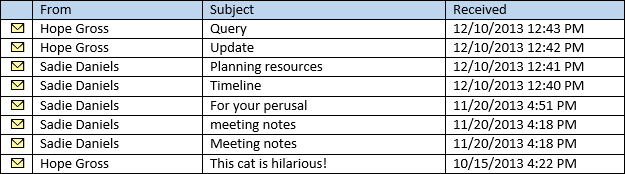
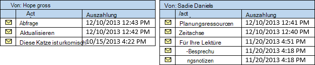
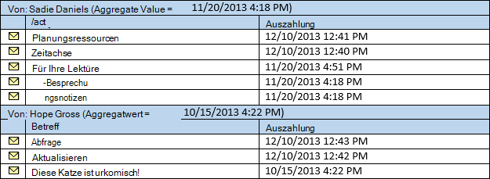

# <a name="perform-grouped-searches-by-using-ews-in-exchange"></a><span data-ttu-id="c0b6a-103">Führen Sie gruppierte Suchvorgänge in Exchange mithilfe der Exchange-Webdienste aus</span><span class="sxs-lookup"><span data-stu-id="c0b6a-103">Perform grouped searches by using EWS in Exchange</span></span>

<span data-ttu-id="c0b6a-104">Erfahren Sie, wie Sie gruppierten Suchvorgänge in die EWS Managed API oder EWS-Anwendung, die beruht auf Exchange ausführen.</span><span class="sxs-lookup"><span data-stu-id="c0b6a-104">Find out how to perform grouped searches in your EWS Managed API or EWS application that targets Exchange.</span></span>
  
<span data-ttu-id="c0b6a-105">Gruppierte Suchvorgänge sind hilfreich, da sie können Sie steuern, wie Suchergebnisse geordnet sind.</span><span class="sxs-lookup"><span data-stu-id="c0b6a-105">Grouped searches are useful in that they gives you control over how search results are organized.</span></span> <span data-ttu-id="c0b6a-106">Organisierten Suchergebnisse können erleichtern für die Anwendung zum Verarbeiten von Ergebnissen oder in ein Endbenutzer in einer verwaltbaren Weise angezeigt werden.</span><span class="sxs-lookup"><span data-stu-id="c0b6a-106">Organized search results can make it easier for your application to process results or display them to an end user in a manageable way.</span></span>
  
<span data-ttu-id="c0b6a-107">Gruppieren von Works durch werden die Websitemigration alle Elemente innerhalb des Resultsets, die den gleichen Wert eines bestimmten Felds in einer Gruppe aufweisen.</span><span class="sxs-lookup"><span data-stu-id="c0b6a-107">Grouping works by putting all items within the result set that have the same value of a specific field into a group.</span></span> <span data-ttu-id="c0b6a-108">Sie können die Ergebnisse vom Absender, gruppieren und alle Elemente aus der gleichen Person kann in einer separaten Gruppe und der Elemente innerhalb jeder Gruppe gemäß der Reihenfolge aus, die Sie, in der Ansicht angeben sortiert werden sollen.</span><span class="sxs-lookup"><span data-stu-id="c0b6a-108">For example, you can group your results by the sender, and all items from the same person will be in a separate group, and the items within each group will be sorted according to the order you specify on the view.</span></span> <span data-ttu-id="c0b6a-109">Die Gruppen selbst werden durch einen aggregierten Wert basierend auf einem Feld gewählte sortiert.</span><span class="sxs-lookup"><span data-stu-id="c0b6a-109">The groups themselves are sorted by an aggregate value based on a field you choose.</span></span>
  
<span data-ttu-id="c0b6a-110">**In Tabelle 1. EWS Managed API-Methoden und EWS-Vorgänge zum Organisieren von Suchergebnissen**</span><span class="sxs-lookup"><span data-stu-id="c0b6a-110">**Table 1. EWS Managed API methods and EWS operations for organizing search results**</span></span>

|<span data-ttu-id="c0b6a-111">**Aktion**</span><span class="sxs-lookup"><span data-stu-id="c0b6a-111">**If you want to…**</span></span>|<span data-ttu-id="c0b6a-112">**Verwenden Sie in die EWS Managed API...**</span><span class="sxs-lookup"><span data-stu-id="c0b6a-112">**In the EWS Managed API, use…**</span></span>|<span data-ttu-id="c0b6a-113">**Verwenden Sie in der Exchange-Webdienste...**</span><span class="sxs-lookup"><span data-stu-id="c0b6a-113">**In EWS, use…**</span></span>|
|:-----|:-----|:-----|
|<span data-ttu-id="c0b6a-114">Organisieren Sie Elemente mit demselben Wert in einer bestimmten Eigenschaft in die Ergebnisse in Gruppen.</span><span class="sxs-lookup"><span data-stu-id="c0b6a-114">Organize items with the same value in a specific property in your results into groups</span></span>  <br/> |[<span data-ttu-id="c0b6a-115">Grouping.GroupOn</span><span class="sxs-lookup"><span data-stu-id="c0b6a-115">Grouping.GroupOn</span></span>](http://msdn.microsoft.com/en-us/library/microsoft.exchange.webservices.data.grouping.groupon%28v=exchg.80%29.aspx) <br/> |<span data-ttu-id="c0b6a-116">[FieldURI](http://msdn.microsoft.com/library/24af8e3b-3074-4c8c-8d0a-52446508d044%28Office.15%29.aspx) -Element als untergeordnetes Element des Elements [GroupBy](http://msdn.microsoft.com/library/9728619b-4674-4b9d-9f6c-e75c6165966c%28Office.15%29.aspx)</span><span class="sxs-lookup"><span data-stu-id="c0b6a-116">[FieldURI](http://msdn.microsoft.com/library/24af8e3b-3074-4c8c-8d0a-52446508d044%28Office.15%29.aspx) element as a child of the [GroupBy](http://msdn.microsoft.com/library/9728619b-4674-4b9d-9f6c-e75c6165966c%28Office.15%29.aspx) element</span></span>  <br/> |
|<span data-ttu-id="c0b6a-117">Sortieren der Elemente innerhalb jeder Gruppe durch den Wert in eine bestimmte Eigenschaft</span><span class="sxs-lookup"><span data-stu-id="c0b6a-117">Sort items within each group by the value in a specific property</span></span>  <br/> |[<span data-ttu-id="c0b6a-118">ItemView.OrderBy</span><span class="sxs-lookup"><span data-stu-id="c0b6a-118">ItemView.OrderBy</span></span>](http://msdn.microsoft.com/en-us/library/microsoft.exchange.webservices.data.itemview.orderby%28v=exchg.80%29.aspx) <br/> |<span data-ttu-id="c0b6a-119">[SortOrder](http://msdn.microsoft.com/library/c2413f0b-8c03-46ae-9990-13338b3c53a6%28Office.15%29.aspx) -element</span><span class="sxs-lookup"><span data-stu-id="c0b6a-119">[SortOrder](http://msdn.microsoft.com/library/c2413f0b-8c03-46ae-9990-13338b3c53a6%28Office.15%29.aspx) element</span></span>  <br/> |
|<span data-ttu-id="c0b6a-120">Sortieren der Gruppen</span><span class="sxs-lookup"><span data-stu-id="c0b6a-120">Sort the groups</span></span>  <br/> |[<span data-ttu-id="c0b6a-121">Grouping.AggregateOn</span><span class="sxs-lookup"><span data-stu-id="c0b6a-121">Grouping.AggregateOn</span></span>](http://msdn.microsoft.com/en-us/library/microsoft.exchange.webservices.data.grouping.aggregateon%28v=exchg.80%29.aspx) <br/><br/> [<span data-ttu-id="c0b6a-122">Grouping.AggregateType</span><span class="sxs-lookup"><span data-stu-id="c0b6a-122">Grouping.AggregateType</span></span>](http://msdn.microsoft.com/en-us/library/microsoft.exchange.webservices.data.grouping.aggregatetype%28v=exchg.80%29.aspx) <br/><br/> [<span data-ttu-id="c0b6a-123">Grouping.SortDirection</span><span class="sxs-lookup"><span data-stu-id="c0b6a-123">Grouping.SortDirection</span></span>](http://msdn.microsoft.com/en-us/library/microsoft.exchange.webservices.data.grouping.sortdirection%28v=exchg.80%29.aspx) <br/> |<span data-ttu-id="c0b6a-124">**FieldURI** -Element als untergeordnetes Element des Elements [AggregateOn](http://msdn.microsoft.com/library/9b0a03f2-3282-46e1-b1a0-cbb9a0fbe9bb%28Office.15%29.aspx)</span><span class="sxs-lookup"><span data-stu-id="c0b6a-124">**FieldURI** element as a child of the [AggregateOn](http://msdn.microsoft.com/library/9b0a03f2-3282-46e1-b1a0-cbb9a0fbe9bb%28Office.15%29.aspx) element</span></span><br/><br/> <span data-ttu-id="c0b6a-125">**Aggregate** -Attribut für das **AggregateOn** -element</span><span class="sxs-lookup"><span data-stu-id="c0b6a-125">**Aggregate** attribute on the **AggregateOn** element</span></span><br/><br/><span data-ttu-id="c0b6a-126">**Reihenfolge** -Attribut die **GroupBy** -element</span><span class="sxs-lookup"><span data-stu-id="c0b6a-126">**Order** attribute on the **GroupBy** element</span></span>  <br/> |
   
<span data-ttu-id="c0b6a-127">Betrachten sie Schritt für Schritt.</span><span class="sxs-lookup"><span data-stu-id="c0b6a-127">Let's take it step by step.</span></span>
  
## <a name="group-results-by-a-specific-property"></a><span data-ttu-id="c0b6a-128">Gruppieren von Ergebnissen nach einer bestimmten Eigenschaft</span><span class="sxs-lookup"><span data-stu-id="c0b6a-128">Group results by a specific property</span></span>
<span data-ttu-id="c0b6a-129"><a name="bk_GroupResults"> </a></span><span class="sxs-lookup"><span data-stu-id="c0b6a-129"></span></span>

<span data-ttu-id="c0b6a-130">Der erste Schritt bei der Verwendung der Gruppierung ist, wählen Sie eine Eigenschaft oder-Attribut für die Elemente im Exchange-Speicher, nach dem gruppiert werden.</span><span class="sxs-lookup"><span data-stu-id="c0b6a-130">The first step to using grouping is to select a property, or attribute on the items in the Exchange store, to group by.</span></span> <span data-ttu-id="c0b6a-131">Die EWS Managed API stellt diese als Klasseneigenschaften auf die entsprechenden Klassen, während EWS als XML-Elemente macht.</span><span class="sxs-lookup"><span data-stu-id="c0b6a-131">The EWS Managed API exposes these as class properties on the corresponding classes, while EWS exposes them as XML elements.</span></span> <span data-ttu-id="c0b6a-132">Sie können eine beliebige Eigenschaft, einschließlich der benutzerdefinierte oder erweiterte Eigenschaften auswählen, aber es ist hilfreich, zu verstehen, wie die Elemente basierend auf dem Wert der Eigenschaft gruppiert sind gewählte.</span><span class="sxs-lookup"><span data-stu-id="c0b6a-132">You can choose any property, including custom or extended properties, but it is helpful to understand how items are grouped based on the value of the property you choose.</span></span> 

<span data-ttu-id="c0b6a-133">Alle Elemente, die den gleichen Wert in der Eigenschaft aufweisen, nach denen gruppiert gewählte werden zusammengefasst werden.</span><span class="sxs-lookup"><span data-stu-id="c0b6a-133">All items that have the same value in the property you choose to group by will be grouped together.</span></span> <span data-ttu-id="c0b6a-134">Dies möglicherweise offensichtlich, aber es ist eine wichtige Details.</span><span class="sxs-lookup"><span data-stu-id="c0b6a-134">This might seem obvious, but it is an important detail.</span></span> <span data-ttu-id="c0b6a-135">Beachten Sie, was geschieht, wenn Sie nach einem Datum/Uhrzeit-Eigenschaft, wie beispielsweise [Item.DateTimeReceived](http://msdn.microsoft.com/en-us/library/microsoft.exchange.webservices.data.item.datetimereceived%28v=exchg.80%29.aspx) in die EWS Managed API oder das [DateTimeReceived](http://msdn.microsoft.com/library/8f489bd4-2434-4d0a-91fe-1b5ba7eb5765%28Office.15%29.aspx) -Element im EWS gruppieren.</span><span class="sxs-lookup"><span data-stu-id="c0b6a-135">Consider what happens if you group by a date/time property, such as [Item.DateTimeReceived](http://msdn.microsoft.com/en-us/library/microsoft.exchange.webservices.data.item.datetimereceived%28v=exchg.80%29.aspx) in the EWS Managed API, or the [DateTimeReceived](http://msdn.microsoft.com/library/8f489bd4-2434-4d0a-91fe-1b5ba7eb5765%28Office.15%29.aspx) element in EWS.</span></span> <span data-ttu-id="c0b6a-136">Die Absicht möglicherweise die Ergebnisse in Gruppen, mit dem jede Gruppe, die Elemente aus der gleichen Tag zu organisieren.</span><span class="sxs-lookup"><span data-stu-id="c0b6a-136">The intent might be to organize the results into groups, with each group containing items from the same day.</span></span> <span data-ttu-id="c0b6a-137">Gruppierung untersucht jedoch den gesamten Wert, der die Zeit enthält.</span><span class="sxs-lookup"><span data-stu-id="c0b6a-137">However, grouping looks at the entire value, which includes the time.</span></span> 

<span data-ttu-id="c0b6a-138">Das Ergebnis ist, dass sodass gleichzeitig nach unten zu der zweite empfangenen Elemente in ihren jeweiligen Gruppen sind die Elemente gruppiert werden.</span><span class="sxs-lookup"><span data-stu-id="c0b6a-138">The end result is that the items will be grouped so that items received at the same time, down to the second, are in their own groups.</span></span> <span data-ttu-id="c0b6a-139">Die Ergebnisse werden in den meisten Fällen in eine große Anzahl von Gruppen mit einer kleinen Anzahl von Elementen in den einzelnen Gruppen sortiert.</span><span class="sxs-lookup"><span data-stu-id="c0b6a-139">The results will most likely be sorted into a large number of groups with a small number of items in each group.</span></span> 
  
<span data-ttu-id="c0b6a-140">Wenn Sie eine Resultsets mit einer kleineren Anzahl von Gruppen und eine größere Anzahl von Elementen in den einzelnen Gruppen erhalten möchten, wählen Sie eine Eigenschaft, die wahrscheinlich haben eine kleinere Anzahl von Werten, wie [EmailMessage.From](http://msdn.microsoft.com/en-us/library/microsoft.exchange.webservices.data.emailmessage.from%28v=exchg.80%29.aspx) oder [Item.Categories](http://msdn.microsoft.com/en-us/library/microsoft.exchange.webservices.data.item.categories%28v=exchg.80%29.aspx) in die EWS Managed API oder [aus](http://msdn.microsoft.com/library/5a52d644-3677-4049-874c-12bd5c3080dc%28Office.15%29.aspx) oder EWS [Kategorien](http://msdn.microsoft.com/library/d84d4927-b524-4e62-bf3d-1f12fec8c21a%28Office.15%29.aspx) .</span><span class="sxs-lookup"><span data-stu-id="c0b6a-140">To get a results set with a smaller number of groups and a larger number of items in each group, choose a property that is likely to have a smaller number of values, such as [EmailMessage.From](http://msdn.microsoft.com/en-us/library/microsoft.exchange.webservices.data.emailmessage.from%28v=exchg.80%29.aspx) or [Item.Categories](http://msdn.microsoft.com/en-us/library/microsoft.exchange.webservices.data.item.categories%28v=exchg.80%29.aspx) in the EWS Managed API, or [From](http://msdn.microsoft.com/library/5a52d644-3677-4049-874c-12bd5c3080dc%28Office.15%29.aspx) or [Categories](http://msdn.microsoft.com/library/d84d4927-b524-4e62-bf3d-1f12fec8c21a%28Office.15%29.aspx) in EWS.</span></span> <span data-ttu-id="c0b6a-141">Die folgende Abbildung zeigt eine Liste der e-Mail-Nachrichten, die angezeigt werden, in einen Ordner Posteingang.</span><span class="sxs-lookup"><span data-stu-id="c0b6a-141">The following figure shows a list of emails that appear in an Inbox.</span></span> 
  
<span data-ttu-id="c0b6a-142">**Abbildung 1. Nachrichten in einen Ordner Posteingang**</span><span class="sxs-lookup"><span data-stu-id="c0b6a-142">**Figure 1. Messages in an Inbox**</span></span>


  
<span data-ttu-id="c0b6a-144">Wenn Sie von der **EmailMessage.From** -Eigenschaft der Elemente in Abbildung 1 zu gruppieren, wird das Ergebnis zwei Gruppen, hoffe Brutto gesendeten Nachrichten und Sadie Daniels gesendeten Nachrichten werden.</span><span class="sxs-lookup"><span data-stu-id="c0b6a-144">If you group the items in Figure 1 by the **EmailMessage.From** property, the result will be two groups, one for messages sent by Hope Gross, and one for messages sent by Sadie Daniels.</span></span> 
  
<span data-ttu-id="c0b6a-145">**Abbildung 2. Nachrichten, die getrennt in Gruppen basierend auf der From-Eigenschaft**</span><span class="sxs-lookup"><span data-stu-id="c0b6a-145">**Figure 2. Messages separated into groups based on the From property**</span></span>


  
## <a name="sort-the-items-within-groups"></a><span data-ttu-id="c0b6a-147">Sortieren der Elemente in Gruppen</span><span class="sxs-lookup"><span data-stu-id="c0b6a-147">Sort the items within groups</span></span>
<span data-ttu-id="c0b6a-148"><a name="bk_SortItems"> </a></span><span class="sxs-lookup"><span data-stu-id="c0b6a-148"></span></span>

<span data-ttu-id="c0b6a-149">Sie können steuern, wie Elemente in den einzelnen Gruppen mithilfe der [ItemView.OrderBy](http://msdn.microsoft.com/en-us/library/microsoft.exchange.webservices.data.itemview.orderby%28v=exchg.80%29.aspx) -Eigenschaft in die EWS Managed API oder die [SortOrder](http://msdn.microsoft.com/library/c2413f0b-8c03-46ae-9990-13338b3c53a6%28Office.15%29.aspx) -Element im EWS sortiert werden.</span><span class="sxs-lookup"><span data-stu-id="c0b6a-149">You can control how items are sorted within each group by using the [ItemView.OrderBy](http://msdn.microsoft.com/en-us/library/microsoft.exchange.webservices.data.itemview.orderby%28v=exchg.80%29.aspx) property in the EWS Managed API, or the [SortOrder](http://msdn.microsoft.com/library/c2413f0b-8c03-46ae-9990-13338b3c53a6%28Office.15%29.aspx) element in EWS.</span></span> <span data-ttu-id="c0b6a-150">Die gleichen Reihenfolge gilt für jede Gruppe.</span><span class="sxs-lookup"><span data-stu-id="c0b6a-150">The same ordering applies to each group.</span></span> <span data-ttu-id="c0b6a-151">Angenommen, wenn Sie die Elemente in Abbildung 1 von der **Item.DateTimeReceived** -Eigenschaft, in absteigender Reihenfolge sortiert das Element zuletzt von hoffe Brutto-empfangen werden in der Gruppe hoffe Brutto erste, und das Element zuletzt von Sadie Daniels empfangen werden der erste in der Gruppe Sadie Daniels.</span><span class="sxs-lookup"><span data-stu-id="c0b6a-151">For example, if you sort the items from Figure 1 by the **Item.DateTimeReceived** property, in descending order, the item most recently received from Hope Gross will be first in the Hope Gross group, and the item most recently received from Sadie Daniels will be first in the Sadie Daniels group.</span></span> <span data-ttu-id="c0b6a-152">Gruppen in Abbildung 2 sind bequem, bereits auf diese Weise sortiert.</span><span class="sxs-lookup"><span data-stu-id="c0b6a-152">Conveniently, the groups in Figure 2 are already sorted this way.</span></span> 
  
## <a name="sort-the-groups"></a><span data-ttu-id="c0b6a-153">Sortieren der Gruppen</span><span class="sxs-lookup"><span data-stu-id="c0b6a-153">Sort the groups</span></span>
<span data-ttu-id="c0b6a-154"><a name="bk_SortGroups"> </a></span><span class="sxs-lookup"><span data-stu-id="c0b6a-154"></span></span>

<span data-ttu-id="c0b6a-155">Nun, da Sie Ihren Gruppen ausgeglichen haben, ist der letzte Schritt die Gruppen selbst sortieren.</span><span class="sxs-lookup"><span data-stu-id="c0b6a-155">Now that you have your groups settled, the final step is sorting the groups themselves.</span></span> <span data-ttu-id="c0b6a-156">Da die Gruppen selbst keine bestimmte Werte haben, kann der Gruppierung zuweisen ein Werts sortieren jeder Gruppe.</span><span class="sxs-lookup"><span data-stu-id="c0b6a-156">Because the groups themselves have no specific values, the grouping process has to assign a sort value to each group.</span></span> <span data-ttu-id="c0b6a-157">Dies erfolgt durch Aggregation der Werte einer bestimmten Eigenschaft in jeder Gruppe von der [Grouping.AggregateOn](http://msdn.microsoft.com/en-us/library/microsoft.exchange.webservices.data.grouping.aggregateon%28v=exchg.80%29.aspx) -Eigenschaft in die EWS Managed API oder das [FieldURI](http://msdn.microsoft.com/library/24af8e3b-3074-4c8c-8d0a-52446508d044%28Office.15%29.aspx) -Element als untergeordnetes Element des Elements [AggregateOn](http://msdn.microsoft.com/library/9b0a03f2-3282-46e1-b1a0-cbb9a0fbe9bb%28Office.15%29.aspx) im EWS angegeben.</span><span class="sxs-lookup"><span data-stu-id="c0b6a-157">This is done by aggregation of the values of a specific property within each group, specified by the [Grouping.AggregateOn](http://msdn.microsoft.com/en-us/library/microsoft.exchange.webservices.data.grouping.aggregateon%28v=exchg.80%29.aspx) property in the EWS Managed API, or the [FieldURI](http://msdn.microsoft.com/library/24af8e3b-3074-4c8c-8d0a-52446508d044%28Office.15%29.aspx) element as a child of the [AggregateOn](http://msdn.microsoft.com/library/9b0a03f2-3282-46e1-b1a0-cbb9a0fbe9bb%28Office.15%29.aspx) element in EWS.</span></span> <span data-ttu-id="c0b6a-158">Die [Grouping.AggregateType](http://msdn.microsoft.com/en-us/library/microsoft.exchange.webservices.data.grouping.aggregatetype%28v=exchg.80%29.aspx) -Eigenschaft in die EWS Managed API (oder das **aggregieren** der **AggregateOn** -Element im EWS-Attribut) gibt an, welcher Wert aus der Elemente innerhalb jeder Gruppe der Sortierwert für die Gruppe zugewiesen ist, entweder die größten Wert oder den kleinsten Wert.</span><span class="sxs-lookup"><span data-stu-id="c0b6a-158">The [Grouping.AggregateType](http://msdn.microsoft.com/en-us/library/microsoft.exchange.webservices.data.grouping.aggregatetype%28v=exchg.80%29.aspx) property in the EWS Managed API (or the **Aggregate** attribute on the **AggregateOn** element in EWS) specifies which value from the items within each group is assigned to the sort value for the group — either the largest value or the smallest value.</span></span> <span data-ttu-id="c0b6a-159">Schließlich wird die Sortierreihenfolge (absteigend oder aufsteigend) von der [Grouping.SortDirection](http://msdn.microsoft.com/en-us/library/microsoft.exchange.webservices.data.grouping.sortdirection%28v=exchg.80%29.aspx) -Eigenschaft in die EWS Managed API oder das Attribut **Reihenfolge** der [GroupBy](http://msdn.microsoft.com/library/9728619b-4674-4b9d-9f6c-e75c6165966c%28Office.15%29.aspx) -Element im EWS angegeben.</span><span class="sxs-lookup"><span data-stu-id="c0b6a-159">Finally, the sort order (descending or ascending) is specified by the [Grouping.SortDirection](http://msdn.microsoft.com/en-us/library/microsoft.exchange.webservices.data.grouping.sortdirection%28v=exchg.80%29.aspx) property in the EWS Managed API, or the **Order** attribute on the [GroupBy](http://msdn.microsoft.com/library/9728619b-4674-4b9d-9f6c-e75c6165966c%28Office.15%29.aspx) element in EWS.</span></span> 
  
<span data-ttu-id="c0b6a-160">Beispielsweise wenn die Gruppen aus der Abbildung 2 Aggregieren auf die **Item.DateTimeReceived** -Eigenschaft sortiert werden, werden mithilfe des kleinsten Werts und Sortierung in absteigender Reihenfolge die Elemente in Abbildung 3 in der Reihenfolge zurückgegeben.</span><span class="sxs-lookup"><span data-stu-id="c0b6a-160">For example, if the groups from Figure 2 are sorted by aggregating on the **Item.DateTimeReceived** property, using the smallest value, and sorting in descending order, the items are returned in the order in shown Figure 3.</span></span> 
  
<span data-ttu-id="c0b6a-161">**Abbildung 3. Gruppierte Suchergebnisse mit den Gruppen sortiert nach der DateTimeReceived-Eigenschaft**</span><span class="sxs-lookup"><span data-stu-id="c0b6a-161">**Figure 3. Grouped search results with the groups sorted by the DateTimeReceived property**</span></span>


  
<span data-ttu-id="c0b6a-163">In den nächsten Abschnitten anzeigen Sie, wie Sie gruppieren und Sortieren zusammen im Code abrufen können.</span><span class="sxs-lookup"><span data-stu-id="c0b6a-163">The next sections show you how you might pull grouping and sorting together in code.</span></span>
  
## <a name="example-perform-a-grouped-search-by-using-the-ews-managed-api"></a><span data-ttu-id="c0b6a-164">Beispiel: Führen Sie eine gruppierte Suche mithilfe der EWS Managed API</span><span class="sxs-lookup"><span data-stu-id="c0b6a-164">Example: Perform a grouped search by using the EWS Managed API</span></span>
<span data-ttu-id="c0b6a-165"><a name="bk_GroupSearchEWSMA"> </a></span><span class="sxs-lookup"><span data-stu-id="c0b6a-165"></span></span>

<span data-ttu-id="c0b6a-166">Die folgenden EWS Managed API-Methoden können Gruppierung verwenden:</span><span class="sxs-lookup"><span data-stu-id="c0b6a-166">The following EWS Managed API methods can use grouping:</span></span>
  
- [<span data-ttu-id="c0b6a-167">ExchangeService.FindItems</span><span class="sxs-lookup"><span data-stu-id="c0b6a-167">ExchangeService.FindItems</span></span>](http://msdn.microsoft.com/en-us/library/microsoft.exchange.webservices.data.exchangeservice.finditems%28v=exchg.80%29.aspx)
    
- [<span data-ttu-id="c0b6a-168">Folder.FindItems</span><span class="sxs-lookup"><span data-stu-id="c0b6a-168">Folder.FindItems</span></span>](http://msdn.microsoft.com/en-us/library/microsoft.exchange.webservices.data.folder.finditems%28v=exchg.80%29.aspx)
    
<span data-ttu-id="c0b6a-169">Das folgende Beispiel verwendet die **ExchangeService.FindItems** -Methode. übernehmen jedoch den gleichen Regeln und Konzepte für die **Folder.FindItems** -Methode.</span><span class="sxs-lookup"><span data-stu-id="c0b6a-169">The following example uses the **ExchangeService.FindItems** method; however, the same rules and concepts apply to the **Folder.FindItems** method.</span></span> <span data-ttu-id="c0b6a-170">In diesem Beispiel wird eine Methode namens **GroupItemsByFrom** definiert.</span><span class="sxs-lookup"><span data-stu-id="c0b6a-170">In this example, a method called **GroupItemsByFrom** is defined.</span></span> <span data-ttu-id="c0b6a-171">Es wird ein [ExchangeService](http://msdn.microsoft.com/en-us/library/microsoft.exchange.webservices.data.exchangeservice%28v=exchg.80%29.aspx) -Objekt und ein [WellKnownFolderName](http://msdn.microsoft.com/en-us/library/microsoft.exchange.webservices.data.wellknownfoldername%28v=exchg.80%29.aspx) -Objekt als Parameter.</span><span class="sxs-lookup"><span data-stu-id="c0b6a-171">It takes an [ExchangeService](http://msdn.microsoft.com/en-us/library/microsoft.exchange.webservices.data.exchangeservice%28v=exchg.80%29.aspx) object and a [WellKnownFolderName](http://msdn.microsoft.com/en-us/library/microsoft.exchange.webservices.data.wellknownfoldername%28v=exchg.80%29.aspx) object as parameters.</span></span> <span data-ttu-id="c0b6a-172">Es fordert die ersten 50 Elemente im Ordner, gruppiert nach der **EmailMessage.From** -Eigenschaft, die von der **Item.DateTimeReceived** -Eigenschaft in absteigender Reihenfolge sortiert.</span><span class="sxs-lookup"><span data-stu-id="c0b6a-172">It requests the first 50 items in the folder, grouped by the **EmailMessage.From** property, sorted by the **Item.DateTimeReceived** property in descending order.</span></span> <span data-ttu-id="c0b6a-173">Die Gruppen selbst werden nach der kleinste Wert der **Item.DateTimeReceived** -Eigenschaft auf deren Elemente in absteigender Reihenfolge sortiert.</span><span class="sxs-lookup"><span data-stu-id="c0b6a-173">The groups themselves are sorted by the smallest **Item.DateTimeReceived** property value on their items, in descending order.</span></span> 
  
<span data-ttu-id="c0b6a-174">In diesem Beispiel wird davon ausgegangen, dass das **ExchangeService**-Objekt mit gültigen Werten in den [Credentials](http://msdn.microsoft.com/en-us/library/microsoft.exchange.webservices.data.exchangeservicebase.credentials%28v=exchg.80%29.aspx)- und [Url](http://msdn.microsoft.com/en-us/library/microsoft.exchange.webservices.data.exchangeservice.url%28v=exchg.80%29.aspx)-Eigenschaften initialisiert wurde.</span><span class="sxs-lookup"><span data-stu-id="c0b6a-174">This example assumes that the **ExchangeService** object has been initialized with valid values in the [Credentials](http://msdn.microsoft.com/en-us/library/microsoft.exchange.webservices.data.exchangeservicebase.credentials%28v=exchg.80%29.aspx) and [Url](http://msdn.microsoft.com/en-us/library/microsoft.exchange.webservices.data.exchangeservice.url%28v=exchg.80%29.aspx) properties.</span></span> 
  
```cs
static void GroupItemsByFrom(ExchangeService service, WellKnownFolderName folder)
{
    // Limit the result set to 50 items.
    ItemView view = new ItemView(50);
    view.PropertySet = new PropertySet(ItemSchema.Subject,
                                       ItemSchema.DateTimeReceived,
                                       EmailMessageSchema.From,
                                       ItemSchema.Categories);
    // Item searches do not support Deep traversal.
    view.Traversal = ItemTraversal.Shallow;
    // Specify the sorting done within the groups.
    view.OrderBy.Add(ItemSchema.DateTimeReceived, SortDirection.Descending);
    // Configure grouping.
    Grouping groupByFrom = new Grouping();
    groupByFrom.GroupOn = EmailMessageSchema.From;
    groupByFrom.AggregateOn = ItemSchema.DateTimeReceived;
    groupByFrom.AggregateType = AggregateType.Minimum;
    groupByFrom.SortDirection = SortDirection.Descending;
    try
    {
        GroupedFindItemsResults<Item> results = service.FindItems(folder,
            view, groupByFrom);
        foreach (ItemGroup<Item> group in results.ItemGroups)
        {
            Console.WriteLine("Group: {0}", group.GroupIndex);
            foreach (Item item in group.Items)
            {
                if (item is EmailMessage)
                {
                    EmailMessage message = item as EmailMessage;
                    Console.WriteLine("From: {0}", message.From);
                    Console.WriteLine("Subject: {0}", message.Subject);
                    Console.WriteLine("Id: {0}\n", message.Id.ToString());
                }
            }
        }
    }
    catch (Exception ex)
    {
        Console.WriteLine("Exception while enumerating results: {0}", ex.Message);
    }
}
```

## <a name="example-perform-a-grouped-search-by-using-ews"></a><span data-ttu-id="c0b6a-175">Beispiel: Führen Sie eine gruppierte Suche mithilfe der Exchange-Webdienste</span><span class="sxs-lookup"><span data-stu-id="c0b6a-175">Example: Perform a grouped search by using EWS</span></span>
<span data-ttu-id="c0b6a-176"><a name="bk_GroupSearchEWS"> </a></span><span class="sxs-lookup"><span data-stu-id="c0b6a-176"></span></span>

<span data-ttu-id="c0b6a-177">Das folgende anforderungsbeispiel zeigt eine Anforderung [FindItem Vorgang](http://msdn.microsoft.com/library/ebad6aae-16e7-44de-ae63-a95b24539729%28Office.15%29.aspx) für die ersten 50 Elemente im Ordner, gruppiert nach dem **aus** -Element, das **DateTimeReceived** -Element in absteigender Reihenfolge sortiert.</span><span class="sxs-lookup"><span data-stu-id="c0b6a-177">The following request example shows a [FindItem operation](http://msdn.microsoft.com/library/ebad6aae-16e7-44de-ae63-a95b24539729%28Office.15%29.aspx) request for the first 50 items in the folder, grouped by the **From** element, sorted by the **DateTimeReceived** element in descending order.</span></span> <span data-ttu-id="c0b6a-178">Die Gruppen selbst werden nach dem kleinsten **DateTimeReceived** Elementwert auf deren Elemente in absteigender Reihenfolge sortiert.</span><span class="sxs-lookup"><span data-stu-id="c0b6a-178">The groups themselves are sorted by the smallest **DateTimeReceived** element value on their items, in descending order.</span></span> 
  
```XML
<?xml version="1.0" encoding="utf-8"?>
<soap:Envelope xmlns:xsi="http://www.w3.org/2001/XMLSchema-instance" 
    xmlns:m="http://schemas.microsoft.com/exchange/services/2006/messages" 
    xmlns:t="http://schemas.microsoft.com/exchange/services/2006/types" 
    xmlns:soap="http://schemas.xmlsoap.org/soap/envelope/">
  <soap:Header>
    <t:RequestServerVersion Version="Exchange2007_SP1" />
    <t:TimeZoneContext>
      <t:TimeZoneDefinition Id="Eastern Standard Time" />
    </t:TimeZoneContext>
  </soap:Header>
  <soap:Body>
    <m:FindItem Traversal="Shallow">
      <m:ItemShape>
        <t:BaseShape>IdOnly</t:BaseShape>
        <t:AdditionalProperties>
          <t:FieldURI FieldURI="item:Subject" />
          <t:FieldURI FieldURI="item:DateTimeReceived" />
          <t:FieldURI FieldURI="message:From" />
          <t:FieldURI FieldURI="item:Categories" />
        </t:AdditionalProperties>
      </m:ItemShape>
      <m:IndexedPageItemView MaxEntriesReturned="50" Offset="0" BasePoint="Beginning" />
      <m:GroupBy Order="Descending">
        <t:FieldURI FieldURI="message:From" />
        <t:AggregateOn Aggregate="Minimum">
          <t:FieldURI FieldURI="item:DateTimeReceived" />
        </t:AggregateOn>
      </m:GroupBy>
      <m:SortOrder>
        <t:FieldOrder Order="Descending">
          <t:FieldURI FieldURI="item:DateTimeReceived" />
        </t:FieldOrder>
      </m:SortOrder>
      <m:ParentFolderIds>
        <t:DistinguishedFolderId Id="inbox" />
      </m:ParentFolderIds>
    </m:FindItem>
  </soap:Body>
</soap:Envelope>
```

<span data-ttu-id="c0b6a-179">Der Server gibt die folgende Antwort zurück.</span><span class="sxs-lookup"><span data-stu-id="c0b6a-179">The server returns the following response.</span></span>
  
```XML
<?xml version="1.0" encoding="utf-8"?>
<s:Envelope xmlns:s="http://schemas.xmlsoap.org/soap/envelope/">
  <s:Header>
    <h:ServerVersionInfo MajorVersion="15" MinorVersion="0" MajorBuildNumber="712" MinorBuildNumber="22" Version="V2_3" 
        xmlns:h="http://schemas.microsoft.com/exchange/services/2006/types" 
        xmlns="http://schemas.microsoft.com/exchange/services/2006/types" 
        xmlns:xsd="http://www.w3.org/2001/XMLSchema" 
        xmlns:xsi="http://www.w3.org/2001/XMLSchema-instance" />
  </s:Header>
  <s:Body xmlns:xsi="http://www.w3.org/2001/XMLSchema-instance" xmlns:xsd="http://www.w3.org/2001/XMLSchema">
    <m:FindItemResponse xmlns:m="http://schemas.microsoft.com/exchange/services/2006/messages" 
      xmlns:t="http://schemas.microsoft.com/exchange/services/2006/types">
      <m:ResponseMessages>
        <m:FindItemResponseMessage ResponseClass="Success">
          <m:ResponseCode>NoError</m:ResponseCode>
          <m:RootFolder IndexedPagingOffset="10" TotalItemsInView="8" IncludesLastItemInRange="true">
            <t:Groups>
              <t:GroupedItems>
                <t:GroupIndex>0</t:GroupIndex>
                <t:Items>
                  <t:Message>
                    <t:ItemId Id="AAMkAGM2..." ChangeKey="CQAAABYA..." />
                    <t:Subject>Planning resources</t:Subject>
                    <t:DateTimeReceived>2013-12-10T17:41:05Z</t:DateTimeReceived>
                    <t:From>
                      <t:Mailbox>
                        <t:Name>Sadie Daniels</t:Name>
                        <t:EmailAddress>/O=FIRST ORGANIZATION/OU=EXCHANGE ADMINISTRATIVE GROUP (FYDIBOHF23SPDLT)/CN=RECIPIENTS/CN=8D84A3F4CBB34D48838A3AECF99795C0-SADIE</t:EmailAddress>
                        <t:RoutingType>EX</t:RoutingType>
                      </t:Mailbox>
                    </t:From>
                  </t:Message>
                  <t:Message>
                    <t:ItemId Id="AAMkAGM2..." ChangeKey="CQAAABYA..." />
                    <t:Subject>Timeline</t:Subject>
                    <t:DateTimeReceived>2013-12-10T17:40:37Z</t:DateTimeReceived>
                    <t:Categories>
                      <t:String>Project</t:String>
                    </t:Categories>
                    <t:From>
                      <t:Mailbox>
                        <t:Name>Sadie Daniels</t:Name>
                        <t:EmailAddress>/O=FIRST ORGANIZATION/OU=EXCHANGE ADMINISTRATIVE GROUP (FYDIBOHF23SPDLT)/CN=RECIPIENTS/CN=8D84A3F4CBB34D48838A3AECF99795C0-SADIE</t:EmailAddress>
                        <t:RoutingType>EX</t:RoutingType>
                      </t:Mailbox>
                    </t:From>
                  </t:Message>
                  <t:Message>
                    <t:ItemId Id="AAMkAGM2..." ChangeKey="CQAAABYA..." />
                    <t:Subject>For your perusal</t:Subject>
                    <t:DateTimeReceived>2013-11-20T21:51:16Z</t:DateTimeReceived>
                    <t:From>
                      <t:Mailbox>
                        <t:Name>Sadie Daniels</t:Name>
                        <t:EmailAddress>/O=FIRST ORGANIZATION/OU=EXCHANGE ADMINISTRATIVE GROUP (FYDIBOHF23SPDLT)/CN=RECIPIENTS/CN=8D84A3F4CBB34D48838A3AECF99795C0-SADIE</t:EmailAddress>
                        <t:RoutingType>EX</t:RoutingType>
                      </t:Mailbox>
                    </t:From>
                  </t:Message>
                  <t:Message>
                    <t:ItemId Id="AAMkAGM2..." ChangeKey="CQAAABYA..." />
                    <t:Subject>meeting notes</t:Subject>
                    <t:DateTimeReceived>2013-11-20T21:18:51Z</t:DateTimeReceived>
                    <t:Categories>
                      <t:String>Blue category</t:String>
                    </t:Categories>
                    <t:From>
                      <t:Mailbox>
                        <t:Name>Sadie Daniels</t:Name>
                        <t:EmailAddress>/O=FIRST ORGANIZATION/OU=EXCHANGE ADMINISTRATIVE GROUP (FYDIBOHF23SPDLT)/CN=RECIPIENTS/CN=8D84A3F4CBB34D48838A3AECF99795C0-SADIE</t:EmailAddress>
                        <t:RoutingType>EX</t:RoutingType>
                      </t:Mailbox>
                    </t:From>
                  </t:Message>
                  <t:Message>
                    <t:ItemId Id="AAMkAGM2..." ChangeKey="CQAAABYA..." />
                    <t:Subject>Meeting notes</t:Subject>
                    <t:DateTimeReceived>2013-11-20T21:18:51Z</t:DateTimeReceived>
                    <t:From>
                      <t:Mailbox>
                        <t:Name>Sadie Daniels</t:Name>
                        <t:EmailAddress>/O=FIRST ORGANIZATION/OU=EXCHANGE ADMINISTRATIVE GROUP (FYDIBOHF23SPDLT)/CN=RECIPIENTS/CN=8D84A3F4CBB34D48838A3AECF99795C0-SADIE</t:EmailAddress>
                        <t:RoutingType>EX</t:RoutingType>
                      </t:Mailbox>
                    </t:From>
                  </t:Message>
                </t:Items>
              </t:GroupedItems>
              <t:GroupedItems>
                <t:GroupIndex>1</t:GroupIndex>
                <t:Items>
                  <t:Message>
                    <t:ItemId Id="AAMkAGM2..." ChangeKey="CQAAABYA..." />
                    <t:Subject>Query</t:Subject>
                    <t:DateTimeReceived>2013-12-10T17:43:15Z</t:DateTimeReceived>
                    <t:From>
                      <t:Mailbox>
                        <t:Name>Hope Gross</t:Name>
                        <t:EmailAddress>/O=FIRST ORGANIZATION/OU=EXCHANGE ADMINISTRATIVE GROUP (FYDIBOHF23SPDLT)/CN=RECIPIENTS/CN=9B55E4100C064D9D8C5F72FF36802ED3-HOPE</t:EmailAddress>
                        <t:RoutingType>EX</t:RoutingType>
                      </t:Mailbox>
                    </t:From>
                  </t:Message>
                  <t:Message>
                    <t:ItemId Id="AAMkAGM2..." ChangeKey="CQAAABYA..." />
                    <t:Subject>Update</t:Subject>
                    <t:DateTimeReceived>2013-12-10T17:42:33Z</t:DateTimeReceived>
                    <t:Categories>
                      <t:String>Project</t:String>
                      <t:String>Blue category</t:String>
                    </t:Categories>
                    <t:From>
                      <t:Mailbox>
                        <t:Name>Hope Gross</t:Name>
                        <t:EmailAddress>/O=FIRST ORGANIZATION/OU=EXCHANGE ADMINISTRATIVE GROUP (FYDIBOHF23SPDLT)/CN=RECIPIENTS/CN=9B55E4100C064D9D8C5F72FF36802ED3-HOPE</t:EmailAddress>
                        <t:RoutingType>EX</t:RoutingType>
                      </t:Mailbox>
                    </t:From>
                  </t:Message>
                  <t:Message>
                    <t:ItemId Id="AAMkAGM2..." ChangeKey="CQAAABYA..." />
                    <t:Subject>This cat is hilarious!</t:Subject>
                    <t:DateTimeReceived>2013-10-15T20:22:12Z</t:DateTimeReceived>
                    <t:From>
                      <t:Mailbox>
                        <t:Name>Hope Gross</t:Name>
                        <t:EmailAddress>/O=FIRST ORGANIZATION/OU=EXCHANGE ADMINISTRATIVE GROUP (FYDIBOHF23SPDLT)/CN=RECIPIENTS/CN=9B55E4100C064D9D8C5F72FF36802ED3-HOPE</t:EmailAddress>
                        <t:RoutingType>EX</t:RoutingType>
                      </t:Mailbox>
                    </t:From>
                  </t:Message>
                </t:Items>
              </t:GroupedItems>
            </t:Groups>
          </m:RootFolder>
        </m:FindItemResponseMessage>
      </m:ResponseMessages>
    </m:FindItemResponse>
  </s:Body>
</s:Envelope>
```

## <a name="version-differences"></a><span data-ttu-id="c0b6a-180">Versionsunterschiede</span><span class="sxs-lookup"><span data-stu-id="c0b6a-180">Version differences</span></span>
<span data-ttu-id="c0b6a-181"><a name="bk_VersionDiffs"> </a></span><span class="sxs-lookup"><span data-stu-id="c0b6a-181"></span></span>

<span data-ttu-id="c0b6a-182">Versionen von Exchange mit Hauptversion 15 beginnend und endend mit Build 15.0.775.38 return **Gruppe** Elemente (vom Typ **GroupedItemsType**) anstelle von [GroupedItems](http://msdn.microsoft.com/library/53170df4-4272-4b37-b23f-cd8e2d4a7396%28Office.15%29.aspx) Elemente in die SOAP-Antwort.</span><span class="sxs-lookup"><span data-stu-id="c0b6a-182">Versions of Exchange starting with major version 15 and ending with build 15.0.775.38 return **Group** elements (of type **GroupedItemsType**) in place of [GroupedItems](http://msdn.microsoft.com/library/53170df4-4272-4b37-b23f-cd8e2d4a7396%28Office.15%29.aspx) elements in the SOAP response.</span></span> <span data-ttu-id="c0b6a-183">Wenn Sie die EWS Managed API verwenden, bewirkt dies die [GroupedFindItemsResults.ItemGroups](http://msdn.microsoft.com/en-us/library/office/dd633961%28v=exchg.80%29.aspx) -Auflistung, das 0-Objekte enthalten.</span><span class="sxs-lookup"><span data-stu-id="c0b6a-183">If you are using the EWS Managed API, this will cause the [GroupedFindItemsResults.ItemGroups](http://msdn.microsoft.com/en-us/library/office/dd633961%28v=exchg.80%29.aspx) collection to contain 0 objects.</span></span> <span data-ttu-id="c0b6a-184">Wenn Sie Exchange-Webdienste verwenden, sollten **Gruppe** Elemente als **GroupedItems** Elemente behandelt werden.</span><span class="sxs-lookup"><span data-stu-id="c0b6a-184">If you are using EWS, **Group** elements should be handled as **GroupedItems** elements.</span></span> 
  
<span data-ttu-id="c0b6a-185">Versionen von Exchange, beginnend mit Hauptversion 15 werden zusätzliche **Gruppe** oder **GroupedItems** Elemente zurück, mit dem **xsi: nil** -Attribut auf **true fest,** in die SOAP-Antwort festgelegt.</span><span class="sxs-lookup"><span data-stu-id="c0b6a-185">Versions of Exchange starting with major version 15 return extra **Group** or **GroupedItems** elements with the **xsi:nil** attribute set to **true** in the SOAP response.</span></span> <span data-ttu-id="c0b6a-186">Wenn Sie die EWS Managed API verwenden, verursacht diese zusätzlichen Elemente einer [ServiceXmlDeserializationException](http://msdn.microsoft.com/en-us/library/microsoft.exchange.webservices.data.servicexmldeserializationexception%28v=exchg.80%29.aspx) ausgelöst wird.</span><span class="sxs-lookup"><span data-stu-id="c0b6a-186">If you are using the EWS Managed API, these extra elements will cause a [ServiceXmlDeserializationException](http://msdn.microsoft.com/en-us/library/microsoft.exchange.webservices.data.servicexmldeserializationexception%28v=exchg.80%29.aspx) to be thrown.</span></span> <span data-ttu-id="c0b6a-187">Wenn Sie Exchange-Webdienste verwenden, sollten diese zusätzlichen Elemente ignoriert werden.</span><span class="sxs-lookup"><span data-stu-id="c0b6a-187">If you are using EWS, these extra elements should be ignored.</span></span> 
  
## <a name="see-also"></a><span data-ttu-id="c0b6a-188">Siehe auch</span><span class="sxs-lookup"><span data-stu-id="c0b6a-188">See also</span></span>

- [<span data-ttu-id="c0b6a-189">Suche und EWS in Exchange</span><span class="sxs-lookup"><span data-stu-id="c0b6a-189">Search and EWS in Exchange</span></span>](search-and-ews-in-exchange.md)    
- [<span data-ttu-id="c0b6a-190">ExchangeService.FindItems</span><span class="sxs-lookup"><span data-stu-id="c0b6a-190">ExchangeService.FindItems</span></span>](http://msdn.microsoft.com/en-us/library/microsoft.exchange.webservices.data.exchangeservice.finditems%28v=exchg.80%29.aspx)    
- [<span data-ttu-id="c0b6a-191">Folder.FindItems</span><span class="sxs-lookup"><span data-stu-id="c0b6a-191">Folder.FindItems</span></span>](http://msdn.microsoft.com/en-us/library/microsoft.exchange.webservices.data.folder.finditems%28v=exchg.80%29.aspx)   
- [<span data-ttu-id="c0b6a-192">Gruppierung-Klasse</span><span class="sxs-lookup"><span data-stu-id="c0b6a-192">Grouping class</span></span>](http://msdn.microsoft.com/en-us/library/microsoft.exchange.webservices.data.grouping%28v=exchg.80%29.aspx)    
- [<span data-ttu-id="c0b6a-193">FindItem-Vorgang</span><span class="sxs-lookup"><span data-stu-id="c0b6a-193">FindItem operation</span></span>](http://msdn.microsoft.com/library/ebad6aae-16e7-44de-ae63-a95b24539729%28Office.15%29.aspx)
    

