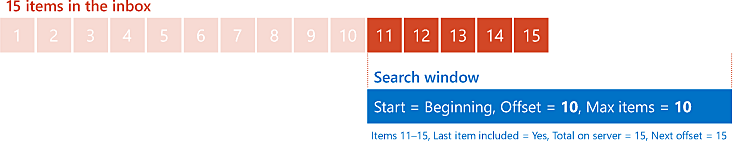
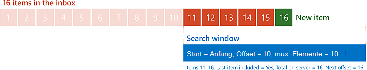
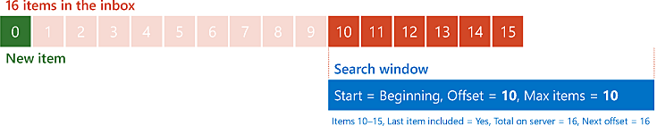

# <a name="perform-paged-searches-by-using-ews-in-exchange"></a>Durchführen seitenweiter Suchen mithilfe von EWS in Exchange

Erfahren Sie, wie Sie Auslagerungs Suchvorgänge in ihrer verwaltete EWS-API-oder EWS-Anwendung durchführen, die auf Exchange abzielt.
  
Paging ist ein Feature in EWS, mit dem Sie die Größe der Ergebnisse einer Suche steuern können. Anstatt das gesamte Resultset in einer EWS-Antwort abzurufen, können Sie kleinere Sätze in mehreren EWS-Antworten abrufen. Halten Sie sich beispielsweise an einen Benutzer mit 10.000 e-Mail-Nachrichten in Ihrem Posteingang. Theoretisch könnten Sie alle 10.000-e-Mails in einer sehr großen Antwort abrufen, aber Sie können dies aus Bandbreiten-oder Leistungsgründen in mehr verwaltbare Abschnitte unterteilen. Paging bietet Ihnen die Tools, die genau dies tun.
  
> [!NOTE]
> Sie können zwar hypothetisch 10.000-Elemente in einer Anforderung abrufen, in Wirklichkeit ist dies jedoch aufgrund der EWS-Drosselung unwahrscheinlich. Weitere Informationen finden Sie unter [EWS-Drosselung in Exchange](ews-throttling-in-exchange.md). 
  
**Tabelle 1. Paging-Parameter im verwaltete EWS-API und EWS**

|**So konfigurieren oder rufen Sie den...**|**Verwenden Sie im verwaltete EWS-API die...**|**Verwenden Sie in EWS die...**|
|:-----|:-----|:-----|
|Maximale Anzahl von Elementen oder Ordnern in einer Antwort  <br/> |Der **PageSize** -Parameter für den [ItemView-Konstruktor](https://msdn.microsoft.com/library/microsoft.exchange.webservices.data.itemview.itemview%28v=exchg.80%29.aspx) oder den [folderview-Konstruktor](https://msdn.microsoft.com/library/microsoft.exchange.webservices.data.folderview.folderview%28v=exchg.80%29.aspx) <br/> Oder:  <br/> Die [PagedView. PageSize](https://msdn.microsoft.com/library/microsoft.exchange.webservices.data.pagedview.pagesize%28v=exchg.80%29.aspx) -Eigenschaft  <br/> |Das **MaxEntriesReturned** -Attribut für das [IndexedPageItemView](https://msdn.microsoft.com/library/6d1b0b04-cc35-4a57-bd7a-824136d14fda%28Office.15%29.aspx) -Element oder das [IndexedPageFolderView](https://msdn.microsoft.com/library/c6dac232-244b-4db0-9a15-5e01b8aa7a7d%28Office.15%29.aspx) -Element  <br/> |
|Ausgangspunkt in der Liste der Elemente oder Ordner  <br/> |Der **offsetBasePoint** -Parameter für den **ItemView** -Konstruktor oder den **folderview** -Konstruktor  <br/> Oder:  <br/> Die [PagedView. OffsetBasePoint](https://msdn.microsoft.com/library/microsoft.exchange.webservices.data.pagedview.offsetbasepoint%28v=exchg.80%29.aspx) -Eigenschaft  <br/> |Das **Basepoint** -Attribut für das **IndexedPageItemView** -Element oder das **IndexedPageFolderView** -Element  <br/> |
|Offset vom Ausgangspunkt  <br/> |Der **Offset** -Parameter für den **ItemView** -Konstruktor oder den **folderview** -Konstruktor  <br/> Oder:  <br/> Die [PagedView. Offset](https://msdn.microsoft.com/library/microsoft.exchange.webservices.data.pagedview.offset%28v=exchg.80%29.aspx) -Eigenschaft  <br/> |Das **Offset** -Attribut für das **IndexedPageItemView** -Element oder das **IndexedPageFolderView** -Element  <br/> |
|Gesamtzahl der Ergebnisse auf dem Server  <br/> |Die [FindItemsResults. Total count](https://msdn.microsoft.com/library/dd635348%28v=exchg.80%29.aspx) -Eigenschaft oder die [FindFoldersResults. Total count](https://msdn.microsoft.com/library/microsoft.exchange.webservices.data.findfoldersresults.totalcount%28v=exchg.80%29.aspx) -Eigenschaft  <br/> |Das **TotalItemsInView** -Attribut für das [RootFolder (FindItemResponseMessage)-](https://msdn.microsoft.com/library/187e009f-efaa-42a8-8962-329a645213ab%28Office.15%29.aspx) Element oder das [RootFolder (FindFolderResponseMessage)-](https://msdn.microsoft.com/library/5089c815-663f-46be-bc59-aed9ee20f94a%28Office.15%29.aspx) Element  <br/> |
|Offset des ersten Elements oder Ordners, der nicht in der aktuellen Antwort enthalten ist  <br/> |Die [FindItemsResults. NextPageOffset](https://msdn.microsoft.com/library/ee693014%28v=exchg.80%29.aspx) -Eigenschaft oder die [FindFoldersResults. NextPageOffset](https://msdn.microsoft.com/library/microsoft.exchange.webservices.data.findfoldersresults.nextpageoffset%28v=exchg.80%29.aspx) -Eigenschaft  <br/> |Das **IndexedPagingOffset** -Attribut für das **RootFolder** -Element  <br/> |
|Indikator, dass die Antwort das letzte Element oder den letzten Ordner in der Liste enthält.  <br/> |Die [FindItemsResults. MoreAvailable](https://msdn.microsoft.com/library/dd635477%28v=exchg.80%29.aspx) -Eigenschaft oder die [FindFoldersResults. MoreAvailable](https://msdn.microsoft.com/library/microsoft.exchange.webservices.data.findfoldersresults.moreavailable%28v=exchg.80%29.aspx) -Eigenschaft  <br/> |Das **IncludesLastItemInRange** -Attribut für das **RootFolder** -Element  <br/> |
   
## <a name="how-paging-works"></a>Funktionsweise von Paging
<a name="bk_HowPagingWorks"> </a>

Um zu verstehen, wie das Paging funktioniert, ist es hilfreich, die Nachrichten in einem Ordner als nebeneinander in einem Feld außerhalb Ihres Hauses nebeneinander liegenden Plakaten zu visualisieren. Einige dieser Plakate können Sie in einem magischen Fenster sehen. Sie haben die Möglichkeit, die Größe des Fensters zu ändern (um mehr oder weniger Billboards gleichzeitig anzuzeigen) und das Fenster zu wechseln (um zu steuern, welche Billboards angezeigt werden). Bei dieser Manipulation des Fensters handelt es sich um Paging. 
  
Wenn Sie Ihre Anforderung an den Exchange-Server senden, geben Sie die Größe des Fensters im Hinblick auf die Anzahl der zurückzugebenden Elemente an. Sie legen die Position des Fensters fest, indem Sie einen Anfangspunkt (entweder den Anfang der Linien oder das Ende der Position) und einen Offset von diesem Anfangspunkt angeben, der in einer Anzahl von Elementen ausgedrückt wird. Der Anfang des Fensters ist die Anzahl der Elemente, die vom Offset vom Ausgangspunkt angegeben werden.
  
Wo Paging wird ein bisschen interessanter ist in der Antwort des Servers, und wie Ihre Anwendung diese Antwort verwenden können, um die nächste Anforderung zu gestalten. Der Server enthält drei Informationen, die Sie verwenden können, um zu bestimmen, wie Sie Ihr "Fenster" für Ihre nächste Anforderung konfigurieren: 
  
- Gibt an, ob die Ergebnisse in der Antwort das letzte Element in der Gesamtergebnismenge auf dem Server enthalten.
    
- Die Gesamtzahl der Elemente in der Ergebnisgruppe auf dem Server.
    
- Was der nächste Offsetwert sein soll, wenn Sie das Fenster auf das nächste Element im Resultset heraufsetzen möchten, das in der aktuellen Antwort nicht enthalten ist.
    
Lassen Sie uns ein einfaches Beispiel betrachten. Stellen Sie sich einen Posteingang mit 15 Nachrichten vor. Ihre Anwendung sendet eine anfängliche Anforderung zum Abrufen von maximal 10 Elementen, beginnend am Anfang der Liste der Nachrichten (sodass der Offset NULL ist). Der Server antwortet mit den ersten 10 Nachrichten und gibt an, dass die Antwort nicht das letzte Element enthält, dass es insgesamt 15 Elemente gibt und dass der nächste Offset 10 sein sollte.
  
**Abbildung 1. Anfordern von 10 Elementen bei Offset 0 vom Anfang einer Liste mit 15 Elementen**


  
Die Anwendung sendet dann die gleiche Anforderung erneut an den Server, wobei die einzige Änderung darin besteht, dass der Offset jetzt 10 ist. Der Server gibt die letzten fünf Elemente zurück und gibt an, dass die Antwort das letzte Element enthält, dass es insgesamt 15 Elemente gibt und dass der nächste Offset 15 sein sollte (obwohl Sie natürlich das Ende erreicht haben, gibt es keinen nächsten Offset.)
  
**Abbildung 2. Anfordern von 10 Elementen bei Offset 10 vom Anfang einer Liste mit 15 Elementen**


  
## <a name="design-considerations-for-paging"></a>Entwurfsüberlegungen für das Paging
<a name="bk_DesignConsiderations"> </a>

Das Beste aus dem Paging in Ihrer Anwendung herauszunehmen, erfordert einige Überlegungen. Wie groß ist beispielsweise die Größe des Fensters? Was tun Sie, wenn sich die Ergebnisse auf dem Server ändern, während Sie Ihr "Fenster" verschieben?
  
### <a name="determine-the-size-of-your-window"></a>Bestimmen der Größe des Fensters

Es gibt keine maximale Anzahl von Einträgen in einer Größe, die alle Anwendungen verwenden sollten. Die Bestimmung der Nummer, die für Ihre Anwendung richtig ist, hängt von verschiedenen Faktoren ab. Es ist jedoch hilfreich, die folgenden Richtlinien im Hinterkopf zu behalten:
  
- Standardmäßig schränkt Exchange die maximale Anzahl von Elementen ein, die in einer einzigen Anforderung an 1000 zurückgegeben werden können.
    
- Wenn Sie die maximale Anzahl von Einträgen auf eine größere Zahl festlegen, müssen weniger Anforderungen zum Abrufen aller Elemente gesendet werden, sodass die Antworten nicht länger gewartet werden müssen.
    
- Wenn Sie die maximale Anzahl von Einträgen auf eine kleinere Zahl festlegen, erhalten Sie schnellere Antwortzeiten, wobei mehr Anforderungen zum Abrufen aller Elemente gesendet werden müssen.
    
### <a name="handling-changes-to-the-result-set"></a>Behandeln von Änderungen an der Ergebnismenge

Im einfachen Beispiel weiter oben in diesem Artikel ist die Anzahl der Elemente im Posteingang des Benutzers konstant geblieben. In Wirklichkeit kann sich die Anzahl der Elemente in einem Posteingang jedoch häufig ändern. Neue Nachrichten können eintreffen, und Elemente können jederzeit gelöscht oder verschoben werden. Wie wirkt sich dies jedoch auf die Auslagerungsdatei aus? Lassen Sie uns das frühere Beispielszenario ändern, um es herauszufinden.
  
Wir beginnen erneut mit den 15 Elementen im Posteingang des Benutzers und senden die gleiche anfängliche Anforderung. Wie zuvor antwortet der Server mit den ersten 10 Nachrichten und gibt an, dass die Antwort nicht das letzte Element enthält, dass insgesamt 15 Elemente vorhanden sind und dass der nächste Offset 10 sein sollte, wie in Abbildung 1 dargestellt.
  
Während Ihre Anwendung diese 10 Elemente verarbeitet, kommt eine neue Nachricht im Posteingang an und wird dem Resultset auf dem Server hinzugefügt. Die Anwendung sendet die gleiche Anforderung erneut an den Server (nur mit dem Offset auf 10). Dieses Mal erhält der Server sechs Elemente zurück und gibt an, dass insgesamt 16 Elemente in der Ergebnisgruppe vorhanden sind.
  
An diesem Punkt Fragen Sie sich möglicherweise, ob dies sogar ein Problem ist. Immerhin haben Sie 16 Elemente zurück über die beiden Antworten, also warum all die Aufregung? Die Antwort hängt davon ab, an welcher Stelle in der Liste das neue Element eingefügt wird. Wenn die Liste so sortiert ist, dass die ältesten Elemente (nach Empfangsdatum/-Uhrzeit) zuerst vorhanden sind, gibt es in diesem Szenario keinen Anlass zur Besorgnis. Das neue Element wird am Ende der Liste eingefügt und in die zweite Antwort aufgenommen.
  
**Abbildung 3. Anfordern von 10 Elementen bei Offset 10 vom Anfang einer Liste mit 16 Elementen, wobei das 16. Element in der Liste neu ist**


  
Wenn die Liste so sortiert ist, dass die neuesten Elemente zuerst sind, handelt es sich um eine andere Geschichte. In diesem Fall wäre das erste Element in der zweiten Anforderung das letzte Element aus der vorherigen Anforderung und die restlichen fünf Elemente aus dem ursprünglichen 15. Um es in Bezug auf unser imaginäres magisches Fenster zu setzen, haben Sie die Position Ihres Fensters um 10 verschoben, aber auch die Plakate wurden um 1 verschoben.
  
**Abbildung 4. Anfordern von 10 Elementen bei Offset 10 vom Anfang einer Liste mit 16 Elementen, wobei das erste Element in der Liste neu ist**


  
Eine Möglichkeit zum Erkennen einer Änderung an den Ergebnissen auf dem Server besteht darin, das Konzept eines Ankerelements zu verwenden. Ein Ankerelement ist ein zusätzliches Element in der Antwort, das nicht zusammen mit den restlichen Ergebnissen verarbeitet wird, sondern zum Vergleichen mit den nächsten Ergebnissen verwendet wird, um zu ermitteln, ob die Elemente selbst verschoben wurden. Wenn die Anwendung eine Fenstergröße von 10 verwendet, legen Sie die maximale Anzahl von Elementen, die auf 11 zurückgegeben werden sollen, in unserem einfachen Beispiel fest. Ihre Anwendung verarbeitet die ersten 10 Elemente in der Antwort wie gewohnt. Für das letzte Element speichern Sie den Bezeichner des Elements als Anker und geben dann die nächste Anforderung mit einem Offset von 10 aus. Wenn sich die Daten nicht geändert haben, sollte das erste Element in der zweiten Antwort eine Element-ID aufweisen, die mit dem Anker übereinstimmt. Wenn die Element-IDs nicht übereinstimmen, wissen Sie, dass die Daten entfernt oder in die Teile der Liste eingefügt wurden, die Sie bereits "ausgelagert" haben.
  
Selbst wenn Sie wissen, dass die Daten geändert wurden, müssen Sie dennoch entscheiden, wie Sie reagieren sollen. Für diese Frage gibt es auch keine One-size-fits-all-Antwort. Ihre Aktionen hängen von der Art der Anwendung und der Wichtigkeit der Erfassung aller Elemente ab. Sie können ihn möglicherweise ganz ignorieren, den Prozess von Anfang oder zurückverfolgen und versuchen zu ermitteln, wo die Änderung vorging.
  
## <a name="example-perform-a-paged-search-by-using-the-ews-managed-api"></a>Beispiel: Durchführen einer ausgelagerten Suche mithilfe der verwaltete EWS-API
<a name="bk_PagedSearchEWSMA"> </a>

Das Paging wird von den folgenden verwaltete EWS-API-Methoden unterstützt:
  
- [ExchangeService.FindFolders](https://msdn.microsoft.com/library/microsoft.exchange.webservices.data.exchangeservice.findfolders%28v=exchg.80%29.aspx)
    
- [ExchangeService.FindItems](https://msdn.microsoft.com/library/microsoft.exchange.webservices.data.exchangeservice.finditems%28v=exchg.80%29.aspx)
    
- [Folder.FindFolders](https://msdn.microsoft.com/library/microsoft.exchange.webservices.data.folder.findfolders%28v=exchg.80%29.aspx)
    
- [Folder.FindFolders](https://msdn.microsoft.com/library/microsoft.exchange.webservices.data.folder.finditems%28v=exchg.80%29.aspx)
    
Wenn Sie die verwaltete EWS-API verwenden, konfiguriert ihre Anwendung das Paging mit der [ItemView](https://msdn.microsoft.com/library/microsoft.exchange.webservices.data.itemview%28v=exchg.80%29.aspx) -oder der [folderview](https://msdn.microsoft.com/library/microsoft.exchange.webservices.data.folderview%28v=exchg.80%29.aspx) -Klasse und empfängt Informationen vom Server zum Paging von der [FindItemsResults](https://msdn.microsoft.com/library/dd635381%28v=exchg.80%29.aspx) -oder der [FindFoldersResults](https://msdn.microsoft.com/library/microsoft.exchange.webservices.data.findfoldersresults%28v=exchg.80%29.aspx) -Klasse. 
  
Im folgenden Beispiel werden alle Elemente in einem Ordner mithilfe einer ausgelagerten Suche abgerufen, die fünf Elemente in jeder Antwort zurückgibt. Außerdem ruft es ein zusätzliches Element ab, das als Anker dient, um Änderungen an den Ergebnissen auf dem Server zu erkennen. 
  
In diesem Beispiel wird davon ausgegangen, dass das **ExchangeService**-Objekt mit gültigen Werten in den [Credentials](https://msdn.microsoft.com/library/microsoft.exchange.webservices.data.exchangeservicebase.credentials%28v=exchg.80%29.aspx)- und [Url](https://msdn.microsoft.com/library/microsoft.exchange.webservices.data.exchangeservice.url%28v=exchg.80%29.aspx)-Eigenschaften initialisiert wurde. 
  
```cs
using Microsoft.Exchange.WebServices.Data;
static void PageSearchItems(ExchangeService service, WellKnownFolderName folder)
{
    int pageSize = 5;
    int offset = 0;
    // Request one more item than your actual pageSize.
    // This will be used to detect a change to the result
    // set while paging.
    ItemView view = new ItemView(pageSize + 1, offset);
    view.PropertySet = new PropertySet(ItemSchema.Subject);
    view.OrderBy.Add(ItemSchema.DateTimeReceived, SortDirection.Descending);
    view.Traversal = ItemTraversal.Shallow;
    bool moreItems = true;
    ItemId anchorId = null;
    while (moreItems)
    {
        try
        {
            FindItemsResults<Item> results = service.FindItems(folder, view);
            moreItems = results.MoreAvailable;
            if (moreItems &amp;&amp; anchorId != null)
            {
                // Check the first result to make sure it matches
                // the last result (anchor) from the previous page.
                // If it doesn't, that means that something was added
                // or deleted since you started the search.
                if (results.Items.First<Item>().Id != anchorId)
                {
                    Console.WriteLine("The collection has changed while paging. Some results may be missed.");
                }
            }
            if (moreItems)
                view.Offset += pageSize;
            anchorId = results.Items.Last<Item>().Id;
            // Because you're including an additional item on the end of your results
            // as an anchor, you don't want to display it.
            // Set the number to loop as the smaller value between
            // the number of items in the collection and the page size.
            int displayCount = results.Items.Count > pageSize ? pageSize : results.Items.Count;
            for (int i = 0; i < displayCount; i++)
            {
                Item item = results.Items[i];
                Console.WriteLine("Subject: {0}", item.Subject);
                Console.WriteLine("Id: {0}\n", item.Id.ToString());
            }
        }
        catch (Exception ex)
        {
            Console.WriteLine("Exception while paging results: {0}", ex.Message);
        }
    }
}
```

## <a name="example-perform-a-paged-search-by-using-ews"></a>Beispiel: Durchführen einer Seiten weisen Suche mithilfe von EWS
<a name="bk_PagedSearchEWS"> </a>

Paging wird von den folgenden EWS-Vorgängen unterstützt:
  
- [FindFolder](https://msdn.microsoft.com/library/7a9855aa-06cc-45ba-ad2a-645c15b7d031%28Office.15%29.aspx)
    
- [FindItem](https://msdn.microsoft.com/library/ebad6aae-16e7-44de-ae63-a95b24539729%28Office.15%29.aspx)
    
Wenn Sie EWS verwenden, konfiguriert ihre Anwendung das Paging mit dem [IndexedPageItemView](https://msdn.microsoft.com/library/6d1b0b04-cc35-4a57-bd7a-824136d14fda%28Office.15%29.aspx) -Element oder dem [IndexedPageFolderView](https://msdn.microsoft.com/library/c6dac232-244b-4db0-9a15-5e01b8aa7a7d%28Office.15%29.aspx) -Element und empfängt Informationen vom Server hinsichtlich der Paginierung vom [RootFolder (FindItemResponseMessage)-](https://msdn.microsoft.com/library/187e009f-efaa-42a8-8962-329a645213ab%28Office.15%29.aspx) Element oder dem [RootFolder (FindFolderResponseMessage)](https://msdn.microsoft.com/library/5089c815-663f-46be-bc59-aed9ee20f94a%28Office.15%29.aspx) -Element. 
  
In diesem Anforderungs Beispiel wird eine **FindItem** -Anforderung für maximal sechs Elemente gesendet, beginnend bei einem Offset von NULL vom Anfang der Liste der Elemente im Posteingang des Benutzers. 
  
```XML
<?xml version="1.0" encoding="utf-8"?>
<soap:Envelope xmlns:xsi="http://www.w3.org/2001/XMLSchema-instance" 
    xmlns:m="https://schemas.microsoft.com/exchange/services/2006/messages" 
    xmlns:t="https://schemas.microsoft.com/exchange/services/2006/types" 
    xmlns:soap="https://schemas.xmlsoap.org/soap/envelope/">
  <soap:Header>
    <t:RequestServerVersion Version="Exchange2007_SP1" />
    <t:TimeZoneContext>
      <t:TimeZoneDefinition Id="Eastern Standard Time" />
    </t:TimeZoneContext>
  </soap:Header>
  <soap:Body>
    <m:FindItem Traversal="Shallow">
      <m:ItemShape>
        <t:BaseShape>IdOnly</t:BaseShape>
        <t:AdditionalProperties>
          <t:FieldURI FieldURI="item:Subject" />
        </t:AdditionalProperties>
      </m:ItemShape>
      <m:IndexedPageItemView MaxEntriesReturned="6" Offset="0" BasePoint="Beginning" />
      <m:ParentFolderIds>
        <t:DistinguishedFolderId Id="inbox" />
      </m:ParentFolderIds>
    </m:FindItem>
  </soap:Body>
</soap:Envelope>
```

Der Server gibt die folgende Antwort zurück, die sechs Elemente enthält. Die Antwort weist außerdem darauf hin, dass es insgesamt acht Elemente in den Ergebnissen auf dem Server gibt und dass das letzte Element in der Ergebnisliste in dieser Antwort nicht vorhanden ist.
  
```XML
<?xml version="1.0" encoding="utf-8"?>
<s:Envelope xmlns:s="https://schemas.xmlsoap.org/soap/envelope/">
  <s:Header>
    <h:ServerVersionInfo MajorVersion="15" MinorVersion="0" MajorBuildNumber="775" MinorBuildNumber="35" Version="V2_4" 
        xmlns:h="https://schemas.microsoft.com/exchange/services/2006/types" 
        xmlns="https://schemas.microsoft.com/exchange/services/2006/types" 
        xmlns:xsd="http://www.w3.org/2001/XMLSchema" 
        xmlns:xsi="http://www.w3.org/2001/XMLSchema-instance" />
  </s:Header>
  <s:Body xmlns:xsi="http://www.w3.org/2001/XMLSchema-instance" xmlns:xsd="http://www.w3.org/2001/XMLSchema">
    <m:FindItemResponse xmlns:m="https://schemas.microsoft.com/exchange/services/2006/messages" 
        xmlns:t="https://schemas.microsoft.com/exchange/services/2006/types">
      <m:ResponseMessages>
        <m:FindItemResponseMessage ResponseClass="Success">
          <m:ResponseCode>NoError</m:ResponseCode>
          <m:RootFolder IndexedPagingOffset="6" TotalItemsInView="8" IncludesLastItemInRange="false">
            <t:Items>
              <t:Message>
                <t:ItemId Id="AAMkAGM2..." ChangeKey="CQAAABYA..." />
                <t:Subject>Query</t:Subject>
              </t:Message>
              <t:Message>
                <t:ItemId Id="AAMkAGM2..." ChangeKey="CQAAABYA..." />
                <t:Subject>Update</t:Subject>
              </t:Message>
              <t:Message>
                <t:ItemId Id="AAMkAGM2..." ChangeKey="CQAAABYA..." />
                <t:Subject>Planning resources</t:Subject>
              </t:Message>
              <t:Message>
                <t:ItemId Id="AAMkAGM2..." ChangeKey="CQAAABYA..." />
                <t:Subject>Timeline</t:Subject>
              </t:Message>
              <t:Message>
                <t:ItemId Id="AAMkAGM2..." ChangeKey="CQAAABYA..." />
                <t:Subject>For your perusal</t:Subject>
              </t:Message>
              <t:Message>
                <t:ItemId Id="AAMkAGM2..." ChangeKey="CQAAABYA..." />
                <t:Subject>meeting notes</t:Subject>
              </t:Message>
            </t:Items>
          </m:RootFolder>
        </m:FindItemResponseMessage>
      </m:ResponseMessages>
    </m:FindItemResponse>
  </s:Body>
</s:Envelope>
```

In diesem Beispiel wird dieselbe Anforderung gesendet, dieses Mal wird jedoch das **Offset** -Attribut in fünf geändert, was darauf hinweist, dass der Server höchstens sechs Elemente zurückgeben soll, beginnend mit Offset 5 vom Anfang an. 
  
```XML
<?xml version="1.0" encoding="utf-8"?>
<soap:Envelope xmlns:xsi="http://www.w3.org/2001/XMLSchema-instance" 
    xmlns:m="https://schemas.microsoft.com/exchange/services/2006/messages" 
    xmlns:t="https://schemas.microsoft.com/exchange/services/2006/types" 
    xmlns:soap="https://schemas.xmlsoap.org/soap/envelope/">
  <soap:Header>
    <t:RequestServerVersion Version="Exchange2007_SP1" />
    <t:TimeZoneContext>
      <t:TimeZoneDefinition Id="Eastern Standard Time" />
    </t:TimeZoneContext>
  </soap:Header>
  <soap:Body>
    <m:FindItem Traversal="Shallow">
      <m:ItemShape>
        <t:BaseShape>IdOnly</t:BaseShape>
        <t:AdditionalProperties>
          <t:FieldURI FieldURI="item:Subject" />
        </t:AdditionalProperties>
      </m:ItemShape>
      <m:IndexedPageItemView MaxEntriesReturned="6" Offset="5" BasePoint="Beginning" />
      <m:ParentFolderIds>
        <t:DistinguishedFolderId Id="inbox" />
      </m:ParentFolderIds>
    </m:FindItem>
  </soap:Body>
</soap:Envelope>
```

Der Server sendet die folgende Antwort, die drei Elemente enthält. Die Antwort weist außerdem darauf hin, dass die Gesamtzahl der Elemente in den Ergebnissen auf dem Server immer noch acht ist und dass das letzte Element in der Ergebnisliste in dieser Antwort enthalten ist.
  
```XML
<?xml version="1.0" encoding="utf-8"?>
<s:Envelope xmlns:s="https://schemas.xmlsoap.org/soap/envelope/">
  <s:Header>
    <h:ServerVersionInfo MajorVersion="15" MinorVersion="0" MajorBuildNumber="775" MinorBuildNumber="35" Version="V2_4" 
        xmlns:h="https://schemas.microsoft.com/exchange/services/2006/types" 
        xmlns="https://schemas.microsoft.com/exchange/services/2006/types" 
        xmlns:xsd="http://www.w3.org/2001/XMLSchema" 
        xmlns:xsi="http://www.w3.org/2001/XMLSchema-instance" />
  </s:Header>
  <s:Body xmlns:xsi="http://www.w3.org/2001/XMLSchema-instance" xmlns:xsd="http://www.w3.org/2001/XMLSchema">
    <m:FindItemResponse xmlns:m="https://schemas.microsoft.com/exchange/services/2006/messages" 
    xmlns:t="https://schemas.microsoft.com/exchange/services/2006/types">
      <m:ResponseMessages>
        <m:FindItemResponseMessage ResponseClass="Success">
          <m:ResponseCode>NoError</m:ResponseCode>
          <m:RootFolder IndexedPagingOffset="8" TotalItemsInView="8" IncludesLastItemInRange="true">
            <t:Items>
              <t:Message>
                <t:ItemId Id="AAMkAGM2..." ChangeKey="CQAAABYA..." />
                <t:Subject>meeting notes</t:Subject>
              </t:Message>
              <t:Message>
                <t:ItemId Id="AAMkAGM2..." ChangeKey="CQAAABYA..." />
                <t:Subject>Meeting notes</t:Subject>
              </t:Message>
              <t:Message>
                <t:ItemId Id="AAMkAGM2..." ChangeKey="CQAAABYA..." />
                <t:Subject>This cat is hilarious!</t:Subject>
              </t:Message>
            </t:Items>
          </m:RootFolder>
        </m:FindItemResponseMessage>
      </m:ResponseMessages>
    </m:FindItemResponse>
  </s:Body>
</s:Envelope>
```

## <a name="see-also"></a>Siehe auch


- [Suche und EWS in Exchange](search-and-ews-in-exchange.md)
    
- [ExchangeService.FindFolders-Methode](https://msdn.microsoft.com/library/microsoft.exchange.webservices.data.exchangeservice.findfolders%28v=exchg.80%29.aspx)
    
- [ExchangeService.FindItems-Methode](https://msdn.microsoft.com/library/microsoft.exchange.webservices.data.exchangeservice.finditems%28v=exchg.80%29.aspx)
    
- [Folder.FindFolders-Methode](https://msdn.microsoft.com/library/microsoft.exchange.webservices.data.folder.findfolders%28v=exchg.80%29.aspx)
    
- [Folder.FindFolders-Methode](https://msdn.microsoft.com/library/microsoft.exchange.webservices.data.folder.finditems%28v=exchg.80%29.aspx)
    
- [FindFolder-Vorgang](https://msdn.microsoft.com/library/7a9855aa-06cc-45ba-ad2a-645c15b7d031%28Office.15%29.aspx)
    
- [FindItem-Vorgang](https://msdn.microsoft.com/library/ebad6aae-16e7-44de-ae63-a95b24539729%28Office.15%29.aspx)
    
- [EWS-Einschränkung in Exchange](ews-throttling-in-exchange.md)
    

