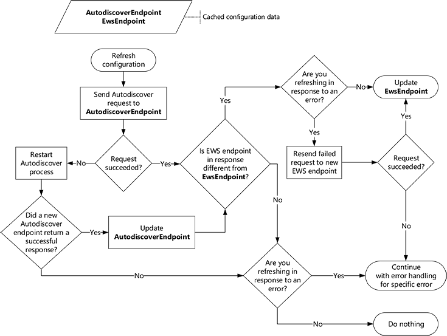

# Aktualisieren von Konfigurationsinformationen mithilfe der AutoErmittlungRefresh configuration information by using Autodiscover

Hier erfahren Sie, wie und wann zum Aktualisieren von Konfigurationsinformationen für Ihre Exchange-Verbindung mit der AutoErmittlung.Learn how and when to refresh configuration information for your Exchange connection by using Autodiscover.
  
Wenn die EWS-Anwendung zum ersten Mal ausgeführt wird, bietet AutoErmittlung eine hervorragende Möglichkeit, die Informationen zu sammeln, die Sie benötigen, um mit Exchange-Postfach des Benutzers zu verbinden.When your EWS application runs for the first time, Autodiscover provides a great way for you to collect the information you need in order to connect to your user's Exchange mailbox. Aber AutoErmittlung nicht nur für die erstmalige Verwendung.But Autodiscover isn't just for first time use. Verwenden der AutoErmittlung in regelmäßigen Abständen können Sie Ihre Anwendung verbunden werden, da es zur Beantwortung von Änderungen in der Exchange-Bereitstellung schützen.Using Autodiscover on a regular basis can help keep your application connected by enabling it to respond to changes in the Exchange deployment.
  
## Cache für die AutoErmittlung Endpunkt und EWS-EinstellungenCache Autodiscover endpoint and EWS settings

Während wir erfordert mithilfe von AutoErmittlung regelmäßig, wie häufig Sie verwenden sollten einige berücksichtigt.While we recommend that you use Autodiscover regularly, how regularly you use it requires some consideration. Im Idealfall können Sie abstimmen, reagieren schnell auf Änderungen in der Umgebung mit zu hohem Datenverkehr Netzwerk unnötig generieren.Ideally you can balance responding quickly to changes in the environment against generating too much unnecessary network traffic. Wenn die Anwendung zum ersten Mal eine erfolgreiche Antwort der AutoErmittlung erhält, sollten Sie die folgende Informationen speichern, so, dass Sie keine AutoErmittlung-Prozesses wiederholen jedes Mal, wenn Sie eine webdienstanforderung senden.When your application gets a successful Autodiscover response for the first time, you should save the following information so that you do not have to repeat the Autodiscover process every time you send an EWS request.
  
**In Tabelle 1. Fordert Informationen zu den Cache für die AutoErmittlung****Table 1. Information to cache for Autodiscover requests**

|**Durch Festlegen auf cache****Setting to cache**|**Gilt für...****Valid for…**|**Details****Details**|
|:-----|:-----|:-----|
|AutoErmittlung-EndpunktAutodiscover endpoint    |Solange es funktioniertAs long as it works    |Wenn Sie den AutoErmittlung-Endpunkt, der eine erfolgreiche Antwort zurückgegeben speichern, müssen Sie keinen wiederholen den Vorgang [generieren Sie eine Liste der AutoErmittlung-Endpunkten](how-to-generate-a-list-of-autodiscover-endpoints.md) und versuchen sie, bis Sie eine erfolgreiche Antwort erhalten.When you save the Autodiscover endpoint that returned a successful response, you do not have to repeat the process of [generating a list of Autodiscover endpoints](how-to-generate-a-list-of-autodiscover-endpoints.md) and trying them until you get a successful response.   **Hinweis**: die EWS Managed API unterstützt nicht das Zwischenspeichern des AutoErmittlung-Endpunkts.**NOTE**: The EWS Managed API does not support caching the Autodiscover endpoint.           |
|EWS-URL und alle anderen Einstellungen aus der Antwort der AutoErmittlung abgerufenEWS URL and any other settings retrieved from the Autodiscover response    |24 Stunden24 hours    |Durch Speichern der EWS-URL und andere verwandte Einstellungen, die Sie nicht bei jeder Anforderung EWS [Senden Sie eine neue autoermittlungsanforderung](how-to-get-user-settings-from-exchange-by-using-autodiscover.md) verfügen oder wenn die Anwendung neu gestartet wird.By saving the EWS URL and other related settings, you do not have to [send a new Autodiscover request](how-to-get-user-settings-from-exchange-by-using-autodiscover.md) for each EWS request or if your application restarts. Selbst wenn EWS-URL für Ihre Benutzer funktioniert, ein Server möglicherweise jedoch verfügbar d. h. mehr optimale.However, even if an EWS URL works for your user, a server might be available that is more optimal.   Beispielsweise kann das Postfach des Benutzers auf einen neuen Mailbox-Server, was zu einem neuen bevorzugten EWS-Endpunkt verschoben haben.For example, the user's mailbox might have moved to a new mailbox server, resulting in a new preferred EWS endpoint. Es wird empfohlen, dass Sie Ihre benutzereinstellungen durch Senden einer neuen autoermittlungsanforderung nach Ablauf von 24 Stunden seit der letzten AutoErmittlung-Anforderung aktualisieren.We recommend that you refresh your user settings by sending a new Autodiscover request after 24 hours have passed since your last Autodiscover request. Dieses Mal kann die erfüllen Ihrer Anwendung angepasst werden.This time can be adjusted to meet the requirements of your application.    |
   
## Aktualisieren von zwischengespeicherten KonfigurationsinformationenRefresh cached configuration information

Nun, da Sie die Daten, die zwischengespeichert werden, betrachten wir wie Sie diesem Cache aktuell beibehalten können.Now that you have the information cached, let's examine how you can keep that cache fresh. Es wird empfohlen, dass Sie die zwischengespeicherte Informationen zu aktualisieren wenn:We recommend that you refresh your cached information when:
  
- Die Informationen Gültigkeitsdauer läuft ab.The information's validity period expires.
    
- Ein [Verbindungsfehler](#bk_ConnectionErrors) auftritt.A [Connection-related errors](#bk_ConnectionErrors) occurs. 
    
Um die zwischengespeicherten Informationen zu aktualisieren, senden Sie eine autoermittlungsanforderung an einen zwischengespeicherten AutoErmittlung-Endpunkt, und gehen Sie folgendermaßen vor:To refresh your cached information, send an Autodiscover request to a cached Autodiscover endpoint, and do the following:
  
- Wenn die Anforderung erfolgreich ist, vergleichen Sie EWS-Endpunkts in der Antwort mit dem Cache EWS-Endpunkt, und gehen Sie folgendermaßen vor:If the request succeeds, compare the EWS endpoint in the response with the cached EWS endpoint, and do the following:
    
  - Wenn sie unterschiedlich sind, verwenden Sie neue EWS-Endpunkts.If they are different, use the new EWS endpoint. Wenn Sie zum Wiederherstellen eines Fehlers aktualisieren sind, wiederholen Sie die fehlerhafte Anforderung mit dem neuen Endpunkt.If you're refreshing to recover from an error, retry the failed request with the new endpoint.
    
  - Wenn sie identisch sind, auch weiterhin mithilfe den ursprünglichen EWS-Endpunkt.If they are the same, continue to use the original EWS endpoint. Wenn Sie zum Wiederherstellen eines Fehlers aktualisieren sind, wird der Fehler entsprechend behandelt.If you're refreshing to recover from an error, handle the error as appropriate.
    
- Wenn die Anforderung ein Fehler auftritt, beginnen Sie der [AutoErmittlung-Prozesses](autodiscover-for-exchange.md) am Anfang.If the request fails, start the [Autodiscover process](autodiscover-for-exchange.md) from the beginning. Nachdem Sie eine erfolgreiche Antwort erhalten, ersetzen Sie den zwischengespeicherten AutoErmittlung-Endpunkt mit der AutoErmittlung-Endpunkt, der erfolgreich abgeschlossen wurde, und fahren Sie mit der neuen EWS-Endpunkt verwenden.After you get a successful response, replace the cached Autodiscover endpoint with the Autodiscover endpoint that succeeded and continue to use the new EWS endpoint. Wenn Sie keine erfolgreiche Antwort erhalten, auch weiterhin mithilfe der ursprünglichen AutoErmittlung-Endpunkt und EWS-Endpunkt.If you do not get a successful response, continue to use the original Autodiscover endpoint and EWS endpoint. Wenn Sie zum Wiederherstellen eines Fehlers aktualisieren sind, wird der Fehler entsprechend behandelt.If you're refreshing to recover from an error, handle the error as appropriate. 
    
Die folgende Abbildung bietet eine visuelle Darstellung dieses Prozesses.The following figure provides a visual representation of this process.
  
**Abbildung 1. Prozess für die Aktualisierung von Konfigurationsinformationen mithilfe der AutoErmittlung****Figure 1. Process for refreshing configuration information by using Autodiscover**

  
### VerbindungsfehlerConnection-related errors

Aktualisiert die zwischengespeicherten Konfigurationsinformationen kann mit einigen Fehlern, jedoch nicht alle helfen.Refreshing your cached configuration information can help with some errors, but not all. 
  
**In Tabelle 2. Fehler behoben, indem Sie den Cache aktualisieren****Table 2. Errors addressed by refreshing your cache**

|**Fehler****Error**|**EWS Managed API-Implementierung****EWS Managed API implementation**|**Anmerkungen****Notes**|
|:-----|:-----|:-----|
|DNS- oder Fehler bei FehlernDNS or network failure errors   Beispiel: Hostname konnte nicht gefunden werden.Example: Host name could not be found.    |[ServiceRemoteExceptionServiceRemoteException](https://msdn.microsoft.com/library/Microsoft.Exchange.WebServices.Data.ServiceRemoteException.aspx)   |Etwaige Fehler, der angibt, dass der Server nicht gefunden oder nicht erreicht werden konnte möglicherweise durch Versuch der AutoErmittlung behoben werden.Any error that indicates that the server could not be found or could not be reached might be resolved by trying Autodiscover.    Ihrer zwischengespeicherte EWS-Endpunkt möglicherweise nicht mehr gültig sein, und möglicherweise AutoErmittlung können Sie auf den neuen Server verweisen.Your cached EWS endpoint might no longer be valid, and Autodiscover might be able to point you to the new server.    |
|HTTP-Status-FehlerHTTP status errors   Beispiel: 503 Dienst nicht verfügbarExample: 503 Service Unavailable    |[ServiceRemoteExceptionServiceRemoteException](https://msdn.microsoft.com/library/Microsoft.Exchange.WebServices.Data.ServiceRemoteException.aspx)   |HTTP-Status Fehler können auftreten, verschiedene Ursachen haben.HTTP status errors can happen for many different reasons.   Jedoch ist es ratsam, versuchen Sie es AutoErmittlung, um festzustellen, ob eine neue EWS-Endpunkts für den Benutzer zur Verfügung steht.However, it's a good idea to try Autodiscover to see if a new EWS endpoint is available for the user.    |
|EWS-FehlercodesEWS error codes    Beispiel: ErrorConnectionFailedExample: ErrorConnectionFailed   |[ResponseCodeTypeResponseCodeType](https://msdn.microsoft.com/library/Microsoft.Exchange.WebServices.Data.ResponseCodeType.aspx)   | Die meisten EWS-Fehlercodes rechtfertigen nicht aktualisieren Ihre Konfigurationsinformationen.Most EWS error codes don't warrant refreshing your configuration information.   Allerdings geben Sie die folgenden insbesondere, dass die Konfigurationsinformationen aktualisiert werden muss:However, the following specifically indicate that the configuration information needs to be updated: - **ErrorConnectionFailed**- **ErrorConnectionFailed**  - **ErrorMailboxMoveInProgress**- **ErrorMailboxMoveInProgress**   |
   
## Siehe auchSee also

- [AutoErmittlung für ExchangeAutodiscover for Exchange](autodiscover-for-exchange.md)  
- [Generieren Sie eine Liste von Endpunkten für die AutoErmittlungGenerate a list of Autodiscover endpoints](how-to-generate-a-list-of-autodiscover-endpoints.md)   
- [Abrufen von benutzereinstellungen aus Exchange mithilfe der AutoErmittlungGet user settings from Exchange by using Autodiscover](how-to-get-user-settings-from-exchange-by-using-autodiscover.md)
    

