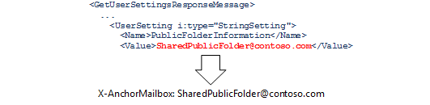
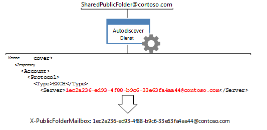

# <a name="route-public-folder-hierarchy-requests"></a><span data-ttu-id="21232-104">Weiterleiten von Hierarchie Anforderungen für Öffentliche Ordner</span><span class="sxs-lookup"><span data-stu-id="21232-104">Route public folder hierarchy requests</span></span>

<span data-ttu-id="21232-105">Alle Anforderungen für Öffentliche Ordner-Informationen, die Kenntnisse der Hierarchie Öffentlicher Ordner erfordern, beispielsweise verschieben, aktualisieren, löschen oder suchen öffentlicher Ordner, müssen an das Standardpostfach für Öffentliche Ordner für den angegebenen Benutzer weitergeleitet werden.</span><span class="sxs-lookup"><span data-stu-id="21232-105">All requests for public folder information that require knowledge of the public folder hierarchy, such as moving, updating, deleting, or finding public folders, need to be routed to the default public folder hierarchy mailbox for the given user.</span></span> <span data-ttu-id="21232-106">Um die Anforderungen an dieses Postfach weiterzuleiten, müssen Sie die Header **x-AnchorMailbox** und **x-PublicFolderMailbox** auf bestimmte vom AutoErmittlungsdienst zurückgegebene Werte festlegen.</span><span class="sxs-lookup"><span data-stu-id="21232-106">To route the requests to that mailbox, you need to set the **X-AnchorMailbox** and **X-PublicFolderMailbox** headers to specific values returned by the Autodiscover service.</span></span> 
  
<span data-ttu-id="21232-107">**Übersicht über öffentliche Ordner**</span><span class="sxs-lookup"><span data-stu-id="21232-107">**Overview of public folders**</span></span>

|<span data-ttu-id="21232-108">Kopfzeile</span><span class="sxs-lookup"><span data-stu-id="21232-108">Header</span></span>|<span data-ttu-id="21232-109">Was benötige ich?</span><span class="sxs-lookup"><span data-stu-id="21232-109">What do I need?</span></span>|<span data-ttu-id="21232-110">Wie erhalte ich diese?</span><span class="sxs-lookup"><span data-stu-id="21232-110">How do I get it?</span></span>|
|:-----|:-----|:-----|
|<span data-ttu-id="21232-111">**X-AnchorMailbox**</span><span class="sxs-lookup"><span data-stu-id="21232-111">**X-AnchorMailbox**</span></span> <br/> |<span data-ttu-id="21232-112">Der [PublicFolderInformation](https://msdn.microsoft.com/library/dn751006%28v=exchg.150%29.aspx) -Wert aus einer [GetUserSettings](https://msdn.microsoft.com/library/office/dd877096%28v=exchg.150%29.aspx) -SOAP-Antwort, die zum Wert des **X-AnchorMailbox-** Headers wird.</span><span class="sxs-lookup"><span data-stu-id="21232-112">The [PublicFolderInformation](https://msdn.microsoft.com/library/dn751006%28v=exchg.150%29.aspx) value from a [GetUserSettings](https://msdn.microsoft.com/library/office/dd877096%28v=exchg.150%29.aspx) Autodiscover SOAP response, which becomes the value of the **X-AnchorMailbox** header.</span></span><br/><br/> <span data-ttu-id="21232-113"></span><span class="sxs-lookup"><span data-stu-id="21232-113"></span></span>| <span data-ttu-id="21232-114">1. senden Sie eine **GetUserSetting** -Anforderung mit der SMTP-Adresse für das Postfach des Benutzers.</span><span class="sxs-lookup"><span data-stu-id="21232-114">1. Send a **GetUserSetting** request with the SMTP address for the user's mailbox.</span></span><br/><br/><span data-ttu-id="21232-115">2. Zwischenspeichern des Werts des **PublicFolderInformation** -Elements, das vom AutoErmittlungsdienst zurückgegeben wird.</span><span class="sxs-lookup"><span data-stu-id="21232-115">2. Cache the value of the **PublicFolderInformation** element that the Autodiscover service returns.</span></span> <span data-ttu-id="21232-116">Dies kann ein zwischengespeicherter von einem vorhandenen Auto Ermittlungs Aufruf in Ihrem Code sein oder ein neuer [verwaltete EWS-API GetUserSettings-Aufruf](#bk_getpfinfoewsma) oder eine [GetUserSettings-SOAP-Anforderung](#bk_getpfinfoews).</span><span class="sxs-lookup"><span data-stu-id="21232-116">This can be a cached from an existing Autodiscover call in your code, or a new [EWS Managed API GetUserSettings call](#bk_getpfinfoewsma) or a [GetUserSettings SOAP request](#bk_getpfinfoews).</span></span>  <br/><br/><span data-ttu-id="21232-117">3. verwenden Sie das **PublicFolderInformation** -Element, um den Wert der **X-AnchorMailbox-** Kopfzeile aufzufüllen.</span><span class="sxs-lookup"><span data-stu-id="21232-117">3. Use the **PublicFolderInformation** element to populate the value of the **X-AnchorMailbox** header.</span></span> <span data-ttu-id="21232-118">Der Wert des **PublicFolderInformation** -Elements ist eine SMTP-Adresse.</span><span class="sxs-lookup"><span data-stu-id="21232-118">The value of the **PublicFolderInformation** element is an SMTP address.</span></span>  <br/> |
|<span data-ttu-id="21232-119">**X-PublicFolderMailbox**</span><span class="sxs-lookup"><span data-stu-id="21232-119">**X-PublicFolderMailbox**</span></span> <br/> |<span data-ttu-id="21232-120">Der [Server](https://msdn.microsoft.com/library/bb204084%28v=exchg.150%29.aspx) Wert aus einer [POX-Auto Ermittlungs Antwort](https://msdn.microsoft.com/library/bb204082%28v=exchg.150%29.aspx), die zum Wert des **X-PublicFolderMailbox-** Headers wird.</span><span class="sxs-lookup"><span data-stu-id="21232-120">The [Server](https://msdn.microsoft.com/library/bb204084%28v=exchg.150%29.aspx) value from a [POX Autodiscover response](https://msdn.microsoft.com/library/bb204082%28v=exchg.150%29.aspx), which becomes the value of the **X-PublicFolderMailbox** header.</span></span><br/><br/> <span data-ttu-id="21232-121"></span><span class="sxs-lookup"><span data-stu-id="21232-121"></span></span>|<span data-ttu-id="21232-122">1. [rufen Sie den POX-Auto Ermittlungs](#bk_makeautodrequest) Dienst unter Verwendung der **X-AnchorMailbox** -e-Mail-Adresse auf.</span><span class="sxs-lookup"><span data-stu-id="21232-122">1. [Call the POX Autodiscover](#bk_makeautodrequest) service using the **X-AnchorMailbox** email address.</span></span>  <br/><br/><span data-ttu-id="21232-123">2. verwenden Sie das vom AutoErmittlungsdienst zurückgegebene **Server** Element, um den Wert des **X-PublicFolderMailbox-** Headers aufzufüllen.</span><span class="sxs-lookup"><span data-stu-id="21232-123">2. Use the **Server** element returned by the Autodiscover service to populate the value of the **X-PublicFolderMailbox** header.</span></span> <span data-ttu-id="21232-124">Der Wert von **X-PublicFolderMailbox** ist eine SMTP-Adresse, bei der es sich bei dem Benutzernamen um eine GUID handelt.</span><span class="sxs-lookup"><span data-stu-id="21232-124">The value of the **X-PublicFolderMailbox** is an SMTP address where the username is a GUID.</span></span>  <br/> |

<br/>

<span data-ttu-id="21232-125">Wenn Sie die kopfzeilenwerte bestimmt haben, schließen Sie diese ein, [Wenn Sie Hierarchie Anforderungen für Öffentliche Ordner vornehmen](#bk_setheadervalues).</span><span class="sxs-lookup"><span data-stu-id="21232-125">After you have determined the header values, include them [when you make public folder hierarchy requests](#bk_setheadervalues).</span></span>
  
<span data-ttu-id="21232-126">Die Schritte in diesem Artikel gelten speziell für Hierarchie Anforderungen für Öffentliche Ordner.</span><span class="sxs-lookup"><span data-stu-id="21232-126">The steps in this article are specific to public folder hierarchy requests.</span></span> <span data-ttu-id="21232-127">Informationen zum ermitteln, ob es sich bei Ihrer Anforderung um eine Hierarchie Öffentlicher Ordner oder eine Inhaltsanforderung handelt, finden Sie unter [Routing Public Folder Requests](public-folder-access-with-ews-in-exchange.md#bk_routing).</span><span class="sxs-lookup"><span data-stu-id="21232-127">To determine whether your request is a public folder hierarchy or content request, see [Routing public folder requests](public-folder-access-with-ews-in-exchange.md#bk_routing).</span></span>
  
## <a name="determine-the-value-of-the-x-anchormailbox-header-by-using-the-ews-managed-api"></a><span data-ttu-id="21232-128">Bestimmen Sie den Wert des X-AnchorMailbox-Headers mithilfe der verwaltete EWS-API</span><span class="sxs-lookup"><span data-stu-id="21232-128">Determine the value of the X-AnchorMailbox header by using the EWS Managed API</span></span>
<span data-ttu-id="21232-129"><a name="bk_getpfinfoewsma"> </a></span><span class="sxs-lookup"><span data-stu-id="21232-129"><a name="bk_getpfinfoewsma"> </a></span></span>

<span data-ttu-id="21232-130">Wenn Sie den [PublicFolderInformation (POX)](https://msdn.microsoft.com/library/a221aa9e-b4ac-4ec5-aa42-7e2a69e8eaa6%28Office.15%29.aspx) -Wert mithilfe der verwaltete EWS-API abrufen möchten, können Sie entweder den Wert des **PublicFolderInformation** -Elements Zwischenspeichern, das ein vorhandener Aufruf des AutoErmittlungsdiensts zurückgibt, oder einen neuen Anruf tätigen.</span><span class="sxs-lookup"><span data-stu-id="21232-130">To retrieve the [PublicFolderInformation (POX)](https://msdn.microsoft.com/library/a221aa9e-b4ac-4ec5-aa42-7e2a69e8eaa6%28Office.15%29.aspx) value by using the EWS Managed API, you can either cache the value of the **PublicFolderInformation** element that an existing call to the Autodiscover service returns, or make a new call.</span></span> 
  
<span data-ttu-id="21232-131">Wenn Sie einen neuen Anruf tätigen, können Sie [Benutzereinstellungen abrufen](how-to-get-user-settings-from-exchange-by-using-autodiscover.md#bk_Managed), indem Sie mithilfe des verwaltete EWS-API[Benutzereinstellungen abrufen, indem Sie den Code verwaltete EWS-API](how-to-get-user-settings-from-exchange-by-using-autodiscover.md#bk_Managed) verwenden, und dann die **GetUserSettings** -Beispielmethode mit dem folgenden Code aufrufen, der nur den Wert des **PublicFolderInformation** -Elements abruft.</span><span class="sxs-lookup"><span data-stu-id="21232-131">If you're making a new call, you can [Get user settings by using the EWS Managed API](how-to-get-user-settings-from-exchange-by-using-autodiscover.md#bk_Managed)[Get user settings by using the EWS Managed API](how-to-get-user-settings-from-exchange-by-using-autodiscover.md#bk_Managed) to your code, and then call the **GetUserSettings** sample method by using the following code, which retrieves only the value of the **PublicFolderInformation** element.</span></span> <span data-ttu-id="21232-132">Schließen Sie die SMTP-Adresse des Postfachbenutzers als Eingabeparameter ein.</span><span class="sxs-lookup"><span data-stu-id="21232-132">Include the SMTP address of the mailbox user as an input parameter.</span></span> 
  
```cs
GetUserSettingsResponse userResponse = GetUserSettings(adservice, "sonyaf@contoso.com", 3, UserSettingName.PublicFolderInformation);
Console.WriteLine("X-AnchorMailbox value for public folder hierarchy requests: {0}", userResponse.Settings[UserSettingName.PublicFolderInformation]);
```

<span data-ttu-id="21232-133">Nach dem Ausführen des Codes werden die folgenden Informationen in der Konsole angezeigt:</span><span class="sxs-lookup"><span data-stu-id="21232-133">After running the code, the following information is displayed on the console:</span></span>
  
`X-AnchorMailbox for public folder hierarchy requests: SharedPublicFolder@contoso.com`

<span data-ttu-id="21232-134">Nachdem Sie nun den **PublicFolderInformation** -Wert haben, fügen Sie ihn als Wert für die X-AnchorMailbox-Kopfzeile in allen Hierarchie Anforderungen für Öffentliche Ordner ein.</span><span class="sxs-lookup"><span data-stu-id="21232-134">Now that you have the **PublicFolderInformation** value, include it as the value for the X-AnchorMailbox header in all public folder hierarchy requests.</span></span> 
  
`X-AnchorMailbox: SharedPublicFolder@contoso.com`

## <a name="determine-the-value-of-the-x-anchormailbox-header-using-soap"></a><span data-ttu-id="21232-135">Ermitteln des Werts des X-AnchorMailbox-Headers mit SOAP</span><span class="sxs-lookup"><span data-stu-id="21232-135">Determine the value of the X-AnchorMailbox header using SOAP</span></span>
<span data-ttu-id="21232-136"><a name="bk_getpfinfoews"> </a></span><span class="sxs-lookup"><span data-stu-id="21232-136"><a name="bk_getpfinfoews"> </a></span></span>

<span data-ttu-id="21232-137">Im folgenden Codebeispiel wird veranschaulicht, wie der **PublicFolderInformation** -Wert mithilfe des [GetUserSettings](https://msdn.microsoft.com/library/dd877096%28v=exchg.150%29.aspx) -SOAP-Vorgangs abgerufen wird.</span><span class="sxs-lookup"><span data-stu-id="21232-137">The following code example shows how to retrieve the **PublicFolderInformation** value by using the [GetUserSettings](https://msdn.microsoft.com/library/dd877096%28v=exchg.150%29.aspx) SOAP operation.</span></span> <span data-ttu-id="21232-138">Der Postfachbenutzer wird im [Post Fach](https://msdn.microsoft.com/library/dd877076%28v=exchg.150%29.aspx) Element angegeben, und das [RequestedSettings](https://msdn.microsoft.com/library/office/dd877107%28v=exchg.150%29.aspx) -Element schränkt die Antwort auf den [PublicFolderInformation](https://msdn.microsoft.com/library/dn751006%28v=exchg.150%29.aspx) -Wert ein.</span><span class="sxs-lookup"><span data-stu-id="21232-138">The mailbox user is specified in the [Mailbox](https://msdn.microsoft.com/library/dd877076%28v=exchg.150%29.aspx) element, and the [RequestedSettings](https://msdn.microsoft.com/library/office/dd877107%28v=exchg.150%29.aspx) element limits the response to the [PublicFolderInformation](https://msdn.microsoft.com/library/dn751006%28v=exchg.150%29.aspx) value.</span></span> 
  
```XML
<?xml version="1.0" encoding="utf-8"?>
<soap:Envelope xmlns:a="https://schemas.microsoft.com/exchange/2010/Autodiscover"
               xmlns:wsa="http://www.w3.org/2005/08/addressing"
               xmlns:xsi="http://www.w3.org/2001/XMLSchema-instance"
               xmlns:soap="https://schemas.xmlsoap.org/soap/envelope/">
  <soap:Header>
    <a:RequestedServerVersion>Exchange2007_SP1</a:RequestedServerVersion>
    <wsa:Action>https://schemas.microsoft.com/exchange/2010/Autodiscover/Autodiscover/GetUserSettings</wsa:Action>
    <wsa:To>https://pod51042.outlook.com/autodiscover/autodiscover.svc</wsa:To>
  </soap:Header>
  <soap:Body>
    <a:GetUserSettingsRequestMessage xmlns:a="https://schemas.microsoft.com/exchange/2010/Autodiscover">
      <a:Request>
        <a:Users>
          <a:User>
            <a:Mailbox>sonyaf@contoso.com</a:Mailbox>
          </a:User>
        </a:Users>
        <a:RequestedSettings>
          <a:Setting>PublicFolderInformation</a:Setting>
        </a:RequestedSettings>
      </a:Request>
    </a:GetUserSettingsRequestMessage>
  </soap:Body>
</soap:Envelope>
```

<span data-ttu-id="21232-139">Die Antwort enthält den **PublicFolderInformation** -Wert.</span><span class="sxs-lookup"><span data-stu-id="21232-139">The response includes the **PublicFolderInformation** value.</span></span> 
  
```XML
<UserSetting i:type="StringSetting">
    <Name>PublicFolderInformation</Name>
    <Value>SharedPublicFolder@contoso.com</Value>
</UserSetting>
```

<span data-ttu-id="21232-140">Nachdem Sie nun den **PublicFolderInformation** -Wert haben, fügen Sie ihn als Wert für die X-AnchorMailbox-Kopfzeile in allen Hierarchie Anforderungen für Öffentliche Ordner ein.</span><span class="sxs-lookup"><span data-stu-id="21232-140">Now that you have the **PublicFolderInformation** value, include it as the value for the X-AnchorMailbox header in all public folder hierarchy requests.</span></span> 
  
`X-AnchorMailbox: SharedPublicFolder@contoso.com`

## <a name="make-an-autodiscover-request-to-determine-the-x-publicfolderinformation-value"></a><span data-ttu-id="21232-141">Erstellen einer AutoErmittlungs-Anforderung zum Ermitteln des X-PublicFolderInformation-Werts</span><span class="sxs-lookup"><span data-stu-id="21232-141">Make an Autodiscover request to determine the X-PublicFolderInformation value</span></span>
<span data-ttu-id="21232-142"><a name="bk_makeautodrequest"> </a></span><span class="sxs-lookup"><span data-stu-id="21232-142"><a name="bk_makeautodrequest"> </a></span></span>

<span data-ttu-id="21232-143">Erstellen Sie eine Auto Ermittlungsanforderung mithilfe der SMTP-Adresse **PublicFolderInformation** , die nun als **X-AnchorMailbox-** Wert verwendet wird.</span><span class="sxs-lookup"><span data-stu-id="21232-143">Make an Autodiscover request by using the **PublicFolderInformation** SMTP address, which is now being used as the **X-AnchorMailbox** value.</span></span> <span data-ttu-id="21232-144">Verwenden Sie die [Exchange 2013: Abrufen von Benutzereinstellungen mit der Auto](https://code.msdn.microsoft.com/exchange/Exchange-2013-Get-user-7e22c86e) Ermittlungs Code-Beispiel, um den AutoErmittlungsdienst aufzurufen, da er den Auto Ermittlungsprozess rationalisiert.</span><span class="sxs-lookup"><span data-stu-id="21232-144">Use the [Exchange 2013: Get user settings with Autodiscover](https://code.msdn.microsoft.com/exchange/Exchange-2013-Get-user-7e22c86e) code sample to call the Autodiscover service because it streamlines the Autodiscover process for you.</span></span> <span data-ttu-id="21232-145">In diesem Codebeispiel werden die in der folgenden Tabelle aufgeführten Befehlszeilenargumente verwendet, um den POX-AutoErmittlungsdienst für die SMTP-Adresse **PublicFolderInformation** aufzurufen.</span><span class="sxs-lookup"><span data-stu-id="21232-145">This code sample uses the command line arguments listed in the following table to call the POX Autodiscover service on the **PublicFolderInformation** SMTP address.</span></span> 
  
|<span data-ttu-id="21232-146">**Befehlszeilenargument**</span><span class="sxs-lookup"><span data-stu-id="21232-146">**Command-line argument**</span></span>|<span data-ttu-id="21232-147">**Beschreibung**</span><span class="sxs-lookup"><span data-stu-id="21232-147">**Description**</span></span>|
|:-----|:-----|
|<span data-ttu-id="21232-148">emailAddress</span><span class="sxs-lookup"><span data-stu-id="21232-148">emailAddress</span></span>  <br/> |<span data-ttu-id="21232-149">Die **PublicFolderInformation** -SMTP-Adresse.</span><span class="sxs-lookup"><span data-stu-id="21232-149">The **PublicFolderInformation** SMTP address.</span></span>  <br/> |
|<span data-ttu-id="21232-150">-skipSOAP</span><span class="sxs-lookup"><span data-stu-id="21232-150">-skipSOAP</span></span>  <br/> | <span data-ttu-id="21232-151">Verwenden Sie POX-Auto Ermittlungsanforderungen für dieses Szenario.</span><span class="sxs-lookup"><span data-stu-id="21232-151">Use POX Autodiscover requests for this scenario.</span></span>  <br/> |
|<span data-ttu-id="21232-152">-auth authEmailAddress</span><span class="sxs-lookup"><span data-stu-id="21232-152">-auth authEmailAddress</span></span>  <br/> |<span data-ttu-id="21232-153">Die e-Mail-Adresse des Postfachbenutzers, die für die Authentifizierung verwendet wird.</span><span class="sxs-lookup"><span data-stu-id="21232-153">The mailbox user's email address, which is used for authentication.</span></span> <span data-ttu-id="21232-154">Sie werden aufgefordert, das Kennwort des Postfachbenutzers einzugeben, wenn Sie das Beispiel ausführen.</span><span class="sxs-lookup"><span data-stu-id="21232-154">You will be prompted to enter the mailbox user's password when you run the sample.</span></span>  <br/> |
   
<span data-ttu-id="21232-155">Wenn SharedPublicFolder@contoso.com beispielsweise die SMTP-Adresse des **PublicFolderInformation** -Elements ist und sonyaf@contoso.com der Postfachbenutzer ist, sollten die Befehlszeilenargumente wie folgt aussehen.</span><span class="sxs-lookup"><span data-stu-id="21232-155">For example, when SharedPublicFolder@contoso.com is the SMTP address of the **PublicFolderInformation** element, and sonyaf@contoso.com is the mailbox user, the command-line arguments should look like this.</span></span> 
  
`SharedPublicFolder@contoso.com -skipSOAP -auth sonyaf@contoso.com`

<span data-ttu-id="21232-156">Wenn Sie das **Exchange 2013: Abrufen von Benutzereinstellungen mit dem Auto Ermittlungs** Beispiel ausführen, sollte die letzte Antwort auf die AutoErmittlung erfolgreich sein und alle Benutzereinstellungen einschließen, die der Postfach-GUID zugeordnet sind.</span><span class="sxs-lookup"><span data-stu-id="21232-156">When you run the **Exchange 2013: Get user settings with Autodiscover** sample, the last Autodiscover response should be successful and include all the user settings associated with the mailbox GUID.</span></span> <span data-ttu-id="21232-157">Der [Server](https://msdn.microsoft.com/library/bb204084%28v=exchg.150%29.aspx) Wert, der dem [Protokolltyp](https://msdn.microsoft.com/library/bb204278%28v=exchg.150%29.aspx)-Element des[Typs Typ](https://msdn.microsoft.com/library/office/bb204223%28v=exchg.150%29.aspx) zugeordnet ist, ist der **X-PublicFolderInformation-** Headerwert.</span><span class="sxs-lookup"><span data-stu-id="21232-157">The [Server](https://msdn.microsoft.com/library/bb204084%28v=exchg.150%29.aspx) value associated with the EXCH [Protocol](https://msdn.microsoft.com/library/bb204278%28v=exchg.150%29.aspx)[Type](https://msdn.microsoft.com/library/office/bb204223%28v=exchg.150%29.aspx) element is the **X-PublicFolderInformation** header value.</span></span> 
  
```XML
<Autodiscover xmlns="https://schemas.microsoft.com/exchange/autodiscover/responseschema/2006">
  <Response xmlns="https://schemas.microsoft.com/exchange/autodiscover/outlook/responseschema/2006a">
    …
    <Account>
      <AccountType>email</AccountType>
      <Action>settings</Action>
      <Protocol>
        <Type>EXCH</Type>
        <Server>1ec2a236-ed93-4f88-b9c6-33e63fa4aa44@contoso.com</Server>

```

<span data-ttu-id="21232-158">Alternativ können Sie, wenn Sie die **Exchange 2013: Abrufen von Benutzereinstellungen mit Auto Ermittlungs** Beispiel verwenden möchten, den **Server** Wert abrufen, indem Sie [eine Liste der Auto Ermittlungs Endpunkte generieren](how-to-generate-a-list-of-autodiscover-endpoints.md)und dann die folgende POX-Auto Ermittlungsanforderung an jede URL senden, bis Sie eine erfolgreiche Antwort erhalten.</span><span class="sxs-lookup"><span data-stu-id="21232-158">Alternatively, if you do not want to use the **Exchange 2013: Get user settings with Autodiscover** sample, you can get the **Server** value by [generating a list of Autodiscover endpoints](how-to-generate-a-list-of-autodiscover-endpoints.md), and then sending the following POX Autodiscover request to each URL until you receive a successful response.</span></span> <span data-ttu-id="21232-159">SharedPublicFolder@contoso.com ist der Wert der **X-PublicFolderMailbox-** Kopfzeile.</span><span class="sxs-lookup"><span data-stu-id="21232-159">SharedPublicFolder@contoso.com is the value of the **X-PublicFolderMailbox** header.</span></span> 
  
```XML
<?xml version="1.0" encoding="utf-8"?>
<Autodiscover xmlns="https://schemas.microsoft.com/exchange/autodiscover/outlook/requestschema/2006">
  <Request>
    <EMailAddress>SharedPublicFolder@contoso.com</EMailAddress>
    <AcceptableResponseSchema>https://schemas.microsoft.com/exchange/autodiscover/outlook/responseschema/2006a</AcceptableResponseSchema>
  </Request>
</Autodiscover>
```

<span data-ttu-id="21232-160">Weitere Informationen zum Auto Ermittlungsprozess finden Sie unter [AutoErmittlung für Exchange](autodiscover-for-exchange.md), [Generieren einer Liste mit Auto Ermittlungs Endpunkten](how-to-generate-a-list-of-autodiscover-endpoints.md)und [Abrufen von Benutzereinstellungen von Exchange mithilfe der AutoErmittlung](how-to-get-user-settings-from-exchange-by-using-autodiscover.md).</span><span class="sxs-lookup"><span data-stu-id="21232-160">For more information about the Autodiscover process, see [Autodiscover for Exchange](autodiscover-for-exchange.md), [Generate a list of Autodiscover endpoints](how-to-generate-a-list-of-autodiscover-endpoints.md), and [Get user settings from Exchange by using Autodiscover](how-to-get-user-settings-from-exchange-by-using-autodiscover.md).</span></span>
  
## <a name="set-the-values-of-the-x-anchormailbox-and-x-publicfoldermailbox-headers"></a><span data-ttu-id="21232-161">Festlegen der Werte der x-AnchorMailbox-und x-PublicFolderMailbox-Kopfzeilen</span><span class="sxs-lookup"><span data-stu-id="21232-161">Set the values of the X-AnchorMailbox and X-PublicFolderMailbox headers</span></span>
<span data-ttu-id="21232-162"><a name="bk_setheadervalues"> </a></span><span class="sxs-lookup"><span data-stu-id="21232-162"><a name="bk_setheadervalues"> </a></span></span>

<span data-ttu-id="21232-163">Verwenden Sie den Wert der **PublicFolderInformation** -SMTP-Adresse, die in [bestimmen des Werts der x-AnchorMailbox-Kopfzeile mithilfe des verwaltete EWS-APIs verwendet wird](#bk_getpfinfoewsma) , oder [bestimmen Sie den Wert des x-AnchorMailbox-Headers mit SOAP](#bk_getpfinfoews) und den in [make a AutoErmittlung](#bk_makeautodrequest)Acquired erworbenen **Wert der** x- **AnchorMailbox** -und **x-PublicFolderMailbox-** Header in der Inhaltsanforderung für Öffentliche Ordner.</span><span class="sxs-lookup"><span data-stu-id="21232-163">Using the value of the **PublicFolderInformation** SMTP address acquired in [Determine the value of the X-AnchorMailbox header by using the EWS Managed API](#bk_getpfinfoewsma) or [Determine the value of the X-AnchorMailbox header using SOAP](#bk_getpfinfoews) and the **Server** value acquired in [Make an Autodiscover request to determine the X-PublicFolderInformation value](#bk_makeautodrequest), set the values of **X-AnchorMailbox** and **X-PublicFolderMailbox** headers in your public folder content request.</span></span> 
  
<span data-ttu-id="21232-164">Wenn Sie beispielsweise eine **PublicFolderInformation** -SMTP-Adresse von SharedPublicFolder@contoso.com und einen **Server** Wert von 1ec2a236-ed93-4f88-b9c6-33e63fa4aa44@contoso.com verwenden, schließen Sie die folgenden Kopfzeilen ein, wenn Sie die folgenden Methoden oder Vorgänge aufrufen.</span><span class="sxs-lookup"><span data-stu-id="21232-164">For example, given a **PublicFolderInformation** SMTP address of SharedPublicFolder@contoso.com and a **Server** value of 1ec2a236-ed93-4f88-b9c6-33e63fa4aa44@contoso.com, include the following headers when making calls to the following methods or operations.</span></span> 
  
`X-AnchorMailbox: SharedPublicFolder@contoso.com` <br/>
`X-PublicFolderMailbox: 1ec2a236-ed93-4f88-b9c6-33e63fa4aa44@contoso.com`

<span data-ttu-id="21232-165">**Öffentliche Ordner-Aufrufe, die die Header x-AnchorMailbox und x-PublicFolder erfordern**</span><span class="sxs-lookup"><span data-stu-id="21232-165">**Public folder calls that require the X-AnchorMailbox and X-PublicFolder headers**</span></span>

|<span data-ttu-id="21232-166">**EWS Managed API-Methoden**</span><span class="sxs-lookup"><span data-stu-id="21232-166">**EWS Managed API methods**</span></span>|<span data-ttu-id="21232-167">**EWS-Operationen**</span><span class="sxs-lookup"><span data-stu-id="21232-167">**EWS operations**</span></span>|
|:-----|:-----|
|[<span data-ttu-id="21232-168">Folder.FindFolders</span><span class="sxs-lookup"><span data-stu-id="21232-168">Folder.FindFolders</span></span>](https://msdn.microsoft.com/library/microsoft.exchange.webservices.data.folder.findfolders%28v=exchg.80%29.aspx) <br/> [<span data-ttu-id="21232-169">Folder.Delete</span><span class="sxs-lookup"><span data-stu-id="21232-169">Folder.Delete</span></span>](https://msdn.microsoft.com/library/microsoft.exchange.webservices.data.folder.delete%28v=exchg.80%29.aspx) <br/> [<span data-ttu-id="21232-170">Folder.Update</span><span class="sxs-lookup"><span data-stu-id="21232-170">Folder.Update</span></span>](https://msdn.microsoft.com/library/microsoft.exchange.webservices.data.folder.update%28v=exchg.80%29.aspx) <br/> [<span data-ttu-id="21232-171">Folder.Move</span><span class="sxs-lookup"><span data-stu-id="21232-171">Folder.Move</span></span>](https://msdn.microsoft.com/library/microsoft.exchange.webservices.data.folder.move%28v=exchg.80%29.aspx) <br/> |[<span data-ttu-id="21232-172">CreateFolder</span><span class="sxs-lookup"><span data-stu-id="21232-172">CreateFolder</span></span>](https://msdn.microsoft.com/library/6f6c334c-b190-4e55-8f0a-38f2a018d1b3%28Office.15%29.aspx) <br/> [<span data-ttu-id="21232-173">FindFolder</span><span class="sxs-lookup"><span data-stu-id="21232-173">FindFolder</span></span>](https://msdn.microsoft.com/library/7a9855aa-06cc-45ba-ad2a-645c15b7d031%28Office.15%29.aspx) <br/> [<span data-ttu-id="21232-174">DeleteFolder</span><span class="sxs-lookup"><span data-stu-id="21232-174">DeleteFolder</span></span>](https://msdn.microsoft.com/library/b0f92682-4895-4bcf-a4a1-e4c2e8403979%28Office.15%29.aspx) <br/> [<span data-ttu-id="21232-175">UpdateFolder</span><span class="sxs-lookup"><span data-stu-id="21232-175">UpdateFolder</span></span>](https://msdn.microsoft.com/library/3494c996-b834-4813-b1ca-d99642d8b4e7%28Office.15%29.aspx) <br/> [<span data-ttu-id="21232-176">MoveFolder</span><span class="sxs-lookup"><span data-stu-id="21232-176">MoveFolder</span></span>](https://msdn.microsoft.com/library/c7233966-6c87-4a14-8156-b1610760176d%28Office.15%29.aspx) <br/> |
   
<span data-ttu-id="21232-177">Verwenden Sie die [httpheaders-. Add](https://msdn.microsoft.com/library/system.net.http.headers.httpheaders.add%28v=vs.118%29.aspx) -Methode, um diese Header mithilfe der verwaltete EWS-API hinzuzufügen.</span><span class="sxs-lookup"><span data-stu-id="21232-177">To add these headers by using the EWS Managed API, use the [HttpHeaders.Add](https://msdn.microsoft.com/library/system.net.http.headers.httpheaders.add%28v=vs.118%29.aspx) method.</span></span> 
  
```cs
service.HttpHeaders.Add("X-AnchorMailbox", "SharedPublicFolder@contoso.com");service.HttpHeaders.Add("X-PublicFolderMailbox", "1ec2a236-ed93-4f88-b9c6-33e63fa4aa44@contoso.com");
```

<span data-ttu-id="21232-178">Der folgende Code zeigt beispielsweise eine [FindFolder](https://msdn.microsoft.com/library/7a9855aa-06cc-45ba-ad2a-645c15b7d031%28Office.15%29.aspx) -Anforderung, bei der der **x-AnchorMailbox** -und der **x-PublicFolderMailbox-** Header auf die in den Beispielen in diesem Artikel abgerufenen Werte festgelegt sind.</span><span class="sxs-lookup"><span data-stu-id="21232-178">For example, the following code shows a [FindFolder](https://msdn.microsoft.com/library/7a9855aa-06cc-45ba-ad2a-645c15b7d031%28Office.15%29.aspx) request with the **X-AnchorMailbox** and **X-PublicFolderMailbox** header set to the values retrieved in the examples in this article.</span></span> 
  
```XML
POST https://outlook.office365.com/EWS/Exchange.asmx HTTP/1.1
Content-Type: text/xml; charset=utf-8
User-Agent: SoapSender1.0
X-AnchorMailbox: SharedPublicFolder@contoso.com
X-PublicFolderMailbox: 1ec2a236-ed93-4f88-b9c6-33e63fa4aa44@contoso.com
Host: outlook.office365.com
Content-Length: 1174
Expect: 100-continue
Connection: Keep-Alive
<?xml version="1.0" encoding="utf-8"?>
<soap:Envelope xmlns:xsi="http://www.w3.org/2001/XMLSchema-instance" xmlns:m="https://schemas.microsoft.com/exchange/services/2006/messages" xmlns:t="https://schemas.microsoft.com/exchange/services/2006/types" xmlns:soap="https://schemas.xmlsoap.org/soap/envelope/">
  <soap:Header>
    <t:RequestServerVersion Version="Exchange2013_SP1" />
  </soap:Header>
  <soap:Body>
    <m:FindFolder Traversal="Shallow">
      <m:FolderShape>
        <t:BaseShape>AllProperties</t:BaseShape>
      </m:FolderShape>
      <m:IndexedPageFolderView MaxEntriesReturned="1" Offset="0" BasePoint="Beginning" />
      <m:Restriction>
        <t:IsEqualTo>
          <t:FieldURI FieldURI="folder:DisplayName" />
          <t:FieldURIOrConstant>
            <t:Constant Value="My Public Contacts" />
          </t:FieldURIOrConstant>
        </t:IsEqualTo>
      </m:Restriction>
      <m:ParentFolderIds>
        <t:FolderId Id="AQEuAAADy/LIWjRCp0GFb0W6aGPbwwEARg5aCLUc8k6wLfl1c0a/2AAAAwIAAAA=" ChangeKey="AQAAABYAAABGDloItRzyTrAt+XVzRr/YAABdo/XB" />
      </m:ParentFolderIds>
    </m:FindFolder>
  </soap:Body>
</soap:Envelope>
```

## <a name="see-also"></a><span data-ttu-id="21232-179">Siehe auch</span><span class="sxs-lookup"><span data-stu-id="21232-179">See also</span></span>

- [<span data-ttu-id="21232-180">Zugriff auf Öffentliche Ordner mit EWS in Exchange</span><span class="sxs-lookup"><span data-stu-id="21232-180">Public folder access with EWS in Exchange</span></span>](public-folder-access-with-ews-in-exchange.md)    
- [<span data-ttu-id="21232-181">Weiterleiten von Inhaltsanforderungen für Öffentliche Ordner</span><span class="sxs-lookup"><span data-stu-id="21232-181">Route public folder content requests</span></span>](how-to-route-public-folder-content-requests.md)    
- [<span data-ttu-id="21232-182">Abrufen von Benutzereinstellungen mithilfe der EWS Managed API</span><span class="sxs-lookup"><span data-stu-id="21232-182">Get user settings by using the EWS Managed API</span></span>](how-to-get-user-settings-from-exchange-by-using-autodiscover.md#bk_Managed)
    

