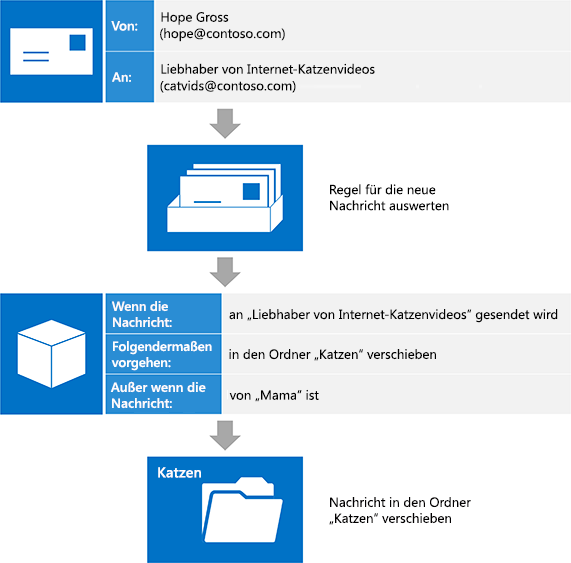

# Posteingangsverwaltung und EWS in ExchangeInbox management and EWS in Exchange

Erfahren Sie, wie Sie Ihren Posteingang in Ihrer verwalteten EWS-API oder EWS-Anwendung mithilfe von Posteingangsregeln und der Liste der blockierten Absender verwalten können.Find out how you can manage your Inbox in your EWS Managed API or EWS application by using Inbox rules and the blocked senders list.
  
Exchange-Postfächer verfügen über Features, mit denen Benutzer ihre eingehenden E-Mail-Nachrichten automatisch organisieren können. Alle diese Features funktionieren auf dem Server ohne Eingreifen des Benutzers, dienen aber unterschiedlichen Zwecken. Die verwaltete EWS-API und EWS ermöglichen den Zugriff auf diese Features, damit Ihre Benutzer ihre Posteingänge verwalten können.Exchange mailboxes come equipped with features to help users organize their incoming mail automatically. These features all operate on the server without user intervention, but they serve different needs. The EWS Managed API and EWS provide access to these features, enabling your users to manage their Inboxes.
  
**In Tabelle 1. Posteingang Management-features****Table 1. Inbox management features**

|**Aktion****If you want to…**|**Verwenden Sie...****Use…**|
|:-----|:-----|
|Ergreifen von Maßnahmen für eingehende Nachrichten (z. B. Verschieben in einen anderen Ordner oder löschen) basierend auf bestimmten Kriterien (z. B. Absender, Betreff oder Anlagen)Take action on incoming messages (such as moving them to another folder or deleting them) based on specific criteria (such as sender, subject, or attachments)    |PosteingangsregelnInbox rules    |
|Löschen aller eingehenden E-Mail-Nachrichten eines bestimmten AbsendersDelete all incoming mail from a particular sender    |Liste der geblockten AbsenderBlocked Senders List    |
   
## PosteingangsregelnInbox rules

Seien wir ehrlich: Nicht alle E-Mail-Nachrichten sind gleichberechtigt. Für jede E-Mail, die ein Benutzer von seinem Vorgesetzten erhält, gibt es eine von einer Internet-Videoverteilerliste für Katzenvideos, der er vor Jahren beigetreten und nie mehr verlassen hat. Katzenvideos sind zwar unterhaltsam, erzeugen aber riesige Datenmengen, sodass  wichtige Nachrichten einfach im Meer der Verteilungslisten-E-Mails in einem Posteingang verloren gehen können. Viele Benutzer verwenden Posteingangsregeln, um diese Nachrichten auszusortieren, damit der Posteingang übersichtlicher wird. Mit Exchange-Webdienste (EWS) kann Ihre Anwendung die Leistungsfähigkeit von Regeln optimal nutzen.Let's face it: not every email message is created equal. For every email a user gets from his or her manager, there's one from an Internet cat video distribution list he or she joined years ago and never got around to leaving. While Internet cat videos are entertaining, the amount of traffic that distribution list gets can get out of hand, and important messages can easily be lost in the sea of distribution list mail in an Inbox. Many users turn to Inbox rules to help pare down those messages, and make their Inbox a much nicer place to be. With Exchange Web Services (EWS), your application can bring the power of rules to bear.
  
Die EWS Managed API bietet die [ExchangeService.GetInboxRules](http://msdn.microsoft.com/en-us/library/microsoft.exchange.webservices.data.exchangeservice.getinboxrules%28v=exchg.80%29.aspx) und [ExchangeService.UpdateInboxRules](http://msdn.microsoft.com/en-us/library/microsoft.exchange.webservices.data.exchangeservice.updateinboxrules%28v=exchg.80%29.aspx) Methoden zum Arbeiten mit Regeln.The EWS Managed API provides the [ExchangeService.GetInboxRules](http://msdn.microsoft.com/en-us/library/microsoft.exchange.webservices.data.exchangeservice.getinboxrules%28v=exchg.80%29.aspx) and [ExchangeService.UpdateInboxRules](http://msdn.microsoft.com/en-us/library/microsoft.exchange.webservices.data.exchangeservice.updateinboxrules%28v=exchg.80%29.aspx) methods for working with rules. EWS bietet die [GetInboxRules](http://msdn.microsoft.com/library/b4b2701a-4a23-4acc-8c75-19f7955ad7ae%28Office.15%29.aspx) und [UpdateInboxRules](http://msdn.microsoft.com/library/f982a237-471e-45c5-a2b5-468cfc53150b%28Office.15%29.aspx) Vorgänge für die Arbeit mit Regeln.EWS provides the [GetInboxRules](http://msdn.microsoft.com/library/b4b2701a-4a23-4acc-8c75-19f7955ad7ae%28Office.15%29.aspx) and [UpdateInboxRules](http://msdn.microsoft.com/library/f982a237-471e-45c5-a2b5-468cfc53150b%28Office.15%29.aspx) operations for working with rules. Beachten Sie jedoch, dass die EWS Managed API und EWS beim Arbeiten mit Posteingangsregeln die folgenden Einschränkungen gelten:However, note that the EWS Managed API and EWS have the following limitations when working with Inbox rules: 
  
- EWS kann nicht auf "Nur-Client"-Regeln oder Regeln zugreifen oder diese erstellen, die in Outlook für die Ausführung "nur auf diesem Computer" festgelegt sind.EWS cannot access or create "client-only" rules or rules that are set in Outlook to run "on this computer only".
    
- Um die aktuellen Regeln mithilfe von EWS zu ändern, müssen Sie den Outlook-Regel-BLOB entfernen, sofern vorhanden. Dies bedeutet, dass durch das Verwenden von EWS zum Ändern von Regeln alle Regeln, die zuvor mithilfe von Outlook ausgeschaltet (deaktiviert) wurden, gelöscht werden. To change the current set of rules by using EWS, you have to remove the Outlook rules BLOB, if it is present. This means that using EWS to modify rules deletes any rules that were previously turned off (disabled) by using Outlook. 
    
### Wie funktionieren Regeln?How do rules work?

Das Regelmodul fungiert als Gatekeeper Postfach eines Benutzers.The rules engine acts as a gatekeeper to a user's mailbox. Eintreffen eine Nachricht in das Postfach des Benutzers, aber bevor die Nachricht im Posteingang angezeigt wird, wird die Nachricht gegen eine sortierte Liste der Regeln ausgewertet.As a message arrives in the user's mailbox, but before the message appears in the Inbox, that message is evaluated against an ordered list of rules. Beachten Sie, dass dies nur zu hinzukommen Zeitpunkt und nur im Posteingang auftritt.Note that this only occurs at arrival time, and only in the Inbox. Diese Regeln bestehen aus drei Teilen: [Bedingungen](#bk_Conditions), [Aktionen](#bk_Actions)und [Ausnahmen](#bk_Exceptions).These rules are comprised of three parts: [Conditions](#bk_Conditions), [Actions](#bk_Actions), and [Exceptions](#bk_Exceptions).
  
Beginnend mit der Regel ganz oben in der Regelliste führt das Regelmodul die folgenden Schritte aus, bis das Ende der Regelliste erreicht ist:Starting with the rule at the top of the rule list, the rules engine performs the following steps until it reaches the end of the list of rules:
  
1. Überprüft die Nachricht, um festzustellen, ob sie alle Kriterien der Regel erfüllt.Checks the message to determine whether it meets all the conditions specified in the rule.
    
1. Wenn sie alle Bedingungen erfüllt, wird die Auswertung mit Schritt 2 fortgesetzt.If it meets all the conditions, evaluation continues with step 2.
    
2. Wenn sie nicht alle Bedingungen erfüllt, lädt das Regelmodul die nächste Regel in der Liste und beginnt dann wieder bei Schritt 1.If it does not meet all the conditions, the rules engine loads the next rule in the rule list and starts over at step 1.
    
2. Überprüft die Nachricht, um festzustellen, ob sie Ausnahmen der Regel erfüllt.Checks the message to determine whether it meets any of the exceptions specified in the rule.
    
1. Wenn Ausnahmen erfüllt werden, lädt das Regelmodul die nächste Regel in der Liste und beginnt dann wieder bei Schritt 1.If it meets any of the exceptions, the rules engine loads the next rule in the rule list and starts over at step 1.
    
2. Wenn sie keine der Ausnahmen erfüllt, wird die Bewertung mit Schritt 3 fortgesetzt.If it does not meet any of the exceptions, evaluation continues with step 3.
    
3. Führt die Aktionen durch, die in der Regel für die Nachricht angegeben sind.Performs the actions specified in the rule on the message.
    
1. Wenn die Aktion "Verarbeiten weiterer Regeln beenden" angegeben ist, führt das Regelmodul alle anderen Aktionen für die Nachricht aus und wird dann ohne Auswertung zusätzlicher Regeln für die Nachricht beendet.If the "stop processing more rules" action is specified, the rules engine performs all the other actions on the message, then exits without evaluating any additional rules against the message.
    
2. Wenn die Aktion "Verarbeiten weiterer Regeln beenden" nicht angegeben ist, lädt das Regelmodul die nächste Regel in der Liste und beginnt dann wieder bei Schritt 1.If the "stop processing more rules" action is not specified, the rules engine loads the next rule in the rule list and starts over at step 1.
    
Die folgende Abbildung zeigt den Prozess, dem das Regelmodul folgt.The following figure shows the process that the rules engine follows.
  
**Abbildung 1: Regeln Engine (Übersicht)****Figure 1: Rules engine overview**

  
### Zusammensetzen der Teile - Teile einer RegelPutting the pieces together - parts of a rule

Eine Möglichkeit zum Visualisieren der Teile einer Regel ist, stellen Sie sich, dass Sie die Anweisungen an eine Person zuweisen möchten, die mit Ihrer eingehenden e-Mails organisieren beauftragt ist.One way to visualize the parts of a rule is to imagine that you are giving instructions to someone who is tasked with organizing your incoming email. An diese Person Sie sagen: "beim Empfang einer Nachricht, die \<Bedingungen hier einfügen\>, führen Sie \<Aktionen hier einfügen\>, es sei denn, die Nachricht \<Ausnahmen hier einfügen\>.You might say to this person: "When a message arrives that \<insert conditions here\>, do \<insert actions here\>, unless the message \<insert exceptions here\>. Werfen wir näher an jeden Teil.Let's take a closer look at each part.
  
#### BedingungenConditions

[Bedingung](http://msdn.microsoft.com/library/f049a48c-9585-43f7-8549-0b8cb19a5eea%28Office.15%29.aspx) wird beschrieben, wann eine Regel angewendet werden soll.[Conditions](http://msdn.microsoft.com/library/f049a48c-9585-43f7-8549-0b8cb19a5eea%28Office.15%29.aspx) describe when a rule should be applied. Während Sie die Bedingungen einer Regel (was in einer Regel, die für jede Nachricht empfangen gilt) weglassen können, ist es ganz häufiger für Regeln für die Bedingungen verfügen, die auf eine Teilmenge der eingehenden Nachrichten gelten.While you can omit the conditions of a rule (resulting in a rule that applies to every message received), it is far more common for rules to have conditions that apply to a subset of incoming messages. Einige Beispiele sind "Wenn eine Nachricht von Sadie ist" oder "eine Nachricht an die Verteilerliste 'Cat Video Benutzern' gesendet wird".Some examples are "when a message is from Sadie" or "when a message is sent to the 'Cat Video Lovers' distribution list". Regeln können mehrere Bedingungen haben.Rules can have multiple conditions. Wenn mehr als eine Bedingung von Regeln vorhanden sind, müssen in der Reihenfolge für das Regelmodul angegebene Aktion ausführen aller Bedingungen erfüllt sein.When rules have more than one condition, all the conditions must be met in order for the rules engine to take the specified action. 
  
#### AktionenActions

[Vorgänge](http://msdn.microsoft.com/library/c5aa96b1-2d8b-422f-8c2f-f118572ab23f%28Office.15%29.aspx) beschrieben, was geschieht, wenn eine Regel angewendet wird.[Actions](http://msdn.microsoft.com/library/c5aa96b1-2d8b-422f-8c2f-f118572ab23f%28Office.15%29.aspx) describe what happens when a rule applies. Beispiele sind "Verschieben der Nachricht in den Ordner"Katzen"" oder "Markieren der Nachricht mit der Wichtigkeit 'Niedrig'".Examples are "move the message to the 'Cats' folder" or "mark the message with 'Low' importance". Regeln können mehrere Aktionen haben.Rules can have multiple actions. Wenn Sie mehrere Aktionen für eine Regel angeben, werden alle Aktionen ausgeführt, wenn die Regel angewendet wird.When you specify multiple actions for a rule, all the actions are performed when the rule is applied. 
  
#### AusnahmenExceptions

[Ausnahmen](http://msdn.microsoft.com/library/7cd63ac2-3441-4ed4-915b-6f90af4b28fc%28Office.15%29.aspx) beschreiben bei eine Regel nicht angewendet werden soll, auch wenn die in die Bedingungen angegebenen Kriterien erfüllt sind.[Exceptions](http://msdn.microsoft.com/library/7cd63ac2-3441-4ed4-915b-6f90af4b28fc%28Office.15%29.aspx) describe when a rule should not apply, even if the criteria specified in the conditions are met. Beispiele sind "außer wenn die Nachricht nur an mich gesendet wird" oder "es sei denn, wenn die Nachricht von Mom".Examples are "except if the message is sent only to me" or "except if the message is from Mom". Eine Regel kann mehrere Ausnahmen haben.A rule can have multiple exceptions. Wenn Regeln mehr als eine Ausnahme haben und Ausnahmen erfüllt sind, wird die Regel nicht angewendet.When rules have more than one exception, and any of the exceptions are met, the rule is not applied. 
  
### Beispiel: Verwalten dieser KatzenExample: Herding those cats

Werfen wir einen Blick darauf, wie Ihre Benutzer diese Regeln verwenden können, um den Datenverkehr von der Verteilerliste mit den Internetkatzenvideos zu vermeiden. Nehmen wir Folgendes an:Let's take a look at how your users can use rules to eliminate the traffic from that Internet cat video distribution list. Let's assume the following:
  
- Diese Nachrichten werden an eine Verteilerliste namens "Fans von Internetkatzenvideos" gesendet.These messages are sent to a distribution list called "Internet Cat Video Enthusiasts".
    
- Möchten, dass Ihre Benutzer schließlich diese Nachrichten lesen, die sie gerade nicht möchten, dass sie ihren Posteingang belegt.Your users want to read these messages eventually, they just don't want them cluttering their Inbox. Sie würden vielmehr in einen Ordner namens "Katzen" file.They'd rather file them in a folder called "Cats".
    
- Ihre Benutzer möchten Nachrichten, die an diese Verteilerliste von deren Müttern gesendet werden, sofort lesen, da Mama die witzigsten Videos sendet.Your users want to read messages sent to this distribution list by their mother right away, because Mom sends the funniest videos.
    
Das Regelmodul erhält folgende Anweisung: "Beim Eintreffen einer Nachricht, die an die Verteilerliste 'Fans von Internetkatzenvideos' gesendet wird, verschiebe diese in den Ordner 'Katzen', es sei denn, die Nachricht ist von Mama". This tells the rules engine the following: "When a message arrives that is sent to the 'Internet Cat Video Enthusiasts' distribution list, move it to the 'Cats' folder, unless the message is from Mom." 
  
**In Tabelle 2. Regel-definition****Table 2. Rule definition**

|**Regel-Webpart****Rule part**|**Wert****Value**|
|:-----|:-----|
|BedingungenConditions    |Gesendet an die Verteilerliste 'Fans von Internetkatzenvideos'Sent to the 'Internet Cat Video Enthusiasts' distribution list    |
|AktionenActions    |Verschieben der Nachricht in den Ordner 'Katzen'Move the message to the 'Cats' folder    UND Verarbeiten weiterer Regeln beendenAND stop processing more rules    |
|AusnahmenExceptions    |Von 'Mama'From 'Mom'    |
   
> [!NOTE]
> Beachten Sie, dass "Verarbeiten weiterer Regeln beenden" eine der Aktionen in der resultierenden Regel ist. Im Allgemeinen ist es ratsam, diese Aktion einzuschließen, um Verwirrung darüber zu vermeiden, welche Regeln für eine bestimmte Nachricht gilt. Durch Auslasen dieser Aktion und ordnungsgemäßem Sortieren Ihrer Regeln können Sie jedoch eine erweiterte Verarbeitung von eingehenden Nachrichten erzielen. In diesem Fall ist es wahrscheinlich sicher, dass Nachrichten mit Internetkatzenvideos keine erweiterte Verarbeitung benötigen.Notice that "stop processing more rules" is one of the actions in the resulting rule. In general it's a good idea to include this action to avoid confusion over which rules act on any given message. However, by omitting this action and properly ordering your rules, you can achieve more advanced processing of your incoming mail. In this case, it's probably a safe bet that Internet cat video messages don't require much in the way of advanced processing. 
  
Kurz nach dem Erstellen dieser Regel trifft eine neue Nachricht ein. Eine Mitarbeiterin sendet eine Nachricht an die Verteilerliste. Wenn wir die Arbeit des Regelmoduls einmal mental ausführen, erfüllt die Nachricht allen angegebenen Bedingungen (sie wird an 'Fans von Internetkatzenvideos' gesendet) und keine der Ausnahmen (sie ist nicht von 'Mama'), also wird die Regel angewendet, und die Nachricht wird in den Ordner 'Katzen' verschoben.Shortly after creating this rule, a new message comes in. A coworker Hope sends a message to the distribution list. If we mentally perform the work of the rules engine, the message meets all the conditions (it is sent to 'Internet Cat Videos Enthusiasts'), and it meets none of the exceptions (it isn't from 'Mom'), so the rule applies and the message gets moved to the 'Cats' folder.
  
Die folgende Abbildung zeigt, wie die Regel auf eine eingehende E-Mail-Nachricht angewendet wird.The following figure shows how the rule is applied to an incoming mail message.
  
**Abbildung 2. Eingehende Nachricht wird durch eine Regel verarbeitet.****Figure 2. Incoming message is processed by a rule**

  
## Blockieren von AbsendernBlocking senders

Obwohl Sie eine Regel erstellen können, die alle e-Mail-Nachrichten von einem bestimmten Absender in den Junk-e-Mailordner verschieben möchten, können Sie auch hierzu mithilfe der Liste blockierter Absender in den Junk-e-Mail-Optionen.Although you can create a rule that will move all mail from a specific sender to the Junk Mail folder, you can also do this by using the Blocked Senders List in your Junk Email options. Da es ein Grenzwert, wie viele Regeln, die ein Benutzer ausführen kann besteht, ist es sinnvoll, verwenden Sie die Liste der blockierten Absender.Because there is a limit to how many rules a user can have, it makes sense to use the Blocked Senders List. Sie können [bestimmten e-Mail-Adressen aus der Liste blockierter Absender hinzufügen oder entfernen](how-to-add-and-remove-email-addresses-from-blocked-senders-list-by-using-ews.md) , indem Sie die [ExchangeService.MarkAsJunk](http://msdn.microsoft.com/en-us/library/microsoft.exchange.webservices.data.exchangeservice.markasjunk%28v=exchg.80%29.aspx) EWS Managed API-Methode oder die [MarkAsJunk](http://msdn.microsoft.com/library/1f71f04d-56a9-4fee-a4e7-d1034438329e%28Office.15%29.aspx) EWS-Vorgang.You can [add or remove specific email addresses from the Blocked Senders List](how-to-add-and-remove-email-addresses-from-blocked-senders-list-by-using-ews.md) by using the [ExchangeService.MarkAsJunk](http://msdn.microsoft.com/en-us/library/microsoft.exchange.webservices.data.exchangeservice.markasjunk%28v=exchg.80%29.aspx) EWS Managed API method or the [MarkAsJunk](http://msdn.microsoft.com/library/1f71f04d-56a9-4fee-a4e7-d1034438329e%28Office.15%29.aspx) EWS operation. Beachten Sie, dass in der Reihenfolge für EWS der Liste blockierter Absender Zugriff auf das Postfach des Benutzers aus der e-Mail-Adresse eine e-Mail-Nachricht enthalten muss, die Sie hinzufügen oder entfernen möchten.Note that in order for EWS to access the Blocked Senders List, the user's mailbox must contain an email message from the email address that you want to add or remove. 
  
## Inhalt dieses AbschnittsIn this section

- [Verwalten von Posteingangsregeln mithilfe der EWS in ExchangeManage Inbox rules by using EWS in Exchange](how-to-manage-inbox-rules-by-using-ews-in-exchange.md)
    
- [Hinzufügen und Entfernen von e-Mail-Adressen aus der Liste blockierter Absender mithilfe der EWS in ExchangeAdd and remove email addresses from the Blocked Senders List by using EWS in Exchange](how-to-add-and-remove-email-addresses-from-blocked-senders-list-by-using-ews.md)
    
## Siehe auchSee also

- [Entwickeln von Webdienstclients für ExchangeDevelop web service clients for Exchange](develop-web-service-clients-for-exchange.md)
    
- [GetInboxRules-VorgangGetInboxRules operation](http://msdn.microsoft.com/library/b4b2701a-4a23-4acc-8c75-19f7955ad7ae%28Office.15%29.aspx)
    
- [UpdateInboxRules-VorgangUpdateInboxRules operation](http://msdn.microsoft.com/library/f982a237-471e-45c5-a2b5-468cfc53150b%28Office.15%29.aspx)
    
- [MarkAsJunk OperationMarkAsJunk operation](http://msdn.microsoft.com/library/1f71f04d-56a9-4fee-a4e7-d1034438329e%28Office.15%29.aspx)
    

