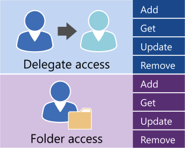

# Verwalten des Benutzerzugriffs in Exchange mithilfe der Exchange-WebdiensteManaging user access by using EWS in Exchange

Hier finden Sie Informationen zu die Optionen für die Verwaltung von Benutzerkonten den Zugriff auf Ihren Exchange-Server.Find out what your options are for managing user account access to your Exchange server.
  
Exchange-Webdienste (EWS) und die EWS managed API bieten eine begrenzte Anzahl von Operationen, die Sie zum Verwalten von Konten in Exchange Online, Exchange Online als Teil von Office 365 oder eine Version von Exchange, beginnend mit Exchange 2013 verwenden können.Exchange Web Services (EWS) and the EWS managed API provide a limited number of operations that you can use to manage accounts on Exchange Online, Exchange Online as part of Office 365, or a version of Exchange starting with Exchange 2013. Sie können die Vorgänge in der folgenden Abbildung dargestellt, Stellvertretungen verwalten und Festlegen von Zugriffsberechtigungen für Ordner für andere Konten verwenden.You can use the operations shown in the following figure to manage delegates and to set folder access permissions for other accounts. 
  
**EWS-Vorgänge für den Delegaten und Ordner****EWS operations for delegate and folder access**

  
Wenn die Anwendung zusätzliche Kontrolle über die Konten auf einem Exchange-Server benötigt, können Sie die Exchange-Verwaltungsshell-Cmdlets zum Verwalten von Konten verwenden.If your application needs additional control over the accounts on an Exchange server, you can use Exchange Management Shell cmdlets to manage the accounts. Sie können die Exchange-Verwaltungsshell-Cmdlets aufrufen, indem Sie einen der folgenden Schritte ausführen:You can call the Exchange Management Shell cmdlets by doing one of the following:
  
- Schreiben einer Anwendung mit c# oder Visual Basic, die die Exchange-Verwaltungsshell-Cmdlets aufruft.Writing an application using C# or Visual Basic that calls the Exchange Management Shell cmdlets. Betrachten Sie im Beispielcode in der [Exchange Management Shell API-Dokumentation](../management/exchange-management-shell.md) erfahren, wie ein Cmdlet aufrufen.You can look at the sample code in the [Exchange Management Shell API documentation](../management/exchange-management-shell.md) to learn how to call a cmdlet. 
    
- Verwenden von Windows PowerShell und Windows PowerShell-Skripts zum Aufrufen der Exchange-Verwaltungsshell-Cmdlets.Using Windows PowerShell and Windows PowerShell scripts to call Exchange Management Shell cmdlets. Finden Sie eine vollständige Liste mit den [Exchange Server-PowerShell (Exchange-Verwaltungsshell)](https://docs.microsoft.com/en-us/powershell/exchange/exchange-server/exchange-management-shell?view=exchange-ps), zusammen mit Beispielen, die zeigen, deren Verwendung.You can find a complete list of the [Exchange Server PowerShell (Exchange Management Shell)](https://docs.microsoft.com/en-us/powershell/exchange/exchange-server/exchange-management-shell?view=exchange-ps), along with examples that show how to use them. 
    
## Siehe auchSee also

- [Einrichten Ihrer EWS-AnwendungSetting up your EWS application](setting-up-your-ews-application.md)   
- [Exchange 2013-CmdletsExchange 2013 Cmdlets](https://docs.microsoft.com/en-us/powershell/exchange/?view=exchange-ps)  
    

