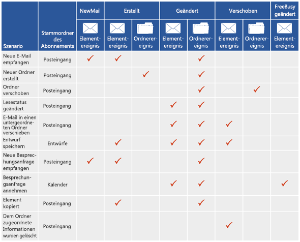
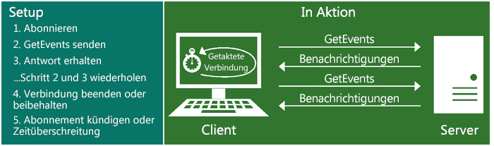

# Benachrichtigungsabonnements, Postfachereignisse und EWS in Exchange

Erfahren Sie mehr über Benachrichtigungsabonnements und Postfachereignisse in EWS in Exchange.
  
Sie können sowohl die EWS Managed API als auch Exchange-Webdienste (EWS) verwenden, um Abonnements für Benachrichtigungen zu erstellen, wenn Ereignisse in einem Postfach oder in einem oder mehreren Ordnern in einem Postfach geschehen. Es stehen drei Abonnementtypen zur Verfügung: Streamingbenachrichtigungen, Pullbenachrichtigungen und Pushbenachrichtigungen. Jeder dieser Abonnementtypen verwendet unterschiedliche Techniken, um die Benachrichtigungen zu erhalten oder abzurufen.
  
## Erhalten von Benachrichtigungen - welche Optionen habe ich?

EWS umfasst drei Abonnementtypen, die unabhängig voneinander arbeiten, um den Client über Änderungen auf dem Server zu benachrichtigen. Unabhängig davon, welchen Abonnementtyp Sie auswählen, erhalten Sie letztendlich immer Zugriff auf dieselben Benachrichtigungsereignisse - es geht nur darum, wie Sie diese erhalten.
  
**Tabelle 1. Abonnementtypen**

|**Option**|**Beschreibung**|**Ist diese Option richtig für mich?**|
|:-----|:-----|:-----|
|Streamingbenachrichtigungen    |Benachrichtigungen, die vom Server über eine Verbindung gesendet werden, die für eine bestimmte Zeit geöffnet bleibt.    |Streamingbenachrichtigungen werden im Allgemeinen für die meisten Anwendungen empfohlen. Sie sind Pull- und Pushbenachrichtigungen ähnlich und vereinen die Vorteile aus beiden Welten. Nachdem Sie Ihr Benachrichtigungsabonnement eingerichtet haben, bleibt die Verbindung bis zu 30 Minuten geöffnet, damit der Server Benachrichtigungen zurück an den Client schieben kann. Es ist nicht erforderlich, Updates anzufordern, wie dies bei einem Pullabonnement der Fall wäre, und Sie müssen keine Webdienst-Listeneranwendung erstellen, wie dies bei einem Pushabonnement der Fall ist.    |
|Pullbenachrichtigungen    |Benachrichtigungen, die vom Client angefordert werden.    |Pullbenachrichtigungen sind im Allgemeinen für locker miteinander verbundene Clients am besten geeignet, bei denen der Client nicht zuverlässig mit dem Netzwerk verbunden ist. Pullbenachrichtigungen können einen übermäßigen Datenverkehr zwischen dem Client und dem Server verursachen, da der Client häufige Anforderungen an den Server zum Abrufen von Benachrichtigungen sendet, und nicht alle Anforderungen führen zu abgerufenen Benachrichtigungen.    |
|Pushbenachrichtigungen    |Benachrichtigungen, die vom Server an einem clientseitigen Webdienst über eine Rückrufadresse gesendet (bzw. geschoben) werden.    |Pushbenachrichtigungen bieten im Allgemeine eine kürzere Benachrichtigungswartezeit als Pullbenachrichtigungen und sind für eng verbundene Clients geeignet, auf die der Server zuverlässigen Zugriff hat und wobei der Client IP-adressierbar ist. Pushbenachrichtigungen werden jedoch seit der Einführung von Streamingbenachrichtigungen in Exchange 2010 nicht mehr sehr häufig verwendet. Wenn möglich, wird empfohlen, in Zukunft anstelle von Pushbenachrichtigungen Streamingbenachrichtigungen zu verwenden. Pushbenachrichtigungen erfordern, dass Sie ein Listeneranwendung schreiben, an die die Benachrichtigungen gesendet werden an. Dies ist ein kleiner Vorteil gegenüber Pulllbenachrichtigungen dahingehend, dass Netzwerkverkehr reduziert wird, es wird jedoch ein Mehraufwand verursacht, da eine separate Anwendung erforderlich ist.    |
   
## Welche EWS-Ereignisse kann ich abonnieren?

Die von Clients abonnierten Typen von EWS-Ereignissen werden von der [EventType](http://msdn.microsoft.com/de-DE/library/microsoft.exchange.webservices.data.eventtype%28v=exchg.80%29.aspx)-Enumeration für die EWS Managed API oder das [EventType](http://msdn.microsoft.com/library/04b70f9e-c226-4130-958e-0db0275cf58b%28Office.15%29.aspx)-Element für EWS definiert. Die folgenden EWS-Ereignisse können abonniert werden: 
  
- NewMail – Eine neue Nachricht ist im Posteingang eingegangen.
    
- Deleted - Eine Nachricht wurde dauerhaft aus dem Posteingang gelöscht. Weitere Informationen zu Benachrichtigungen über gelöschte Elemente finden Sie unter [Löschen von Elementen mithilfe von EWS in Exchange](deleting-items-by-using-ews-in-exchange.md) und [Ziehen Sie Benachrichtigungen für EWS Postfach löschen-bezogenen Ereignisse in Exchange](pull-notifications-for-ews-deletion-related-mailbox-events-in-exchange.md).
    
- Modified – Ein Element oder Ordner wurde geändert.
    
- Moved – Ein Element oder Ordner wurde verschoben. 
    
- Copied – Ein Element oder Ordner wurde kopiert.
    
- Created – Ein Element oder Ordner wurde erstellt. 
    
- FreeBusyChanged - Die Frei/Gebucht-Informationen eines Benutzers wurden geändert.
    
Ein weiterer EWS-Ereignistyp, das Status-Ereignis, wird vom [EventType](http://msdn.microsoft.com/de-DE/library/microsoft.exchange.webservices.data.eventtype%28v=exchg.80%29.aspx)-Element definiert, dieses Ereignis wird jedoch nicht abonniert. Es wird vielmehr vom Server gesendet, um den Status des Clients für Streaming- und Pushbenachrichtigungen zu überprüfen. Der Client muss auf dieses Ereignis reagieren, da sonst eine Zeitüberschreitung auftritt. 
  
Eine einzige Benutzeraktion führt häufig zur Erstellung mehrerer Benachrichtigungen. Die folgende Abbildung zeigt zur Veranschaulichung einige häufige Szenarien und die für jedes Szenarion erstellten Benachrichtigungen. Clienteinstellungen haben Auswirkungen auf die empfangenen Benachrichtigungen, daher ist dies keine vollständige Liste aller Konfigurationsoptionen und der sich daraus ergebenden Benachrichtigungen.
  
**Abbildung 1. Von Benachrichtigungsabonnements zurückgegebene Ereignistypen**

  
In Abbildung 1 ist der Benachrichtigungsprozess vereinfacht dargestellt. In der Realität können mehrere Benachrichtigungen (sogar mehrere Benachrichtigungen desselben Typs) für eine einzige Benutzeraktion erstellt werden. Im Fall des Verschiebens eines Ordners werden beispielsweise drei Ordnerereignisse erstellt: eines für den geänderten Ordners, einen für den alten übergeordneten Ordner, und eines für den neuen übergeordneten Ordner. Da für einen einzigen Vorgang zahlreiche Ereignisse ausgelöst werden können, wird empfohlen, dass Sie [eine Wartezeit von ein paar Sekunden in Synchronisierungsvorgängen erstellen](mailbox-synchronization-and-ews-in-exchange.md#bk_bestpractices), damit nur synchronisiert wird, wenn die Aktion abgeschlossen ist und nicht mitten in der Aktion.
  
Außerdem ist es wichtig zu wissen, dass sich die Konfigurationseinstellungen, die jeder Benutzer auswählt, Auswirkungen darauf haben, welche Benachrichtigungen erstellt werden. Beispielsweise werden die Frei/Gebucht-Informationen einiger Benutzer automatisch aktualisiert, und das FreeBusyChanged-Ereignis wird erstellt, wenn eine neue Besprechungsanfrage empfangen wird, sogar bevor sie das Element gelesen haben. Bei anderen Benutzern werden die Frei/Gebucht-Informationen nicht aktualisiert und das FreeBusyChanged-Ereignis wird erst erstellt, wenn die Besprechung akzeptiert wurde. Diese Einstellungen können einen wesentlichen Einfluss auf die vom Server erstellten Benachrichtigungen haben.
  
## Wie funktionieren EWS-Benachrichtigungen?

EWS-Benachrichtigungen werden auf Abonnementbasis verarbeitet. In der Regel gibt es ein Abonnement pro Postfach, und innerhalb des Postfachabonnements können Sie einige oder alle Ordner abonnieren. Sie entscheiden, welche Art von Benachrichtigung Sie abonnieren möchten (Streaming, Pull oder Push) und welche Art von Ereignissen (NewMail, Created, Deleted, Modified usw.) Sie erhalten möchten; dann erstellen Sie ein Abonnement. Die EWS-Ereignisse werden dann asynchron vom Postfachserver an den Client gesendet. (Geschichtsstunde: Protokollereignisse sind in Exchange 2007 synchron, und Ereignisse werden auf dem Clientzugriffsserver in Exchange 2010 gespeichert).
  
Wie die Benachrichtigungen an den Client gesendet werden, variiert in Abhängigkeit von der Art des ausgewählten Abonnements. In diesem Abschnitt ausführlich beschrieben, wie die einzelnen Abbonementtypen funktionieren.
  
### EWS-Streamingbenachrichtigungen

Streamingbenachrichtigungen basieren auf einer hängenden Get-Anforderung an den Server, um eine Verbindung für ein Streamingabonnement geöffnet zu lassen, damit Ereignisse, die auftreten, während die Verbindung aktiv ist, sofort an den Client gestreamt werden. Im Verlauf einer einzigen Verbindung können mehrere Benachrichtigungen gesendet werden, und die Verbindung bleibt geöffnet, oder maximal 30 Minuten. Nachdem die Verbindung abgelaufen ist, sendet der Client die hängende Get-Anforderung erneut. Abbildung 2 zeigt, wie Streamingabonnements und Streamingbenachrichtigungen funktionieren.
  
**Abbildung 2. Übersicht über Streamingbenachrichtigungen**

  
Informationen zum Erstellen von Streamingbenachrichtigungen finden Sie unter [Streamingbenachrichtigungen zu Postfachereignissen mithilfe von EWS in Exchange](how-to-stream-notifications-about-mailbox-events-by-using-ews-in-exchange.md).
  
### EWS-Pullbenachrichtigungen

Pullbenachrichtigungen basieren darauf, dass der Client in einem vom Client verwalteten Intervall nach Benachrichtigungen fragt. Dies kann zu GetEvents-Antworten ohne Benachrichtigungen führen. Abbildung 3 zeigt, wie Pullabonnements und Pullbenachrichtigungen funktionieren.
  
**Abbildung 3. Übersicht über Pullbenachrichtigungen**

  
Informationen zum Erstellen von Pullbenachrichtigungen finden Sie unter [Pullbenachrichtigungen zu Postfachereignissne mithilfe von EWS in Exchange](how-to-pull-notifications-about-mailbox-events-by-using-ews-in-exchange.md).
  
### EWS-Pushbenachrichtigungen

Pushbenachrichtigungen basieren darauf, dass der Server Benachrichtigungen zurück an den Client schiebt. Es entsteht nur Verkehr, wenn eine Benachrichtigung vorhanden ist. Abbildung 4 zeigt, wie Pushabonnements und Pushbenachrichtigungen funktionieren.
  
**Abbildung 4. Übersicht über Pushbenachrichtigungen**

  
Wenn Sie [Pushbenachrichtigungen mit Exchange 2010](http://msdn.microsoft.com/library/db1f8523-fa44-483f-bdb6-ab5939b52eee%28Office.15%29.aspx) verwenden, sollten Sie darüber nachdenken, die Anwendung auf die [Verwendung von Streamingbenachrichtigungen](http://code.msdn.microsoft.com/exchange/Exchange-2013-Set-push-82738cc5) zu aktualisieren, damit Sie keine separate Anwendung für das Empfangen der Ereignisse benötigen.
  
## Wie kann ich Benachrichtigungen abonnieren?

Je nach Typ des Abonnements, das Sie erstellen möchten, steht Ihnen eine Reihe von Optionen zur Auswahl, um Benachrichtigungen zu abonnieren.
  
**Tabelle 2. Vorgänge und Methoden für das Abonnieren von Benachrichtigungen**

|**Abonnementtyp**|**EWS-Vorgang**|**EWS Managed API-Methoden**|**Funktion der Einstellung**|
|:-----|:-----|:-----|:-----|
|Streaming    |[Vorgang abonnieren](http://msdn.microsoft.com/library/f17c3d08-c79e-41f1-ba31-6e41e7aafd87%28Office.15%29.aspx)   |[ExchangeService.BeginSubscribeToStreamingNotifications-Methode](http://msdn.microsoft.com/de-DE/library/microsoft.exchange.webservices.data.exchangeservice.beginsubscribetostreamingnotifications%28v=exchg.80%29.aspx)   [ExchangeService.BeginSubscribeToStreamingNotificationsOnAllFolders-Methode](http://msdn.microsoft.com/de-DE/library/microsoft.exchange.webservices.data.exchangeservice.beginsubscribetostreamingnotificationsonallfolders%28v=exchg.80%29.aspx)   [ExchangeService.SubscribeToStreamingNotificationsOnAllFolders-Methode](http://msdn.microsoft.com/de-DE/library/microsoft.exchange.webservices.data.exchangeservice.subscribetostreamingnotifications%28v=exchg.80%29.aspx)   |Erstellt eine Anforderung zum Abonnieren von Streamingbenachrichtigungen.    |
|Pull    |[Vorgang abonnieren](http://msdn.microsoft.com/library/f17c3d08-c79e-41f1-ba31-6e41e7aafd87%28Office.15%29.aspx)   |[ExchangeService.BeginSubscribeToPullNotifications-Methode](http://msdn.microsoft.com/de-DE/library/microsoft.exchange.webservices.data.exchangeservice.beginsubscribetopullnotifications%28v=exchg.80%29.aspx)   [ExchangeService.BeginSubscribeToPullNotificationsOnAllFolders-Methode](http://msdn.microsoft.com/de-DE/library/microsoft.exchange.webservices.data.exchangeservice.beginsubscribetopullnotificationsonallfolders%28v=exchg.80%29.aspx)   [ExchangeService.SubscribeToPullNotifications-Methode](http://msdn.microsoft.com/de-DE/library/microsoft.exchange.webservices.data.exchangeservice.subscribetopullnotifications%28v=exchg.80%29.aspx)   [ExchangeService.SubscribeToPullNotificationsOnAllFolders-Methode](http://msdn.microsoft.com/de-DE/library/microsoft.exchange.webservices.data.exchangeservice.subscribetopullnotificationsonallfolders%28v=exchg.80%29.aspx)   |Erstellt eine Anforderung zum Abonnieren von Pullbenachrichtigungen.    |
|Push    |[Vorgang abonnieren](http://msdn.microsoft.com/library/f17c3d08-c79e-41f1-ba31-6e41e7aafd87%28Office.15%29.aspx)   |[ExchangeService.BeginSubscribeToPushNotifications-Überladungsmethode](http://msdn.microsoft.com/de-DE/library/microsoft.exchange.webservices.data.exchangeservice.beginsubscribetopushnotifications%28v=exchg.80%29.aspx)   [ExchangeService.BeginSubscribeToPushNotificationsOnAllFolders-Überladungsmethode](http://msdn.microsoft.com/de-DE/library/microsoft.exchange.webservices.data.exchangeservice.beginsubscribetopushnotificationsonallfolders%28v=exchg.80%29.aspx)   [ExchangeService.SubscribeToPushNotifications-Überladungsmethode](http://msdn.microsoft.com/de-DE/library/microsoft.exchange.webservices.data.exchangeservice.subscribetopushnotifications%28v=exchg.80%29.aspx)   [ExchangeService.SubscribeToPushNotificationsOnAllFolders-Überladungsmethode](http://msdn.microsoft.com/de-DE/library/microsoft.exchange.webservices.data.exchangeservice.subscribetopushnotificationsonallfolders%28v=exchg.80%29.aspx)   |Erstellt eine Anforderung zum Abonnieren von Pushbenachrichtigungen.    |
   
## Wie kann ich EWS-Ereignisse abrufen?

Nachdem das Abonnement erstellt wurde, ist die Art, wie die tatsächlichen Ereignisse an den Client gesendet werden,vom Abonnementtyp abhängig. 
  
Für Streamingbenachrichtigungen muss eine Streamingabonnementverbindung erstellt werden, und das Abonnement wird dann zu der Verbindung hinzugefügt. Weitere Informationen zu diesem Prozess finden Sie unter [Streamingbenachrichtigungen zu Postfachereignissen mithilfe von EWS in Exchange](how-to-stream-notifications-about-mailbox-events-by-using-ews-in-exchange.md). 
  
Für Pullbenachrichtigungen wurde das Abonnementobjekt initialisiert, als das Abonnement erstellt wurde, Sie müssen daher nur die **GetEvent** -Methode oder -Operation aufrufen, um die Ereignisse vom Server abzurufen. Weitere Informationen hierzu finden Sie unter [Pullbenachrichtigungen zu Postfachereignissen mithilfe von EWS in Exchange](how-to-pull-notifications-about-mailbox-events-by-using-ews-in-exchange.md). 
  
In der folgenden Tabelle sind die Vorgänge und Klassen aufgeführt, die zum Abrufen von Ereignissen erforderlich sind. 
  
**Tabelle 3. Elemente und Klassen für das Herstellen einer Verbindung und das Abrufen von Ereignissen**

|**Abonnementtyp**|**EWS-Vorgang**|**EWS Managed API-Methode**|**Funktion der Einstellung**|
|:-----|:-----|:-----|:-----|
|Streaming    |[GetStreamingEvents-Vorgang](http://msdn.microsoft.com/library/8da95423-72bc-4034-90a8-162eedcd059b%28Office.15%29.aspx)   |[StreamingSubscriptionConnection.AddSubscription-Methode](http://msdn.microsoft.com/de-DE/library/microsoft.exchange.webservices.data.streamingsubscriptionconnection.addsubscription%28v=exchg.80%29.aspx)   |Erstellt eine hängende Get-Anforderung auf dem Server, auf die geantwortet wird, wenn Ereignisse auftreten.    |
|Pull    |[GetEvents-Vorgang](http://msdn.microsoft.com/library/f268efe5-9a1a-41a2-b6a6-51fcde7720a1%28Office.15%29.aspx)   |[PullSubscription.GetEvents-Methode](http://msdn.microsoft.com/de-DE/library/microsoft.exchange.webservices.data.pullsubscription.getevents%28v=exchg.80%29.aspx)   |Ruft Pullbenachrichtigungsereignisse vom Server ab.    |
|Push    |Nicht zutreffend.    |Nicht zutreffend.    |Pushbenachrichtigungen werden automatisch an den Webdienst-Listener (die in der Abonnementanforderung angegebene Callback-URL) gesendet. Es müssen keine zusätzlichen Methoden oder Operationen aufgerufen werden.    |
   
## Wie kann ich ein Abonnement von Benachrichtigungen kündigen?

Die folgende Tabelle enthält die Methoden, mit deren Hilfe Sie alle Abonnementtypen kündigen können.
  
**Tabelle 4. Vorgänge und Methoden für das Kündigen von Abonnements für Benachrichtigungen**

|**Abonnementtyp**|**EWS**|**EWS Managed API**||
|:-----|:-----|:-----|:-----|
|Streaming    |[Vorgang des Kündigens von Abonnements](http://msdn.microsoft.com/library/994a9d2b-1501-4804-90f0-12bd914496ec%28Office.15%29.aspx)   |[StreamingSubscription.BeginUnsubscribe-Methode](http://msdn.microsoft.com/de-DE/library/microsoft.exchange.webservices.data.streamingsubscription.beginunsubscribe%28v=exchg.80%29.aspx)   [StreamingSubscription.EndUnsubscribe-Methode](http://msdn.microsoft.com/de-DE/library/microsoft.exchange.webservices.data.streamingsubscription.endunsubscribe%28v=exchg.80%29.aspx)   [StreamingSubscription.Unsubscribe-Methode](http://msdn.microsoft.com/de-DE/library/microsoft.exchange.webservices.data.streamingsubscription.unsubscribe%28v=exchg.80%29.aspx)   ||
|Pull    |[Vorgang des Kündigens von Abonnements](http://msdn.microsoft.com/library/994a9d2b-1501-4804-90f0-12bd914496ec%28Office.15%29.aspx)   |[PullSubscription.BeginUnsubscribe-Methode](http://msdn.microsoft.com/de-DE/library/microsoft.exchange.webservices.data.pullsubscription.beginunsubscribe%28v=exchg.80%29.aspx)   [PullSubscription.EndUnsubscribe-Methode](http://msdn.microsoft.com/de-DE/library/microsoft.exchange.webservices.data.pullsubscription.endunsubscribe%28v=exchg.80%29.aspx)   [PullSubscription.Unsubscribe-Methode](http://msdn.microsoft.com/de-DE/library/microsoft.exchange.webservices.data.pullsubscription.unsubscribe%28v=exchg.80%29.aspx)   ||
|Push    |Gibt **Unsubscribe** im [StatusFrequency](http://msdn.microsoft.com/library/917474e2-a426-4166-b825-53783a41dad4%28Office.15%29.aspx)-Element der [SendNotificationResponseMessage](http://msdn.microsoft.com/library/2c6d681b-67ac-4331-bc6b-a2e709b638e3%28Office.15%29.aspx) zurück   |Nicht zutreffend. Lassen Sie für das Abonnement stattdessen ein Timeout auftreten.    ||
   
Alternativ können Sie für jedes der Abonnements eine Zeitüberschreitung auftreten lassen. 
  
**Tabelle 5. Timeouts für Abonnements**

|**Abonnementtyp**|**Timeoutwert in EWS**|**Timeoutwert in der EWS Managed API**|**Timeoutverarbeitung**|
|:-----|:-----|:-----|:-----|
|Streaming    |[ConnectionTimeout](http://msdn.microsoft.com/library/14da68a0-bcca-4281-a774-47644baa4ee9%28Office.15%29.aspx)-Element    | *lifetime*  -Parameter des [StreamingSubscriptionConnection](http://msdn.microsoft.com/de-DE/library/microsoft.exchange.webservices.data.streamingsubscriptionconnection.streamingsubscriptionconnection%28v=exchg.80%29.aspx)-Konstruktors    |Bei der EWS Managed API wird nach Ablauf des Timeoutswerts das [OnDisconnect](http://msdn.microsoft.com/de-DE/library/microsoft.exchange.webservices.data.streamingsubscriptionconnection.ondisconnect%28v=exchg.80%29.aspx)-Ereignis ausgelöst. Wenn die [StreamingSubscriptionConnection.Open](http://msdn.microsoft.com/de-DE/library/microsoft.exchange.webservices.data.streamingsubscriptionconnection.open%28v=exchg.80%29.aspx)-Methode nicht aufgerufen wird, wird die Verbindung geschlossen.    Bei EWS gibt nach Ablauf des Timeoutwerts die [GetUserConfigurationResponse](http://msdn.microsoft.com/library/5e418c91-c836-4de0-a80d-f0dad0c684d7%28Office.15%29.aspx)-Nachricht den Wert [ConnectionStatus](http://msdn.microsoft.com/library/4300f9d6-8bf9-48c2-9f07-d80197864e17%28Office.15%29.aspx) "Geschlossen" zurück.    |
|Pull    |[Timeout](http://msdn.microsoft.com/library/c2e1ca5a-6667-4f6f-aac4-89de33bddc54%28Office.15%29.aspx)-Element    | *timeout*  -Parameter der [SubscribeToPullNotification](http://msdn.microsoft.com/de-DE/library/microsoft.exchange.webservices.data.exchangeservice.subscribetopullnotifications%28v=exchg.80%29.aspx)-Methode    |Nachdem der Timeoutwert abgelaufen ist, löscht der Server das Abonnement.    |
|Push    |[StatusFrequency](http://msdn.microsoft.com/library/917474e2-a426-4166-b825-53783a41dad4%28Office.15%29.aspx)-Element    | *frequency*  -Parameter der [SubscribeToPushNotification](http://msdn.microsoft.com/de-DE/library/microsoft.exchange.webservices.data.exchangeservice.subscribetopushnotifications%28v=exchg.80%29.aspx)-Methode    |Wenn der Server keine Antwort auf eine Pushbenachrichtigung oder ein Statusping erhält, wird das Senden der Nachricht mehrere Male erneut versucht, bevor das Senden der Benachrichtiungen beendet wird. Weitere Informationen finden Sie unter [StatusFrequency](http://msdn.microsoft.com/library/917474e2-a426-4166-b825-53783a41dad4%28Office.15%29.aspx).    |
   
## Kann ich Abonnements einschränken?

In einer lokalen Bereitstellung können Sie die Anzahl von Abonnements pro Benutzer mit dem [EwsMaxSubscriptions-Einschränkungsparameter](ews-throttling-in-exchange.md) der Einschränkungsrichtlinie einschränken. Diese Richtlinie kann auf alle Benutzer oder nur bestimmte Benutzer angewendet werden. Die **EwsMaxSubscriptions**-Einschränkungsrichtlinie ist fürr Exchange Online nicht konfigurierbar. 
  
## Inhalt dieses Abschnitts

- [Streambenachrichtigungen zu Postfachereignissen mithilfe von EWS in Exchange](how-to-stream-notifications-about-mailbox-events-by-using-ews-in-exchange.md)
    
- [Pullbenachrichtigungen zu Postfachereignissen mithilfe von EWS in Exchange](how-to-pull-notifications-about-mailbox-events-by-using-ews-in-exchange.md)
    
- [Verwalten von Affinität zwischen einer Gruppe von Abonnements und dem Postfachserver in Exchange](how-to-maintain-affinity-between-group-of-subscriptions-and-mailbox-server.md)
    
- [Umgang von Fehlern im Zusammenhang mit Benachrichtigungen in EWS in Exchange](handling-notification-related-errors-in-ews-in-exchange.md)
    
## Siehe auch

- [Entwickeln von Webdienstclients für Exchange](develop-web-service-clients-for-exchange.md)
- [Referenz für Webdienste für Exchange](../web-service-reference/web-services-reference-for-exchange.md)
- [Erste Schritte mit Webdiensten in Exchange](start-using-web-services-in-exchange.md)
- [Postfachsynchronisierung und EWS in Exchange](mailbox-synchronization-and-ews-in-exchange.md)
- [Beispielanwendung für Pushbenachrichtigungen](http://msdn.microsoft.com/library/db1f8523-fa44-483f-bdb6-ab5939b52eee%28Office.15%29.aspx)
    

