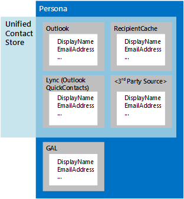

# Benutzer und Kontakte in EWS in Exchange

Informationen Sie zu Rollen, der einheitliche Kontaktspeicher und zum Arbeiten mit Kontakten durch Verwenden der EWS Managed API oder EWS in Exchange. 
  
Kontakte werden Elemente in Exchange, die Informationen zu einer einzelnen, Gruppe oder Organisation zu speichern. Kontakte können enthalten, Namen und e-Mail-Adressen und andere Informationen, einschließlich Instant Messaging-Adressen, physischen Adressen, Geburtstage, Produktfamilie Informationen und ein Foto oder Bild, das den Kontakt darstellt.
  
Kontaktinformationen wird in einem von zwei Orten gespeichert:
  
- Active Directory-Domänendienste (AD DS), wenn der Kontakt innerhalb der Organisation ist.
    
- Der Ordner Kontakte oder einen anderen Ordner im Postfach eines Benutzers, wenn der Kontakt außerhalb der Organisation ist.
    
Mehrere Kontaktelementen können eine Person darstellen. Exchange verwendet Rollen, die diese unterschiedlichen Kontaktelementen kombinieren unterstützen. Eine *Rolle* ist eine Aggregation von Kontaktinformationen für die gleiche Person aus verschiedenen Quellen. Darüber hinaus können Informationen in Exchange in Verbindung setzen Rollen auch von Informationen in der Empfängercache für das Postfach, einen ausgeblendeten Ordner für Instant Messaging-Kontakte aufgerufen QuickContacts, und von Drittanbieter-Datenquellen aggregiert werden. Der einheitliche Kontaktspeicher in Exchange ermöglicht Instant Messaging-Clients diese Aggregation verwenden. der einzige Unterschied ist, dass der einheitliche Kontaktspeicher Informationen von AD DS, nicht aggregiert werden, wie in Abbildung 1 dargestellt. 
  
**Abbildung 1. Kontaktinformationen Quellen für Rollen und der einheitliche Kontaktspeicher**

  
**In Tabelle 1. EWS Managed API-Methoden und EWS-Vorgänge für das Arbeiten mit Kontakten**

|**Aktion**|**Verwenden Sie diese Methode EWS Managed API**|**Zu verwendender EWS-Vorgang**|
|:-----|:-----|:-----|
|Erstellen eines neuen Kontakts    |Instanziieren Sie [ein neues Kontaktobjekt](http://msdn.microsoft.com/en-us/library/office/microsoft.exchange.webservices.data.contact%28v=exchg.80%29.aspx) und Verwenden von [Contact.Save](http://msdn.microsoft.com/en-us/library/office/microsoft.exchange.webservices.data.contact.save%28v=exchg.80%29.aspx)   |[CreateItem](http://msdn.microsoft.com/library/417e994b-0a17-4c24-9527-04796b80b029%28Office.15%29.aspx)   |
|Kopieren eines Kontakts    |[Contact.Copy](http://msdn.microsoft.com/en-us/library/office/microsoft.exchange.webservices.data.contact.copy%28v=exchg.80%29.aspx)   |[CopyItem](http://msdn.microsoft.com/library/bcc68f9e-d511-4c29-bba6-ed535524624a%28Office.15%29.aspx)   |
|Verschieben eines Kontakts    |[Contact.Move](http://msdn.microsoft.com/en-us/library/office/microsoft.exchange.webservices.data.contact.move%28v=exchg.80%29.aspx)   |[MoveItem](http://msdn.microsoft.com/library/dcf40fa7-7796-4a5c-bf5b-7a509a18d208%28Office.15%29.aspx)   |
|Aktualisieren eines vorhandenen Kontakts    |[Contact.Bind](http://msdn.microsoft.com/en-us/library/office/microsoft.exchange.webservices.data.contact.bind%28v=exchg.80%29.aspx) und [Contact.Update](http://msdn.microsoft.com/en-us/library/office/microsoft.exchange.webservices.data.contact.update%28v=exchg.80%29.aspx)   |[UpdateItem](http://msdn.microsoft.com/library/298fdd71-a83d-4407-9728-4f0a8e2d857c%28Office.15%29.aspx)   |
|Löschen eines Kontakts    |[Contact.Bind](http://msdn.microsoft.com/en-us/library/office/microsoft.exchange.webservices.data.contact.bind%28v=exchg.80%29.aspx) und [Contact.Delete](http://msdn.microsoft.com/en-us/library/office/microsoft.exchange.webservices.data.contact.delete%28v=exchg.80%29.aspx)   |[DeleteItem](../web-service-reference/deleteitem-operation.md)   |
|Suchen nach einem Kontakt    |[ExchangeService.FindItems](http://msdn.microsoft.com/en-us/library/office/microsoft.exchange.webservices.data.exchangeservice.finditems%28v=exchg.80%29.aspx)   |[FindItem](http://msdn.microsoft.com/library/ebad6aae-16e7-44de-ae63-a95b24539729%28Office.15%29.aspx)   |
|Suchen nach Personen    |–    |[FindPeople](http://msdn.microsoft.com/library/446106b7-ff2d-4107-90c1-29f4d38ba128%28Office.15%29.aspx)   |
|Erweitern einer Verteilergruppe    |[ExchangeService.ExpandGroup](http://msdn.microsoft.com/en-us/library/office/microsoft.exchange.webservices.data.exchangeservice.expandgroup%28v=exchg.80%29.aspx)   |[ExpandDL](http://msdn.microsoft.com/library/1f7837e7-9eff-4e10-9577-c40f7ed6af94%28Office.15%29.aspx)   |
|Einen mehrdeutigen Namen auflösen    |[ExchangeService.ResolveName](http://msdn.microsoft.com/en-us/library/office/microsoft.exchange.webservices.data.exchangeservice.resolvename%28v=exchg.80%29.aspx)   |[ResolveNames](http://msdn.microsoft.com/library/6b4eb4b3-9ad6-4804-a09f-7e20cfea4dbb%28Office.15%29.aspx)   |
|Abrufen einer Rolle    |–    |[GetPersona](http://msdn.microsoft.com/library/e2146df0-53d0-4caf-9758-b600bbc14b6a%28Office.15%29.aspx)   |
|Arbeiten mit Kontaktfotos    |[Contact.SetContactPicture](http://msdn.microsoft.com/en-us/library/office/microsoft.exchange.webservices.data.contact.setcontactpicture%28v=exchg.80%29.aspx), [Contact.GetContactPictureAttachment](http://msdn.microsoft.com/en-us/library/office/microsoft.exchange.webservices.data.contact.getcontactpictureattachment%28v=exchg.80%29.aspx)oder [Contact.RemoveContactPicture](http://msdn.microsoft.com/en-us/library/office/microsoft.exchange.webservices.data.contact.setcontactpicture%28v=exchg.80%29.aspx)   |[GetUserPhoto](http://msdn.microsoft.com/library/f6e8143d-4235-428e-8f9c-ab6e9b1cfa6e%28Office.15%29.aspx) oder [GetAttachment](http://msdn.microsoft.com/library/24d10a15-b942-415e-9024-a6375708f326%28Office.15%29.aspx)   |
   
## Personas

Bis vor kurzem wurden Kontakte häufig in einem einzigen Speicherort gespeichert – in der Regel auf ein e-Mail-Client. Heute, wird es zum Speichern von Kontakten an vielen verschiedenen Orten wie beispielsweise auf einem Telefon, auf einer Website für soziale Netzwerke, in einem Kontakteordner in einem Exchange-Postfach oder in einer Organisation Verzeichnisdienst häufiger immer. Die Verbreitung von Kontaktinformationen ist es möglich, dass mehrere Kontakte, die die gleiche Person darstellen unterschiedliche Informationen enthalten. Angenommen, ein Kontakt kann eine geschäftliche Telefonnummer enthalten und eine andere eine persönliche Telefonnummer oder einen Kontakt in einem Kontakteordner gespeichert möglicherweise einen anderen Namen als den Kontakt für die gleiche Person, die auf dem Telefon gespeichert ist.
  
In Exchange Online, Exchange Online als Teil von Office 365 und lokale Versionen von Exchange, beginnend mit Exchange 2013, werden Kontakte aus anderen Quellen, die die gleiche Person darstellen ähnlich wie, die e-Mail-Nachrichten miteinander verknüpft sind in Unterhaltungen aggregiert, über eine gemeinsame link ID ab. Aggregierte Kontaktinformationen von einem Exchange-Server zurückgegeben wird, enthält einen Satz mit Attributen für jeden Kontakt, wie eine des Quellordners, einen Anzeigenamen, eine ID und einen Quell-ID. Die Summe der Eigenschaften und Attribute zurückgegeben wird eine Rolle genannt, und die Gruppe von Eigenschaften zurückgegeben wird als [Rolle Shape](http://msdn.microsoft.com/library/61d87cd5-3270-40d1-bab7-d0d5bf938607%28Office.15%29.aspx)bezeichnet.
  
Da die Informationen, die einer Rolle besteht nicht an einem einzigen Speicherort gespeichert wird und diese Informationen können Sie jederzeit ändern kann, wird eine Rolle erstellt, nur, wenn Sie eine Anforderung an einem Exchange-Server vornehmen. Verwenden Sie [FindPeople](http://msdn.microsoft.com/library/446106b7-ff2d-4107-90c1-29f4d38ba128%28Office.15%29.aspx) EWS-Vorgangs, um eine Suchabfrage Persona vorzunehmen. Ihre Anforderung kann keine Sortierreihenfolge enthalten, und gemäß einer Abfragezeichenfolge, die Sie die richtige Rolle zu finden, indem Sie sortieren und Filtern der Ergebnisse unterstützen gefiltert werden kann. Beispielsweise können Sie den Anzeigenamen und eine Reihe von allen e-Mail-Adressen, die mit einem bestimmten Kontakt aus den Ordner Kontakte, ein Hotmail-Konto, ein LinkedIn-Konto und eines Unternehmens Verzeichnisdienst verknüpft sind abrufen, oder Sie können eine Reihe von alle Rollen abrufen, haben Sie Instant Messaging-Adressen. Das Verknüpfen von Kontakten in Rollen erfolgt automatisch basierend auf einen Algorithmus, der eine Beziehung zwischen Kontakte auf verschiedene Geräte erkennt. 
  
> [!NOTE]
> [!HINWEIS] Die verwaltete EWS-API implementiert diese Funktion nicht. 
  
**In Tabelle 2. EWS-Vorgänge für die Arbeit mit Rollen**

|**Name des Vorgangs**|**Beschreibung**|
|:-----|:-----|
|[FindPeople](http://msdn.microsoft.com/library/446106b7-ff2d-4107-90c1-29f4d38ba128%28Office.15%29.aspx)   |Gibt alle verfügbare Rollen in einem angegebenen Kontakteordner oder Kontakte, die eine angegebene Abfragezeichenfolge entsprechen abgerufen.    |
|[GetPersona](http://msdn.microsoft.com/library/e2146df0-53d0-4caf-9758-b600bbc14b6a%28Office.15%29.aspx)   |Gibt einen Satz von Eigenschaften, die einer bestimmten Rolle zugeordnet ist, wie alle Instant Messaging-Adressen oder Anzeigenamen für einen angegebenen Persona-ID.    |
   
Die **GetPersona** und **FindPeople** Vorgänge können Sie die Kontaktinformationen aus mehreren Quellen effizientes abrufen. Da alle Elemente im Zusammenhang mit einer Rolle ein Link-ID zugeordnet sind, können Sie diese Vorgänge in einer Vielzahl von Anwendungen, die Kontaktdaten verwenden. Es folgen einige Beispiele: 
  
- Eine Mobile Phone-app, die den Vorgang **GetPersona** verwendet, wenn ein Benutzer ein Kontakts anrufen, und klicken Sie dann zusätzliche Telefonnummern bietet aufrufen, wenn niemand beantwortet. 
    
- Eine Anwendung, die den **FindPeople** Vorgang wird verwendet, um die Überprüfung von Nachrichten im Posteingang für e-Mail-Adressen, um festzustellen, ob sie in einer vorhandenen Rolle gefunden werden. Adressen, die nicht bereits eine Rolle zugeordnet sind, können Vertriebskontakte oder einer Liste aller letzte Communications mit der Person, die diese Rolle dargestellte erstellen verwendet werden. 
    
- [Eine Mail-app für Outlook](mail-apps-for-outlook-and-ews-in-exchange.md) , die bietet verschiedene Grußformeln basiert, ob Korrespondenz formell oder informell. Formelle Grußformeln werden von den Anzeigenamen aus dem Verzeichnisdienst bereitgestellt wird, und informelle Grußformeln stammen aus der Anzeigename, der in sozialer Netzwerkkontakte stammt. 
    
## Einheitlicher Kontaktspeicher

Rollen sind nicht auf ein e-Mail-Client nur beschränkt. Bei der Entwicklung eines Instant Messaging-Clients, können Sie einige oder alle der folgenden Fragen:
  
- Wie kann ich Lync-Clientanwendungen mit einer Reihe von Kontaktelementen Instant Messaging bereitstellen?
    
- Wie ich verwalten im-Kontakt und gruppieren Listen?
    
- Wie werden benutzerdefinierte Lync-Client-Zugriff auf im-Kontakte und Sofortnachrichten Gruppen verwaltet?
    
Der einheitliche Kontaktspeicher arbeitet im Hintergrund im Exchange zum Kontakt Aggregieren von Daten aus Exchange und andere Quellen in eine einzelne Entität oder Rolle. Obwohl die EWS-Vorgänge, mit denen Sie Zugriff auf der einheitliche Kontaktspeicher für im-Kontakte spezifisch sind, können Sie der einheitliche Kontaktspeicher Rollen im alle Anwendungstypen entwickelt im Exchange verwenden. Behalten Sie im Hinterkopf, dass der einheitliche Kontaktspeicher Kontaktdaten AD DS zugreifen können.
  
Im-Kontakte werden in einem ausgeblendeten Ordner mit dem Namen QuickContacts gespeichert. Die **AddNewImContactToGroup** und **AddImContactToGroup** Vorgänge können Sie Gruppen hinzugefügt, die in diesem ausgeblendeten Ordner gespeichert sind. Und, da Sie der einheitliche Kontaktspeicher Instant Messaging-Kontakte Gruppieren verwenden können, können Sie Zugriff auf und aktualisieren Sie Gruppen von Kontakten leichter. 
  
> [!NOTE]
> [!HINWEIS] Die verwaltete EWS-API implementiert diese Funktion nicht. 
  
**Tabelle 3. EWS-Vorgänge für den Zugriff auf den einheitlichen Kontaktspeicher**

|**Name des Vorgangs**|**Beschreibung**|
|:-----|:-----|
|[AddNewImContactToGroup](http://msdn.microsoft.com/library/0cb5525f-faa3-48f1-9551-df55ffc26f46%28Office.15%29.aspx)   |Bis zu maximal 1000 Kontakte eine Instant Messaging-Gruppe hinzugefügt einen neuen Instant Messaging-Kontakt.    |
|[AddImContactToGroup](http://msdn.microsoft.com/library/376acc42-2684-4596-aca1-82a4a10865c9%28Office.15%29.aspx)   |Bis zu maximal 1000 Kontakte eine Instant Messaging-Gruppe hinzugefügt einen vorhandenen Instant Messaging-Kontakt.    |
|[AddImGroup](http://msdn.microsoft.com/library/6df6e504-b7c8-4773-b10f-ffa5defac229%28Office.15%29.aspx)   |Fügt eine neue Instant Messaging-Gruppe bis zu maximal 64 Gruppen hinzu.    |
|[AddDistributionGroupToImList](http://msdn.microsoft.com/library/5aa9bec8-71cf-4a6e-8ec8-b4965b40fd4a%28Office.15%29.aspx)   |Fügt eine neue Verteilergruppe zu einer Gruppe von Instant Messaging, bis zu maximal 64-Gruppen.    |
|[GetImItemList](http://msdn.microsoft.com/library/e31d14e1-0c1f-4b69-98b7-157d59c13698%28Office.15%29.aspx)   |Ruft eine Liste von Instant Messaging-Gruppen und Instant Messaging-Kontakt Rollen.    |
|[GetImItems](http://msdn.microsoft.com/library/51186691-46d2-4d5c-b8bc-4ee2bb20fbe7%28Office.15%29.aspx)   |Ruft Informationen über bestimmte Gruppen von Instant Messaging und Sofortnachrichten Rollen wenden Sie sich an.    |
|[RemoveContactFromImList](http://msdn.microsoft.com/library/28ec96c3-45af-48ff-9f17-718a527dc0ad%28Office.15%29.aspx)   |Entfernt einen Kontakt aus einer Gruppe von Sofortnachrichten.    |
|[RemoveImContactFromGroup](http://msdn.microsoft.com/library/a190bbec-c71b-4e6a-880b-55854c724d8c%28Office.15%29.aspx)   |Entfernt einen Sofortnachrichten-Kontakt aus einer Gruppe von Sofortnachrichten.    |
|[RemoveDistributionGroupFromImList](http://msdn.microsoft.com/library/252bddf2-98b6-4824-b548-2fba2bda5384%28Office.15%29.aspx)   |Entfernt eine Verteilergruppe aus einer Gruppe von Sofortnachrichten.    |
|[RemoveImGroup](http://msdn.microsoft.com/library/5e788016-68e0-4a3f-9243-03f6b6c6b389%28Office.15%29.aspx)   |Entfernt eine Instant Messaging-Gruppe an.    |
|[SetImGroup](http://msdn.microsoft.com/library/2d48aa07-8152-4c3d-a519-061253e80174%28Office.15%29.aspx)   |Ändert den Anzeigenamen einer Instant Messaging-Gruppe an.    |
   
## Inhalt dieses Abschnitts

- [Prozess Kontakte in Batches mithilfe der EWS in Exchange](how-to-process-contacts-in-batches-by-using-ews-in-exchange.md)
    
- [Lösen Sie mehrdeutige Namen auf, mithilfe von EWS in Exchange 2013](how-to-resolve-ambiguous-names-by-using-ews-in-exchange-2013.md)
    
- [Abrufen von benutzerfotos mithilfe der EWS in Exchange](how-to-get-user-photos-by-using-ews-in-exchange.md)
    
## Siehe auch

- [Entwickeln von Webdienstclients für Exchange](develop-web-service-clients-for-exchange.md)
    
- [Erste Schritte mit Webdiensten in Exchange](start-using-web-services-in-exchange.md)
    
- [Übersicht über den EWS-Cliententwurf für Exchange](ews-client-design-overview-for-exchange.md)
    

