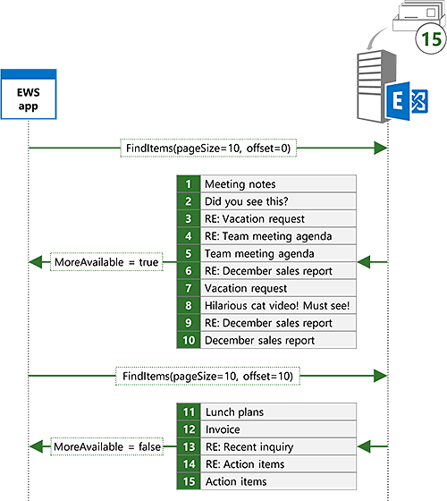
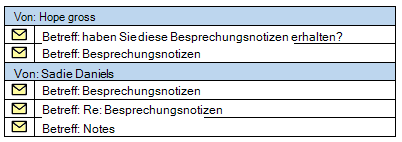

# <a name="search-and-ews-in-exchange"></a><span data-ttu-id="844c0-103">Suche und EWS in Exchange</span><span class="sxs-lookup"><span data-stu-id="844c0-103">Search and EWS in Exchange</span></span>

<span data-ttu-id="844c0-104">Erfahren Sie, wie Sie Elemente im Exchange mithilfe der EWS Managed API oder EWS zu suchen.</span><span class="sxs-lookup"><span data-stu-id="844c0-104">Find out how to search for items in Exchange by using the EWS Managed API or EWS.</span></span>
  
<span data-ttu-id="844c0-105">Kommt diese bekannt?</span><span class="sxs-lookup"><span data-stu-id="844c0-105">Does this sound familiar?</span></span> <span data-ttu-id="844c0-106">Starten Sie schließlich das Projekt, den, das Sie für Wochen haben, nicht jetzt noch, ein, und Sie benötigen Informationen über das Projekt, das Sie als Manager in Woche e-Mail gesendet.</span><span class="sxs-lookup"><span data-stu-id="844c0-106">You're finally starting that project you've been putting off for weeks, and you need information about the project that your manager sent you in email weeks ago.</span></span> <span data-ttu-id="844c0-107">Posteingang weist Hunderte oder vielleicht Tausende von Nachrichten auf.</span><span class="sxs-lookup"><span data-stu-id="844c0-107">Your Inbox has hundreds or perhaps thousands of messages in it.</span></span> <span data-ttu-id="844c0-108">Was machst du?</span><span class="sxs-lookup"><span data-stu-id="844c0-108">What do you do?</span></span> <span data-ttu-id="844c0-109">Blättern Sie durch Ihre e-Mails Scannen jeder Betreff und der Absender, bis Sie ihn finden?</span><span class="sxs-lookup"><span data-stu-id="844c0-109">Do you scroll through your email scanning each subject and sender until you find it?</span></span> <span data-ttu-id="844c0-110">Oder verwenden Sie die Suchfunktion in Ihrem bevorzugten e-Mail-Client schnell auf NULL auf, was Sie benötigen?</span><span class="sxs-lookup"><span data-stu-id="844c0-110">Or do you use the search feature in your favorite email client to quickly zero in on what you need?</span></span>
  
<span data-ttu-id="844c0-111">Suche ist wohl ein Feature muss für alle e-Mail-Clients.</span><span class="sxs-lookup"><span data-stu-id="844c0-111">Search is arguably a must-have feature for any email client.</span></span> <span data-ttu-id="844c0-112">Aber Suche deutlich mehr als nur die Benutzer sich ihr Postfach Suchen verwendet werden kann.</span><span class="sxs-lookup"><span data-stu-id="844c0-112">But search can be used for a lot more than just enabling users to search their mailbox.</span></span> <span data-ttu-id="844c0-113">Muss Ihre app Termine verarbeitet, die in bestimmten Zeitfenster fallen verwendet?</span><span class="sxs-lookup"><span data-stu-id="844c0-113">Does your app need to process appointments that fall within specific time windows?</span></span> <span data-ttu-id="844c0-114">Möglicherweise müssen Sie alle Aufgabenelemente mit einem bestimmten Status melden, oder verschieben Sie alle Kontakte mit einem bestimmten Unternehmen Namen in einen anderen Ordner.</span><span class="sxs-lookup"><span data-stu-id="844c0-114">Maybe you need to report on all task items with a specific status, or move all contacts with a specific company name to a different folder.</span></span> <span data-ttu-id="844c0-115">Hilfe können mit all diesen Anforderungen.</span><span class="sxs-lookup"><span data-stu-id="844c0-115">Search can help with all of these requirements.</span></span>
  
## <a name="search-basics"></a><span data-ttu-id="844c0-116">Grundlagen der Suche</span><span class="sxs-lookup"><span data-stu-id="844c0-116">Search basics</span></span>
<span data-ttu-id="844c0-117"><a name="bk_SearchBasics"> </a></span><span class="sxs-lookup"><span data-stu-id="844c0-117"></span></span>

<span data-ttu-id="844c0-118">Die EWS Managed API und EWS bieten zwei grundlegende Methoden zur Angabe einer Suche.</span><span class="sxs-lookup"><span data-stu-id="844c0-118">The EWS Managed API and EWS offer two basic methods for specifying a search.</span></span> <span data-ttu-id="844c0-119">Sie können einen [Suchfilter](how-to-use-search-filters-with-ews-in-exchange.md) oder eine [Abfragezeichenfolge](how-to-perform-an-aqs-search-by-using-ews-in-exchange.md)verwenden.</span><span class="sxs-lookup"><span data-stu-id="844c0-119">You can use a [search filter](how-to-use-search-filters-with-ews-in-exchange.md) or a [query string](how-to-perform-an-aqs-search-by-using-ews-in-exchange.md).</span></span> <span data-ttu-id="844c0-120">Die verwendete Methode hängt von der Absicht hinter der Suche.</span><span class="sxs-lookup"><span data-stu-id="844c0-120">The method you use depends on the intent behind your search.</span></span>
  
<span data-ttu-id="844c0-121">**In Tabelle 1. Szenarien für die Suchfilter und Suchabfragen**</span><span class="sxs-lookup"><span data-stu-id="844c0-121">**Table 1. Scenarios for search filters and search queries**</span></span>

|<span data-ttu-id="844c0-122">**Aktion**</span><span class="sxs-lookup"><span data-stu-id="844c0-122">**If you want to…**</span></span>|<span data-ttu-id="844c0-123">**Verwenden einer...**</span><span class="sxs-lookup"><span data-stu-id="844c0-123">**Use a…**</span></span>|<span data-ttu-id="844c0-124">**Anmerkungen**</span><span class="sxs-lookup"><span data-stu-id="844c0-124">**Notes**</span></span>|
|:-----|:-----|:-----|
|<span data-ttu-id="844c0-125">Beschränken Sie die Suche auf eine bestimmte Eigenschaft oder eine Gruppe von Eigenschaften</span><span class="sxs-lookup"><span data-stu-id="844c0-125">Limit your search to a specific property or set of properties</span></span>  <br/> |<span data-ttu-id="844c0-126">Suchfilter</span><span class="sxs-lookup"><span data-stu-id="844c0-126">Search filter</span></span>  <br/> |<span data-ttu-id="844c0-127">Suchfilter bieten die beste des Steuerelements über die Eigenschaften durchsucht werden.</span><span class="sxs-lookup"><span data-stu-id="844c0-127">Search filters provide the best level of control over which properties are searched.</span></span> <span data-ttu-id="844c0-128">Obwohl Abfragezeichenfolgen eine begrenzte Auswahl von Eigenschaften mithilfe von (Erweiterte Query Syntax, AQS) ausgerichtet werden, können eine beliebige Eigenschaft Suchfilter Ziel ein.</span><span class="sxs-lookup"><span data-stu-id="844c0-128">Although query strings can target a limited set of properties by using Advanced Query Syntax (AQS), search filters can target any property.</span></span>  <br/> |
|<span data-ttu-id="844c0-129">Suchvorgänge mit mehreren Kriterien erstellen</span><span class="sxs-lookup"><span data-stu-id="844c0-129">Create searches with multiple criteria</span></span>  <br/> |<span data-ttu-id="844c0-130">Suchfilter</span><span class="sxs-lookup"><span data-stu-id="844c0-130">Search filter</span></span>  <br/> |<span data-ttu-id="844c0-131">Suchfilter können mehrere Suchkriterien zusammen mit logisches AND oder or gleichzeitig, für die Suche wie "Betreff enthält 'Besprechungsnotizen' und Absender"Sadie Daniels"gleich" zulassen verknüpft werden.</span><span class="sxs-lookup"><span data-stu-id="844c0-131">With search filters, multiple search criteria can be joined together with logical ANDs or ORs, allowing for searches like "subject contains 'Meeting Notes' AND sender equals 'Sadie Daniels'".</span></span> <span data-ttu-id="844c0-132">Obwohl Abfragezeichenfolgen auch mehrere Suchkriterien beitreten können, sind sie auf die Gruppe von Eigenschaften von Abfragezeichenfolgen unterstützt beschränkt.</span><span class="sxs-lookup"><span data-stu-id="844c0-132">Although query strings can also join multiple search criteria, they are limited to the set of properties supported by query strings.</span></span>  <br/> |
|<span data-ttu-id="844c0-133">Benutzerdefinierte Eigenschaften der Suche</span><span class="sxs-lookup"><span data-stu-id="844c0-133">Search custom properties</span></span>  <br/> |<span data-ttu-id="844c0-134">Suchfilter</span><span class="sxs-lookup"><span data-stu-id="844c0-134">Search filter</span></span>  <br/> |<span data-ttu-id="844c0-135">Suchfilter können benutzerdefinierte Eigenschaften adressieren.</span><span class="sxs-lookup"><span data-stu-id="844c0-135">Search filters can target custom properties.</span></span> <span data-ttu-id="844c0-136">Benutzerdefinierte Eigenschaften suchen Abfragezeichenfolgen nicht.</span><span class="sxs-lookup"><span data-stu-id="844c0-136">Query strings do not search custom properties.</span></span>  <br/> |
|<span data-ttu-id="844c0-137">Führen Sie eine Suche Groß-/Kleinschreibung von Zeichenfolgeneigenschaften</span><span class="sxs-lookup"><span data-stu-id="844c0-137">Perform a case sensitive search of string properties</span></span>  <br/> |<span data-ttu-id="844c0-138">Suchfilter</span><span class="sxs-lookup"><span data-stu-id="844c0-138">Search filter</span></span>  <br/> |<span data-ttu-id="844c0-139">Abfrage Zeichenfolgensuchen sind nicht zwischen Groß-und Kleinschreibung.</span><span class="sxs-lookup"><span data-stu-id="844c0-139">Query string searches are not case sensitive.</span></span>  <br/> |
|<span data-ttu-id="844c0-140">Steuern des Beschränkung Modus bei der Suche Zeichenfolgeneigenschaften</span><span class="sxs-lookup"><span data-stu-id="844c0-140">Control the containment mode when searching string properties</span></span>  <br/> |<span data-ttu-id="844c0-141">Suchfilter</span><span class="sxs-lookup"><span data-stu-id="844c0-141">Search filter</span></span>  <br/> |<span data-ttu-id="844c0-142">Abfrage Zeichenfolgensuchen sind immer Suchvorgänge nach Teilzeichenfolgen dar.</span><span class="sxs-lookup"><span data-stu-id="844c0-142">Query string searches are always substring searches.</span></span> <span data-ttu-id="844c0-143">Wenn Sie müssen zum Suchen nach bestimmten Präfixen oder nach genauen Übereinstimmungen erfordern, ist ein Suchfilter die beste Wahl.</span><span class="sxs-lookup"><span data-stu-id="844c0-143">If you need to search for specific prefixes, or require exact matches, a search filter is the best choice.</span></span>  <br/> |
|<span data-ttu-id="844c0-144">Suchen nach Ordnern</span><span class="sxs-lookup"><span data-stu-id="844c0-144">Search for folders</span></span>  <br/> |<span data-ttu-id="844c0-145">Suchfilter</span><span class="sxs-lookup"><span data-stu-id="844c0-145">Search filter</span></span>  <br/> |<span data-ttu-id="844c0-146">Suchen nach Ordnern mit einer Abfragezeichenfolge unterstützt EWS nicht.</span><span class="sxs-lookup"><span data-stu-id="844c0-146">EWS does not support searching for folders with a query string.</span></span>  <br/> |
|<span data-ttu-id="844c0-147">Erstellen eines Suchordners</span><span class="sxs-lookup"><span data-stu-id="844c0-147">Create a search folder</span></span>  <br/> |<span data-ttu-id="844c0-148">Suchfilter</span><span class="sxs-lookup"><span data-stu-id="844c0-148">Search filter</span></span>  <br/> |<span data-ttu-id="844c0-149">Erstellen von Suchordnern mit einer Abfragezeichenfolge unterstützt EWS nicht.</span><span class="sxs-lookup"><span data-stu-id="844c0-149">EWS does not support creating search folders with a query string.</span></span>  <br/> |
|<span data-ttu-id="844c0-150">Suchfunktion im Webstil für alle verwendete häufig Eigenschaften</span><span class="sxs-lookup"><span data-stu-id="844c0-150">Search across all commonly used properties</span></span>  <br/> |<span data-ttu-id="844c0-151">Abfragezeichenfolge</span><span class="sxs-lookup"><span data-stu-id="844c0-151">Query string</span></span>  <br/> |<span data-ttu-id="844c0-152">Abfragezeichenfolgen, die nicht AQS enthalten werden über alle am häufigsten verwendeten Eigenschaften gesucht.</span><span class="sxs-lookup"><span data-stu-id="844c0-152">Query strings that do not contain AQS will search across all commonly used properties.</span></span> <span data-ttu-id="844c0-153">Abfrage String-Wert "Mack Chaves" gibt beispielsweise alle Nachrichten von Mack Chaves als auch für alle Nachrichten mit "Mack Chaves" im Nachrichtentext oder der Betreff zurück.</span><span class="sxs-lookup"><span data-stu-id="844c0-153">For example, a query string value of "Mack Chaves" will return all messages sent by Mack Chaves as well as any messages that have "Mack Chaves" in the body or subject.</span></span>  <br/> |
|<span data-ttu-id="844c0-154">Erstellen Sie eine Suche basierend auf einfache Benutzereingabe</span><span class="sxs-lookup"><span data-stu-id="844c0-154">Construct a search based on simple user input</span></span>  <br/> |<span data-ttu-id="844c0-155">Abfragezeichenfolge</span><span class="sxs-lookup"><span data-stu-id="844c0-155">Query string</span></span>  <br/> |<span data-ttu-id="844c0-156">Eine Abfragezeichenfolge ist eine hervorragende Wahl für die Endbenutzer quick Suche durchgeführt werden soll, indem Sie in eine einfache Zeichenfolge eingeben.</span><span class="sxs-lookup"><span data-stu-id="844c0-156">A query string is a great choice for allowing an end user to do a quick search by typing in a simple string.</span></span> <span data-ttu-id="844c0-157">Da eine Abfrage Zeichenfolgensuche alle am häufigsten verwendete Eigenschaften enthält, werden die Ergebnisse Elemente enthalten, die der Benutzer die Suchbegriffe enthalten.</span><span class="sxs-lookup"><span data-stu-id="844c0-157">Because a query string search includes all commonly used properties, the results will contain any items that contain the user's search terms.</span></span>  <br/> |
   
### <a name="using-a-search-filter"></a><span data-ttu-id="844c0-158">Verwenden einen Filter für die Suche</span><span class="sxs-lookup"><span data-stu-id="844c0-158">Using a search filter</span></span>

<span data-ttu-id="844c0-159">Suchfilter können Sie eine Vielzahl von Suchoptionen und den höchsten Grad steuern, wie die Suche ausgeführt wird.</span><span class="sxs-lookup"><span data-stu-id="844c0-159">Search filters give you a wide range of search options and the greatest degree of control over how the search is performed.</span></span> <span data-ttu-id="844c0-160">Sie können zum Ausführen von grundlegenden Gleichheit und Vergleich sucht Suchfilter verwenden, aber Sie können auch den Inhalt der Zeichenfolgeneigenschaften suchen oder Bitmaske Vergleiche.</span><span class="sxs-lookup"><span data-stu-id="844c0-160">You can use search filters to perform basic equality and comparison searches, but you can also search within the contents of string properties or do bitmask comparisons.</span></span>
  
<span data-ttu-id="844c0-161">Beispielsweise können Sie den Inhalt des Betreffs von Elementen mithilfe der [SearchFilter.ContainsSubstring](http://msdn.microsoft.com/en-us/library/microsoft.exchange.webservices.data.searchfilter.containssubstring%28v=exchg.80%29.aspx) -Klasse in die EWS Managed API suchen.</span><span class="sxs-lookup"><span data-stu-id="844c0-161">For example, you can search the contents of the subject of items by using the [SearchFilter.ContainsSubstring](http://msdn.microsoft.com/en-us/library/microsoft.exchange.webservices.data.searchfilter.containssubstring%28v=exchg.80%29.aspx) class in the EWS Managed API.</span></span> <span data-ttu-id="844c0-162">In diesem Beispiel wird ein Suchfilter erstellt, um den Betreff für die Teilzeichenfolge "Besprechungsnotizen" wird zu suchen.</span><span class="sxs-lookup"><span data-stu-id="844c0-162">In this example, a search filter is created to search the subject for the substring "meeting notes", ignoring case.</span></span> 
  
```cs
SearchFilter.ContainsSubstring subjectFilter = new SearchFilter.ContainsSubstring(ItemSchema.Subject,
    "meeting notes", ContainmentMode.Substring, ComparisonMode.IgnoreCase);
```

<span data-ttu-id="844c0-163">Sie können auch mit benutzerdefinierten Eigenschaften suchen.</span><span class="sxs-lookup"><span data-stu-id="844c0-163">You can also search against custom properties.</span></span> <span data-ttu-id="844c0-164">In diesem Beispiel wird die benutzerdefinierte Eigenschaft **ItemIndex** für Werte, die größer als 3 durchsucht.</span><span class="sxs-lookup"><span data-stu-id="844c0-164">In this example, the custom property **ItemIndex** is searched for values greater than 3.</span></span> 
  
```cs
Guid MyAppGuid = new Guid("{AA3DF801-4FC7-401F-BBC1-7C93D6498C2E}");
ExtendedPropertyDefinition customPropDefinition =
    new ExtendedPropertyDefinition(MyAppGuid, "ItemIndex", MapiPropertyType.Integer); 
SearchFilter.IsGreaterThan customPropFilter =
    new SearchFilter.IsGreaterThan(customPropDefinition, 3);
```

<span data-ttu-id="844c0-165">Sie können auch mehrere Suchfilter zum komplexere Suchvorgänge kombinieren.</span><span class="sxs-lookup"><span data-stu-id="844c0-165">You can also combine multiple search filters to create more complex searches.</span></span> <span data-ttu-id="844c0-166">Beispielsweise können Sie die vorherigen beiden Filter mit ein logisches AND kombinieren, mithilfe der [SearchFilter.SearchFilterCollection](http://msdn.microsoft.com/en-us/library/microsoft.exchange.webservices.data.searchfilter.searchfiltercollection%28v=exchg.80%29.aspx) -Klasse.</span><span class="sxs-lookup"><span data-stu-id="844c0-166">For example, you can combine the previous two filters with a logical AND by using the [SearchFilter.SearchFilterCollection](http://msdn.microsoft.com/en-us/library/microsoft.exchange.webservices.data.searchfilter.searchfiltercollection%28v=exchg.80%29.aspx) class.</span></span> 
  
```cs
SearchFilter.SearchFilterCollection compoundFilter =
    new SearchFilter.SearchFilterCollection(LogicalOperator.And, subjectFilter, customPropFilter);
```

### <a name="using-a-query-string"></a><span data-ttu-id="844c0-167">Verwenden einer Abfragezeichenfolge</span><span class="sxs-lookup"><span data-stu-id="844c0-167">Using a query string</span></span>

<span data-ttu-id="844c0-168">Abfragezeichenfolgen bieten einen anderen Ansatz zum Suchen.</span><span class="sxs-lookup"><span data-stu-id="844c0-168">Query strings provide a different approach to search.</span></span> <span data-ttu-id="844c0-169">Sie haben weniger Kontrolle über die Felder, die durchsucht werden und wie die Suche ausgeführt wird, wenn Sie eine Abfrage Zeichenfolgensuche verwenden.</span><span class="sxs-lookup"><span data-stu-id="844c0-169">You have less control over the fields that are searched and how the search is performed when you use a query string search.</span></span> <span data-ttu-id="844c0-170">Nicht ab, die eine schlechte Sache ist!</span><span class="sxs-lookup"><span data-stu-id="844c0-170">Not that that's a bad thing!</span></span> <span data-ttu-id="844c0-171">In einigen Fällen möchten Sie möglicherweise ein breiter Netz, sodass Basisdaten umgewandelt.</span><span class="sxs-lookup"><span data-stu-id="844c0-171">In some cases, you might want to cast a wider net, so to speak.</span></span>
  
<span data-ttu-id="844c0-172">Beispielsweise können Sie nach "Besprechungsnotizen" suchen, mit der [ExchangeService.FindItems](http://msdn.microsoft.com/en-us/library/jj223808%28v=exchg.80%29.aspx) EWS Managed API-Methode.</span><span class="sxs-lookup"><span data-stu-id="844c0-172">For example, you can search for "meeting notes" by using the [ExchangeService.FindItems](http://msdn.microsoft.com/en-us/library/jj223808%28v=exchg.80%29.aspx) EWS Managed API method.</span></span> 
  
```cs
FindItemsResults<Item> results = service.FindItems(folder, "meeting notes", view);
```

<span data-ttu-id="844c0-173">Wenn Sie die Ergebnisse dieser Suche an die Ergebnisse zuvor im **SearchFilter.ContainsSubstring** Search Beispiel vergleichen, wird diese Suche weitere Ergebnisse enthalten.</span><span class="sxs-lookup"><span data-stu-id="844c0-173">If you compare the results of this search to the results of the **SearchFilter.ContainsSubstring** search example earlier, this search will contain more results.</span></span> <span data-ttu-id="844c0-174">Die Filter-Suche gibt nur Elemente zurück, die "Besprechungsnotizen" in der Betreffzeile haben, während diese Suche Elemente zurückgibt, die "Besprechungsnotizen" in den Betreff, Textkörper und andere Felder aufweisen.</span><span class="sxs-lookup"><span data-stu-id="844c0-174">The search filter search will return only items that have "meeting notes" in the subject, while this search will return items that have "meeting notes" in the subject, body, and other fields.</span></span> 
  
<span data-ttu-id="844c0-175">Sehen wir uns an, wie Sie die Abfragezeichenfolge näher auf die Ergebnisse abgerufen, die Sie aus dem Suchfilter finden Sie unter optimieren können.</span><span class="sxs-lookup"><span data-stu-id="844c0-175">Let's take a look at how you can refine the query string to get closer to the results you see from the search filter.</span></span> <span data-ttu-id="844c0-176">AQS verwenden, können Sie die Suche auf den Betreff beschränken.</span><span class="sxs-lookup"><span data-stu-id="844c0-176">Using AQS, you can limit your search to the subject.</span></span>
  
```cs
FindItemsResults<Item> results = service.FindItems(folder, "subject:meeting notes", view);
```

<span data-ttu-id="844c0-177">Hierbei handelt es sich um näher, aber die Ergebnisse sind noch nicht ganz identisch.</span><span class="sxs-lookup"><span data-stu-id="844c0-177">This is closer, but the results are still not quite the same.</span></span> <span data-ttu-id="844c0-178">Wenn Sie eine Abfragezeichenfolge mit mehreren Wörtern verwenden, erhalten Sie Übereinstimmungen, selbst wenn die Wörter nicht in der Reihenfolge sind die von die Ihnen angegebenen oder selbst wenn sie nicht nebeneinander sind.</span><span class="sxs-lookup"><span data-stu-id="844c0-178">When you use a query string with multiple words, you will get matches even if the words are not in the order you specify, or even if they're not adjacent to each other.</span></span> <span data-ttu-id="844c0-179">Mit der Abfragezeichenfolge "Betreff: Besprechungsnotizen" werden Sie Übereinstimmungen für "Besprechungsnotizen", "Notizen aus der Besprechung" erhalten möchten, und so weiter.</span><span class="sxs-lookup"><span data-stu-id="844c0-179">With the query string "subject:meeting notes", you will get matches for "meeting notes", "notes from the meeting", and so on.</span></span> <span data-ttu-id="844c0-180">Zum verfeinern, können Sie die Suchbegriffe in doppelte Anführungszeichen, um anzugeben, dass Sie diesen Ausdruck nur möchten umbrechen.</span><span class="sxs-lookup"><span data-stu-id="844c0-180">To further refine, you can wrap the search terms in double quotes to indicate that you want that phrase only.</span></span>
  
```cs
FindItemsResults<Item> results = service.FindItems(folder, "subject:\"meeting notes\"", view);
```

## <a name="requesting-specific-properties-in-search-results"></a><span data-ttu-id="844c0-181">Anfordern von bestimmten Eigenschaften in Suchergebnissen</span><span class="sxs-lookup"><span data-stu-id="844c0-181">Requesting specific properties in search results</span></span>
<span data-ttu-id="844c0-182"><a name="bk_RequestSpecific"> </a></span><span class="sxs-lookup"><span data-stu-id="844c0-182"></span></span>

<span data-ttu-id="844c0-183">Standardmäßig werden Suchergebnisse alle Eigenschaften für die Elemente enthalten, die den Suchkriterien entsprechen.</span><span class="sxs-lookup"><span data-stu-id="844c0-183">By default, search results will contain all properties on the items that match the search.</span></span> <span data-ttu-id="844c0-184">In einigen Fällen möglicherweise verfügbare, aber in den meisten Fällen die Anwendung erfordert nur einen einzelnen Satz von Eigenschaften.</span><span class="sxs-lookup"><span data-stu-id="844c0-184">In some cases this might be what you want, but in most cases your application only requires a discrete set of properties.</span></span> <span data-ttu-id="844c0-185">In diesem Fall sollten Sie begrenzen, die Gruppe von Eigenschaften, die auf die Eigenschaften die Anwendung zurückgegeben werden muss.</span><span class="sxs-lookup"><span data-stu-id="844c0-185">In this case, you should limit the set of properties that are returned to only the properties your application needs.</span></span> <span data-ttu-id="844c0-186">Im folgenden Beispiel wird die [aufrufenArtikel aufrufen](http://msdn.microsoft.com/en-us/library/microsoft.exchange.webservices.data.itemview%28v=exchg.80%29.aspx) -Klasse verwendet, um begrenzen die zurückgegebenen Eigenschaften auf den Betreff Datum/Uhrzeit empfangen und die ID der Elemente.</span><span class="sxs-lookup"><span data-stu-id="844c0-186">In the following example, the [ItemView](http://msdn.microsoft.com/en-us/library/microsoft.exchange.webservices.data.itemview%28v=exchg.80%29.aspx) class is used to limit the returned properties to the subject, date/time received, and ID of the items.</span></span> 
  
```cs
ItemView view = new ItemView(10);
// Creating a new PropertySet with this constructor includes 
// ItemSchema.Id.
view.PropertySet = new PropertySet(ItemSchema.Subject, ItemSchema.DateTimeReceived);
```

## <a name="controlling-search-depth"></a><span data-ttu-id="844c0-187">Steuern des Search-Tiefe</span><span class="sxs-lookup"><span data-stu-id="844c0-187">Controlling search depth</span></span>
<span data-ttu-id="844c0-188"><a name="bk_SearchDepth"> </a></span><span class="sxs-lookup"><span data-stu-id="844c0-188"></span></span>

<span data-ttu-id="844c0-189">Festlegen der Durchlauf für die Ansicht steuert die projekttiefe und den Umfang der Suche.</span><span class="sxs-lookup"><span data-stu-id="844c0-189">Setting the traversal on the view controls the depth and scope of the search.</span></span> 
  
<span data-ttu-id="844c0-190">**In Tabelle 2. Durchqueren Suchwerten**</span><span class="sxs-lookup"><span data-stu-id="844c0-190">**Table 2. Search traversal values**</span></span>

|<span data-ttu-id="844c0-191">**Traversal Wert**</span><span class="sxs-lookup"><span data-stu-id="844c0-191">**Traversal value**</span></span>|<span data-ttu-id="844c0-192">**Betrifft**</span><span class="sxs-lookup"><span data-stu-id="844c0-192">**Applies to**</span></span>|<span data-ttu-id="844c0-193">**Beschreibung**</span><span class="sxs-lookup"><span data-stu-id="844c0-193">**Description**</span></span>|
|:-----|:-----|:-----|
|<span data-ttu-id="844c0-194">Flach</span><span class="sxs-lookup"><span data-stu-id="844c0-194">Shallow</span></span>  <br/> |<span data-ttu-id="844c0-195">Elemente und Ordner</span><span class="sxs-lookup"><span data-stu-id="844c0-195">Items and Folders</span></span>  <br/> |<span data-ttu-id="844c0-196">Flache Suchvorgänge können nur direkte untergeordnete Elemente des Ordners, der durchsucht wird.</span><span class="sxs-lookup"><span data-stu-id="844c0-196">Shallow searches are limited to direct children of the folder being searched.</span></span>  <br/> |
|<span data-ttu-id="844c0-197">Tief</span><span class="sxs-lookup"><span data-stu-id="844c0-197">Deep</span></span>  <br/> |<span data-ttu-id="844c0-198">Elemente (nur bei Suchordnern) und Ordner</span><span class="sxs-lookup"><span data-stu-id="844c0-198">Items (only with search folders) and Folders</span></span>  <br/> |<span data-ttu-id="844c0-199">Tiefe Suchvorgänge rekursiv Suchen der durchsuchte Ordner und Unterordner.</span><span class="sxs-lookup"><span data-stu-id="844c0-199">Deep searches recursively search the folder being searched and subfolders.</span></span>  <br/> |
|<span data-ttu-id="844c0-200">Verknüpft ist</span><span class="sxs-lookup"><span data-stu-id="844c0-200">Associated</span></span>  <br/> |<span data-ttu-id="844c0-201">Elemente</span><span class="sxs-lookup"><span data-stu-id="844c0-201">Items</span></span>  <br/> |<span data-ttu-id="844c0-202">Zugehörige suchen umfassen nur zugeordnete Elemente aus dem Ordner, der durchsucht wird.</span><span class="sxs-lookup"><span data-stu-id="844c0-202">Associated searches only include associated items from the folder being searched.</span></span> <span data-ttu-id="844c0-203">Zugeordnete Elemente sind ausgeblendete Elemente im Ordner.</span><span class="sxs-lookup"><span data-stu-id="844c0-203">Associated items are hidden items within the folder.</span></span>  <br/> |
|<span data-ttu-id="844c0-204">SoftDeleted</span><span class="sxs-lookup"><span data-stu-id="844c0-204">SoftDeleted</span></span>  <br/> |<span data-ttu-id="844c0-205">Elemente und Ordner</span><span class="sxs-lookup"><span data-stu-id="844c0-205">Items and Folders</span></span>  <br/> |<span data-ttu-id="844c0-206">Dieses Typs durchqueren ist veraltet.</span><span class="sxs-lookup"><span data-stu-id="844c0-206">This traversal type is deprecated.</span></span> <span data-ttu-id="844c0-207">SoftDeleted suchen umfassen nur Elemente in der muss.</span><span class="sxs-lookup"><span data-stu-id="844c0-207">SoftDeleted searches only include items that are in the dumpster.</span></span> <span data-ttu-id="844c0-208">Die Dumpster wurde durch den [Ordner "wiederherstellbare Elemente"](https://docs.microsoft.com/en-us/exchange/policy-and-compliance/recoverable-items-folder/recoverable-items-folder) in Exchange Online, Exchange Online als Teil von Office 365 und Exchange beginnend mit Exchange 2010-Versionen ersetzt.</span><span class="sxs-lookup"><span data-stu-id="844c0-208">The dumpster has been replaced by the [Recoverable Items Folder](https://docs.microsoft.com/en-us/exchange/policy-and-compliance/recoverable-items-folder/recoverable-items-folder) in Exchange Online, Exchange Online as part of Office 365, and versions of Exchange starting with Exchange 2010.</span></span>  <br/> |
   
## <a name="managing-search-results"></a><span data-ttu-id="844c0-209">Verwalten von Suchergebnissen</span><span class="sxs-lookup"><span data-stu-id="844c0-209">Managing search results</span></span>
<span data-ttu-id="844c0-210"><a name="bk_ManageSearchResults"> </a></span><span class="sxs-lookup"><span data-stu-id="844c0-210"></span></span>

<span data-ttu-id="844c0-211">Die EWS Managed API und EWS können Sie auch ändern, wie die Suchergebnisse zurückgegeben werden.</span><span class="sxs-lookup"><span data-stu-id="844c0-211">The EWS Managed API and EWS also allow you to change how your search results are returned.</span></span> <span data-ttu-id="844c0-212">Sie können mithilfe von Ansichten können Sie angeben, welche Eigenschaften in den Ergebnissen enthalten sind, Ergebnisse sortieren und page Ihre Ergebnisse, um ähnliche nur eine festgelegte Anzahl von Ergebnissen pro Antwort erhalten.</span><span class="sxs-lookup"><span data-stu-id="844c0-212">You can use views to specify which properties are included in the results, sort results, and page your results to only get back a set number of results per response.</span></span> <span data-ttu-id="844c0-213">Sie können auch Ergebnisse nach bestimmten Feldwerte und Steuerelement die Tiefe der Suche durch Angabe eines bestimmten durchqueren gruppieren.</span><span class="sxs-lookup"><span data-stu-id="844c0-213">You can also group results by specific field values and control the depth of a search by specifying a traversal type.</span></span> <span data-ttu-id="844c0-214">Suchordner können Sie schließlich permanente Suchläufe erstellen, die dynamisch Eintreffen neuer Elemente aktualisiert werden.</span><span class="sxs-lookup"><span data-stu-id="844c0-214">Finally, you can use search folders to create persistent searches that are updated dynamically as new items arrive.</span></span>
  
### <a name="sorting"></a><span data-ttu-id="844c0-215">Sortieren</span><span class="sxs-lookup"><span data-stu-id="844c0-215">Sorting</span></span>

<span data-ttu-id="844c0-216">Sie können den Server um sortierte Ergebnisse zurückzugeben, die angezeigt werden soll oder Verarbeiten von Elementen in der Reihenfolge erleichtern abrufen.</span><span class="sxs-lookup"><span data-stu-id="844c0-216">You can get the server to return sorted results, which can make it easier to display or process items in order.</span></span> <span data-ttu-id="844c0-217">In diesem Beispiel werden die Ergebnisse nach Datum/Uhrzeit-erhalten haben, mit den neuesten Elemente der ersten sortiert werden.</span><span class="sxs-lookup"><span data-stu-id="844c0-217">In this example, the results will be sorted by the date/time received, with the newest items being first.</span></span>
  
```cs
view.OrderBy.Add(ItemSchema.DateTimeReceived, SortDirection.Descending);
```

### <a name="paging"></a><span data-ttu-id="844c0-218">Paging</span><span class="sxs-lookup"><span data-stu-id="844c0-218">Paging</span></span>

<span data-ttu-id="844c0-219">Wenn Sie eine Suchanfrage mithilfe des EWS Managed API oder EWS senden, geben Sie eine Ansichtsgröße, die steuert die maximale Anzahl der zurückgegebenen Elemente an.</span><span class="sxs-lookup"><span data-stu-id="844c0-219">When you send a search request by using the EWS Managed API or EWS, you specify a view size, which controls the maximum number of items returned.</span></span> <span data-ttu-id="844c0-220">Die Anzahl der Elemente auf dem Server, die den Suchkriterien entsprechen größer als die Ansichtsgröße möglicherweise.</span><span class="sxs-lookup"><span data-stu-id="844c0-220">However, the number of items on the server that match your search might be larger than the view size.</span></span> <span data-ttu-id="844c0-221">In diesem Fall gibt den Server an, dass weitere Artikel zur Verfügung stehen.</span><span class="sxs-lookup"><span data-stu-id="844c0-221">In this case, the server indicates that more items are available.</span></span> <span data-ttu-id="844c0-222">Sie können [verwenden, um die Suche wiederholen die Paging](how-to-perform-paged-searches-by-using-ews-in-exchange.md) und Abrufen der nächsten Gruppe von Ergebnissen.</span><span class="sxs-lookup"><span data-stu-id="844c0-222">You can [use paging to repeat your search](how-to-perform-paged-searches-by-using-ews-in-exchange.md) and get the next set of results.</span></span> 
  
<span data-ttu-id="844c0-223">Beispielsweise können Sie eine Suchanfrage mit einer Ansichtsgröße von 10 senden.</span><span class="sxs-lookup"><span data-stu-id="844c0-223">For example, you can send a search request with a view size of 10.</span></span> <span data-ttu-id="844c0-224">Es könnten 15 Elemente auf dem Server, die den Suchkriterien entsprechen, aber Sie erhalten nur dann wieder die ersten 10, Indikator (die [FindItemsResults\<TItem\>. MoreAvailable](http://msdn.microsoft.com/en-us/library/dd635477%28v=exchg.80%29.aspx) Eigenschaft, wenn Sie die EWS Managed API verwenden), dass weitere Ergebnisse auf dem Server vorhanden sind.</span><span class="sxs-lookup"><span data-stu-id="844c0-224">There might be 15 items on the server that match your search, but you will only get back the first 10, along with an indicator (the [FindItemsResults\<TItem\>.MoreAvailable](http://msdn.microsoft.com/en-us/library/dd635477%28v=exchg.80%29.aspx) property if you're using the EWS Managed API) that there are more results on the server.</span></span> <span data-ttu-id="844c0-225">Sie können dann senden die gleiche Suche mit einem Offset von 10 Fragen für die nächsten 10 Elemente, die den Suchkriterien entsprechen.</span><span class="sxs-lookup"><span data-stu-id="844c0-225">You can then send the same search with an offset of 10 to ask for the next 10 items that match your search.</span></span> <span data-ttu-id="844c0-226">Der Server gibt die verbleibenden fünf Elemente zurück.</span><span class="sxs-lookup"><span data-stu-id="844c0-226">The server will return the remaining five items.</span></span> 
  
<span data-ttu-id="844c0-227">**Abbildung 1. Ausgelagerte Suche-Beispiel**</span><span class="sxs-lookup"><span data-stu-id="844c0-227">**Figure 1. Paged search example**</span></span>


  
### <a name="grouping"></a><span data-ttu-id="844c0-231">Gruppieren</span><span class="sxs-lookup"><span data-stu-id="844c0-231">Grouping</span></span>

 <span data-ttu-id="844c0-232">Exchange können Sie zur Gruppe der Suchergebnisse nach einem bestimmten Feld.</span><span class="sxs-lookup"><span data-stu-id="844c0-232">Exchange enables you to group search results by a specific field.</span></span> <span data-ttu-id="844c0-233">Damit können Sie die Suchergebnisse in leichter Gruppen unterteilen.</span><span class="sxs-lookup"><span data-stu-id="844c0-233">This can help break up search results into more manageable sets.</span></span> <span data-ttu-id="844c0-234">Beispielsweise können Sie "Besprechungsnotizen" gesucht und die Ergebnisse nach Absender gruppiert.</span><span class="sxs-lookup"><span data-stu-id="844c0-234">For example, you can search for "meeting notes" and group the results by sender.</span></span> <span data-ttu-id="844c0-235">Wie in der folgenden Abbildung gezeigt, werden der zurückgegebenen Elemente in Gruppen, die mit allen aufgeteilt werden die Elemente, die den Suchkriterien vom selben Absender in einer Gruppe: alle übereinstimmenden Elemente aus einer anderen Absender in einer anderen Gruppe usw..</span><span class="sxs-lookup"><span data-stu-id="844c0-235">As shown in the following figure, the items returned will be separated into groups, with all the items that match the criteria from the same sender in one group, all the matching items from another sender in another group, and so on.</span></span> 
  
<span data-ttu-id="844c0-236">**Abbildung 2. Die Suchergebnisse nach Absender gruppiert**</span><span class="sxs-lookup"><span data-stu-id="844c0-236">**Figure 2. Search results grouped by sender**</span></span>


  
## <a name="search-folders"></a><span data-ttu-id="844c0-238">Suchordner</span><span class="sxs-lookup"><span data-stu-id="844c0-238">Search folders</span></span>
<span data-ttu-id="844c0-239"><a name="bk_SearchFolders"> </a></span><span class="sxs-lookup"><span data-stu-id="844c0-239"></span></span>

<span data-ttu-id="844c0-240">Mit einem regulären-Suche für die Suche wird ausgeführt, die Ergebnisse werden an die Anwendung zur Verarbeitung zurückgegeben und für die Suche nicht mehr vorhanden.</span><span class="sxs-lookup"><span data-stu-id="844c0-240">With a regular search, the search is executed, the results are returned to your application for processing, and the search ceases to exist.</span></span> <span data-ttu-id="844c0-241">Suchordner bieten eine Möglichkeit, eine Suche dauerhaft zu machen.</span><span class="sxs-lookup"><span data-stu-id="844c0-241">Search folders provide a way to make a search persistent.</span></span> <span data-ttu-id="844c0-242">Dies ist eine hervorragende Option für Suchvorgänge, die Sie wissen, dass mehrmals ausgeführt werden soll.</span><span class="sxs-lookup"><span data-stu-id="844c0-242">This is a great option for searches that you know you will want to execute multiple times.</span></span> <span data-ttu-id="844c0-243">Statt die gleiche Suche wiederholt ausführen, macht und den Server für die Suche von Grund auf jedes Mal bewerten ein Suchordner eine Suche immer auf, so dass der Server aktualisieren das vorhandene Ergebnis festzulegen, wie Elemente hinzugefügt werden oder aus den Suchbereich entfernt.</span><span class="sxs-lookup"><span data-stu-id="844c0-243">Rather than executing the same search repeatedly, causing the server to evaluate the search from scratch each time, a search folder makes a search always on, allowing the server to update the existing result set as items are added to or removed from the search scope.</span></span> <span data-ttu-id="844c0-244">Ordner Act wie normale Ordner zu suchen, dass sie als Ordner angezeigt werden, die Elemente enthalten.</span><span class="sxs-lookup"><span data-stu-id="844c0-244">Search folders act like regular folders, in that they appear as folders that have items in them.</span></span> <span data-ttu-id="844c0-245">Der Unterschied besteht darin, dass nur Elemente im Ordner enthalten sind, die den Suchkriterien entsprechen, die mit dem Ordner verknüpft sind.</span><span class="sxs-lookup"><span data-stu-id="844c0-245">The difference is that the only items contained in the folder are those that match the search criteria that are associated with the folder.</span></span> <span data-ttu-id="844c0-246">Nach dem Erstellen eines Suchordners kann Ihre Anwendung auf dem neuesten Stand Ergebnisse der Suche nur Mobilgeräts auf den Inhalt des Ordners abrufen.</span><span class="sxs-lookup"><span data-stu-id="844c0-246">After a search folder is created, your application can get up-to-date results of the search just by checking the contents of the folder.</span></span>
  
<span data-ttu-id="844c0-247">Erstellen eines Suchordners ist einfacher, wenn Sie erstellen Suchfilter beherrschen.</span><span class="sxs-lookup"><span data-stu-id="844c0-247">Creating a search folder is simple when you've mastered creating search filters.</span></span> <span data-ttu-id="844c0-248">Im folgenden Beispiel wird ein Suchordner erstellt, um alle e-Mail-Nachrichten mit dem Betreff anzuzeigen, die "Besprechungsnotizen" enthält.</span><span class="sxs-lookup"><span data-stu-id="844c0-248">In the following example, a search folder is created to show all email with a subject that contains "meeting notes".</span></span>
  
```cs
static void CreateSearchFolder(ExchangeService service)
{
    SearchFilter.ContainsSubstring subjectFilter = new SearchFilter.ContainsSubstring(ItemSchema.Subject,
        "meeting notes", ContainmentMode.Substring, ComparisonMode.IgnoreCase);
    SearchFolder searchFolder = new SearchFolder(service);
    searchFolder.DisplayName = "Meeting Notes";
    searchFolder.SearchParameters.RootFolderIds.Add(WellKnownFolderName.Inbox);
    searchFolder.SearchParameters.Traversal = SearchFolderTraversal.Deep;
    searchFolder.SearchParameters.SearchFilter = subjectFilter;
    searchFolder.Save(WellKnownFolderName.SearchFolders);
}
```

## <a name="in-this-section"></a><span data-ttu-id="844c0-249">Inhalt dieses Abschnitts</span><span class="sxs-lookup"><span data-stu-id="844c0-249">In this section</span></span>
<span data-ttu-id="844c0-250"><a name="bk_InThisSection"> </a></span><span class="sxs-lookup"><span data-stu-id="844c0-250"></span></span>

- [<span data-ttu-id="844c0-251">Verwenden Sie Suchfilter mit EWS in Exchange</span><span class="sxs-lookup"><span data-stu-id="844c0-251">Use search filters with EWS in Exchange</span></span>](how-to-use-search-filters-with-ews-in-exchange.md)
    
- [<span data-ttu-id="844c0-252">Führen Sie eine AQS-Suche mithilfe der EWS in Exchange</span><span class="sxs-lookup"><span data-stu-id="844c0-252">Perform an AQS search by using EWS in Exchange</span></span>](how-to-perform-an-aqs-search-by-using-ews-in-exchange.md)
    
- [<span data-ttu-id="844c0-253">Führen Sie seitenweise durch Verwenden von EWS in Exchange</span><span class="sxs-lookup"><span data-stu-id="844c0-253">Perform paged searches by using EWS in Exchange</span></span>](how-to-perform-paged-searches-by-using-ews-in-exchange.md)
    
- [<span data-ttu-id="844c0-254">Führen Sie gruppierte Suchvorgänge in Exchange mithilfe der Exchange-Webdienste aus</span><span class="sxs-lookup"><span data-stu-id="844c0-254">Perform grouped searches by using EWS in Exchange</span></span>](how-to-perform-grouped-searches-by-using-ews-in-exchange.md)
    
- [<span data-ttu-id="844c0-255">Arbeiten Sie mit Suchordner in Exchange mithilfe der Exchange-Webdienste</span><span class="sxs-lookup"><span data-stu-id="844c0-255">Work with search folders by using EWS in Exchange</span></span>](how-to-work-with-search-folders-by-using-ews-in-exchange.md)
    
## <a name="see-also"></a><span data-ttu-id="844c0-256">Siehe auch</span><span class="sxs-lookup"><span data-stu-id="844c0-256">See also</span></span>


- [<span data-ttu-id="844c0-257">Entwickeln von Webdienstclients für Exchange</span><span class="sxs-lookup"><span data-stu-id="844c0-257">Develop web service clients for Exchange</span></span>](develop-web-service-clients-for-exchange.md)
    
- [<span data-ttu-id="844c0-258">Ordner "wiederherstellbare Elemente"</span><span class="sxs-lookup"><span data-stu-id="844c0-258">Recoverable Items Folder</span></span>](https://docs.microsoft.com/en-us/exchange/policy-and-compliance/recoverable-items-folder/recoverable-items-folder)
    
- [<span data-ttu-id="844c0-259">ExchangeService.FindItems</span><span class="sxs-lookup"><span data-stu-id="844c0-259">ExchangeService.FindItems</span></span>](http://msdn.microsoft.com/en-us/library/microsoft.exchange.webservices.data.exchangeservice.finditems%28v=exchg.80%29.aspx)
    
- [<span data-ttu-id="844c0-260">Einschränkungsrichtlinienparameter mit Auswirkung auf EWS-Suchvorgänge</span><span class="sxs-lookup"><span data-stu-id="844c0-260">Throttling policy parameters that affect EWS search operations</span></span>](ews-throttling-in-exchange.md#bk_ThrottlingSearch)
    

