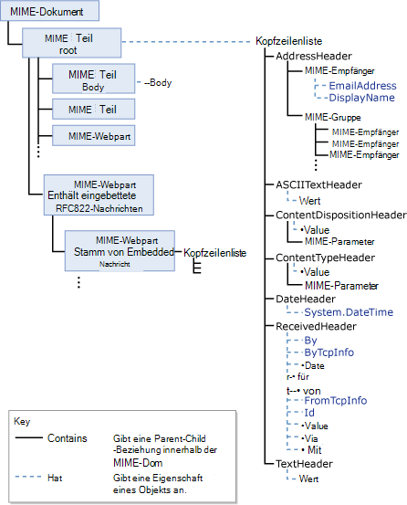
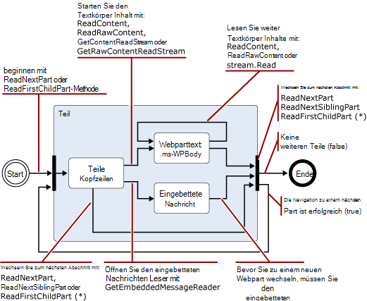
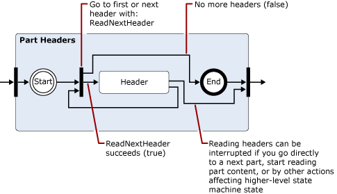
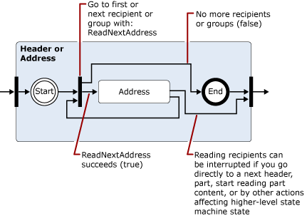
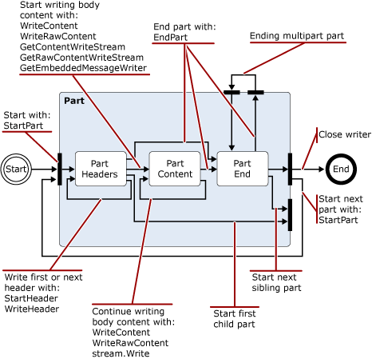

# Lesen und Ändern von Nachrichten in der Transportpipeline Exchange 2013Reading and modifying messages in the Exchange 2013 transport pipeline

Lernen Sie .NET Framework-Klassen, mit denen Sie in Ihrer Exchange-können 2013 Transport-Agents zum Lesen, schreiben und Ändern von Nachrichten.Learn about the .NET Framework classes you can use in your Exchange 2013 transport agents to read, write, and modify messages.
  
**Gilt für:** Exchange Server 2013**Applies to:** Exchange Server 2013
  
- Klassen, die zum Lesen, schreiben oder Ändern von NachrichtenClasses used to read, write, or modify messages
- Encoder-namespaceEncoders namespace
- iCalendar-namespaceiCalendar namespace
- MIME-namespaceMIME namespace
- TextConverters-namespaceTextConverters namespace
- TNEF-namespaceTnef namespace
- vCard-namespacevCard namespace
  
Wie Nachrichten über die Transportpipeline übergeben, kann der Transport-Agent lesen, schreiben und Nachrichteninhalt zwischen verschiedenen Datenformaten zu konvertieren.As messages pass through the transport pipeline, your transport agent can read, write, and convert message content between different data formats. Beispielsweise können Sie lesen und Schreiben von MIME-Daten, identifizieren Sie eingehende Nachrichten im UUENCODE oder Quoted-printable (qp) Format, und konvertieren Sie anschließend diese mit einem Standard Ihrer Organisation verwendeten oder lesen, und klicken Sie dann speichern Kalender-oder Kontakt zugeordnet ist eingehende Nachrichten.For example, you can read and write MIME data, identify incoming messages that are in Uuencoded or Quoted-printable (qp) format, and then convert them to a standard used by your organization, or read and then save calendar or contact information associated with incoming messages. 
  
Auch kann Inhalte, die ein Sicherheitsrisiko birgt identifizieren und verschieben oder Löschen der Inhalt oder die Nachrichten, die sie enthalten; beispielsweise durch Entfernen von Hyperlinks in einer HTML-Nachricht.You can also identify content that poses a security threat and move or delete the content or the messages that contain them; for example, by removing links in an HTML message.
  
Dieser Artikel enthält Informationen zu den .NET Framework-Klassen, die Sie zum Lesen, schreiben und Ändern von Nachrichten verwenden können.This article provides information about the .NET Framework classes that you can use to read, write, and modify messages.
  
> [!CAUTION]
> Viele der Eigenschaften und Parameter in der inhaltskonvertierung APIs können die Werte groß genug, um Leistungsprobleme, einschließlich Denial-of-Service.Many of the properties and parameters in the content conversion APIs allow values large enough to cause performance problems, including denial of service. Bei Verwendung der inhaltskonvertierung APIs in einen Transport-Agent sollten Sie Grenzwerte auf die Eigenschaft und Parameter Wert Größen implementieren, die Sie beim Lesen oder schreiben, um beschränken Ressourcenverbrauch durch den Agent unterstützt.When you use the content conversion APIs in a transport agent, you should implement limits on the property and parameter value sizes you support when reading or writing in order to limit resource consumption by your agent. 

## Klassen, die zum Lesen, schreiben oder Ändern von NachrichtenClasses used to read, write, or modify messages

Die folgende Tabelle enthält die .NET Framework-Klassen, die Sie zum Lesen, schreiben und Ändern von e-Mail-Nachrichten verwenden können.The following table lists the .NET Framework classes that you can use to read, write, and modify email messages.
  
**.NET Framework-Nachricht Verarbeitung namespaces****.NET Framework message processing namespaces**

|**.NET Framework-namespace****.NET Framework namespace**|**Kurse****Classes**|
|:-----|:-----|
|[Microsoft.Exchange.Data.Mime.EncodersMicrosoft.Exchange.Data.Mime.Encoders](https://msdn.microsoft.com/library/Microsoft.Exchange.Data.Mime.Encoders.aspx)   |Enthält Klassen für die in-Memory-Codierung und-Decodierung, eine Encoder Stream-Klasse, die eine der in eine zugeordnete-Enumeration enthaltenen Klassen Encoder oder Decoder akzeptiert und die Basisklasse [' ByteEncoder '](https://msdn.microsoft.com/library/Microsoft.Exchange.Data.Mime.Encoders.ByteEncoder.aspx) und [ByteEncoderException](https://msdn.microsoft.com/library/Microsoft.Exchange.Data.Mime.Encoders.ByteEncoderException.aspx) Exception-Klasse für die Encoder und Decoder.Contains classes for in-memory encoding and decoding, an encoder stream class that accepts one of the encoder or decoder classes contained in an associated enumeration, and the [ByteEncoder](https://msdn.microsoft.com/library/Microsoft.Exchange.Data.Mime.Encoders.ByteEncoder.aspx) base class and [ByteEncoderException](https://msdn.microsoft.com/library/Microsoft.Exchange.Data.Mime.Encoders.ByteEncoderException.aspx) exception class for the encoders and decoders.    |
|[Microsoft.Exchange.Data.ContentTypes.iCalendarMicrosoft.Exchange.Data.ContentTypes.iCalendar](https://msdn.microsoft.com/library/Microsoft.Exchange.Data.ContentTypes.iCalendar.aspx)   |Enthält Typen, mit denen Sie das Lesen und Schreiben von Datenströmen, die Kalenderinformationen enthalten.Contains types that enable you to read and write data streams that contain calendar information. Enthält einen Kalender Reader und Writer, ein Exception-Objekt, ein Objekt Serie und Strukturen und Enumerationen, mit denen Sie Eigenschaftsinformationen für Kalenderelemente zurückzugeben.Includes a calendar reader and writer, an exception object, a recurrence object, and structures and enumerations that help you return property information about calendar items.    |
|[Microsoft.Exchange.Data.MimeMicrosoft.Exchange.Data.Mime](https://msdn.microsoft.com/library/Microsoft.Exchange.Data.Mime.aspx)   |Enthält Klassen, Strukturen, Enumerationen und Delegaten, die Sie zum Erstellen, lesen, schreiben, durchlaufen, codieren und Decodieren MIME-Daten verwenden können.Contains classes, structures, enumerations, and delegates that you can use to create, read, write, traverse, encode, and decode MIME data. Enthält einen datenstrombasierte Reader und Writer, die Sie Vorwärtscursor Lese- und Schreibzugriff auf MIME-Datenströmen sowie DOM-basierte Methoden ermöglicht und Klassen, mit denen, die Sie auf MIME-Dokumenten verwenden können.Includes a stream-based reader and writer that gives you forward-only read and write access to MIME data streams, as well as DOM-based methods and classes you can use on MIME documents.    |
|[Microsoft.Exchange.Data.TextConvertersMicrosoft.Exchange.Data.TextConverters](https://msdn.microsoft.com/library/Microsoft.Exchange.Data.TextConverters.aspx)   |Enthält Klassen, Strukturen, Enumerationen und Delegaten, mit denen Sie zum Lesen und Schreiben einen Datenstrom und Durchführen von Konvertierungen zwischen bestimmten Datentypen. beispielsweise HTML, Rich Text Format (RTF).Contains classes, structures, enumerations, and delegates that allow you to read and write a data stream and perform conversions between specific data types; for example, HTML to Rich Text Format (RTF). Textkonverter können Sie das Format des Document-Datenstrom aus einem Formular zu einer anderen wechseln als auch entfernen Wählen Sie einzelne Elemente eines Dokuments, die ein Sicherheitsrisiko darstellen kann.Text converters enable you to change the format of a document stream from one form to another as well as selectively remove elements of a document that might pose a security risk.    |
|[Microsoft.Exchange.Data.ContentTypes.TnefMicrosoft.Exchange.Data.ContentTypes.Tnef](https://msdn.microsoft.com/library/Microsoft.Exchange.Data.ContentTypes.Tnef.aspx)   |Enthält einen vorwärtsgerichteten Datenstrom Reader und Writer, ein Exception-Klasse und Strukturen und Enumerationen, die das Lesen und Schreiben von Daten Transport Neutral Encapsulation Format (TNEF) erleichtern.Contains a forward-only stream reader and writer, an exception class, and structures and enumerations that facilitate reading and writing Transport Neutral Encapsulation Format (TNEF) data.    |
|[Microsoft.Exchange.Data.ContentTypes.vCardMicrosoft.Exchange.Data.ContentTypes.vCard](https://msdn.microsoft.com/library/Microsoft.Exchange.Data.ContentTypes.vCard.aspx)   |Enthält einen vorwärtsgerichteten Datenstrom Reader und Writer, ein Exception-Klasse und Strukturen und Enumerationen, die zu erleichtern, lesen und Schreiben von Kontaktdaten vCard-Format.Contains a forward-only stream reader and writer, an exception class, and structures and enumerations that facilitate reading and writing vCard-formatted contact data.    |
   
## Encoder-namespaceEncoders namespace

Der Encoder-Namespace enthält die Klassen für die in-Memory-Codierung und-Decodierung.The Encoders namespace contains classes for in-memory encoding and decoding. Diese erben von der [' ByteEncoder '](https://msdn.microsoft.com/library/Microsoft.Exchange.Data.Mime.Encoders.ByteEncoder.aspx) -Basisklasse.These inherit from the [ByteEncoder](https://msdn.microsoft.com/library/Microsoft.Exchange.Data.Mime.Encoders.ByteEncoder.aspx) base class. Klassen codieren und Decodieren für Base64 BinHex, Quoted-printable (qp) und Unix-to-Unix (Uu).Classes encode and decode for Base64, BinHex, Quoted-printable (qp), and Unix-to-Unix (Uu). Die folgenden Klassen sind für in-Memory-Codierung und-Decodierung verwendet:The following classes are used for in-memory encoding and decoding: 
  
- [Base64EncoderBase64Encoder](https://msdn.microsoft.com/library/Microsoft.Exchange.Data.Mime.Encoders.Base64Encoder.aspx)
    
- [Base64DecoderBase64Decoder](https://msdn.microsoft.com/library/Microsoft.Exchange.Data.Mime.Encoders.Base64Decoder.aspx)
    
- [BinHexEncoderBinHexEncoder](https://msdn.microsoft.com/library/Microsoft.Exchange.Data.Mime.Encoders.BinHexEncoder.aspx)
    
- [BinHexDecoderBinHexDecoder](https://msdn.microsoft.com/library/Microsoft.Exchange.Data.Mime.Encoders.BinHexDecoder.aspx)
    
- [QPEncoderQPEncoder](https://msdn.microsoft.com/library/Microsoft.Exchange.Data.Mime.Encoders.QPEncoder.aspx)
    
- [QPDecoderQPDecoder](https://msdn.microsoft.com/library/Microsoft.Exchange.Data.Mime.Encoders.QPDecoder.aspx)
    
- [UUEncoderUUEncoder](https://msdn.microsoft.com/library/Microsoft.Exchange.Data.Mime.Encoders.UUEncoder.aspx)
    
- [UUDecoderUUDecoder](https://msdn.microsoft.com/library/Microsoft.Exchange.Data.Mime.Encoders.UUDecoder.aspx)
    
Die Encoder und Decoder von [' ByteEncoder '](https://msdn.microsoft.com/library/Microsoft.Exchange.Data.Mime.Encoders.ByteEncoder.aspx) -Basisklasse erben, und verwenden Sie die [ByteEncoderException](https://msdn.microsoft.com/library/Microsoft.Exchange.Data.Mime.Encoders.ByteEncoderException.aspx) Ausnahme-Klasse für die Fehlerbehandlung.The encoders and decoders inherit from the [ByteEncoder](https://msdn.microsoft.com/library/Microsoft.Exchange.Data.Mime.Encoders.ByteEncoder.aspx) base class and use the [ByteEncoderException](https://msdn.microsoft.com/library/Microsoft.Exchange.Data.Mime.Encoders.ByteEncoderException.aspx) exception class for error handling. 
  
Der Namespace enthält darüber hinaus die [MacBinaryHeader](https://msdn.microsoft.com/library/Microsoft.Exchange.Data.Mime.Encoders.MacBinaryHeader.aspx) -Klasse, die identifiziert codierte MacBinary-Dateien und ihre zugehörigen Dateiheader liest.Additionally, the namespace contains the [MacBinaryHeader](https://msdn.microsoft.com/library/Microsoft.Exchange.Data.Mime.Encoders.MacBinaryHeader.aspx) class, which identifies MacBinary encoded files and reads their associated file header. 
  
Schließlich führt die [EncoderStream](https://msdn.microsoft.com/library/Microsoft.Exchange.Data.Mime.Encoders.EncoderStream.aspx) -Klasse eine Konvertierung für einen Datenstrom anstelle einer in-Memory-Objekts.Finally, the [EncoderStream](https://msdn.microsoft.com/library/Microsoft.Exchange.Data.Mime.Encoders.EncoderStream.aspx) class performs a conversion on a data stream instead of an in-memory object. Diese Klasse nimmt eine der Encoder oder Decoder Klassen und entweder Lesevorgänge oder schreibt entsprechend die zugeordnete [EncoderStreamAccess](https://msdn.microsoft.com/library/Microsoft.Exchange.Data.Mime.Encoders.EncoderStreamAccess.aspx) -Enumeration.This class accepts one of the encoder or decoder classes and either reads or writes according to the associated [EncoderStreamAccess](https://msdn.microsoft.com/library/Microsoft.Exchange.Data.Mime.Encoders.EncoderStreamAccess.aspx) enumeration. 
  
## iCalendar-namespaceiCalendar namespace

Der iCalendar-Namespace stellt einen Vorwärtscursor Reader und Writer für iCalendar-Daten zusätzlich zu unterstützenden Strukturen und Klassen zum Erstellen, die Zugriff auf und Ändern von iCalendar-Streams.The iCalendar namespace provides a forward-only reader and writer for iCalendar data, in addition to supporting structures and classes for creating, accessing, and modifying iCalendar streams.
  
Die Klassen [CalendarReader](https://msdn.microsoft.com/library/Microsoft.Exchange.Data.ContentTypes.iCalendar.CalendarReader.aspx) und [CalendarWriter](https://msdn.microsoft.com/library/Microsoft.Exchange.Data.ContentTypes.iCalendar.CalendarWriter.aspx) dienen zum Lesen und Schreiben von iCalendar Streaming von Daten.The [CalendarReader](https://msdn.microsoft.com/library/Microsoft.Exchange.Data.ContentTypes.iCalendar.CalendarReader.aspx) and [CalendarWriter](https://msdn.microsoft.com/library/Microsoft.Exchange.Data.ContentTypes.iCalendar.CalendarWriter.aspx) classes are used to read and write iCalendar stream data. 
  
Die CalendarReader nimmt einen lesbaren [Stream-Objekt](https://msdn.microsoft.com/library/System.IO.Stream.aspx) als Argument an den Konstruktoren.The CalendarReader takes a readable [Stream](https://msdn.microsoft.com/library/System.IO.Stream.aspx) as an argument to its constructors. Die Methoden [ReadFirstChildComponent](https://msdn.microsoft.com/library/Microsoft.Exchange.Data.ContentTypes.iCalendar.CalendarReader.ReadFirstChildComponent.aspx), [ReadNextSiblingComponent](https://msdn.microsoft.com/library/Microsoft.Exchange.Data.ContentTypes.iCalendar.CalendarReader.ReadNextSiblingComponent.aspx)und [ReadNextComponent](https://msdn.microsoft.com/library/Microsoft.Exchange.Data.ContentTypes.iCalendar.CalendarReader.ReadNextComponent.aspx) können dann nacheinander die iCalendar-Komponenten in der Datenstrom zugreifen.You can then use the [ReadFirstChildComponent](https://msdn.microsoft.com/library/Microsoft.Exchange.Data.ContentTypes.iCalendar.CalendarReader.ReadFirstChildComponent.aspx), [ReadNextSiblingComponent](https://msdn.microsoft.com/library/Microsoft.Exchange.Data.ContentTypes.iCalendar.CalendarReader.ReadNextSiblingComponent.aspx), and [ReadNextComponent](https://msdn.microsoft.com/library/Microsoft.Exchange.Data.ContentTypes.iCalendar.CalendarReader.ReadNextComponent.aspx) methods to sequentially access the iCalendar components in the data stream. Basierend auf dem Wert, den Sie für die [ComplianceMode](https://msdn.microsoft.com/library/Microsoft.Exchange.Data.ContentTypes.iCalendar.CalendarReader.ComplianceMode.aspx) -Eigenschaft festgelegt haben, Fehler im iCalendar-Stream eine Ausnahme ausgelöst oder bewirkt, dass die [ComplianceStatus](https://msdn.microsoft.com/library/Microsoft.Exchange.Data.ContentTypes.iCalendar.CalendarReader.ComplianceStatus.aspx) -Eigenschaft auf einen anderen Wert als [konform](https://msdn.microsoft.com/en-us/library/microsoft.exchange.data.contenttypes.icalendar.calendarcompliancestatus.aspx)festgelegt werden.Based on the value that you have set for the [ComplianceMode](https://msdn.microsoft.com/library/Microsoft.Exchange.Data.ContentTypes.iCalendar.CalendarReader.ComplianceMode.aspx) property, errors in the iCalendar stream will cause an exception to be thrown or will cause the [ComplianceStatus](https://msdn.microsoft.com/library/Microsoft.Exchange.Data.ContentTypes.iCalendar.CalendarReader.ComplianceStatus.aspx) property to be set to a value other than [Compliant](https://msdn.microsoft.com/en-us/library/microsoft.exchange.data.contenttypes.icalendar.calendarcompliancestatus.aspx). Sie können diese Eigenschaft zum Ermitteln von Problemen mit eingehenden iCalendar-Daten überprüfen.You can check this property to discover any issues with incoming iCalendar data. 
  
Die [CalendarWriter](https://msdn.microsoft.com/library/Microsoft.Exchange.Data.ContentTypes.iCalendar.CalendarWriter.aspx) -Klasse verwendet einen schreibbaren [Stream-Objekt](https://msdn.microsoft.com/library/System.IO.Stream.aspx) als Argument an den Konstruktoren.The [CalendarWriter](https://msdn.microsoft.com/library/Microsoft.Exchange.Data.ContentTypes.iCalendar.CalendarWriter.aspx) class takes a writable [Stream](https://msdn.microsoft.com/library/System.IO.Stream.aspx) as an argument to its constructors. 
  
## MIME-namespaceMIME namespace

Der MIME-Namespace enthält Klassen, mit denen Sie erstellen, zugreifen und Bearbeiten von MIME-Dokumenten.The MIME namespace provides classes that enable you to create, access, and modify MIME documents. Sie können mit MIME-Dokumenten mithilfe von entweder eine Methode datenstrombasierte oder DOM-basierten arbeiten.You can work with MIME documents by using either a stream-based or DOM-based method.
  
### MimeDocument-Klasse und dem MIME DOMMimeDocument class and the MIME DOM

Die Klasse [MimeDocument](https://msdn.microsoft.com/library/Microsoft.Exchange.Data.Mime.MimeDocument.aspx) ermöglicht den Zugriff zu einem Dokument MIME DOM.The [MimeDocument](https://msdn.microsoft.com/library/Microsoft.Exchange.Data.Mime.MimeDocument.aspx) class enables DOM access to a MIME document. Verwenden von Objekten dieses Typs, wenn Sie den verfügbaren Speicher zum Laden einer gesamten DOM und Sie haben benötigen direkten Zugriff auf die Kopfzeilen und Inhalte der Nachricht.Use objects of this type when you have the available memory to load a whole DOM and you must have random access to the headers and content of the message. 
  
Sie Laden von Daten in ein [MimeDocument](https://msdn.microsoft.com/library/Microsoft.Exchange.Data.Mime.MimeDocument.aspx) -Objekt mithilfe der Methods [GetLoadStream](https://msdn.microsoft.com/library/Microsoft.Exchange.Data.Mime.MimeDocument.GetLoadStream.aspx) oder [Laden](https://msdn.microsoft.com/library/Microsoft.Exchange.Data.Mime.MimeDocument.Load.aspx) .You load data into a [MimeDocument](https://msdn.microsoft.com/library/Microsoft.Exchange.Data.Mime.MimeDocument.aspx) object by using the [GetLoadStream](https://msdn.microsoft.com/library/Microsoft.Exchange.Data.Mime.MimeDocument.GetLoadStream.aspx) or [Load](https://msdn.microsoft.com/library/Microsoft.Exchange.Data.Mime.MimeDocument.Load.aspx) methods. Sie können dann durchlaufen die DOM-Hierarchie und erstellen, ändern oder Entfernen von MIME-Daten.You can then walk the DOM hierarchy and create, modify, or remove MIME data. Nachdem Sie die MIME-Daten geändert haben, können Sie es in einem Stream-Objekt mithilfe der Methoden [WriteTo](https://msdn.microsoft.com/library/Microsoft.Exchange.Data.Mime.MimeNode.WriteTo.aspx) schreiben.After you have modified the MIME data, you can write it to a stream by using one of the [WriteTo](https://msdn.microsoft.com/library/Microsoft.Exchange.Data.Mime.MimeNode.WriteTo.aspx) methods. 
  
Die folgende Abbildung zeigt die Struktur der Daten in einem [MimeDocument](https://msdn.microsoft.com/library/Microsoft.Exchange.Data.Mime.MimeDocument.aspx) -Objekt.The following figure shows the structure of data within a [MimeDocument](https://msdn.microsoft.com/library/Microsoft.Exchange.Data.Mime.MimeDocument.aspx) object. 
  
**Abbildung 1. Struktur von MimeDocument-Objekten****Figure 1. Structure of MimeDocument objects**

  
### MimeReader und MimeWriter Klassen und datenstrombasierte MIME-AnalyseMimeReader and MimeWriter classes and stream-based MIME parsing

Die Klassen [MimeReader](https://msdn.microsoft.com/library/Microsoft.Exchange.Data.Mime.MimeReader.aspx) und [MimeWriter](https://msdn.microsoft.com/library/Microsoft.Exchange.Data.Mime.MimeWriter.aspx) aktivieren vorwärts-Zugriff in MIME-Streams.The [MimeReader](https://msdn.microsoft.com/library/Microsoft.Exchange.Data.Mime.MimeReader.aspx) and [MimeWriter](https://msdn.microsoft.com/library/Microsoft.Exchange.Data.Mime.MimeWriter.aspx) classes enable forward-only access to MIME streams. Verwenden Sie diese Klassen, wenn Sie nicht zum Ändern der MIME-Daten, die Daten erforderlich sind, die bereits gelesenen oder geschriebenen verfügen.Use these classes when you do not have to change the MIME data that requires data that has already been read or written. Beispielsweise wenn Sie Nachrichten zu drucken, die ein vordefiniertes Format anpassen möchten, die [MimeWriter](https://msdn.microsoft.com/library/Microsoft.Exchange.Data.Mime.MimeWriter.aspx) -Klasse ideal möglicherweise.For example, if you want to print messages that fit a predefined format, the [MimeWriter](https://msdn.microsoft.com/library/Microsoft.Exchange.Data.Mime.MimeWriter.aspx) class might be ideal. 
  
Die [MimeDocument](https://msdn.microsoft.com/library/Microsoft.Exchange.Data.Mime.MimeDocument.aspx) -Klasse kapselt DOM.The [MimeDocument](https://msdn.microsoft.com/library/Microsoft.Exchange.Data.Mime.MimeDocument.aspx) class encapsulates a DOM. Die Klassen [MimeReader](https://msdn.microsoft.com/library/Microsoft.Exchange.Data.Mime.MimeReader.aspx) und [MimeWriter](https://msdn.microsoft.com/library/Microsoft.Exchange.Data.Mime.MimeWriter.aspx) darstellen Zustand Computern.The [MimeReader](https://msdn.microsoft.com/library/Microsoft.Exchange.Data.Mime.MimeReader.aspx) and [MimeWriter](https://msdn.microsoft.com/library/Microsoft.Exchange.Data.Mime.MimeWriter.aspx) classes represent state computers. Wird aufgerufen, ihre basierend auf der Eingabe empfangen und die Methoden Zustände ändert.Their states change based on the input received and the methods called. Zahlen von 2 bis 5 werden vereinfachte Zustand Übergang Diagramme, die für das Objekt [MimeReader](https://msdn.microsoft.com/library/Microsoft.Exchange.Data.Mime.MimeReader.aspx) zeigen, welche Methoden zulässig sind, rufen Sie jeden Zustand und den Status mit der führt.Figures 2 through 5 are simplified state transition diagrams that show, for the [MimeReader](https://msdn.microsoft.com/library/Microsoft.Exchange.Data.Mime.MimeReader.aspx) object, which methods are valid to call from each state and the state that will result. 
  
Führen Sie die Pfeile für die von einem Zustand zum nächsten, ruft die Methode besagt oder Rückgabewerte, die dazu führen, den Zustand dass, ändern, um diese Diagramme zu verwenden.To use these diagrams, follow the arrows from one state to the next, noting the method calls or return values that cause the state to change. Angenommen Sie im ersten Diagramm, dass Sie am Anfang des Datenstroms sind, zu der die MimeReader gehört, die Sie erstellt haben.For example, in the first diagram, assume that you are at the start of the stream that belongs to the MimeReader that you have created. Wenn Sie auf den Status des Part-Kopfzeilen erhalten möchten, rufen Sie eine der [ReadNextPart](https://msdn.microsoft.com/library/Microsoft.Exchange.Data.Mime.MimeReader.ReadNextPart.aspx) oder [ReadFirstChildPart](https://msdn.microsoft.com/library/Microsoft.Exchange.Data.Mime.MimeReader.ReadFirstChildPart.aspx), in dieser Reihenfolge aus.To get to the Part Headers state, call one of [ReadNextPart](https://msdn.microsoft.com/library/Microsoft.Exchange.Data.Mime.MimeReader.ReadNextPart.aspx) or [ReadFirstChildPart](https://msdn.microsoft.com/library/Microsoft.Exchange.Data.Mime.MimeReader.ReadFirstChildPart.aspx), in that order. Wenn Header (d. h., wenn der MIME wohlgeformt ist) vorhanden sind, geben Sie in den Status des Part-Kopfzeilen ein.If there are headers (that is, if the MIME is well-formed), you will enter into the Part Headers state. Andernfalls wird eine Ausnahme ausgelöst.Otherwise, an exception will be thrown. 
  
**Abbildung 2. Vereinfachte Statusübergangsdiagramm für MimeReader-Objekte****Figure 2. Simplified state transition diagram for MimeReader objects**

  
> [!NOTE]
> Abbildung 3, 4 und 5 erweitern Sie dann auf Status in der vorherigen Diagramme angezeigt.Figures 3, 4, and 5 expand on states shown in each of the previous diagrams. 
  
**Abbildung 3. Erweiterung des Status von Abbildung 2 Part-Kopfzeilen****Figure 3. Expansion of Part Headers state from Figure 2**

  
**Abbildung 4. Erweiterung des Status der Kopfzeilen aus Abbildung 3, wenn ein Parameter in einer Kopfzeile aufgetreten****Figure 4. Expansion of Header state from Figure 3 when a parameter has been encountered in a header**

  
> [!NOTE]
> Durch die in Abbildung 5 dargestellt werden rekursive, wenn Adressgruppe gefunden wird, können Sie die [GroupRecipientReader](https://msdn.microsoft.com/library/Microsoft.Exchange.Data.Mime.MimeAddressReader.GroupRecipientReader.aspx) -Eigenschaft verwenden, lesen Sie die Adressen in der Gruppe.The state represented by Figure 5 is recursive in that, if an address group is encountered, you can use the [GroupRecipientReader](https://msdn.microsoft.com/library/Microsoft.Exchange.Data.Mime.MimeAddressReader.GroupRecipientReader.aspx) property to read the addresses in the group. 
  
**Abbildung 5. Erweiterung des Status der Kopfzeilen aus Abbildung 3, wenn eine Adresse oder die Gruppe "Adresse" aufgetreten ist****Figure 5. Expansion of Header state from Figure 3 when an address or address group is encountered**

  
Abbildung 6 und 7 anzeigen vereinfachte Zustand Übergang Diagramme für [MimeWriter](https://msdn.microsoft.com/library/Microsoft.Exchange.Data.Mime.MimeWriter.aspx) -Objekt.Figures 6 and 7 show simplified state transition diagrams for the [MimeWriter](https://msdn.microsoft.com/library/Microsoft.Exchange.Data.Mime.MimeWriter.aspx) object. 
  
> [!NOTE]
> Abbildung 7 wird auf dem in Abbildung 6 gezeigte Part-Kopfzeilen Zustand erweitert.Figure 7 expands on the Part Headers state shown in Figure 6. 
  
**Abbildung 6. Vereinfachte Statusübergangsdiagramm für MimeWriter-Objekte****Figure 6. Simplified state transition diagram for MimeWriter objects**

  
**Abbildung 7. Erweiterung des Status von Abbildung 6 Part-Kopfzeilen****Figure 7. Expansion of Part Headers state from Figure 6**

  
## TextConverters-namespaceTextConverters namespace

Der TextConverters-Namespace enthält Typen, die die Konvertierung des Inhalts der e-Mail-Nachrichten unterstützen.The TextConverters namespace contains types that support the conversion of the contents of email messages. Diese Typen können Code Seite Konvertierung ausführen, entfernen HTML, die nicht sicher ist, und führen andere Transformationen auf e-Mail-Nachrichtentexte.These types can perform code page conversion, remove HTML that is not secure, and perform other transformations on email message bodies. Der [Microsoft.Exchange.Data.TextConverters](https://msdn.microsoft.com/library/Microsoft.Exchange.Data.TextConverters.aspx) -Namespace enthält die folgenden Klassen, die von der abstrakten [TextConverter](https://msdn.microsoft.com/library/Microsoft.Exchange.Data.TextConverters.TextConverter.aspx) -Klasse abgeleitet sind:The [Microsoft.Exchange.Data.TextConverters](https://msdn.microsoft.com/library/Microsoft.Exchange.Data.TextConverters.aspx) namespace includes the following classes that derive from the [TextConverter](https://msdn.microsoft.com/library/Microsoft.Exchange.Data.TextConverters.TextConverter.aspx) abstract class: 
  
- [EnrichedToHtmlEnrichedToHtml](https://msdn.microsoft.com/library/Microsoft.Exchange.Data.TextConverters.EnrichedToHtml.aspx)
    
- [EnrichedToTextEnrichedToText](https://msdn.microsoft.com/library/Microsoft.Exchange.Data.TextConverters.EnrichedToText.aspx)
    
- [HtmlToEnrichedHtmlToEnriched](https://msdn.microsoft.com/library/Microsoft.Exchange.Data.TextConverters.HtmlToEnriched.aspx)
    
- [HtmlToHtmlHtmlToHtml](https://msdn.microsoft.com/library/Microsoft.Exchange.Data.TextConverters.HtmlToHtml.aspx)
    
- [HtmlToRtfHtmlToRtf](https://msdn.microsoft.com/library/Microsoft.Exchange.Data.TextConverters.HtmlToRtf.aspx)
    
- [HtmlToTextHtmlToText](https://msdn.microsoft.com/library/Microsoft.Exchange.Data.TextConverters.HtmlToText.aspx)
    
- [RtfCompressedToRtfRtfCompressedToRtf](https://msdn.microsoft.com/library/Microsoft.Exchange.Data.TextConverters.RtfCompressedToRtf.aspx)
    
- [RtfToHtmlRtfToHtml](https://msdn.microsoft.com/library/Microsoft.Exchange.Data.TextConverters.RtfToHtml.aspx)
    
- [RtfToRtfRtfToRtf](https://msdn.microsoft.com/library/Microsoft.Exchange.Data.TextConverters.RtfToRtf.aspx)
    
- [RtfToRtfCompressedRtfToRtfCompressed](https://msdn.microsoft.com/library/Microsoft.Exchange.Data.TextConverters.RtfToRtfCompressed.aspx)
    
- [RtfToTextRtfToText](https://msdn.microsoft.com/library/Microsoft.Exchange.Data.TextConverters.RtfToText.aspx)
    
- [TextToHtmlTextToHtml](https://msdn.microsoft.com/library/Microsoft.Exchange.Data.TextConverters.TextToHtml.aspx)
    
- [TextToRtfTextToRtf](https://msdn.microsoft.com/library/Microsoft.Exchange.Data.TextConverters.TextToRtf.aspx)
    
- [TextToTextTextToText](https://msdn.microsoft.com/library/Microsoft.Exchange.Data.TextConverters.TextToText.aspx)
    
Diese Textkonverter können Sie so ändern Sie das Format des Document-Datenstrom oder zum Entfernen von Elementen, die nicht sichere aus einem HTML-Dokument sind.These text converters enable you to change the format of a document stream or to remove elements that are not secure from an HTML document. Diese Klassen selbst Durchführung eine Umrechnung mit einem einzigen Aufruf einer der Convert-Methode in der Basisklasse [TextConverter](https://msdn.microsoft.com/library/Microsoft.Exchange.Data.TextConverters.TextConverter.aspx) verwendet werden können, oder können sie an den Konstruktor eines wird verwendet, um die konvertierten Lesevorgänge ausführen oder schreibt den Konverter übergeben werden.These classes can be used by themselves to perform a conversion by using a single call to one of the Convert methods in the [TextConverter](https://msdn.microsoft.com/library/Microsoft.Exchange.Data.TextConverters.TextConverter.aspx) base class, or they can be passed to a constructor of the converter, which uses it to perform converted reads or writes. 
  
Die Funktionen, die von der Basisklasse geerbt eignet sich für die dokumentkonvertierung ausführen, wenn Sie über ausreichend Speicherplatz zum Speichern von dem Originaldokument und die konvertierten Ausgaben verfügen oder wenn Sie die Ergebnisse der Konvertierung speichern möchten.The functionality inherited from the base class is useful for performing conversions when you have sufficient space to store the original document and its converted output, or when you want to store the results of the conversion. Die **Convert** -Methode akzeptiert Eingabe und Ausgabedatenströme, Text Leser oder Text Autoren und den Inhalt der Eingabe in die zugehörige Ausgabe konvertiert.The **Convert** method takes input and output streams, text readers, or text writers, and converts the content of the input to the associated output. 
  
Auch in den Namespace eingefügt werden, die folgenden Textleser, Autor und Stream-Klassen:Also included in the namespace are the following text reader, writer, and stream classes:
  
- [ConverterReader](https://msdn.microsoft.com/library/Microsoft.Exchange.Data.TextConverters.ConverterReader.aspx) – **System.IO.TextReader**abgeleitet.[ConverterReader](https://msdn.microsoft.com/library/Microsoft.Exchange.Data.TextConverters.ConverterReader.aspx) — Derived from **System.IO.TextReader**. 
    
- [ConverterWriter](https://msdn.microsoft.com/library/Microsoft.Exchange.Data.TextConverters.ConverterWriter.aspx) – **System.IO.TextWriter**abgeleitet.[ConverterWriter](https://msdn.microsoft.com/library/Microsoft.Exchange.Data.TextConverters.ConverterWriter.aspx) — Derived from **System.IO.TextWriter**. 
    
- [ConverterStream](https://msdn.microsoft.com/library/Microsoft.Exchange.Data.TextConverters.ConverterStream.aspx) – **System.IO.Stream**abgeleitet.[ConverterStream](https://msdn.microsoft.com/library/Microsoft.Exchange.Data.TextConverters.ConverterStream.aspx) — Derived from **System.IO.Stream**. 
    
Diese dienen zum Durchführen von Konvertierungen, wenn Sie keinen Platz zum Speichern des Originals oder ihre konvertierten Ausgabe, wenn Sie die Ausgabe in einem Stream senden oder die Eingabe von empfangen, oder Sie möchten die Ausgabe nur für die Indizierung oder Zwecke und daher nicht zum speichern möchten Das Ergebnis einer Umrechnung.These are used to perform conversions when you do not have room to store the original or its converted output, when you receive the input from or send the output to a stream, or when you want the output only for indexing or search purposes and therefore do not want to store the result of a conversion.
  
## TNEF-namespaceTnef namespace

Der Tnef-Namespace enthält die Klassen und Typen, die Vorwärtscursor datenstrombasierte lesen und Schreiben von TNEF-Daten zu ermöglichen.The Tnef namespace contains classes and types that enable forward-only stream-based reading and writing of TNEF data. TNEF ist ein Datenformat, die zum Kapseln von MAPI-Eigenschaften für Clients, die MAPI interpretieren kann nicht verwendet wird.TNEF is a data format that is used to encapsulate MAPI properties for clients that cannot interpret MAPI.
  
Die [TnefReader](https://msdn.microsoft.com/library/Microsoft.Exchange.Data.ContentTypes.Tnef.TnefReader.aspx) und [TnefWriter](https://msdn.microsoft.com/library/Microsoft.Exchange.Data.ContentTypes.Tnef.TnefWriter.aspx) -Klassen bieten die Basisfunktionalität im [Microsoft.Exchange.Data.ContentTypes.Tnef](https://msdn.microsoft.com/library/Microsoft.Exchange.Data.ContentTypes.Tnef.aspx) -Namespace.The [TnefReader](https://msdn.microsoft.com/library/Microsoft.Exchange.Data.ContentTypes.Tnef.TnefReader.aspx) and [TnefWriter](https://msdn.microsoft.com/library/Microsoft.Exchange.Data.ContentTypes.Tnef.TnefWriter.aspx) classes provide the core functionality in the [Microsoft.Exchange.Data.ContentTypes.Tnef](https://msdn.microsoft.com/library/Microsoft.Exchange.Data.ContentTypes.Tnef.aspx) namespace. 
  
Die [TnefReader](https://msdn.microsoft.com/library/Microsoft.Exchange.Data.ContentTypes.Tnef.TnefReader.aspx) -Klasse verwendet einen lesbaren Stream als Argument an den Konstruktoren.The [TnefReader](https://msdn.microsoft.com/library/Microsoft.Exchange.Data.ContentTypes.Tnef.TnefReader.aspx) class takes a readable stream as an argument to its constructors. Sie verwenden klicken Sie dann die [ReadNextAttribute](https://msdn.microsoft.com/library/Microsoft.Exchange.Data.ContentTypes.Tnef.TnefReader.ReadNextAttribute.aspx) -Methode, um die Attribute im Datenstrom TNEF sequenziell zu lesen.You then use the [ReadNextAttribute](https://msdn.microsoft.com/library/Microsoft.Exchange.Data.ContentTypes.Tnef.TnefReader.ReadNextAttribute.aspx) method to sequentially read the attributes in the TNEF stream. Nachdem Sie ein Attribut gelesen haben, können Sie Informationen über das Attribut mithilfe eines der der schreibgeschützte Eigenschaften für das Objekt [TnefReader](https://msdn.microsoft.com/library/Microsoft.Exchange.Data.ContentTypes.Tnef.TnefReader.aspx) zusätzlich zum Abrufen einer [TnefPropertyReader](https://msdn.microsoft.com/library/Microsoft.Exchange.Data.ContentTypes.Tnef.TnefPropertyReader.aspx) zum Lesen von der aktuellen-Eigenschaft zugreifen.After you have read an attribute, you can access information about the attribute by using any of the read-only properties on the [TnefReader](https://msdn.microsoft.com/library/Microsoft.Exchange.Data.ContentTypes.Tnef.TnefReader.aspx) object, in addition to getting a [TnefPropertyReader](https://msdn.microsoft.com/library/Microsoft.Exchange.Data.ContentTypes.Tnef.TnefPropertyReader.aspx) to read the current property. Sie können das aktuelle Attribut auch direkt mithilfe der Methode [ReadAttributeRawValue](https://msdn.microsoft.com/library/Microsoft.Exchange.Data.ContentTypes.Tnef.TnefReader.ReadAttributeRawValue.aspx) zugreifen.You can also directly access the current attribute by using the [ReadAttributeRawValue](https://msdn.microsoft.com/library/Microsoft.Exchange.Data.ContentTypes.Tnef.TnefReader.ReadAttributeRawValue.aspx) method. 
  
Die [TnefWriter](https://msdn.microsoft.com/library/Microsoft.Exchange.Data.ContentTypes.Tnef.TnefWriter.aspx) -Klasse verwendet einen schreibbaren [Stream-Objekt](https://msdn.microsoft.com/library/System.IO.Stream.aspx) als Argument an den Konstruktoren.The [TnefWriter](https://msdn.microsoft.com/library/Microsoft.Exchange.Data.ContentTypes.Tnef.TnefWriter.aspx) class takes a writable [Stream](https://msdn.microsoft.com/library/System.IO.Stream.aspx) as an argument to its constructors. Die [TnefWriter](https://msdn.microsoft.com/library/Microsoft.Exchange.Data.ContentTypes.Tnef.TnefWriter.aspx) -Klasse stellt mehrere Methoden zum Schreiben von Daten in diesen Stream.The [TnefWriter](https://msdn.microsoft.com/library/Microsoft.Exchange.Data.ContentTypes.Tnef.TnefWriter.aspx) class provides multiple ways in which to write data to this stream. 
  
## vCard-namespacevCard namespace

Der vCard-Namespace enthält die Klassen, Strukturen und Enumerationen zum Lesen und Schreiben von Kontaktinformationen in einer e-Mail-Nachricht, die in das vCard-Datenformat ist enthalten sind.The vCard namespace contains classes, structures, and enumerations used to read and write contact information contained in an email message that is in the vCard data format. Der Namespace enthält einen Kontakt Reader und Writer, ein Exception-Klasse, eine Eigenschaft Leser, ein Parameter-Reader und Unterstützung von Enumerationen, mit die Sie eine e-Mail-Nachricht zugeordnete vCard-Daten lesen können.The namespace contains a contact reader and writer, an exception class, a property reader, a parameter reader, and supporting enumerations that allow you to read vCard data associated with an email message.
  
## Siehe auchSee also

- [Transport-Agents in ExchangeTransport agents in Exchange](transport-agents-in-exchange-2013.md)  
- [Transport-Agent Konzepte in Exchange 2013Transport agent concepts in Exchange 2013](transport-agent-concepts-in-exchange-2013.md) 
- [Transport-Agent-Referenz für Exchange 2013Transport agent reference for Exchange 2013](transport-agent-reference-for-exchange-2013.md)
- [MIME-MedientypenMIME Media Types](http://www.iana.org/assignments/media-types)
    

