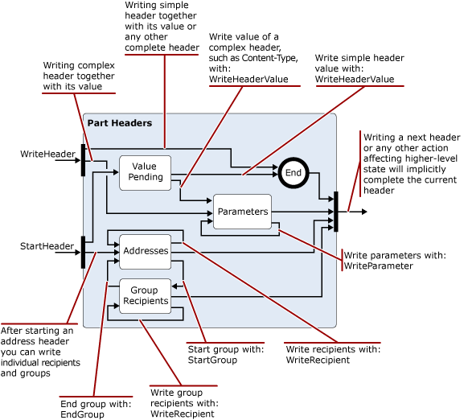

# Lesen und Ändern von Nachrichten in der Exchange 2013 Transportpipeline

Erfahren Sie mehr über die .NET Framework Klassen, die Sie in Ihren Exchange 2013-Transport-Agents zum Lesen, schreiben und Ändern von Nachrichten verwenden können.
  
**Gilt für:** Exchange Server 2013
  
- Zum Lesen, schreiben oder Ändern von Nachrichten verwendete Klassen
- Encoder-Namespace
- iCalendar-Namespace
- MIME-Namespace
- TextConverters-Namespace
- TNEF-Namespace
- vCard-Namespace
  
Wenn Nachrichten die Transportpipeline durchlaufen, kann der Transport-Agent Nachrichteninhalte zwischen verschiedenen Datenformaten lesen, schreiben und konvertieren. Beispielsweise können Sie MIME-Daten lesen und schreiben, eingehende Nachrichten im QP-Format (in einem UUENCODE-oder im Anführungszeichen) identifizieren und diese in einen von Ihrer Organisation verwendeten Standard konvertieren oder Kalender-oder Kontaktinformationen, die mit eingehenden Nachrichten verbunden sind, lesen und dann speichern. 
  
Sie können auch Inhalte identifizieren, die eine Sicherheitsbedrohung darstellen, und den Inhalt oder die darin enthaltenen Nachrichten zu-oder ablegen. beispielsweisedurch Entfernen von Links in einer HTML-Nachricht.
  
Dieser Artikel enthält Informationen zu den .NET Framework Klassen, die Sie zum Lesen, schreiben und Ändern von Nachrichten verwenden können.
  
> [!CAUTION]
> Viele der Eigenschaften und Parameter in der Inhalts Konvertierungs-APIs lassen Werte groß genug, um Leistungsprobleme zu verursachen, einschließlich Denial-of-Service. Wenn Sie die APIs für die Inhaltskonvertierung in einem Transport-Agent verwenden, sollten Sie Grenzwerte für die Eigenschaften-und Parameterwert Größen implementieren, die Sie beim Lesen oder schreiben unterstützen, um die Ressourcennutzung durch ihren Agent zu begrenzen. 

## Zum Lesen, schreiben oder Ändern von Nachrichten verwendete Klassen

In der folgenden Tabelle sind die .NET Framework Klassen aufgeführt, die Sie zum Lesen, schreiben und Ändern von e-Mail-Nachrichten verwenden können.
  
**Namespaces für die .NET Framework Nachrichtenverarbeitung**

|**.NET Framework Namespace**|**Kurse**|
|:-----|:-----|
|[Microsoft. Exchange. Data. MIME. Encoder](https://msdn.microsoft.com/library/Microsoft.Exchange.Data.Mime.Encoders.aspx)   |Enthält Klassen für die in-Memory-Codierung und-Decodierung, eine Encoder-Streamklasse, die eine der Encoder-oder Decoder-Klassen akzeptiert, die in einer zugeordneten Aufzählung enthalten sind, und die [ByteEncoder](https://msdn.microsoft.com/library/Microsoft.Exchange.Data.Mime.Encoders.ByteEncoder.aspx) -Basisklasse und die [ByteEncoderException](https://msdn.microsoft.com/library/Microsoft.Exchange.Data.Mime.Encoders.ByteEncoderException.aspx) -Ausnahmeklasse für die Encoder und Decoder.    |
|[Microsoft. Exchange. Data. ContentTypes. iCalendar](https://msdn.microsoft.com/library/Microsoft.Exchange.Data.ContentTypes.iCalendar.aspx)   |Enthält Typen, mit denen Sie Datenströme lesen und schreiben können, die Kalenderinformationen enthalten. Enthält einen Kalender Leser und-Schreiber, ein Exception-Objekt, ein Serien Objekt sowie Strukturen und Aufzählungen, mit denen Sie Eigenschaftsinformationen zu Kalenderelementen zurückgeben können.    |
|[Microsoft. Exchange. Data. MIME](https://msdn.microsoft.com/library/Microsoft.Exchange.Data.Mime.aspx)   |Enthält Klassen, Strukturen, Aufzählungen und Stellvertretungen, die Sie zum Erstellen, lesen, schreiben, durchlaufen, codieren und Decodieren von MIME-Daten verwenden können. Enthält einen Stream-basierten Leser und Writer, der Ihnen einen vorwärts Lese-und Schreibzugriff auf MIME-Datenströme sowie Dom-basierte Methoden und Klassen zur Verfügung stellt, die Sie für MIME-Dokumente verwenden können.    |
|[Microsoft. Exchange. Data. TextConverters](https://msdn.microsoft.com/library/Microsoft.Exchange.Data.TextConverters.aspx)   |Enthält Klassen, Strukturen, Enumerationen und Delegaten, mit denen Sie einen Datenstrom lesen und schreiben und Konvertierungen zwischen bestimmten Datentypen durchführen können. Beispiel: HTML zum Rich-Text-Format (RTF). Mit Text Konvertern können Sie das Format eines Dokumentdatenstroms von einem Formular in ein anderes ändern und Elemente eines Dokuments selektiv entfernen, die ein Sicherheitsrisiko darstellen könnten.    |
|[Microsoft. Exchange. Data. ContentTypes. TNEF](https://msdn.microsoft.com/library/Microsoft.Exchange.Data.ContentTypes.Tnef.aspx)   |Enthält ein vorwärts gerichtetes Stream-Lesegerät und einen Writer, eine Exception-Klasse sowie Strukturen und Aufzählungen, die das Lesen und Schreiben von Transport Neutral Encapsulation Format (TNEF) Daten erleichtern.    |
|[Microsoft. Exchange. Data. ContentTypes. vCard](https://msdn.microsoft.com/library/Microsoft.Exchange.Data.ContentTypes.vCard.aspx)   |Enthält ein vorwärts gerichtetes Stream-Lesegerät und einen Writer, eine Exception-Klasse sowie Strukturen und Aufzählungen, die das Lesen und Schreiben von vCard-formatierten Kontaktdaten erleichtern.    |
   
## Encoder-Namespace

Der Encoder-Namespace enthält Klassen für die in-Memory-Codierung und-Decodierung. Diese erben von der [ByteEncoder](https://msdn.microsoft.com/library/Microsoft.Exchange.Data.Mime.Encoders.ByteEncoder.aspx) -Basisklasse. Klassen codieren und decodieren für Base64, BinHex, quoted-printable (QP) und UNIX-to-UNIX (UU). Die folgenden Klassen werden für die in-Memory-Codierung und-Decodierung verwendet: 
  
- [Base64Encoder](https://msdn.microsoft.com/library/Microsoft.Exchange.Data.Mime.Encoders.Base64Encoder.aspx)
    
- [Base64Decoder](https://msdn.microsoft.com/library/Microsoft.Exchange.Data.Mime.Encoders.Base64Decoder.aspx)
    
- [BinHexEncoder](https://msdn.microsoft.com/library/Microsoft.Exchange.Data.Mime.Encoders.BinHexEncoder.aspx)
    
- [BinHexDecoder](https://msdn.microsoft.com/library/Microsoft.Exchange.Data.Mime.Encoders.BinHexDecoder.aspx)
    
- [QPEncoder](https://msdn.microsoft.com/library/Microsoft.Exchange.Data.Mime.Encoders.QPEncoder.aspx)
    
- [QPDecoder](https://msdn.microsoft.com/library/Microsoft.Exchange.Data.Mime.Encoders.QPDecoder.aspx)
    
- [UUEncode](https://msdn.microsoft.com/library/Microsoft.Exchange.Data.Mime.Encoders.UUEncoder.aspx)
    
- [UUDecoder](https://msdn.microsoft.com/library/Microsoft.Exchange.Data.Mime.Encoders.UUDecoder.aspx)
    
Die Encoder und Decoder erben von der [ByteEncoder](https://msdn.microsoft.com/library/Microsoft.Exchange.Data.Mime.Encoders.ByteEncoder.aspx) -Basisklasse und verwenden die [ByteEncoderException](https://msdn.microsoft.com/library/Microsoft.Exchange.Data.Mime.Encoders.ByteEncoderException.aspx) -Ausnahmeklasse für die Fehlerbehandlung. 
  
Darüber hinaus enthält der Namespace die [MacBinaryHeader](https://msdn.microsoft.com/library/Microsoft.Exchange.Data.Mime.Encoders.MacBinaryHeader.aspx) -Klasse, die MacBinary-codierte Dateien identifiziert und deren zugeordneten Dateiheader liest. 
  
Schließlich führt die [EncoderStream](https://msdn.microsoft.com/library/Microsoft.Exchange.Data.Mime.Encoders.EncoderStream.aspx) -Klasse eine Konvertierung für einen Datenstrom anstelle eines in-Memory-Objekts aus. Diese Klasse akzeptiert eine der Encoder-oder Decoder-Klassen und liest oder schreibt entsprechend der zugeordneten [EncoderStreamAccess](https://msdn.microsoft.com/library/Microsoft.Exchange.Data.Mime.Encoders.EncoderStreamAccess.aspx) -Aufzählung. 
  
## iCalendar-Namespace

Der iCalendar-Namespace stellt einen vorwärts Leser und-Schreiber für iCalendar-Daten bereit, zusätzlich zu unterstützenden Strukturen und Klassen zum Erstellen, zugreifen und Ändern von iCalendar-Streams.
  
Die Klassen [CalendarReader](https://msdn.microsoft.com/library/Microsoft.Exchange.Data.ContentTypes.iCalendar.CalendarReader.aspx) und [CalendarWriter](https://msdn.microsoft.com/library/Microsoft.Exchange.Data.ContentTypes.iCalendar.CalendarWriter.aspx) werden zum Lesen und Schreiben von iCalendar-Datenstromdaten verwendet. 
  
Der CalendarReader verwendet einen lesbaren [Stream](https://msdn.microsoft.com/library/System.IO.Stream.aspx) als Argument für seine Konstruktoren. Anschließend können Sie die [ReadFirstChildComponent](https://msdn.microsoft.com/library/Microsoft.Exchange.Data.ContentTypes.iCalendar.CalendarReader.ReadFirstChildComponent.aspx)-, [ReadNextSiblingComponent](https://msdn.microsoft.com/library/Microsoft.Exchange.Data.ContentTypes.iCalendar.CalendarReader.ReadNextSiblingComponent.aspx)-und [ReadNextComponent](https://msdn.microsoft.com/library/Microsoft.Exchange.Data.ContentTypes.iCalendar.CalendarReader.ReadNextComponent.aspx) -Methoden verwenden, um sequenziell auf die iCalendar-Komponenten im Datenstrom zuzugreifen. Basierend auf dem Wert, den Sie für die [ComplianceMode](https://msdn.microsoft.com/library/Microsoft.Exchange.Data.ContentTypes.iCalendar.CalendarReader.ComplianceMode.aspx) -Eigenschaft festgelegt haben, wird durch Fehler im iCalendar-Datenstrom eine Ausnahme ausgelöst, oder die [wurde](https://msdn.microsoft.com/library/Microsoft.Exchange.Data.ContentTypes.iCalendar.CalendarReader.ComplianceStatus.aspx) -Eigenschaft wird auf einen anderen Wert als [konform](https://msdn.microsoft.com/library/microsoft.exchange.data.contenttypes.icalendar.calendarcompliancestatus.aspx)festgelegt. Sie können diese Eigenschaft überprüfen, um Probleme mit eingehenden iCalendar-Daten zu ermitteln. 
  
Die [CalendarWriter](https://msdn.microsoft.com/library/Microsoft.Exchange.Data.ContentTypes.iCalendar.CalendarWriter.aspx) -Klasse verwendet einen beschreibbaren [Stream](https://msdn.microsoft.com/library/System.IO.Stream.aspx) als Argument für die Konstruktoren. 
  
## MIME-Namespace

Der MIME-Namespace stellt Klassen zur Verfügung, mit denen Sie MIME-Dokumente erstellen, auf Sie zugreifen und diese bearbeiten können. Sie können mit MIME-Dokumenten entweder mit einer Stream-basierten oder einer DOM-basierten Methode arbeiten.
  
### MimeDocument-Klasse und das MIME-Dom

Die [MimeDocument](https://msdn.microsoft.com/library/Microsoft.Exchange.Data.Mime.MimeDocument.aspx) -Klasse ermöglicht den Dom-Zugriff auf ein MIME-Dokument. Verwenden Sie Objekte dieses Typs, wenn Sie den verfügbaren Arbeitsspeicher zum Laden eines vollständigen DOM haben und Sie über einen zufälligen Zugriff auf die Kopfzeilen und den Inhalt der Nachricht verfügen müssen. 
  
Sie laden Daten in ein [MimeDocument](https://msdn.microsoft.com/library/Microsoft.Exchange.Data.Mime.MimeDocument.aspx) -Objekt mithilfe der [GetLoadStream](https://msdn.microsoft.com/library/Microsoft.Exchange.Data.Mime.MimeDocument.GetLoadStream.aspx) oder [Laden](https://msdn.microsoft.com/library/Microsoft.Exchange.Data.Mime.MimeDocument.Load.aspx) Methoden. Anschließend können Sie die DOM-Hierarchie durchlaufen und MIME-Daten erstellen, ändern oder entfernen. Nachdem Sie die MIME-Daten geändert haben, können Sie Sie mithilfe einer der [WriteTo](https://msdn.microsoft.com/library/Microsoft.Exchange.Data.Mime.MimeNode.WriteTo.aspx) -Methoden in einen Stream schreiben. 
  
In der folgenden Abbildung ist die Struktur der Daten in einem [MimeDocument](https://msdn.microsoft.com/library/Microsoft.Exchange.Data.Mime.MimeDocument.aspx) -Objekt dargestellt. 
  
**Abbildung 1. Struktur von MimeDocument-Objekten**

  
### MimeReader-und MimeWriter-Klassen und datenstrombasierte MIME-Analyse

Die [MimeReader](https://msdn.microsoft.com/library/Microsoft.Exchange.Data.Mime.MimeReader.aspx) -und [MimeWriter](https://msdn.microsoft.com/library/Microsoft.Exchange.Data.Mime.MimeWriter.aspx) -Klassen ermöglichen den Vorwärtszugriff auf MIME-Datenströme. Verwenden Sie diese Klassen, wenn Sie die MIME-Daten nicht ändern müssen, für die bereits gelesene oder geschriebene Daten erforderlich sind. Wenn Sie beispielsweise Nachrichten drucken möchten, die einem vordefinierten Format entsprechen, ist die [MimeWriter](https://msdn.microsoft.com/library/Microsoft.Exchange.Data.Mime.MimeWriter.aspx) -Klasse möglicherweise ideal. 
  
Die [MimeDocument](https://msdn.microsoft.com/library/Microsoft.Exchange.Data.Mime.MimeDocument.aspx) -Klasse kapselt ein DOM. Die [MimeReader](https://msdn.microsoft.com/library/Microsoft.Exchange.Data.Mime.MimeReader.aspx) -und die [MimeWriter](https://msdn.microsoft.com/library/Microsoft.Exchange.Data.Mime.MimeWriter.aspx) -Klasse stellen Statuscomputer dar. Ihre Zustände ändern sich basierend auf der empfangenen Eingabe und den aufgerufenen Methoden. Die Abbildungen 2 bis 5 sind vereinfachte Zustandsübergangsdiagramme, die für das [MimeReader](https://msdn.microsoft.com/library/Microsoft.Exchange.Data.Mime.MimeReader.aspx) -Objekt anzeigen, welche Methoden für den Aufruf von jedem Status gültig sind, und den Zustand, der resultieren wird. 
  
Wenn Sie diese Diagramme verwenden möchten, befolgen Sie die Pfeile von einem Zustand zum nächsten, wobei Sie die Methodenaufrufe oder Rückgabewerte feststellen, die dazu führen, dass sich der Status ändert. Nehmen wir beispielsweise im ersten Diagramm an, dass Sie sich am Anfang des Streams befinden, der zu dem MimeReader gehört, den Sie erstellt haben. Wenn Sie zum Status von Teil Kopfzeilen gelangen möchten, rufen Sie eine der [ReadNextPart](https://msdn.microsoft.com/library/Microsoft.Exchange.Data.Mime.MimeReader.ReadNextPart.aspx) oder [ReadFirstChildPart](https://msdn.microsoft.com/library/Microsoft.Exchange.Data.Mime.MimeReader.ReadFirstChildPart.aspx)in dieser Reihenfolge auf. Wenn es Kopfzeilen gibt (das heißt, wenn der MIME wohlgeformt ist), werden Sie in den Kopfzeilenstatus der Teile eingeben. Andernfalls wird eine Ausnahme ausgelöst. 
  
**Abbildung 2. Vereinfachtes Zustandsübergangsdiagramm für MimeReader-Objekte**

  
> [!NOTE]
> Die Abbildungen 3, 4 und 5 erweitern die Zustände, die in den vorherigen Diagrammen angezeigt werden. 
  
**Abbildung 3. Erweiterung des Status von Teil Kopfzeilen aus Abbildung 2**

  
**Abbildung 4. Erweiterung des Kopfzeilenstatus aus Abbildung 3, wenn ein Parameter in einer Kopfzeile aufgetreten ist**

  
> [!NOTE]
> Der durch Abbildung 5 dargestellte Status ist rekursiv, da Sie, wenn eine Adressgruppe gefunden wird, mit der [GroupRecipientReader](https://msdn.microsoft.com/library/Microsoft.Exchange.Data.Mime.MimeAddressReader.GroupRecipientReader.aspx) -Eigenschaft die Adressen in der Gruppe lesen können. 
  
**Abbildung 5. Erweiterung des Kopfzeilenstatus aus Abbildung 3 beim Auftreten einer Adresse oder einer Adressgruppe**

  
Abbildungen 6 und 7 zeigen vereinfachte Zustandsübergangsdiagramme für das [MimeWriter](https://msdn.microsoft.com/library/Microsoft.Exchange.Data.Mime.MimeWriter.aspx) -Objekt. 
  
> [!NOTE]
> In Abbildung 7 wird der in Abbildung 6 gezeigte Kopfzeilenstatus des Teils erweitert. 
  
**Abbildung 6. Vereinfachtes Zustandsübergangsdiagramm für MimeWriter-Objekte**

  
**Abbildung 7. Erweiterung des Status von Teil Kopfzeilen aus Abbildung 6**

  
## TextConverters-Namespace

Der TextConverters-Namespace enthält Typen, die die Konvertierung des Inhalts von e-Mail-Nachrichten unterstützen. Diese Typen können Codepagekonvertierung durchführen, HTML entfernen, das nicht sicher ist, und andere Transformationen in e-Mail-Nachrichtentext Körpern ausführen. Der [Microsoft. Exchange. Data. TextConverters](https://msdn.microsoft.com/library/Microsoft.Exchange.Data.TextConverters.aspx) -Namespace umfasst die folgenden Klassen, die von der abstrakten [textconverter](https://msdn.microsoft.com/library/Microsoft.Exchange.Data.TextConverters.TextConverter.aspx) -Klasse abgeleitet werden: 
  
- [EnrichedToHtml](https://msdn.microsoft.com/library/Microsoft.Exchange.Data.TextConverters.EnrichedToHtml.aspx)
    
- [EnrichedToText](https://msdn.microsoft.com/library/Microsoft.Exchange.Data.TextConverters.EnrichedToText.aspx)
    
- [HtmlToEnriched](https://msdn.microsoft.com/library/Microsoft.Exchange.Data.TextConverters.HtmlToEnriched.aspx)
    
- [HtmlToHtml](https://msdn.microsoft.com/library/Microsoft.Exchange.Data.TextConverters.HtmlToHtml.aspx)
    
- [HtmlToRtf](https://msdn.microsoft.com/library/Microsoft.Exchange.Data.TextConverters.HtmlToRtf.aspx)
    
- [HtmlToText](https://msdn.microsoft.com/library/Microsoft.Exchange.Data.TextConverters.HtmlToText.aspx)
    
- [RtfCompressedToRtf](https://msdn.microsoft.com/library/Microsoft.Exchange.Data.TextConverters.RtfCompressedToRtf.aspx)
    
- [RtfToHtml](https://msdn.microsoft.com/library/Microsoft.Exchange.Data.TextConverters.RtfToHtml.aspx)
    
- [RtfToRtf](https://msdn.microsoft.com/library/Microsoft.Exchange.Data.TextConverters.RtfToRtf.aspx)
    
- [RtfToRtfCompressed](https://msdn.microsoft.com/library/Microsoft.Exchange.Data.TextConverters.RtfToRtfCompressed.aspx)
    
- [RtfToText](https://msdn.microsoft.com/library/Microsoft.Exchange.Data.TextConverters.RtfToText.aspx)
    
- [TextToHtml](https://msdn.microsoft.com/library/Microsoft.Exchange.Data.TextConverters.TextToHtml.aspx)
    
- [TextToRtf](https://msdn.microsoft.com/library/Microsoft.Exchange.Data.TextConverters.TextToRtf.aspx)
    
- [TextToText](https://msdn.microsoft.com/library/Microsoft.Exchange.Data.TextConverters.TextToText.aspx)
    
Mit diesen Textkonvertern können Sie das Format eines Dokumentdatenstroms ändern oder Elemente entfernen, die aus einem HTML-Dokument nicht sicher sind. Diese Klassen können von selbst verwendet werden, um eine Konvertierung mithilfe eines einzelnen Aufrufs einer der Convert-Methoden in der [textconverter](https://msdn.microsoft.com/library/Microsoft.Exchange.Data.TextConverters.TextConverter.aspx) -Basisklasse durchzuführen, oder Sie können an einen Konstruktor des Konverters übergeben werden, der zum Ausführen konvertierter Lese-oder Schreibvorgänge verwendet wird. 
  
Die von der Basisklasse geerbte Funktionalität ist für die Durchführung von Konvertierungen hilfreich, wenn Sie über ausreichend Speicherplatz zum Speichern des ursprünglichen Dokuments und seiner konvertierten Ausgabe verfügen oder wenn Sie die Ergebnisse der Konvertierung speichern möchten. Die **Convert** -Methode verwendet Eingabe-und Ausgabedatenströme, Text Leser oder Textschreiber und wandelt den Inhalt der Eingabe in die zugehörige Ausgabe um. 
  
Im Namespace sind auch die folgenden TextReader-, Writer-und Stream-Klassen enthalten:
  
- [ConverterReader](https://msdn.microsoft.com/library/Microsoft.Exchange.Data.TextConverters.ConverterReader.aspx) – abgeleitet von **System. IO. TextReader**. 
    
- [ConverterWriter](https://msdn.microsoft.com/library/Microsoft.Exchange.Data.TextConverters.ConverterWriter.aspx) – abgeleitet von **System. IO. TextWriter**. 
    
- [ConverterStream](https://msdn.microsoft.com/library/Microsoft.Exchange.Data.TextConverters.ConverterStream.aspx) – abgeleitet von **System. IO. Stream**. 
    
Diese werden verwendet, um Konvertierungen durchzuführen, wenn Sie keinen Platz zum Speichern der ursprünglichen oder der konvertierten Ausgabe haben, wenn Sie die Eingabe von erhalten oder die Ausgabe an einen Stream senden oder wenn Sie die Ausgabe nur für Indizierungs-oder Suchzwecke verwenden möchten und das Ergebnis einer Konvertierung daher nicht speichern möchten.
  
## TNEF-Namespace

Der TNEF-Namespace enthält Klassen und Typen, die das vorwärts-Stream-basierte lesen und Schreiben von TNEF-Daten ermöglichen. TNEF ist ein Datenformat, das zum Kapseln von MAPI-Eigenschaften für Clients verwendet wird, die MAPI nicht interpretieren können.
  
Die [TnefReader](https://msdn.microsoft.com/library/Microsoft.Exchange.Data.ContentTypes.Tnef.TnefReader.aspx) -und [TnefWriter](https://msdn.microsoft.com/library/Microsoft.Exchange.Data.ContentTypes.Tnef.TnefWriter.aspx) -Klassen stellen die Kernfunktionen im [Microsoft. Exchange. Data. ContentTypes. TNEF](https://msdn.microsoft.com/library/Microsoft.Exchange.Data.ContentTypes.Tnef.aspx) -Namespace bereit. 
  
Die [TnefReader](https://msdn.microsoft.com/library/Microsoft.Exchange.Data.ContentTypes.Tnef.TnefReader.aspx) -Klasse verwendet einen lesbaren Stream als Argument für die Konstruktoren. Anschließend verwenden Sie die [ReadNextAttribute](https://msdn.microsoft.com/library/Microsoft.Exchange.Data.ContentTypes.Tnef.TnefReader.ReadNextAttribute.aspx) -Methode, um die Attribute im TNEF-Datenstrom nacheinander zu lesen. Nachdem Sie ein Attribut gelesen haben, können Sie über eine der schreibgeschützten Eigenschaften des [TnefReader](https://msdn.microsoft.com/library/Microsoft.Exchange.Data.ContentTypes.Tnef.TnefReader.aspx) -Objekts auf Informationen zum Attribut zugreifen, und es wird ein [TnefPropertyReader](https://msdn.microsoft.com/library/Microsoft.Exchange.Data.ContentTypes.Tnef.TnefPropertyReader.aspx) -Objekt hinzugefügt, um die aktuelle Eigenschaft zu lesen. Sie können auch direkt auf das aktuelle Attribut mithilfe der [ReadAttributeRawValue](https://msdn.microsoft.com/library/Microsoft.Exchange.Data.ContentTypes.Tnef.TnefReader.ReadAttributeRawValue.aspx) -Methode zugreifen. 
  
Die [TnefWriter](https://msdn.microsoft.com/library/Microsoft.Exchange.Data.ContentTypes.Tnef.TnefWriter.aspx) -Klasse verwendet einen beschreibbaren [Stream](https://msdn.microsoft.com/library/System.IO.Stream.aspx) als Argument für die Konstruktoren. Die [TnefWriter](https://msdn.microsoft.com/library/Microsoft.Exchange.Data.ContentTypes.Tnef.TnefWriter.aspx) -Klasse bietet mehrere Möglichkeiten zum Schreiben von Daten in diesen Stream. 
  
## vCard-Namespace

Der vCard-Namespace enthält Klassen, Strukturen und Aufzählungen, die zum Lesen und Schreiben von Kontaktinformationen in einer e-Mail-Nachricht im vCard-Datenformat verwendet werden. Der Namespace enthält ein Kontakt-Lesegerät und einen Writer, eine Exception-Klasse, einen Eigenschaften Leser, einen Parameter Leser und unterstützende Aufzählungen, mit denen Sie vCard-Daten lesen können, die einer e-Mail-Nachricht zugeordnet sind.
  
## Siehe auch

- [Transport-Agents in Exchange](transport-agents-in-exchange-2013.md)  
- [Transport-Agent-Konzepte in Exchange 2013](transport-agent-concepts-in-exchange-2013.md) 
- [Transport-Agent-Referenz für Exchange 2013](transport-agent-reference-for-exchange-2013.md)
- [MIME-Medientypen](http://www.iana.org/assignments/media-types)
    

